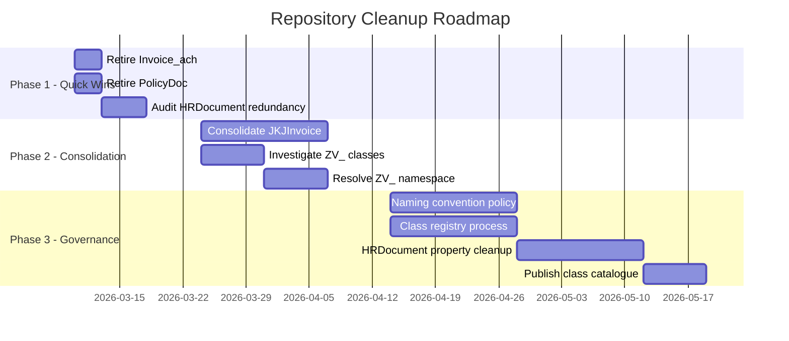

# IBM Content Services Repository — Class Cleanup Roadmap

> **Prepared by:** Bob (AI Technical Lead)
> **Date:** 2026-03-02
> **Based on:** Full repository class inventory and property analysis

---

## Executive Summary

A repository audit identified **3 confirmed duplicate classes**, **1 superseded class**, **2 unresolved namespace conflicts**, and **multiple redundant properties** on the `HRDocument` class. This roadmap prioritises actions by risk and effort, starting with zero-risk quick wins and progressing to governance improvements.

---

## Guiding Principles

- **Never delete before verifying document counts** — always search for active documents first
- **Migrate before retire** — reclassify documents to the target class before removing the source class
- **Prefix = domain ownership** — enforce naming conventions going forward
- **One class per business concept** — no team-specific variants of existing classes

---

## Phase 1 — Quick Wins (1–2 weeks, low risk)

### 1.1 Retire `Invoice_ach` — Exact Duplicate

| Attribute | Value |
|---|---|
| **Risk** | 🟢 Very Low |
| **Effort** | Low |
| **Target class** | `Invoice` |

`Invoice_ach` is a **100% property-identical clone** of `Invoice` — same 7 custom fields, same data types (`InvoiceAmount`, `InvoiceDate`, `InvoiceNumber`, `PONumber`, `Vendor`, `VendorOrderNo`, `BusinessUnits`). The `_ach` suffix suggests it was created for an ACH payment integration project but was never differentiated.

**Action steps:**
1. Search `Invoice_ach` for active documents
2. If documents exist → reclassify all to `Invoice`
3. Delete `Invoice_ach` class definition

---

### 1.2 Retire `PolicyDoc` — Superseded by `LG_PolicyDocument`

| Attribute | Value |
|---|---|
| **Risk** | 🟢 Low |
| **Effort** | Low |
| **Target class** | `LG_PolicyDocument` |

`PolicyDoc` has only 2 custom properties (`PolicyDate`, `LG_PolicyDocumentType`). `LG_PolicyDocument` has those same 2 plus `Description`, `LG_PublicationDate`, and `LG_PolicyReviewDate` — it is strictly richer and better governed. Both share the `LG_PolicyDocumentType` property, confirming they were created for the same purpose.

**Action steps:**
1. Search `PolicyDoc` for active documents
2. Migrate documents to `LG_PolicyDocument` (map `PolicyDate` → `LG_PublicationDate`)
3. Delete `PolicyDoc` class definition

---

### 1.3 Audit `HRDocument` Internal Redundancy

| Attribute | Value |
|---|---|
| **Risk** | 🟢 Very Low |
| **Effort** | Low |

Three overlapping document-type fields exist on `HRDocument` with no clear differentiation:

| Field | Type | Issue |
|---|---|---|
| `DocType` | STRING | Generic — purpose unclear |
| `DocumentCategory` | STRING | Generic — overlaps with DocType |
| `ClassDocType` | STRING | Unclear purpose — possible legacy |

Additionally, `Division` and `Department` serve the same purpose (the description of `Division` literally reads "Division or Department").

**Action steps:**
1. Audit which fields are actually populated in existing HR documents
2. Designate one canonical document-type field (recommend `DocumentCategory`)
3. Hide deprecated fields to stop new population
4. Schedule property removal in Phase 3

---

## Phase 2 — Consolidation (1–2 months, medium effort)

### 2.1 Consolidate `JKJInvoice` into `Invoice`

| Attribute | Value |
|---|---|
| **Risk** | 🟡 Medium |
| **Effort** | Medium |
| **Target class** | `Invoice` |

`JKJInvoice` was created by a separate team (`JKJ` = team/project code) with its own prefixed properties — all typed as `STRING` instead of the properly typed `DOUBLE`/`DATE` fields in `Invoice`. This is a data quality regression.

**Property mapping:**

| `JKJInvoice` field | → | `Invoice` field | Notes |
|---|---|---|---|
| `JKJInvoiceNumber` | → | `InvoiceNumber` | Direct STRING mapping |
| `JKJInvoiceVendor` | → | `Vendor` | Direct STRING mapping |
| `JKJInvoiceAmount` | → | `InvoiceAmount` | ⚠️ STRING → DOUBLE conversion required |
| `JKJInvoiceDueDate` | → | `InvoiceDate` | ⚠️ STRING → DATE conversion required |
| `JKJInvoiceFiledDate` | → | `DateCheckedIn` | Or add new property to `Invoice` |
| `JKJInvoiceBankAccount` | → | *(no equivalent)* | ⚠️ Add `BankAccount` property to `Invoice` first |

**Action steps:**
1. Count documents in `JKJInvoice`
2. Add `BankAccount` property to `Invoice` class
3. Write migration script with data type conversion for amount and date fields
4. Migrate all documents to `Invoice`
5. Retire `JKJInvoice` class

---

### 2.2 Investigate and Resolve `ZV_Contract` vs `Contract`

| Attribute | Value |
|---|---|
| **Risk** | 🟡 Medium |
| **Effort** | Low–Medium |

`ZV_Contract` and `ZV_Customer` use a project-specific prefix inconsistent with the established domain conventions (`LG_`, `CDS_`, `SC_`). These classes may originate from a decommissioned project.

**Action steps:**
1. Compare properties of `ZV_Contract` vs `Contract`
2. Compare properties of `ZV_Customer` vs any existing Customer class
3. Check document counts and last activity dates for both `ZV_*` classes
4. **If `ZV_*` are subsets** → migrate documents and retire
5. **If `ZV_*` have unique properties** → evaluate merging properties into the canonical class, then retire

---

## Phase 3 — Governance & Prevention (Ongoing)

### 3.1 Establish a Class Naming Convention Policy

Enforce the following domain prefix rules for all new classes:

| Prefix | Domain | Example |
|---|---|---|
| `LG_` | Government / Legal | `LG_PolicyDocument` |
| `CDS_` | Case / Certification Management | `CDS_CertificationCaseAsDocument` |
| `SC_` | Supply Chain | `SC_SupplierProductCatalogue` |
| `HR` | Human Resources | `HRDocument` |
| *(no prefix)* | Generic / cross-domain | `Invoice`, `Contract`, `Email` |

**Rule:** No team-specific or project-specific prefixes (`JKJ_`, `ZV_`, `ACH_`). All new classes must go through a naming review before creation.

---

### 3.2 Introduce a Class Registry Review Gate

The invoice triplication (`Invoice`, `Invoice_ach`, `JKJInvoice`) and policy duplication (`PolicyDoc`, `LG_PolicyDocument`) happened because teams created classes independently without checking for existing equivalents.

**Process to implement:**
1. Maintain a **Class Registry** document (see 3.4) as the authoritative list
2. Require a registry search before any new class creation request
3. Assign a **Content Architecture Owner** to approve new class requests
4. Reject any class whose purpose is already served by an existing class

---

### 3.3 Clean Up `HRDocument` Property Sprawl

Following the Phase 1 audit of redundant fields:

1. Remove deprecated properties (`DocType`, `ClassDocType`, `Division`) from the class definition after confirming no active population
2. Review the 10 SAP/SF integration properties — confirm all are still actively used by live integrations:
   - SAP ArchiveLink: `SAPDocId`, `SAPDocProt`, `SAPComps`, `SAPContType`, `SAPCompVersion`, `SapLinkTrigger`, `sapLinked`
   - SuccessFactors: `SFLinkTrigger`
   - Docuflow: `docuflowTimestamp`, `docuflowUsername`
3. Remove any integration properties whose source system has been decommissioned

---

### 3.4 Publish and Maintain a Class Catalogue

Produce a formal class catalogue (the inventory built during this audit) and store it as a governed document in the repository itself, updated on each class change.

**Minimum catalogue fields per class:**
- Symbolic name, display name, domain prefix
- Parent class (inheritance)
- Custom properties list with data types
- Owner team / contact
- Creation date, last reviewed date
- Status: `Active` | `Deprecated` | `Scheduled for removal`

---

## Roadmap Timeline

---

## Risk Matrix

| Action | Risk | Documents at Risk | Reversible? |
|---|---|---|---|
| Retire `Invoice_ach` | 🟢 Very Low | Unknown — verify first | ✅ Yes (before deletion) |
| Retire `PolicyDoc` | 🟢 Low | Unknown — verify first | ✅ Yes (before deletion) |
| Audit `HRDocument` fields | 🟢 Very Low | None (metadata only) | ✅ Yes |
| Consolidate `JKJInvoice` | 🟡 Medium | Active invoices | ✅ Yes (before deletion) |
| Resolve `ZV_*` classes | 🟡 Medium | Unknown — verify first | ✅ Yes (before deletion) |
| Remove deprecated properties | 🔴 High | All HR documents | ⚠️ Partial — backup first |

---

## Classes Confirmed Safe to Keep

The following class pairs were investigated and confirmed as **legitimate distinct classes** — no action required:

| Class Pair | Reason |
|---|---|
| `LG_LicenseDocument` vs `LG_ProductLicenseDocument` | General license vs product-specific subtype |
| `LG_SignatureArchive` vs `LG_CommercialSignatureArchive` | Personal vs commercial signature archives |
| `CDS_Document` vs `CDS_CertificationCaseAsDocument` | Base class vs specialised case type |
| `FormTemplate` vs `WebFormTemplate` | Different form engines (eForm vs ITX/XML) |

---

*Document generated from live repository analysis. Verify document counts before executing any retirement action.*