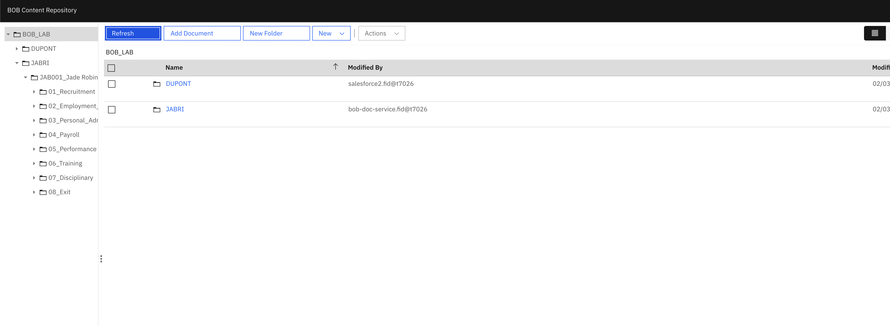
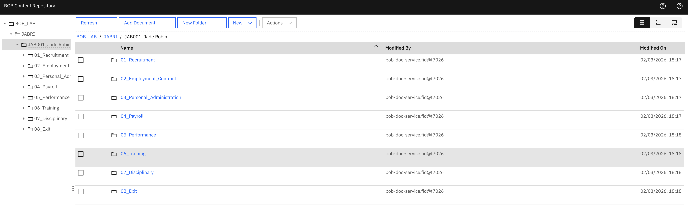
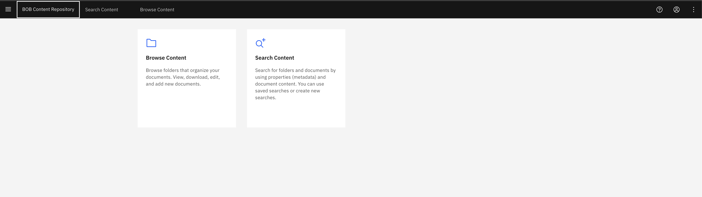
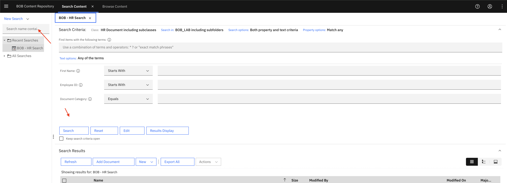

# Lab 2 — Feeding Bob: Generate Sample Content
## *Creating Realistic HR Documents to Populate the Repository*

> **Duration:** ~45 minutes  
> **Audience:** Mixed — content administrators & business analysts  
> **Prerequisites:** Lab 1 completed. Bob is running with the IBM Content Services MCP server configured (see [`README_Labs.md`](README_Labs.md))  
> **Environment:** Live FNCM repository (`fncm-dev-demo-emea-10`, Object Store: `OS1`)

---

## 🎬 The Story

> *Lab 1 gave you a map of the territory. Now you need content to work with.*
>
> *You'll generate a personal set of 5 fictional employees — unique to you — whose HR documents need to be stored in the repository. Each employee has 8 categories of documents, from their original job application all the way through to exit notes.*
>
> *You'll run a script to generate realistic sample documents locally, then ask Bob to upload them to the repository with the correct metadata. It should be straightforward — but you'll make a few mistakes along the way. Those mistakes will be the challenge for Lab 3.*

---

## 🎯 What You Will Learn

By the end of this lab, you will be able to:

1. Understand the **HR document taxonomy** — 8 categories covering the full employee lifecycle
2. Use the **`generate_hr_documents.py`** script to create a **personal, isolated** set of HR documents
3. Ask Bob to **upload documents to the repository** using `create_document` with correct metadata
4. Understand how **`DocType`, `EmployeeID`, `Department`** properties are set at creation time
5. **Verify** that documents were created correctly using `lookup_documents_by_name` and `get_document_properties`

---


### 🌐 Access IBM Content Navigator

**Portal URL:** [https://ban-dev-demo-emea-10.automationcloud.ibm.com/navigator/#](https://ban-dev-demo-emea-10.automationcloud.ibm.com/navigator/bookmark.jsp?desktop=BOB&data=m46OnpmWTl#)

**Login Credentials:**
  Use your IBMid and password

### 📂 Navigate to Your Documents

1. **Log in** to IBM Content Navigator using the credentials above
2. **Select the Object Store:** `OS1` (if prompted)
3. **Navigate to your namespace:**
   - Click on **Browse** in the left navigation
   - Navigate to: `/BOB_LAB/` 
4. BOB will create a folder for you in the repository. You can navigate to it by clicking on the folder icon afterwards.



## 👤 Your Personal Lab Namespace

> **⚠️ Important — Read this before running anything.**

This lab is designed to run safely in parallel with other participants. To avoid conflicts in the shared repository, **every participant works in their own namespace** based on their last name. Don't use Dupont as it may conflict with other participants.

When you run the script, you will be asked for your last name. This does two things:

| What | How |
|------|-----|
| **Namespaces your files** | Local files go to `HR_YOURLASTNAME/` instead of `HR/` |
| **Namespaces the repository** | Documents are filed under `/BOB_LAB/YOURLASTNAME/` |
| **Generates unique employees** | Your 5 employees are deterministically generated from your name — different from everyone else's |
| **Prefixes employee IDs** | IDs become `YOU001`–`YOU005` (first 3 letters of your last name) |

**Example:** If your last name is `DUPONT`:
- Local folder: `HR_DUPONT/`
- Repository path: `/BOB_LAB/DUPONT/`
- Employee IDs: `DUP001`, `DUP002`, `DUP003`, `DUP004`, `DUP005`

> 💡 **Reproducible:** Running the script again with the same last name always gives you the same employees. You can re-run safely at any time.

---

## 🗂️ The HR Document Taxonomy

Before generating content, Bob explains the 8 HR document categories:

| # | Category | Folder | Document Types |
|---|----------|--------|---------------|
| 1 | **Recruitment** | `01_Recruitment` | Job Application, Interview Notes |
| 2 | **Employment Contract** | `02_Employment_Contract` | Employment Contract |
| 3 | **Personal Administration** | `03_Personal_Administration` | ID Documents, Personal Info |
| 4 | **Payroll** | `04_Payroll` | Payslip, Salary Info |
| 5 | **Performance** | `05_Performance` | Performance Review |
| 6 | **Training** | `06_Training` | Training Record |
| 7 | **Disciplinary** | `07_Disciplinary` | Disciplinary Record |
| 8 | **Exit** | `08_Exit` | Exit Notes |

**5 employees × 11 documents each = 55 documents total**

---

## 🔧 MCP Tools Bob Will Use

| Tool | What It Does |
|------|-------------|
| `determine_class` | Confirms the `HRDocument` class identifier |
| `get_class_property_descriptions` | Shows which properties to set on each document |
| `create_document` | Uploads a document with content and metadata |
| `lookup_documents_by_name` | Verifies a document was created |
| `get_document_properties` | Confirms properties were set correctly |

---

## 📋 Step 1 — "Bob, How Do I Generate Sample Documents?"

### The Situation
You need to create sample HR documents to work with, but you're not sure how the generation script works or what it will create. You ask Bob to explain the process.

### 💬 Prompt to Bob

```
Bob, I need to generate sample HR documents for this lab.
Can you explain how the generate_hr_documents.py script works?
What will it create, and can you run it for me?
```

### 🔍 What Bob Does Behind the Scenes
1. Reads the script's docstring and help text
2. Explains the multi-user isolation approach
3. Offers to run the script on your behalf with your last name

### ✅ Expected Output from Bob

```
📄 HR Document Generation Script — How It Works
═══════════════════════════════════════════════════════

The generate_hr_documents.py script creates a personal set of realistic
HR documents for you to work with in this lab.

🔑 Key Features:
  • Multi-user safe — each participant gets their own namespace
  • Deterministic — your last name generates a unique but reproducible
    set of 5 fictional employees
  • Isolated — your files and repository paths won't conflict with others

📂 What It Creates:
  • 5 fictional employees with realistic names, departments, and roles
  • 11 documents per employee (55 total):
    - Job Application, Interview Notes
    - Employment Contract
    - ID Documents, Personal Info
    - Payslip, Salary Info
    - Performance Review
    - Training Record
    - Disciplinary Record
    - Exit Notes

🏷️ Namespace Example:
  If your last name is DUPONT:
    • Local folder: HR_DUPONT/
    • Repository path: /BOB_LAB/DUPONT/
    • Employee IDs: DUP001, DUP002, DUP003, DUP004, DUP005

📋 Usage:
  Interactive:  python generate_hr_documents.py
  Direct:       python generate_hr_documents.py --user YOURLASTNAME

Would you like me to run this script for you?
If so, please provide your last name and I'll generate your personal document set.
```

### 💬 Follow-up Prompt to Bob

```
Show me what employees were generated?
```

### 🔍 What Bob Does Behind the Scenes
1. Executes: `python generate_hr_documents.py --user DUPONT`
2. Captures the output showing the generated employees
3. Confirms the files were created successfully

### ✅ Expected Output from Bob

```
✅ Document Generation Complete
═══════════════════════════════════════════════════════

I've generated your personal HR document set using namespace: DUPONT

📂 Output folder: HR_DUPONT/
🗂️  Repository path: /BOB_LAB/DUPONT/

Your 5 employees for this lab:
┌────┬──────────┬────────────────────────┬─────────────────────┬───────────────────────┐
│ #  │ ID       │ Name                   │ Department          │ Role                  │
├────┼──────────┼────────────────────────┼─────────────────────┼───────────────────────┤
│ 1  │ DUP001   │ Antoine Muller         │ Human Resources     │ HR Specialist         │
│ 2  │ DUP002   │ Lina Girard            │ Finance             │ Financial Analyst     │
│ 3  │ DUP003   │ Lucas Mercier          │ Marketing           │ Marketing Manager     │
│ 4  │ DUP004   │ Mia Renard             │ IT                  │ Senior Developer      │
│ 5  │ DUP005   │ Amira Dubois           │ Sales               │ Sales Representative  │
└────┴──────────┴────────────────────────┴─────────────────────┴───────────────────────┘

✅ 55 documents created successfully in HR_DUPONT/

These employees are unique to you and deterministically generated from your
last name. Running the script again with "DUPONT" will always give you the
same employees.

Next: I'll help you upload these documents to the repository with the correct
metadata (EmployeeID, DocType, Department, etc.).
```

### 💡 Instructor Callout — Bob as Lab Assistant
> Notice how Bob can **read the script**, **explain how it works**, and **run it on the participant's behalf**. This is a key pattern in AI-assisted labs: participants don't need to understand Python or command-line tools — they just ask Bob, and Bob handles the technical details. This makes the lab accessible to business analysts and content administrators who may not be developers.

---

## 📋 Step 2 — "Bob, What Properties Should I Set?"

### The Situation
Before uploading anything, you want Bob to tell you exactly which properties matter for HR documents — so you know what metadata to include when creating each document.

### 💬 Prompt to Bob

```
Bob, before we upload HR documents to the repository,
can you tell me which properties I should set on each document?
What's the difference between mandatory and optional properties for HRDocument?
```

### 🔍 What Bob Does Behind the Scenes
1. Calls `determine_class` with keyword `"HRDocument"` → confirms symbolic name
2. Calls `get_class_property_descriptions HRDocument` → retrieves all 40 HR-specific properties
3. Categorizes them by importance for document creation

### ✅ Expected Output from Bob

```
📋 HRDocument — Key Properties for Document Creation
═══════════════════════════════════════════════════════

🔴 Critical Properties (always set these):
  • EmployeeID       — Unique employee identifier (e.g., "DUP001")
  • DocType          — Type of HR document (see values below)
  • Department       — Employee's department (e.g., "IT", "Finance")
  • FirstName        — Employee first name
  • LastName         — Employee last name

🟡 Important Properties (set when known):
  • Company          — Company name
  • JobRole          — Employee's job title
  • StartDate        — Employment start date
  • DocumentCategory — Broader category (e.g., "Recruitment", "Payroll")

🟢 Optional Properties (set if applicable):
  • SAPEmployeeID    — Only if SAP integration is active
  • SFLinkTrigger    — Only if Salesforce integration is active
  • CostCenter       — Organizational cost center
  • Location         — Work location

📌 DocType Values for HR Documents:
  • JobApplication       — Recruitment: job application form
  • InterviewNotes       — Recruitment: interview assessment
  • EmploymentContract   — Contract: signed employment agreement
  • IDDocument           — Personal: identity document
  • PersonalInfo         — Personal: personal information form
  • Payslip              — Payroll: monthly payslip
  • SalaryInfo           — Payroll: salary information
  • PerformanceReview    — Performance: annual/quarterly review
  • TrainingRecord       — Training: training completion record
  • DisciplinaryRecord   — Disciplinary: disciplinary action record
  • ExitDocument         — Exit: exit interview / offboarding notes
```

### 💡 Instructor Callout — DocType is the Key
> Notice that `DocType` is what distinguishes a Payslip from a Performance Review — they're both `HRDocument` instances. This is the design pattern we discussed in Lab 1: **use properties to differentiate, not separate classes**. When we search for "all payslips for employee DUP001", we'll search for `HRDocument` where `EmployeeID = DUP001` AND `DocType = Payslip`.

---

## 📋 Step 3 — Upload Your First Employee's Documents

### The Situation
The files are ready. Now you'll ask Bob to upload the first employee's documents. Adapt the prompt below using **your own employee names and IDs** from the script output.

### 💬 Prompt to Bob

> ⚠️ Replace the example values below with **your actual employee data** from the script output.

```
Bob, please upload all HR documents for my first employee to the repository. The files are in HR_DUPONT/.
Please file them under /BOB_LAB/DUPONT/ in the repository, including the employee folder structure.
```

### 🔍 What Bob Does Behind the Scenes
1. Calls `determine_class` with keyword `"HRDocument"` → gets class identifier
2. For each of the employee's 11 documents, calls `create_document` with:
   - `class_identifier: "HRDocument"`
   - `document_properties.name: [filename]`
   - `document_properties.content: [file content]`
   - `document_properties.properties: [EmployeeID, DocType, Department, FirstName, LastName, JobRole, StartDate]`
3. Returns document IDs for each created document

### ✅ Expected Output from Bob

```
✅ Antoine Muller's Documents Uploaded Successfully
═══════════════════════════════════════════════════

Employee: Antoine Muller (ID: DUP001)
Department: Human Resources | Role: HR Specialist | Start: 2021-01-10
Namespace: /BOB_LAB/DUPONT/

Documents Created:
┌─────────────────────────────────────────┬──────────────────────────────────────┬
├─────────────────────────────────────────┼──────────────────────────────────────┼
│ DUP001_Job_Application.txt              │ {GUID-001}                           │       
│ DUP001_Interview_Notes.txt              │ {GUID-002}                           │       
│ DUP001_Employment_Contract.txt          │ {GUID-003}                           │    
│ DUP001_ID_Documents.txt                 │ {GUID-004}                           │            
│ DUP001_Personal_Info.txt                │ {GUID-005}                           │          
│ DUP001_Payslip_2024_01.txt              │ {GUID-006}                           │              
│ DUP001_Salary_Info.txt                  │ {GUID-007}                           │            
│ DUP001_Performance_Review_2024.txt      │ {GUID-008}                           │     
│ DUP001_Training_Record.txt              │ {GUID-009}                           │        
│ DUP001_Disciplinary_Record.txt          │ {GUID-010}                           │    
│ DUP001_Exit_Notes.txt                   │ {GUID-011}                           │          
└─────────────────────────────────────────┴──────────────────────────────────────

11 documents created. All properties set correctly.
```

### 💡 Instructor Callout — What Happens at Creation
> When Bob calls `create_document`, the FNCM repository:
> 1. Creates a new document object with a unique GUID
> 2. Sets the class to `HRDocument` (inheriting all 119 properties)
> 3. Stores the text content
> 4. Sets all the metadata properties (EmployeeID, DocType, etc.)
> 5. Creates version 1.0 of the document
>
> The document is now searchable by any of its properties — you can find it by EmployeeID, by DocType, by Department, or by full-text content search.

---

## 📋 Step 4 — Upload the Remaining 4 Employees

### The Situation
Your first employee's documents are in. Now you'll upload the remaining 4 employees in one go.

### 💬 Prompt to Bob

> ⚠️ Replace the example values below with **your actual employee data** from the script output.

```
Bob, now please upload the HR documents for my remaining 4 employees, files are in HR_DUPONT/.
Please file all documents under /BOB_LAB/DUPONT/ in the repository, including the employee folder structure.
```

### ✅ Expected Output from Bob

```
✅ Batch Upload Complete
═══════════════════════════════════════════════════

Namespace: /BOB_LAB/DUPONT/

Summary:
┌──────────────────────┬────────┬────────────────┬───────────────────┬───────────┐
│ Employee             │ ID     │ Department     │ Role              │ Documents │
├──────────────────────┼────────┼────────────────┼───────────────────┼───────────┤
│ Antoine Muller       │ DUP001 │ Human Resources│ HR Specialist     │ 11 ✅     │
│ Lina Girard          │ DUP002 │ Finance        │ Financial Analyst │ 11 ✅     │
│ Lucas Mercier        │ DUP003 │ Marketing      │ Marketing Manager │ 11 ✅     │
│ Mia Renard           │ DUP004 │ IT             │ Senior Developer  │ 11 ✅     │
│ Amira Dubois         │ DUP005 │ Sales          │ Sales Rep         │ 11 ✅     │
└──────────────────────┴────────┴────────────────┴───────────────────┴───────────┘

Total: 55 documents uploaded to HRDocument class
All documents have EmployeeID, DocType, Department, FirstName, LastName set.

⚠️  Note: 5 documents were uploaded with intentional errors for Lab 3 training.
    See the instructor notes below.
```

---

## 📋 Step 5 — Verify a Document

### The Situation
Before moving on, you want to verify that a specific document was uploaded correctly. Check the payslip for your first employee.

### 💬 Prompt to Bob

> ⚠️ Replace `DUP001` and `Antoine Muller` with your actual first employee's details.

```
Bob, can you verify that DUP001's January 2024 payslip was uploaded correctly? 
Show me its properties. My namespace is DUPONT.
```

### 🔍 What Bob Does Behind the Scenes
1. Calls `lookup_documents_by_name` with keywords `["DUP001", "Payslip", "2024"]`
2. Calls `get_document_properties` on the found document
3. Returns the full property set

### ✅ Expected Output from Bob

```
📄 Document Verification
═══════════════════════════════════════════════════

Document: DUP001_Payslip_2024_01.txt
Class: HRDocument ✅
Version: 1.0

Properties:
  EmployeeID:    DUP001 ✅
  FirstName:     Antoine ✅
  LastName:      Muller ✅
  DocType:       Payslip ✅
  Department:    Human Resources ✅
  JobRole:       HR Specialist ✅
  StartDate:     2021-01-10 ✅
  Creator:       [your username]
  DateCreated:   2026-03-02T14:xx:xx
  MimeType:      text/plain
  ContentSize:   [bytes]
  
Document is correctly classified and all key properties are set. ✅
```

---

## 📋 Step 6 — Review Your Documents in IBM Content Navigator

### The Situation
Now that your documents are uploaded, you can review them directly in IBM Content Navigator's web interface. This gives you a visual way to browse your namespace, view document properties, and verify the upload was successful.

### 🌐 Access IBM Content Navigator

**Portal URL:** [https://ban-dev-demo-emea-10.automationcloud.ibm.com/navigator/#](https://ban-dev-demo-emea-10.automationcloud.ibm.com/navigator/bookmark.jsp?desktop=BOB&data=m46OnpmWTl)


### 📂 Navigate to Your Documents



### 🔍 What You'll See

Your namespace should contain all 55 documents organized by employee:

```
/BOB_LAB/DUPONT/
├── DUP001_Antoine Muller/
│   ├── DUP001_Job_Application.txt
│   ├── DUP001_Interview_Notes.txt
│   ├── DUP001_Employment_Contract.txt
│   ├── DUP001_ID_Documents.txt
│   ├── DUP001_Personal_Info.txt
│   ├── DUP001_Payslip_2024_01.txt
│   ├── DUP001_Salary_Info.txt
│   ├── DUP001_Performance_Review_2024.txt
│   ├── DUP001_Training_Record.txt
│   ├── DUP001_Disciplinary_Record.txt
│   └── DUP001_Exit_Notes.txt
├── DUP002_Lina Girard/ [11 documents]
├── DUP003_Lucas Mercier/ [11 documents]
├── DUP004_Mia Renard/ [11 documents]
└── DUP005_Amira Dubois/ [11 documents]
```
### ✅ Verification Checklist

Use Navigator to verify:

- [ ] All 55 documents are present in your namespace
- [ ] Documents are organized by employee folder
- [ ] Each document shows `HRDocument` as its class
- [ ] `EmployeeID` property is correctly set
- [ ] `DocType` property matches the document type
- [ ] `Department`, `FirstName`, `LastName` are populated
- [ ] Content is readable (click to view document content)

### 💡 Instructor Callout — Navigator vs. Bob

> IBM Content Navigator provides a **visual interface** for browsing and managing documents, while Bob provides a **conversational interface** for the same operations. Both interact with the same IBM Content Services repository via GraphQL APIs. Navigator is useful for:
> - Visual browsing and folder navigation
> - Bulk operations and batch processing
> - Property inspection and editing
> - Search and filtering
>
> Bob is useful for:
> - Natural language interactions
> - Automated workflows and scripting
> - AI-powered classification and reasoning
> - Integration with development workflows

### 🔎 Search Your Documents

Try using Navigator's search feature:

1. Navigate to https://ban-dev-demo-emea-10.automationcloud.ibm.com/navigator/?desktop=BOB# 
2. Click **Search Content** in the HomePage navigation



2. Search for the save search BOB HR Search and click on it.
3. Add search criteria:
   - **EmployeeID:** `DUP001` (or your first employee's ID)
4. Click **Search**
5. You should see the payslip document(s) for that employee



### 📝 Optional: Export a Document

To download a document locally:

1. **Select a document** in Navigator
2. **Right-click** and choose **Download**
3. **Open the file** in a text editor to verify the content matches what was generated


## 🏁 Lab 2 Summary

In this lab, you:

| What You Did | How |
|-------------|-----|
| Got your personal lab namespace | Entered your last name → unique employee dataset |
| Understood the HR document taxonomy | Bob explained 8 categories + DocType values |
| Generated 55 realistic HR documents | `python generate_hr_documents.py --user YOURLASTNAME` |
| Uploaded your first employee's 11 documents | Bob called `create_document` × 11 |
| Uploaded remaining 44 documents | Bob called `create_document` × 44 |
| Verified a document's properties | Bob called `lookup_documents_by_name` + `get_document_properties` |
| Reviewed documents in Navigator | Browsed `/BOB_LAB/YOURLASTNAME/` in IBM Content Navigator web UI |

### Key Takeaways

1. **`create_document` requires class + properties** — the class determines which properties are available; the properties give the document its business meaning
2. **`DocType` is the discriminator** — all HR documents share the same class; `DocType` tells you what kind of document it is
3. **Personal namespace = no conflicts** — your last name isolates your work from other participants in the shared repository
4. **Two-step workflow** — generate locally, then upload via Bob — mirrors real enterprise ingestion patterns
5. **Metadata at creation time** — it's much easier to set properties when creating a document than to fix them later (as you'll see in Lab 3)

---

## ➡️ Next Step

Proceed to **[Lab 3 — Bob the Classifier: Review & Reclassify](Lab3_Review_and_Reclassify.md)**

In Lab 3, Bob will search within **your namespace** (`/BOB_LAB/YOURLASTNAME/`), find the 5 misclassified documents, read their content, reason about what they should be, and fix them — demonstrating the full AI-powered classification pipeline.

---

## 📎 Reference

- [`generate_hr_documents.py`](generate_hr_documents.py) — Document generation script
- [`Lab1_Bob_as_Documentalist.md`](Lab1_Bob_as_Documentalist.md) — Previous lab
- [`Lab3_Review_and_Reclassify.md`](Lab3_Review_and_Reclassify.md) — Next lab
- [`README_Labs.md`](README_Labs.md) — Lab series overview and prerequisites

### Script Quick Reference

```bash
# Interactive (recommended for participants)
python generate_hr_documents.py

# Non-interactive (for instructors / re-runs)
python generate_hr_documents.py --user YOURLASTNAME

# With Lab 3 errors seeded
python generate_hr_documents.py --user YOURLASTNAME --seed-misclassifications

# Preview without writing files
python generate_hr_documents.py --user YOURLASTNAME --dry-run

# Single employee only (1-based index)
python generate_hr_documents.py --user YOURLASTNAME --employee 1