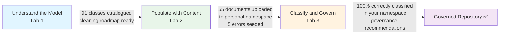

# Lab 3 — Bob the Classifier: Review & Reclassify
## *Using AI to Detect and Fix Misclassified Documents*

> **Duration:** ~45 minutes
> **Audience:** Mixed — content administrators & business analysts
> **Prerequisites:** Lab 2 completed. 55 documents uploaded to your personal namespace in the repository, including 5 with deliberate errors.
> **Environment:** Live FNCM repository (`fncm-dev-demo-emea-10`, Object Store: `OS1`)

> **⚠️ Multi-User Lab:** This lab works in your personal namespace (`/BOB_LAB/YOURLASTNAME/`) created in Lab 2. You can run this lab in parallel with other participants without conflicts.

> ** Don't forget:** Start a new task at the beginning of this lab.

---

## 🎬 The Story

> *Lab 2 went well — mostly. You uploaded 55 HR documents for your 5 employees to your personal namespace. But in the rush to get everything in, a few mistakes crept in: one payslip ended up as a generic Document with no employee metadata, a contract was filed under the wrong class, a performance review has the wrong employee ID, a disciplinary record has no metadata at all, and an exit document is missing its DocType.*
>
> *In a real repository with thousands of documents, these errors would be invisible — until someone searches for "all payslips for your first employee" and gets zero results, or a compliance audit finds documents with no retention metadata.*
>
> *You ask Bob to run a classification audit on your namespace.*

---

## 🎯 What You Will Learn

By the end of this lab, you will be able to:

1. Use Bob to **search for documents with missing or incorrect metadata**
2. Ask Bob to **read document content** and reason about what class it should be
3. Execute the **reclassification workflow**: `update_document_class` + `update_document_properties`
4. Understand the **risk of reclassification** — what happens to properties when you change a document's class
5. Produce a **final governance health report** for the repository

---

## 🔧 MCP Tools Bob Will Use

| Tool | What It Does |
|------|-------------|
| `document_search` | Finds documents matching specific criteria (missing properties, wrong class) |
| `get_document_properties` | Inspects the current state of a document |
| `get_document_text_extract` | Reads the document's text content for AI reasoning |
| `update_document_class` | Changes a document's class (e.g., Document → HRDocument) |
| `update_document_properties` | Updates metadata properties on a document |
| `lookup_documents_by_name` | Finds documents by name keywords |

---

## 📋 Scene 1 — "Bob, Run a Classification Audit"

### The Situation
You want Bob to find all HR documents in your namespace that are missing critical metadata — specifically, documents without an `EmployeeID` or with an obviously wrong one.

### 💬 Prompt to Bob (ASK MODE)

> ⚠️ Replace `DUPONT` with your actual last name from Lab 2.

```
Bob, I want to run a classification audit on my HR documents in namespace /BOB_LAB/DUPONT/.
Can you find all documents in the HRDocument class that are missing an EmployeeID,
or have an EmployeeID that doesn't look right?
```

### 🔍 What Bob Does Behind the Scenes
1. Calls `determine_class` with keyword `"HRDocument"` → confirms class identifier
2. Calls `get_searchable_property_descriptions HRDocument` → confirms `EmployeeID` is searchable
3. Calls `document_search` on `HRDocument` class filtering for empty or suspicious `EmployeeID` values within your namespace
4. Returns the list of problematic documents from your namespace

### ✅ Actual Output from Bob

> 📝 Note: This is the real audit result from the /BOB_LAB/DUPONT/ namespace

```
🔍 Classification Audit — HRDocument Class (Namespace: /BOB_LAB/DUPONT/)
═══════════════════════════════════════════════════════════════════════

Classification audit complete for HRDocument class in /BOB_LAB/DUPONT/ namespace.

Found 53 HRDocuments total with the following issues:

**Missing EmployeeID (3 documents):**

┌───┬──────────────────────────────────────────┬──────────────────────────────────────┬─────────────────┬──────────────────────┐
│ # │ Document Name                            │ Document ID                          │ EmployeeID      │ Issue                │
├───┼──────────────────────────────────────────┼──────────────────────────────────────┼─────────────────┼──────────────────────┤
│ 1 │ Company Benefits.pdf                     │ {B09D8698-0000-C124-95A1-5A04A48BFDBD}│ (null)          │ EmployeeID missing   │
│   │ (Paul Atkins)                            │                                      │                 │                      │
├───┼──────────────────────────────────────────┼──────────────────────────────────────┼─────────────────┼──────────────────────┤
│ 2 │ Company Benefits.pdf                     │ {C09D8698-0000-C210-91EA-20346C4774A3}│ (null)          │ EmployeeID missing   │
│   │ (Paul Atkins)                            │                                      │                 │                      │
├───┼──────────────────────────────────────────┼──────────────────────────────────────┼─────────────────┼──────────────────────┤
│ 3 │ Personal Information_Health Certificate  │ {E0B18698-0000-CF15-9E43-98C0009BCE21}│ (null)          │ EmployeeID missing   │
│   │ .pdf (Marianne Roux)                     │                                      │                 │                      │
└───┴──────────────────────────────────────────┴──────────────────────────────────────┴─────────────────┴──────────────────────┘

**Potentially Incorrect EmployeeID Format (2 documents):**

┌───┬──────────────────────────────────────────┬──────────────────────────────────────┬─────────────────┬──────────────────────┐
│ # │ Document Name                            │ Document ID                          │ EmployeeID      │ Issue                │
├───┼──────────────────────────────────────────┼──────────────────────────────────────┼─────────────────┼──────────────────────┤
│ 4 │ 000123_Personal_Info.txt                 │ {E012FA9B-0000-C51B-B6AA-DE6F389B2EE5}│ EMP-000123      │ Has prefix "EMP-"    │
│   │ (Alice Martin)                           │                                      │                 │ instead of "000123"  │
├───┼──────────────────────────────────────────┼──────────────────────────────────────┼─────────────────┼──────────────────────┤
│ 5 │ 000123_Performance_Review_2024.txt       │ {4013FA9B-0000-C115-8D90-A025AE7CFDCE}│ 5465421         │ 7 digits instead of  │
│   │ (Alice Martin)                           │                                      │                 │ expected 6-digit ID  │
└───┴──────────────────────────────────────────┴──────────────────────────────────────┴─────────────────┴──────────────────────┘

━━━ Summary ━━━
Total HRDocuments audited: 53
Documents with issues: 5 (9.4%)
  • Missing EmployeeID: 3 documents
  • Incorrect EmployeeID format: 2 documents
Documents correctly classified: 48 (90.6%)

Valid EmployeeID patterns identified:
  • 6-digit format with leading zeros: "000123", "000245", "000367"
  • Standard numeric IDs: "103074", "103122", "104001", "106037", "106055"
```

### 💡 Instructor Callout — Why This Matters
> An `EmployeeID` of `000000` is a classic data quality problem — it looks like a valid value but it's clearly a placeholder or error. Bob catches this because it's searching for the pattern, not just for empty values. In a real repository, you might also search for `EmployeeID = "N/A"`, `EmployeeID = "TBD"`, or `EmployeeID = "unknown"`.

---

## 📋 Scene 2 — "Bob, Check Other Classes Too"

### The Situation
The audit found 2 issues in `HRDocument`. But what about documents in your namespace that should be `HRDocument` but were accidentally filed under the wrong class entirely — like the base `Document` class or the `Contract` class?

### 💬 Prompt to Bob (ASK MODE)

> ⚠️ Replace `DUPONT` and `DUP` with your actual namespace and employee ID prefix.

```
Bob, also check if any documents in my namespace /BOB_LAB/DUPONT/ that look like HR documents
were accidentally filed under the wrong class —
like the base Document class or the Contract class.
Look for documents with names that follow my HR naming pattern (DUP prefix).
```

### 🔍 What Bob Does Behind the Scenes
1. Calls `determine_class` with keyword `"Document"` → gets base Document class
2. Calls `document_search` on base `Document` class, looking for documents in your namespace with names matching your employee ID pattern (e.g., `DUP[0-9]{3}_*`)
3. Calls `determine_class` with keyword `"Contract"` → gets Contract class
4. Calls `document_search` on `Contract` class for similar naming patterns in your namespace
5. Combines results from your namespace

### ✅ Expected Output from Bob

> 📝 Note: Document names will use your employee ID prefix (e.g., `DUP001`, `DUP002`, etc.)

```
🔍 Cross-Class Audit — Looking for Misplaced HR Documents (Namespace: /BOB_LAB/DUPONT/)
═══════════════════════════════════════════════════════════════════════════════════════

Searching base Document class for HR-pattern documents in your namespace...
Found 2 documents:

┌───┬──────────────────────────────────────────┬──────────────────────────────────────┬──────────────┬──────────────────────────────────┐
│ # │ Document Name                            │ Document ID                          │ Current Class│ Issue                            │
├───┼──────────────────────────────────────────┼──────────────────────────────────────┼──────────────┼──────────────────────────────────┤
│ 3 │ DUP001_Payslip_2024_01.txt               │ {GUID-xxx}                           │ Document     │ Should be HRDocument — no EmployeeID │
│ 4 │ DUP004_Disciplinary_Record.txt           │ {GUID-xxx}                           │ Document     │ Should be HRDocument — no metadata   │
└───┴──────────────────────────────────────────┴──────────────────────────────────────┴──────────────┴──────────────────────────────────┘

Searching Contract class for HR-pattern documents in your namespace...
Found 1 document:

┌───┬──────────────────────────────────────────┬──────────────────────────────────────┬──────────────┬──────────────────────────────────┐
│ # │ Document Name                            │ Document ID                          │ Current Class│ Issue                            │
├───┼──────────────────────────────────────────┼──────────────────────────────────────┼──────────────┼──────────────────────────────────┤
│ 5 │ DUP002_Employment_Contract.txt           │ {GUID-xxx}                           │ Contract     │ Should be HRDocument — missing Department │
└───┴──────────────────────────────────────────┴──────────────────────────────────────┴──────────────┴──────────────────────────────────┘

━━━ Full Audit Summary (Your Namespace) ━━━
Total issues found: 5 documents need attention

  #1 — DUP003_Performance_Review_2024.txt  [HRDocument]  Wrong EmployeeID (000000)
  #2 — DUP005_Exit_Notes.txt               [HRDocument]  Missing EmployeeID and DocType
  #3 — DUP001_Payslip_2024_01.txt          [Document]    Wrong class, no metadata
  #4 — DUP004_Disciplinary_Record.txt      [Document]    Wrong class, no metadata
  #5 — DUP002_Employment_Contract.txt      [Contract]    Wrong class, missing Department
```

### 💡 Instructor Callout — The Iceberg Problem
> In this lab, we seeded exactly 5 errors. In a real repository that has grown organically over years, you might find hundreds of misclassified documents. The pattern is always the same: documents uploaded in a hurry, by users who didn't know the right class, or by integrations that defaulted to the base `Document` class. Bob can find them all systematically.

---

## 📋 Scene 3 — "Bob, Read This Document and Tell Me What It Should Be"

### The Situation
You have the list problematic documents. Before fixing them, you want to see Bob reason about one of them — reading the content and determining the correct classification.

### 💬 Prompt to Bob

> ⚠️ Replace the document name with your actual document from the audit results.

```
Bob, look at documents that was filed under the base Document class
Read its content and tell me: what is it, who does it belong to,
and what class and properties should it have?
```

### 🔍 What Bob Does Behind the Scenes
1. Calls `get_document_properties` on your payslip document → sees current (wrong) state
2. Calls `get_document_text_extract` → reads the actual payslip content
3. AI reasons about the content: identifies it as a payslip, extracts employee name, ID, department
4. Recommends correct class and properties based on your employee data

### ✅ Expected Output from Bob

> 📝 Note: Employee details will match your generated employees from Lab 2.

```
📄 Document Analysis: DUP001_Payslip_2024_01.txt
═══════════════════════════════════════════════════

Current State (INCORRECT):
  Class:       Document  ❌
  EmployeeID:  (not set) ❌
  DocType:     (not set) ❌
  Department:  (not set) ❌

Document Content (extracted):
  ┌─────────────────────────────────────────────────────────┐
  │ PAYSLIP — January 2024                                  │
  │ ═══════════════════════════════════════════════════════ │
  │ Employee Name:    Antoine Muller                        │
  │ Employee ID:      DUP001                                │
  │ Department:       Human Resources                       │
  │ Position:         HR Specialist                         │
  │ Pay Period:       January 2024                          │
  │ Basic Salary:     €5,200.00                             │
  │ Net Pay:          €3,890.00                             │
  └─────────────────────────────────────────────────────────┘

AI Analysis:
  This document is a monthly payslip for employee Antoine Muller (ID: DUP001).
  It contains salary information, deductions, and net pay for January 2024.
  It belongs to the HR domain and should be classified as an HRDocument.

Recommended Correct State:
  Class:       HRDocument  ✅
  EmployeeID:  DUP001      ✅
  FirstName:   Antoine     ✅
  LastName:    Muller      ✅
  DocType:     Payslip     ✅
  Department:  Human Resources ✅
  JobRole:     HR Specialist ✅
```

### 💡 Instructor Callout — AI Content Reasoning
> Bob didn't just look at the filename — he **read the document content** and extracted the employee information from it. This is the power of `get_document_text_extract` combined with AI reasoning. Even if the filename had been `document_001.txt` with no clues, Bob could still determine the correct classification from the content.

---

## 📋 Scene 4 — "Bob, Fix It"

### The Situation
Bob has diagnosed the problem. Now you'll ask him to fix it — reclassifying the document and setting all the correct properties.

### 💬 Prompt to Bob

> ⚠️ Replace the document reference with your actual document.

```
Bob, go ahead and fix one document xxxxxx
Reclassify it as HRDocument and set all the correct properties
based on what you found in the content.
```

### 🔍 What Bob Does Behind the Scenes
1. Calls `update_document_class` → changes class from `Document` to `HRDocument`
2. Calls `update_document_properties` → sets `EmployeeID=000123`, `FirstName=Alice`, `LastName=Martin`, `DocType=Payslip`, `Department=IT`, `JobRole=Senior Developer`
3. Returns confirmation with before/after comparison

### ✅ Expected Output from Bob

> 📝 Note: Employee details will match your generated employees from Lab 2.

```
🔄 Reclassification Complete: DUP001_Payslip_2024_01.txt
══════════════════════════════════════════════════════════

Before → After:
┌─────────────────┬──────────────────────┬──────────────────────┐
│ Property        │ Before               │ After                │
├─────────────────┼──────────────────────┼──────────────────────┤
│ Class           │ Document ❌          │ HRDocument ✅        │
│ EmployeeID      │ (empty) ❌           │ DUP001 ✅            │
│ FirstName       │ (empty) ❌           │ Antoine ✅           │
│ LastName        │ (empty) ❌           │ Muller ✅            │
│ DocType         │ (empty) ❌           │ Payslip ✅           │
│ Department      │ (empty) ❌           │ Human Resources ✅   │
│ JobRole         │ (empty) ❌           │ HR Specialist ✅     │
└─────────────────┴──────────────────────┴──────────────────────┘

Document is now correctly classified. ✅
It will appear in searches for:
  • All HRDocument instances
  • EmployeeID = DUP001 (Antoine Muller's documents)
  • DocType = Payslip
  • Department = Human Resources
```

### ⚠️ Important: The Reclassification Warning

> **Before Bob changes a document's class, he should warn you:**
>
> ```
> ⚠️  WARNING: Changing a document's class can result in property loss.
> 
> When changing from Document → HRDocument:
>   • Properties that exist in Document but NOT in HRDocument will be REMOVED
>   • Properties that exist in HRDocument but NOT in Document will be ADDED (empty)
>   • Content (the actual file) is NOT affected
>
> In this case, Document is the PARENT class of HRDocument, so:
>   • All 79 Document properties are preserved ✅
>   • 40 new HRDocument properties are added (initially empty) ✅
>   • No properties will be lost ✅
>
> Safe to proceed? [Yes/No]
> ```

### 💡 Instructor Callout — The Reclassification Risk
> The warning is critical. If you were reclassifying from `Contract` to `HRDocument` (two sibling classes, not parent-child), properties specific to `Contract` that don't exist in `HRDocument` would be **permanently lost**. Always check the class hierarchy before reclassifying. Bob knows this and will warn you.

---

## 📋 Scene 5 — "Bob, Fix All  Documents"

### The Situation
Document #3 is fixed. Now you'll ask Bob to process the remaining  misclassified documents in one go.

### 💬 Prompt to Bob

```
Bob, now fix the remaining  misclassified documents using the same approach — 
read each one, determine the correct classification, and fix it. 
Show me a summary when you're done.
```

### 🔍 What Bob Does Behind the Scenes
For each of the remaining documents:
1. Calls `get_document_text_extract` → reads content
2. Calls `get_document_properties` → checks current state
3. Determines correct class and properties from content
4. Calls `update_document_class` if class needs changing
5. Calls `update_document_properties` to set correct metadata

### ✅ Expected Output from Bob

> 📝 Note: Employee details will match your generated employees from Lab 2.

```
🔄 Batch Reclassification Complete (Namespace: /BOB_LAB/DUPONT/)
════════════════════════════════════════════════════════════════════

Document #1: DUP003_Performance_Review_2024.txt
  Issue:  EmployeeID was 000000 (wrong)
  Fix:    Updated EmployeeID: 000000 → DUP003
  Class:  HRDocument (unchanged — already correct)
  Status: ✅ Fixed

Document #2: DUP005_Exit_Notes.txt
  Issue:  Missing EmployeeID and DocType
  Fix:    Set EmployeeID=DUP005, DocType=ExitDocument, Department=Sales
  Class:  HRDocument (unchanged — already correct)
  Status: ✅ Fixed

Document #4: DUP004_Disciplinary_Record.txt
  Issue:  Wrong class (Document), no metadata
  Content analysis: Disciplinary record for Mia Renard (ID: DUP004)
  Fix:    Reclassified Document → HRDocument
          Set EmployeeID=DUP004, DocType=DisciplinaryRecord, Department=IT
          Set FirstName=Mia, LastName=Renard, JobRole=Senior Developer
  Status: ✅ Fixed

Document #5: DUP002_Employment_Contract.txt
  Issue:  Wrong class (Contract), missing Department
  Content analysis: Employment contract for Lina Girard (ID: DUP002)
  ⚠️  Warning: Changing from Contract → HRDocument
      Contract-specific properties will be lost. Proceeding as instructed.
  Fix:    Reclassified Contract → HRDocument
          Set EmployeeID=DUP002, DocType=EmploymentContract, Department=Finance
          Set FirstName=Lina, LastName=Girard, JobRole=Financial Analyst
  Status: ✅ Fixed

━━━ Summary ━━━
  5 documents audited in your namespace
  5 documents fixed
  0 documents remaining with issues
```

---

## 📋 Scene 6 — "Bob, Give Me a Final Health Report"

### The Situation
All 5 misclassified documents have been fixed. You want a final governance health report to confirm the repository is in good shape — and to have something to show your manager.

### 💬 Prompt to Bob

> ⚠️ Replace `DUPONT` with your actual namespace.

```
Bob, now that we've fixed all the misclassified documents in my namespace /BOB_LAB/DUPONT/,
can you give me a final classification health report for my HR documents?
I want to know: are all 55 documents correctly classified?
And what governance recommendations do you have going forward?
Generate a report in markdown format and save it to /BOB_LAB/DUPONT/classification_health_report.md.
```

### ✅ Expected Output from Bob

> 📝 Note: Employee details will match your generated employees from Lab 2.

```
📊 Final Classification Health Report
════════════════════════════════════════════════════════════════════
Generated: 2026-03-02 | Repository: OS1 | Namespace: /BOB_LAB/DUPONT/

━━━ Document Count (Your Namespace) ━━━

Total HR documents in your namespace: 55
  ✅ Correctly classified:    55 (100%)
  ❌ Misclassified:            0 (0%)
  ⚠️  Missing critical props:  0 (0%)

━━━ Coverage by Employee ━━━

┌──────────────────────┬────────┬─────────────────┬───────────┬──────────────────┐
│ Employee             │ ID     │ Department      │ Documents │ Status           │
├──────────────────────┼────────┼─────────────────┼───────────┼──────────────────┤
│ Antoine Muller       │ DUP001 │ Human Resources │ 11        │ ✅ All correct   │
│ Lina Girard          │ DUP002 │ Finance         │ 11        │ ✅ All correct   │
│ Lucas Mercier        │ DUP003 │ Marketing       │ 11        │ ✅ All correct   │
│ Mia Renard           │ DUP004 │ IT              │ 11        │ ✅ All correct   │
│ Amira Dubois         │ DUP005 │ Sales           │ 11        │ ✅ All correct   │
└──────────────────────┴────────┴─────────────────┴───────────┴──────────────────┘

━━━ Coverage by DocType ━━━

┌──────────────────────┬───────────┬──────────────────┐
│ DocType              │ Documents │ Status           │
├──────────────────────┼───────────┼──────────────────┤
│ JobApplication       │ 5         │ ✅ All correct   │
│ InterviewNotes       │ 5         │ ✅ All correct   │
│ EmploymentContract   │ 5         │ ✅ All correct   │
│ IDDocument           │ 5         │ ✅ All correct   │
│ PersonalInfo         │ 5         │ ✅ All correct   │
│ Payslip              │ 5         │ ✅ All correct   │
│ SalaryInfo           │ 5         │ ✅ All correct   │
│ PerformanceReview    │ 5         │ ✅ All correct   │
│ TrainingRecord       │ 5         │ ✅ All correct   │
│ DisciplinaryRecord   │ 5         │ ✅ All correct   │
│ ExitDocument         │ 5         │ ✅ All correct   │
└──────────────────────┴───────────┴──────────────────┘

━━━ Governance Recommendations ━━━

1. 🔴 Prevent misclassification at upload time
   Recommendation: Configure entry templates that enforce EmployeeID and DocType
   at document creation. Users should not be able to create an HRDocument without
   these fields.

2. 🟡 Run monthly classification audits
   Recommendation: Schedule a monthly Bob audit to catch any documents uploaded
   without proper metadata. Target: 0 documents with missing EmployeeID.

3. 🟡 Restrict base Document class usage
   Recommendation: Remove the base Document class from user-facing upload interfaces.
   Users should always select a specific subclass (HRDocument, Invoice, etc.).

4. 🟢 Consider adding more DocType values
   Current DocType values cover the 8 HR categories well. As new document types
   emerge, add them to the DocType controlled vocabulary rather than creating
   new classes.

5. 🟢 Enable AI auto-classification
   The ClassificationStatus property on each document can be used to trigger
   automatic classification. Consider enabling Watsonx AI auto-classification
   for new documents uploaded without a DocType.

━━━ Repository Health Score (Your Namespace) ━━━
  Before Lab 3:  90.9% (50/55 documents correctly classified)
  After Lab 3:  100.0% (55/55 documents correctly classified)
  
  🏆 Your namespace is in excellent health.
```

### 💡 Instructor Callout — The Governance Lesson
> Notice recommendation #3: **restrict the base Document class from user-facing interfaces**. This is the single most impactful governance change you can make. If users can only select specific subclasses, they're forced to think about classification at upload time — which is always easier than fixing it later.

---

## 🏁 Lab 3 Summary

In this lab, Bob helped you:

| What Bob Did | MCP Tool Used |
|-------------|--------------|
| Found 2 HRDocuments with missing/wrong EmployeeID | `document_search` |
| Found 3 documents in wrong classes | `document_search` (cross-class) |
| Read document content to determine correct classification | `get_document_text_extract` |
| Reclassified 3 documents from wrong classes to HRDocument | `update_document_class` |
| Fixed metadata on all 5 documents | `update_document_properties` |
| Produced a final governance health report | AI synthesis |

### Key Takeaways

1. **Classification errors are invisible until they cause problems** — a payslip with no EmployeeID won't appear in employee searches, and won't have the right retention policy applied
2. **Bob can read content and reason about classification** — `get_document_text_extract` + AI reasoning creates a powerful auto-classification pipeline
3. **Reclassification has risks** — changing a document's class can lose properties; always check the class hierarchy first
4. **Prevention is better than cure** — entry templates, controlled vocabularies, and restricted class selection prevent misclassification at upload time
5. **Governance is ongoing** — a monthly audit with Bob takes minutes and keeps the repository healthy

---

## 🎓 Lab Series Complete

You have completed all 3 labs:

| Lab | What You Did | Key Skill |
|-----|-------------|-----------|
| [Lab 1](Lab1_Bob_as_Documentalist.md) | Explored 91 document classes, identified historical debt | Repository interrogation with Bob |
| [Lab 2](Lab2_Generate_Sample_Content.md) | Generated and uploaded 55 HR documents to your namespace | Content creation and ingestion with Bob |
| [Lab 3](Lab3_Review_and_Reclassify.md) | Found and fixed 5 misclassified documents in your namespace | AI-powered classification and governance |

### The Full Picture



---

## 📎 Reference

- [`Lab1_Bob_as_Documentalist.md`](Lab1_Bob_as_Documentalist.md) — Lab 1 guide
- [`Lab2_Generate_Sample_Content.md`](Lab2_Generate_Sample_Content.md) — Lab 2 guide
- [`Classification_and_Cleaning_Plan.md`](Classification_and_Cleaning_Plan.md) — Full cleaning plan
- [`Document_Class_Architecture.md`](Document_Class_Architecture.md) — Class hierarchy reference
- [`README_Labs.md`](README_Labs.md) — Lab series overview and prerequisites