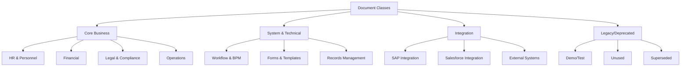
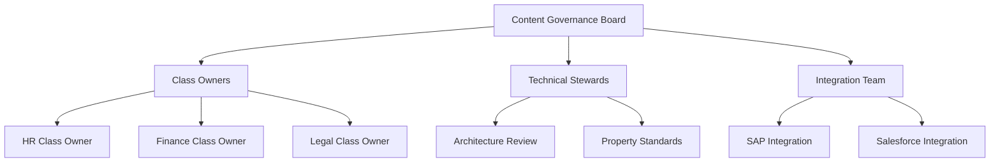

# IBM Content Services - Classification and Cleaning Plan

## Executive Summary

This document outlines a comprehensive plan to classify, organize, and clean the IBM Content Services document class architecture. The current repository contains **91 document classes**, many of which appear to be:
- Legacy or demo classes no longer in active use
- Duplicates or similar classes serving overlapping purposes
- Poorly documented or inconsistently named
- Missing clear business ownership

This plan provides a phased approach to rationalize the class structure, improve governance, and establish sustainable classification practices.

---

## Current State Assessment

### Issues Identified

#### 1. **Class Proliferation** (91 classes)
- Too many specialized classes for similar purposes
- Unclear differentiation between classes
- Multiple demo/test classes in production

#### 2. **Naming Inconsistencies**
- Mixed naming conventions (e.g., `LG_`, `SF`, `usr1_`, `wel`)
- Unclear prefixes and suffixes
- Non-descriptive names (e.g., `DynDos`, `HHNKDocs`, `MitaDoc`)

#### 3. **Documentation Gaps**
- Many classes have empty descriptions
- No clear business ownership documented
- Missing usage guidelines

#### 4. **Potential Duplicates**
- Multiple "Client Document" variants (`ClientDocument`, `usr1_Client_Document`, `usr2_Client_document`, `welClientDocument`)
- Multiple invoice classes (`Invoice`, `Invoice_ach`, `JKJInvoice`)
- Overlapping document types

#### 5. **Legacy/Unused Classes**
- Demo classes in production (`DemoDocument`, `AIngelDokument`)
- User-specific classes (`usr1_`, `usr2_`)
- Unclear if actively used

#### 6. **Property Inconsistency**
- Base Document class has 79 properties (potentially too many)
- Unclear which properties are actually used
- Duplicate or overlapping properties

---

## Classification Strategy

### Phase 1: Discovery and Analysis (Weeks 1-2)

#### 1.1 Document Usage Analysis
**Objective:** Identify which classes are actively used

**Tasks:**
- Query document counts per class
- Analyze creation dates and last modified dates
- Identify classes with zero or minimal documents
- Review access logs to determine usage patterns

**Deliverables:**
- Usage report with document counts per class
- List of potentially unused classes
- Active vs. inactive class classification

#### 1.2 Business Owner Identification
**Objective:** Establish ownership and accountability

**Tasks:**
- Survey business units to identify class owners
- Document business purpose for each class
- Identify classes without clear ownership
- Map classes to business processes

**Deliverables:**
- Class ownership matrix
- Business purpose documentation
- Orphaned class list

#### 1.3 Property Usage Analysis
**Objective:** Understand which properties are actually used

**Tasks:**
- Analyze property population rates across documents
- Identify never-used or rarely-used properties
- Review custom properties vs. system properties
- Assess property naming consistency

**Deliverables:**
- Property usage statistics
- Unused property list
- Property rationalization recommendations

### Phase 2: Classification Framework (Weeks 3-4)

#### 2.1 Define Classification Taxonomy

**Proposed Primary Categories:**



**Classification Criteria:**

| Category | Criteria | Action |
|----------|----------|--------|
| **Active Core** | >100 documents, clear business owner, actively used | Keep and optimize |
| **Active Specialized** | <100 documents, specific business need, active use | Keep with documentation |
| **Integration** | Used by external systems, active sync | Keep and monitor |
| **System** | Required by platform, workflow, or records management | Keep as-is |
| **Candidate for Consolidation** | Overlapping with other classes, <50 documents | Merge or deprecate |
| **Legacy** | No documents or <10 documents, no recent activity | Deprecate |
| **Demo/Test** | Clearly marked as demo, not production | Remove or isolate |

#### 2.2 Establish Naming Conventions

**Proposed Standard:**
```
[Domain]_[Type]_[Variant]

Examples:
- HR_Employee_Document
- Finance_Invoice_Standard
- Legal_Contract_Master
- System_Workflow_Definition
```

**Prefix Standards:**
- `HR_` - Human Resources
- `FIN_` - Finance
- `LEG_` - Legal
- `OPS_` - Operations
- `SYS_` - System/Technical
- `INT_` - Integration
- No prefix for base/generic classes

#### 2.3 Property Rationalization Framework

**Property Categories to Review:**

1. **Core Properties** (Keep)
   - Identity (Id, Creator, Dates)
   - Version Control
   - Security
   - Content Management

2. **Business Properties** (Review per class)
   - Assess usage and necessity
   - Consolidate duplicates
   - Standardize naming

3. **Integration Properties** (Keep but document)
   - SAP properties
   - Salesforce properties
   - External system links

4. **Deprecated Properties** (Mark for removal)
   - Never populated
   - Superseded by other properties
   - No longer relevant

### Phase 3: Cleaning and Consolidation (Weeks 5-8)

#### 3.1 Class Consolidation Plan

**Recommended Consolidations:**

| Current Classes | Proposed Consolidated Class | Rationale |
|----------------|----------------------------|-----------|
| ClientDocument, usr1_Client_Document, usr2_Client_document, welClientDocument | Client_Document | Eliminate user-specific variants |
| Invoice, Invoice_ach, JKJInvoice | Finance_Invoice (with Type property) | Consolidate invoice types |
| Customer, CustomerDocuments | Customer_Document | Merge related classes |
| DemoDocument, AIngelDokument | (Remove) | Demo classes should not be in production |
| Multiple LG_ classes | Legal_Document (with Category property) | Simplify legal document hierarchy |

**Consolidation Process:**
1. Create new consolidated class with combined properties
2. Migrate documents from old classes to new class
3. Update workflows and integrations
4. Deprecate old classes
5. Remove after grace period

#### 3.2 Property Cleanup

**Actions:**

1. **Remove Unused Properties**
   - Properties with <5% population rate
   - Properties not used in last 12 months
   - Deprecated integration properties

2. **Consolidate Duplicate Properties**
   - Merge similar properties with different names
   - Standardize data types
   - Align cardinality

3. **Improve Property Documentation**
   - Add clear descriptions
   - Document valid values
   - Specify business rules

#### 3.3 Class Deprecation Process

**For classes identified as legacy/unused:**

1. **Mark as Deprecated** (Week 5)
   - Update class description
   - Notify stakeholders
   - Document migration path

2. **Grace Period** (Weeks 6-7)
   - 30-day notice period
   - Support migration if needed
   - Monitor for unexpected usage

3. **Removal** (Week 8)
   - Hide from user interfaces
   - Prevent new document creation
   - Archive existing documents if needed

### Phase 4: Governance and Standards (Weeks 9-10)

#### 4.1 Establish Governance Framework

**Governance Structure:**



**Governance Policies:**

1. **New Class Creation**
   - Requires business justification
   - Architecture review required
   - Must follow naming conventions
   - Documentation mandatory

2. **Class Modification**
   - Change request process
   - Impact assessment required
   - Stakeholder approval needed
   - Migration plan for breaking changes

3. **Property Management**
   - New properties require approval
   - Deprecated properties marked clearly
   - Usage monitoring required

4. **Regular Reviews**
   - Quarterly usage reviews
   - Annual architecture assessment
   - Continuous optimization

#### 4.2 Documentation Standards

**Required Documentation per Class:**

1. **Business Purpose**
   - What business need does it serve?
   - Who uses it?
   - What processes depend on it?

2. **Technical Specifications**
   - Property definitions
   - Valid values and constraints
   - Integration points

3. **Usage Guidelines**
   - When to use this class
   - How to populate properties
   - Best practices

4. **Ownership**
   - Business owner
   - Technical contact
   - Support escalation

#### 4.3 Monitoring and Metrics

**Key Metrics to Track:**

| Metric | Target | Frequency |
|--------|--------|-----------|
| Total number of classes | <50 | Quarterly |
| Classes with zero documents | 0 | Monthly |
| Property population rate | >80% for required properties | Monthly |
| Classes without owners | 0 | Quarterly |
| Documentation completeness | 100% | Quarterly |
| New class creation rate | <2 per quarter | Quarterly |

---

## Implementation Roadmap

### Week 1-2: Discovery
- [ ] Run usage analysis queries
- [ ] Generate document count reports
- [ ] Identify business owners
- [ ] Analyze property usage
- [ ] Document current state

### Week 3-4: Classification
- [ ] Apply classification framework
- [ ] Categorize all 91 classes
- [ ] Identify consolidation candidates
- [ ] Define naming standards
- [ ] Create property rationalization plan

### Week 5-6: Planning
- [ ] Develop detailed consolidation plans
- [ ] Create migration scripts
- [ ] Update documentation
- [ ] Communicate changes to stakeholders
- [ ] Prepare deprecation notices

### Week 7-8: Execution
- [ ] Execute class consolidations
- [ ] Migrate documents
- [ ] Update integrations
- [ ] Deprecate unused classes
- [ ] Clean up properties

### Week 9-10: Governance
- [ ] Establish governance board
- [ ] Document policies and procedures
- [ ] Train class owners
- [ ] Set up monitoring
- [ ] Create ongoing review process

---

## Detailed Action Plan by Category

### A. HR & Employment Classes (3 classes)

**Current State:**
- HRDocument (well-defined with 40 properties)
- EmploymentApplication
- SalaryCertificate

**Recommendation:** ✅ **KEEP ALL**
- Well-structured and actively used
- Clear business purpose
- Good property definition

**Actions:**
- Document business ownership
- Review property usage
- Ensure consistent naming

### B. Financial Classes (8 classes)

**Current State:**
- Invoice, Invoice_ach, JKJInvoice (3 invoice variants)
- Contract, Collateral
- FinancialDocuments
- Customer, CustomerDocuments

**Recommendation:** 🔄 **CONSOLIDATE**

**Proposed Structure:**
```
Finance_Invoice (consolidate 3 invoice classes)
  - Add InvoiceType property (Standard, ACH, JKJ)
Finance_Contract
Finance_Collateral
Finance_Customer (merge Customer + CustomerDocuments)
Finance_General (rename FinancialDocuments)
```

**Actions:**
1. Create Finance_Invoice with Type property
2. Migrate documents from Invoice, Invoice_ach, JKJInvoice
3. Merge Customer classes
4. Deprecate old classes after migration

### C. Legal Classes (10 classes)

**Current State:**
- 10 LG_ prefixed classes
- Specific document types (Policy, Mortgage, License, etc.)

**Recommendation:** 🔄 **SIMPLIFY**

**Proposed Structure:**
```
Legal_Document (base class)
  - Add DocumentType property
  - Add DocumentSubtype property
  
Types: Policy, Mortgage, License, KYC, Birth Certificate, Passport, etc.
```

**Alternative:** Keep specialized classes if heavily used

**Actions:**
1. Analyze usage of each LG_ class
2. If low usage (<50 docs each), consolidate
3. If high usage, keep but improve documentation
4. Standardize naming (remove LG_ prefix or make consistent)

### D. System & Workflow Classes (12 classes)

**Current State:**
- WorkflowDefinition, FormTemplate, FormData, FormPolicy
- EntryTemplate, CodeModule
- IBM_BPM_Document, IBM_BPM_CodeModule
- ScenarioDefinition, Simulation
- RecordsTemplate, StoredSearch

**Recommendation:** ✅ **KEEP ALL**
- System-critical classes
- Required for platform functionality
- Do not modify

**Actions:**
- Document dependencies
- Ensure proper access controls
- Monitor usage

### E. Integration Classes (8 classes)

**Current State:**
- SFDocument, SFCRMDocument (Salesforce)
- DemoDocument
- ProductDocument, ProjectDocument
- MarketingPlan, Email
- PreferencesDocument

**Recommendation:** 🔄 **REVIEW AND CLEAN**

**Actions:**
1. **Remove:** DemoDocument (demo class)
2. **Keep:** SF classes if Salesforce integration active
3. **Review:** ProductDocument, ProjectDocument, MarketingPlan
   - Consolidate if overlapping
   - Remove if unused
4. **Keep:** Email, PreferencesDocument (if used)

### F. Specialized/Custom Classes (40 classes)

**Current State:**
- Many vendor/customer-specific classes
- Unclear naming (AIngelDokument, DynDos, HHNKDocs, etc.)
- User-specific classes (usr1_, usr2_)
- Multiple client document variants

**Recommendation:** 🗑️ **AGGRESSIVE CLEANUP**

**Priority Actions:**

1. **Immediate Removal Candidates:**
   - AIngelDokument (unclear purpose)
   - usr1_Client_Document, usr2_Client_document (user-specific)
   - DynDos, HHNKDocs, MitaDoc (unclear naming)
   - JARDNI, JARDocument (unclear purpose)
   - UAX_Alumnos, UAX_Comprobantes (specific implementation)

2. **Consolidation Candidates:**
   - welBankInformation, welClientDocument, welClientIdentification
     → Consolidate to Client_Document with Type property
   - ZV_Contract, ZV_Customer
     → Merge with standard Contract/Customer classes

3. **Review for Retention:**
   - CDS_ classes (if Certification system active)
   - DCGD_Document (if actively used)
   - SC_SupplierProductCatalogue (if supply chain active)
   - webhookclass (if webhook integration active)

**Decision Matrix:**

| Class | Documents | Last Used | Owner | Decision |
|-------|-----------|-----------|-------|----------|
| AIngelDokument | ? | ? | ? | Remove if <10 docs |
| usr1_Client_Document | ? | ? | ? | Consolidate or remove |
| DynDos | ? | ? | ? | Remove if no owner |
| CDS_Document | ? | ? | ? | Keep if active system |

---

## Risk Mitigation

### Risks and Mitigation Strategies

| Risk | Impact | Probability | Mitigation |
|------|--------|-------------|------------|
| Breaking existing integrations | High | Medium | Thorough integration testing, phased rollout |
| Data loss during migration | High | Low | Backup before migration, validation scripts |
| User resistance to changes | Medium | High | Clear communication, training, support |
| Incomplete usage analysis | Medium | Medium | Multiple data sources, stakeholder interviews |
| Regulatory compliance issues | High | Low | Legal review, compliance team involvement |

### Rollback Plan

For each phase:
1. **Backup:** Full system backup before changes
2. **Validation:** Test migration in non-production environment
3. **Monitoring:** Real-time monitoring during rollout
4. **Rollback Procedure:** Documented steps to revert changes
5. **Communication:** Clear escalation path

---

## Success Criteria

### Quantitative Metrics

| Metric | Current | Target | Timeline |
|--------|---------|--------|----------|
| Total document classes | 91 | <50 | 10 weeks |
| Classes with zero documents | Unknown | 0 | 8 weeks |
| Classes without documentation | ~50% | 0% | 10 weeks |
| Classes without owners | Unknown | 0 | 4 weeks |
| Property population rate | Unknown | >80% | 10 weeks |
| Duplicate/similar classes | ~15 | 0 | 8 weeks |

### Qualitative Outcomes

- ✅ Clear business ownership for all classes
- ✅ Consistent naming conventions
- ✅ Comprehensive documentation
- ✅ Established governance process
- ✅ Reduced complexity and maintenance burden
- ✅ Improved user experience
- ✅ Better system performance

---

## Communication Plan

### Stakeholder Communication

| Stakeholder Group | Communication Method | Frequency | Content |
|-------------------|---------------------|-----------|---------|
| Executive Sponsors | Status reports | Bi-weekly | Progress, risks, decisions needed |
| Business Owners | Workshops, emails | Weekly | Changes affecting their classes |
| End Users | Announcements, training | As needed | New features, deprecations |
| Technical Team | Stand-ups, documentation | Daily | Implementation details |
| Integration Partners | Technical briefings | As needed | API changes, migration support |

### Key Messages

1. **Why:** Simplify and optimize the document class structure
2. **What:** Consolidate, clean, and govern document classes
3. **When:** 10-week phased approach
4. **How:** Careful analysis, testing, and migration
5. **Impact:** Better performance, easier maintenance, clearer structure

---

## Next Steps

### Immediate Actions (This Week)

1. **Approve Plan**
   - Review with stakeholders
   - Get executive sponsorship
   - Allocate resources

2. **Form Team**
   - Assign project manager
   - Identify technical leads
   - Engage business owners

3. **Begin Discovery**
   - Run usage queries
   - Start stakeholder interviews
   - Document current state

### Quick Wins (First 2 Weeks)

1. Remove obvious demo/test classes
2. Document top 10 most-used classes
3. Identify and contact class owners
4. Create initial classification

---

## Appendices

### Appendix A: SQL Queries for Analysis

```sql
-- Document count per class
SELECT ClassDescription, COUNT(*) as DocumentCount
FROM Document
GROUP BY ClassDescription
ORDER BY DocumentCount DESC;

-- Classes with zero documents
SELECT ClassName
FROM ClassDefinition
WHERE ClassName NOT IN (SELECT DISTINCT ClassDescription FROM Document);

-- Property population rates
SELECT PropertyName, 
       COUNT(*) as TotalDocuments,
       COUNT(PropertyValue) as PopulatedDocuments,
       (COUNT(PropertyValue) * 100.0 / COUNT(*)) as PopulationRate
FROM Document d
LEFT JOIN DocumentProperties dp ON d.Id = dp.DocumentId
GROUP BY PropertyName
ORDER BY PopulationRate ASC;

-- Last modified dates per class
SELECT ClassDescription, MAX(DateLastModified) as LastActivity
FROM Document
GROUP BY ClassDescription
ORDER BY LastActivity DESC;
```

### Appendix B: Class Owner Template

```markdown
# Class Ownership Record

**Class Name:** [Symbolic Name]
**Display Name:** [Display Name]
**Business Owner:** [Name, Department]
**Technical Contact:** [Name, Email]
**Business Purpose:** [Description]
**Key Processes:** [List of processes]
**Integration Points:** [Systems that use this class]
**Document Count:** [Current count]
**Last Review Date:** [Date]
**Next Review Date:** [Date]
```

### Appendix C: Change Request Template

```markdown
# Document Class Change Request

**Request ID:** [Auto-generated]
**Date:** [Submission date]
**Requestor:** [Name, Department]
**Type:** [New Class | Modify Class | Deprecate Class | Add Property | Remove Property]

## Current State
[Description of current situation]

## Proposed Change
[Detailed description of proposed change]

## Business Justification
[Why is this change needed?]

## Impact Assessment
- Affected Documents: [Count]
- Affected Integrations: [List]
- Affected Users: [Count/Groups]
- Affected Workflows: [List]

## Implementation Plan
[How will this be implemented?]

## Rollback Plan
[How to revert if needed?]

## Approvals Required
- [ ] Business Owner
- [ ] Technical Architect
- [ ] Integration Team
- [ ] Governance Board
```

---

## Conclusion

This classification and cleaning plan provides a structured approach to rationalize the IBM Content Services document class architecture from 91 classes to a more manageable, well-governed set of <50 classes. The phased approach minimizes risk while delivering quick wins and establishing long-term governance.

**Key Success Factors:**
1. Executive sponsorship and support
2. Clear business ownership
3. Thorough analysis before action
4. Careful migration and testing
5. Strong governance framework
6. Ongoing monitoring and optimization

**Expected Benefits:**
- Reduced complexity and maintenance burden
- Improved system performance
- Better user experience
- Clearer business alignment
- Stronger governance and control
- Lower total cost of ownership

The plan is designed to be flexible and can be adjusted based on findings during the discovery phase. Regular checkpoints and stakeholder communication will ensure alignment and success.