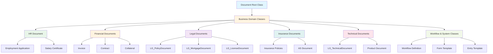
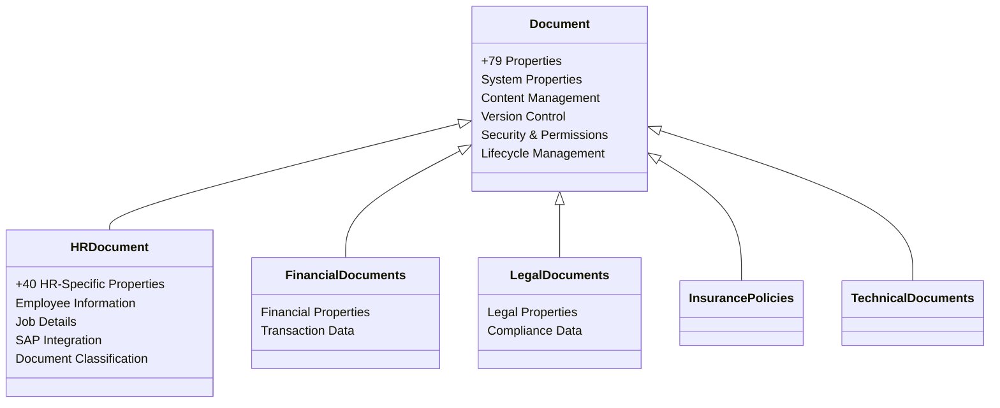
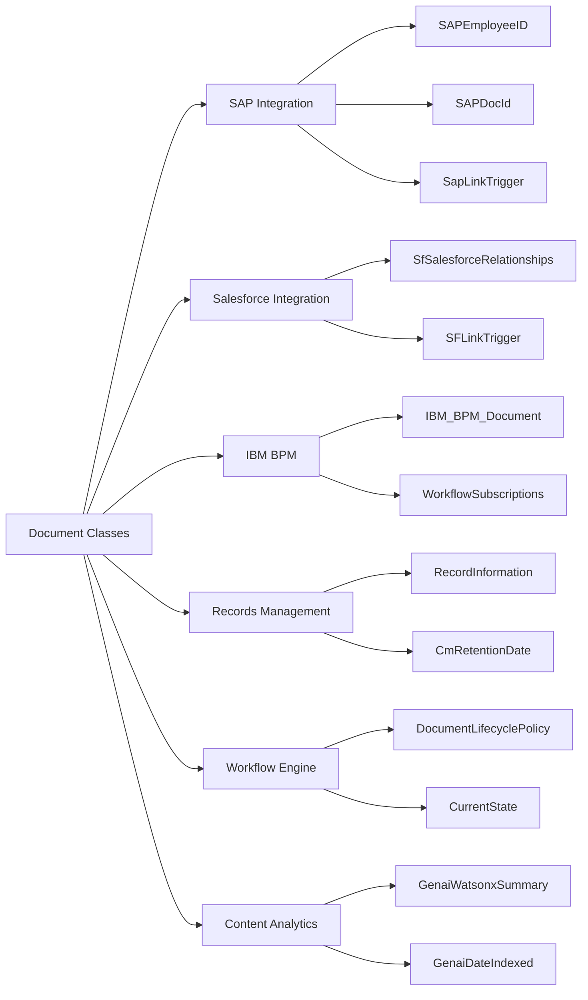

# IBM Content Services - Document Class Architecture

## Overview

The IBM Content Services repository contains **91 document classes** organized in a hierarchical structure, all inheriting from the base `Document` class. This architecture supports various business domains including HR, Finance, Legal, Insurance, and more.

## Architecture Diagram

## Class Hierarchy Structure

## Complete Document Class Catalog

### HR & Employment (3 classes)

| Symbolic Name | Display Name | Description |
|--------------|--------------|-------------|
| HRDocument | HR Document | HR Document |
| EmploymentApplication | Employment Application | Employment Application |
| SalaryCertificate | Salary Certificate | Salary Certificate |

### Financial & Accounting (8 classes)

| Symbolic Name | Display Name | Description |
|--------------|--------------|-------------|
| Invoice | Invoice | Invoice |
| Invoice_ach | Invoice_ach | Invoice_ach |
| Contract | Contract | Contract |
| Collateral | Collateral | Collateral |
| FinancialDocuments | Financial Documents | Financial Documents for Nestle |
| Customer | Customer | Customer |
| CustomerDocuments | Customer Documents | Customer Documents |
| ClientDocument | Client Document | Client Document |

### Legal & Compliance (10 classes)

| Symbolic Name | Display Name | Description |
|--------------|--------------|-------------|
| LG_PolicyDocument | Policy Document | Policy Document |
| LG_MortgageDocument | Mortgage Document | Mortgage Document |
| LG_LicenseDocument | License Document | License Document |
| LG_ProductLicenseDocument | Product License Document | Product License Document |
| LG_TechnicalDocument | Technical Document | Technical Document |
| LG_KYCDocuments | KYC Documents | KYC Documents |
| LG_BirthCertificate | Birth Certificate | Birth Certificate |
| LG_Passport | Passport | Passport |
| LG_SignatureArchive | Signature Archive | Signature Archive |
| LG_CommercialSignatureArchive | Commercial Signature Archive | Commercial Signature Archive |

### Insurance (3 classes)

| Symbolic Name | Display Name | Description |
|--------------|--------------|-------------|
| InsurancePolicies | Insurance Policies | Insurance Policies |
| ASDocument | AS Document | FRDemo : Demo Assurance - Classe de doc ASDocument |
| Disputes | Disputes | Disputes |

### System & Workflow (12 classes)

| Symbolic Name | Display Name | Description |
|--------------|--------------|-------------|
| WorkflowDefinition | Workflow Definition | A workflow definition document |
| FormTemplate | Form Template | Form Template objects for eForm integration |
| FormData | Form Data | Form Data objects used for eForm integration |
| FormPolicy | Form Policy | Form Policy object used for eForm integration |
| EntryTemplate | Entry Template | Entry Template class |
| CodeModule | Code Module | Code module object for event action |
| IBM_BPM_Document | IBM BPM document | The document class definition for the BPM document |
| IBM_BPM_CodeModule | BPM Code Module | An extension of code module with IBM BPM specific properties |
| ScenarioDefinition | Scenario Definition | Scenario Definition |
| Simulation | Simulation | Simulation |
| RecordsTemplate | Records Template | Records Template |
| StoredSearch | Stored Search | (empty description) |

### Integration & Demo (8 classes)

| Symbolic Name | Display Name | Description |
|--------------|--------------|-------------|
| SFDocument | SF Document | SF Document |
| SFCRMDocument | SF CRM Document | SF CRM Document |
| DemoDocument | Demo Document | ECM Demo Document |
| ProductDocument | Product Document | Product Document |
| ProjectDocument | Project Document | Project Document |
| MarketingPlan | Marketing Plan | Marketing Plan |
| Email | Email | Email |
| PreferencesDocument | Preferences Document | Preferences Document |

### Records Management (2 classes)

| Symbolic Name | Display Name | Description |
|--------------|--------------|-------------|
| RecordInfo | Record | RecordInfo |
| ArchiveDocuments | Archive Documents | Archive Documents |

### Content Management (5 classes)

| Symbolic Name | Display Name | Description |
|--------------|--------------|-------------|
| IcnSearch | Search | (empty description) |
| IcnEditTemplate | Edit Service Template | (empty description) |
| IcnOfficeTemplate | Office Template | (empty description) |
| WebContentTemplate | Web Content Template | Web Content Template |
| WebFormTemplate | ITX Form Template | ITX Form Template used for XML based template files |

### Specialized Business Classes (40 classes)

| Symbolic Name | Display Name | Description |
|--------------|--------------|-------------|
| AIngelDokument | DocumentAIngel Document | DocumentAIngel Document |
| Bulletin | Bulletin | Bulletin |
| CDS_CertificationCaseAsDocument | CDS Certification Case | CDS Certification Case |
| CDS_Document | CDS Document | CDS Document |
| CDS_ParentSubcase | CDS ParentSubcase | CDS Parent and Subcase |
| CmRptSearchResultsCSVDocument | Search Results CSV Document | (empty description) |
| DACArchive | DAC Archive | DAC Archive |
| DCGD_Document | DCGD_Document | DCGD_Document |
| DocumentwithSummary | Document with Summary | Document with Summary |
| DynDos | DynDos | DynDos |
| HEL_Kokouskutsu | Kokouskutsu | Kokouskutsu |
| HHNKDocs | HHNKDocs | HHNKDocs |
| HaseDocument | HaseDocument | HaseDocument |
| JARDNI | JARDNI | JARDNI |
| JARDocument | JARDocument | JARDocument |
| JKJInvoice | JKJ Invoice | JKJ Invoice |
| LG_KnowledgeCentre | Knowledge Centre | Knowledge Centre |
| LG_MemberForms | Member Forms | Member Forms |
| MJ_Doc | Account Document | MJ_Doc |
| MitaDoc | Mita Doc | Mita Doc |
| PolicyDoc | PolicyDoc | PolicyDoc |
| SC_SupplierProductCatalogue | Supplier Product Catalogue | Supplier Product Catalogue |
| UAX_Alumnos | UAX_Alumnos | UAX_Alumnos |
| UAX_Comprobantes | UAX_Comprobantes | UAX_Comprobantes |
| USXXX_Document | USXXX_Document | USXXX_Document |
| XMLPropertyMappingScript | XML Property Mapping Script | Contains an XSL Transform script for extracting properties from content |
| ZV_Contract | ZV_Contract | ZV_Contract |
| ZV_Customer | ZV_Customer | ZV_Customer |
| usr1_Client_Document | usr1_Client_Document | usr1_Client_Document |
| usr2_Client_document | usr2_Client_document | usr2_Client_document |
| webhookclass | webhook class | webhook class |
| welBankInformation | wel Bank Information | wel Bank Information |
| welClientDocument | wel Client Document | wel Client Document |
| welClientIdentification | wel Client Identification | wel Client Identification |

## Property Categories

The document classes contain properties organized into these categories:

### 1. System Properties (Inherited from Document)

#### Identity & Metadata
- **Id** (GUID): Unique object identifier
- **Creator** (STRING): User who created the object
- **DateCreated** (DATE): Creation timestamp
- **LastModifier** (STRING): User who last modified the object
- **DateLastModified** (DATE): Last modification timestamp
- **Name** (STRING): Object name property value

#### Version Control
- **IsVersioningEnabled** (BOOLEAN): Whether versioning is enabled
- **MajorVersionNumber** (LONG): Major version number
- **MinorVersionNumber** (LONG): Minor version number
- **VersionStatus** (LONG): Version status indicator
- **IsCurrentVersion** (BOOLEAN): Whether this is the current version
- **IsFrozenVersion** (BOOLEAN): Whether version is frozen
- **IsReserved** (BOOLEAN): Whether document is reserved/checked out
- **ReservationType** (LONG): Type of reservation (collaborative/exclusive)
- **DateCheckedIn** (DATE): Check-in timestamp
- **VersionSeries** (OBJECT): Associated version series object
- **CurrentVersion** (OBJECT): Current version reference
- **ReleasedVersion** (OBJECT): Latest released major version
- **Reservation** (OBJECT): Reservation object reference

#### Security & Permissions
- **Owner** (STRING): Security owner
- **Permissions** (OBJECT LIST): Discretionary permissions
- **SecurityPolicy** (OBJECT): Associated security policy
- **SecurityParent** (OBJECT): Parent for security inheritance
- **SecurityFolder** (OBJECT): Security proxy for access control
- **ActiveMarkings** (OBJECT LIST): Active markings applied

#### Content Management
- **ContentSize** (DOUBLE): Content size in bytes
- **MimeType** (STRING): MIME type of document
- **ContentElements** (OBJECT LIST): Content elements list
- **ContentElementsPresent** (STRING LIST): Component types present
- **StoragePolicy** (OBJECT): Storage policy reference
- **StorageLocation** (STRING): Storage location path
- **StorageArea** (OBJECT): Storage area reference
- **DateContentLastAccessed** (DATE): Last content access timestamp
- **ContentRetentionDate** (DATE): Content retention date

#### Lifecycle Management
- **DocumentLifecyclePolicy** (OBJECT): Applied lifecycle policy
- **CurrentState** (STRING): Current lifecycle state
- **IsInExceptionState** (BOOLEAN): Exception state indicator
- **CmRetentionDate** (DATE): Retention date
- **CmIsMarkedForDeletion** (BOOLEAN): Deletion marker

#### Workflow & Tasks
- **WorkflowSubscriptions** (OBJECT ENUM): Workflow subscriptions
- **CoordinatedTasks** (OBJECT ENUM): Coordinated tasks

#### Relationships & Structure
- **FoldersFiledIn** (OBJECT ENUM): Folders containing document
- **Containers** (OBJECT ENUM): Container relationships
- **Annotations** (OBJECT ENUM): Associated annotations
- **CompoundDocumentState** (LONG): Compound document state
- **ChildDocuments** (OBJECT ENUM): Child component documents
- **ChildRelationships** (OBJECT ENUM): Child relationships
- **ParentDocuments** (OBJECT ENUM): Parent component documents
- **ParentRelationships** (OBJECT ENUM): Parent relationships

#### Indexing & Search
- **IndexationId** (GUID): Indexation collection ID
- **CmIndexingFailureCode** (LONG): Indexing failure reasons
- **ClassificationStatus** (LONG): Auto-classification status

#### Records Management
- **CmHoldRelationships** (OBJECT ENUM): Hold relationships
- **RecordInformation** (OBJECT): Record information object
- **CanDeclare** (BOOLEAN): Can declare as record

#### Integration & Collaboration
- **SfSalesforceRelationships** (OBJECT ENUM): Salesforce relationships
- **ClbSharingController** (OBJECT): Sharing controller
- **ClbSecurityController** (OBJECT): Security controller
- **ClbSensitiveContent** (LONG): Sensitive content indicator
- **ClbDocumentState** (LONG): Document state

#### Digital Signature
- **DSSignatureStatus** (LONG): Signature status
- **DSEnvelopeID** (STRING): Envelope ID

#### AI & Analytics
- **GenaiDateIndexed** (DATE): Gen AI indexing date
- **GenaiWatsonxSummary** (STRING): Watsonx AI summary

#### Entry Template
- **EntryTemplateId** (GUID): Entry template ID
- **EntryTemplateObjectStoreName** (STRING): Object store name
- **EntryTemplateLaunchedWorkflowNumber** (STRING): Workflow number

#### Other System Properties
- **DocumentTitle** (STRING): Document title
- **LockToken** (GUID): WebDAV lock token
- **LockTimeout** (LONG): Lock timeout in seconds
- **LockOwner** (STRING): Lock owner description
- **CmThumbnails** (OBJECT ENUM): Thumbnail images
- **ComponentBindingLabel** (STRING): Component binding label
- **IgnoreRedirect** (BOOLEAN): Redirect ignore flag

### 2. HR-Specific Properties (HRDocument Class)

#### Personal Information
- **FirstName** (STRING): Employee first name
- **LastName** (STRING): Employee last name
- **PersonalID** (STRING): Personal identification number
- **Birthdate** (DATE): Date of birth

#### Employment Details
- **EmployeeID** (STRING): Employee identifier
- **SAPEmployeeID** (STRING): SAP employee ID
- **JobRole** (STRING): Job role/title
- **JobFunction** (STRING): Job function
- **JobCode** (STRING): Job code
- **JobLevel** (STRING): Job level
- **JobStatus** (STRING): Job status
- **EmploymentType** (STRING): Employment type (full-time, part-time, etc.)
- **CurrentStatus** (STRING): Current employment status
- **StartDate** (DATE): Employment start date
- **TerminationDate** (DATE): Employment termination date

#### Organizational Structure
- **Company** (STRING): Company name
- **CompanyCode** (STRING): Company code
- **BusinessUnit** (STRING): Business unit
- **Department** (STRING): Department
- **Division** (STRING): Division or department
- **CostCenter** (STRING): Cost center
- **Location** (STRING): Work location

#### Document Classification
- **DocType** (STRING): Document type
- **DocumentCategory** (STRING): Document category
- **ClassDocType** (STRING): Classification document type

#### SAP Integration
- **SAPDocId** (STRING): SAP document ID
- **SAPDocProt** (STRING): SAP document protocol
- **SAPComps** (STRING): SAP components
- **SAPContType** (STRING): SAP content type
- **SAPCompVersion** (STRING): SAP component version
- **SapLinkTrigger** (BOOLEAN): SAP link trigger flag
- **sapLinked** (STRING): SAP linked status

#### Salesforce Integration
- **SFLinkTrigger** (BOOLEAN): Salesforce link trigger

#### Workflow Integration
- **docuflowTimestamp** (DATE): Docuflow timestamp
- **docuflowUsername** (STRING): Docuflow username

## Property Data Types

| Data Type | Description | Usage |
|-----------|-------------|-------|
| STRING | Text values | Names, descriptions, identifiers |
| DATE | Date/time values | Timestamps, dates |
| LONG | Integer values | Counters, status codes, flags |
| DOUBLE | Decimal values | Sizes, measurements |
| BOOLEAN | True/false flags | Status indicators, toggles |
| GUID | Unique identifiers | IDs, references |
| OBJECT | Complex object references | Relationships, policies |
| ENUM | Enumerated collections | Lists, relationships |

## Property Cardinality

- **SINGLE**: Single value property
- **LIST**: Ordered list of values
- **ENUM**: Enumeration of objects (collection)

## Integration Points

## Security & Compliance Features

### Access Control
- **Permissions**: Discretionary access control lists
- **Owner**: Security owner designation
- **SecurityPolicy**: Policy-based security
- **SecurityParent**: Inherited security model
- **ActiveMarkings**: Security markings/classifications

### Retention Management
- **CmRetentionDate**: Minimum retention date
- **ContentRetentionDate**: Content-specific retention
- **CmIsMarkedForDeletion**: Deletion marker

### Hold Management
- **CmHoldRelationships**: Legal hold relationships
- Prevents deletion during litigation/investigation

### Records Management
- **RecordInformation**: Records management metadata
- **CanDeclare**: Ability to declare as record
- Compliance with regulatory requirements

### Audit Trail
- **Creator**: Document creator
- **DateCreated**: Creation timestamp
- **LastModifier**: Last modifier
- **DateLastModified**: Modification timestamp
- **AuditedEvents**: Audited event collection

### Sensitive Content
- **ClbSensitiveContent**: Sensitive content flag
- Data loss prevention integration

## Best Practices

### 1. Class Selection
- Choose the most specific class that matches your document type
- Consider inheritance hierarchy for property availability
- Use specialized classes (HRDocument, Invoice) over generic Document

### 2. Property Usage
- Populate both system and business properties appropriately
- Use consistent naming conventions
- Leverage integration properties for connected systems

### 3. Version Control
- Enable versioning for documents requiring change tracking
- Use major versions for significant changes
- Use minor versions for incremental updates
- Freeze versions when finalized

### 4. Security
- Set appropriate permissions at creation
- Apply security policies for consistent access control
- Use security inheritance where appropriate
- Apply markings for classified content

### 5. Lifecycle Management
- Define lifecycle policies for automated management
- Set retention dates according to compliance requirements
- Use holds for legal preservation
- Implement proper disposal procedures

### 6. Integration
- Use SAP properties for SAP-integrated documents
- Leverage Salesforce relationships for CRM integration
- Set trigger flags for automated synchronization
- Maintain consistent identifiers across systems

### 7. Content Management
- Store appropriate MIME types
- Use storage policies for tiered storage
- Implement compound documents for related content
- Generate thumbnails for visual preview

### 8. Search & Discovery
- Populate searchable properties
- Use consistent classification
- Enable full-text indexing
- Apply AI summaries for enhanced discovery

## Statistics Summary

| Metric | Value |
|--------|-------|
| Total Document Classes | 91 |
| Base Document Properties | 79 |
| HR Document Additional Properties | 40 |
| System-Owned Properties | ~60 |
| Custom Properties | Variable by class |
| Data Types Supported | 8 |
| Integration Systems | 5+ (SAP, Salesforce, BPM, etc.) |

## Conclusion

This architecture provides a flexible, scalable foundation for enterprise content management across multiple business domains and use cases. The hierarchical class structure, comprehensive property model, and extensive integration capabilities support complex business requirements while maintaining security, compliance, and operational efficiency.