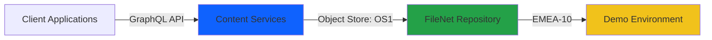

# Audit Scope and Planning
**Audit ID:** 20260519_114024_full_audit  
**Phase:** 1 - Planning & Setup  
**Date:** May 19, 2026

## Audit Objectives

### Primary Goals
1. **Assess Repository Health** - Evaluate the overall state of the IBM FileNet Content Services repository
2. **Identify Optimization Opportunities** - Find areas for improvement in class design, property usage, and folder organization
3. **Document Current State** - Create comprehensive documentation of repository architecture
4. **Provide Actionable Recommendations** - Deliver prioritized improvement roadmap

### Specific Focus Areas

#### 1. Document Class Architecture
- Map complete class hierarchy
- Identify inheritance patterns
- Assess class design consistency
- Evaluate class naming conventions
- Document class relationships

#### 2. Property Template Analysis
- Catalog all property templates
- Analyze property usage patterns
- Identify unused or underutilized properties
- Assess property data types and constraints
- Document property dependencies

#### 3. Folder Structure Organization
- Map folder hierarchy
- Analyze folder depth and breadth
- Identify organizational patterns
- Assess folder naming conventions
- Document folder security patterns

#### 4. Document Distribution
- Analyze document counts by class
- Examine document filing patterns
- Assess classification accuracy
- Identify orphaned or misclassified documents
- Document content distribution

#### 5. Integration Points
- Identify external system integrations
- Document API usage patterns
- Assess integration dependencies
- Map data flow patterns
- Identify potential integration issues

#### 6. Governance & Compliance
- Assess retention policy implementation
- Evaluate security model
- Document audit trail capabilities
- Identify compliance gaps
- Assess data quality

## Repository Context

### Environment Details

- **Environment Type:** Development/Demo
- **Server Location:** fncm-dev-demo-emea-10.automationcloud.ibm.com
- **Object Store:** OS1
- **Access Method:** GraphQL API
- **Authentication:** Service Account (cmis-filenet.fid@t7026)

### Known Context
Based on the workspace structure, this repository appears to be used for:
- HR document management demonstrations
- Document classification and property extraction workflows
- Bulk document upload scenarios
- Content-based retrieval (CBR) testing

## Audit Methodology

### Phase-Based Approach

```mermaid
gantt
    title Audit Execution Timeline
    dateFormat HH:mm
    section Phase 1
    Planning & Setup           :done, p1, 09:40, 30m
    section Phase 2
    Class Analysis            :active, p2, 10:10, 45m
    section Phase 3
    Property Analysis         :p3, 10:55, 45m
    section Phase 4
    Folder Analysis           :p4, 11:40, 30m
    section Phase 5
    Document Analysis         :p5, 12:10, 45m
    section Phase 6
    Integration Analysis      :p6, 12:55, 30m
    section Phase 7
    Executive Summary         :p7, 13:25, 45m
```

### Data Collection Strategy

#### 1. Systematic Discovery
- Use MCP tools to query repository metadata
- Collect comprehensive class definitions
- Gather property template specifications
- Map folder structures
- Sample document distributions

#### 2. Pattern Analysis
- Identify naming conventions
- Detect organizational patterns
- Analyze usage statistics
- Assess design consistency

#### 3. Visual Documentation
- Create Mermaid diagrams for all major findings
- Illustrate class hierarchies
- Map folder structures
- Visualize data flows
- Show before/after scenarios

#### 4. Evidence-Based Findings
- All findings backed by repository data
- Quantitative metrics where possible
- Specific examples for each finding
- Clear traceability to source data

## Audit Scope Boundaries

### In Scope
✅ Document classes and subclasses  
✅ Property templates and definitions  
✅ Folder structure and organization  
✅ Document distribution and classification  
✅ Integration points via GraphQL API  
✅ Metadata quality and consistency  

### Out of Scope
❌ Content file analysis (binary content)  
❌ Performance testing or benchmarking  
❌ Security penetration testing  
❌ Workflow definitions (if any)  
❌ Custom object types (unless relevant)  
❌ Historical audit logs  

## Success Criteria

This audit will be considered successful when:

1. **Complete Documentation** - All 7 phases completed with detailed reports
2. **Visual Clarity** - Mermaid diagrams for all major architectural elements
3. **Actionable Insights** - Clear, prioritized recommendations
4. **Executive Summary** - High-level findings suitable for stakeholders
5. **Implementation Roadmap** - Phased approach to improvements

## Risk Considerations

### Potential Challenges
- **Data Volume** - Large repositories may require sampling strategies
- **Complexity** - Deep class hierarchies may need multiple analysis passes
- **Access Limitations** - Some metadata may not be accessible via GraphQL
- **Time Constraints** - Comprehensive analysis requires systematic approach

### Mitigation Strategies
- Use targeted queries to minimize data retrieval
- Focus on representative samples for large datasets
- Document any access limitations encountered
- Prioritize high-impact findings

## Next Steps

1. ✅ Create audit folder structure
2. ✅ Document audit scope and objectives
3. ➡️ Begin Phase 2: Class Analysis
   - List all root classes
   - Retrieve complete Document class hierarchy
   - Analyze class relationships
   - Generate class architecture diagrams

---

**Phase 1 Status:** ✅ Complete  
**Ready for Phase 2:** Yes  
**Estimated Phase 2 Duration:** 45 minutes