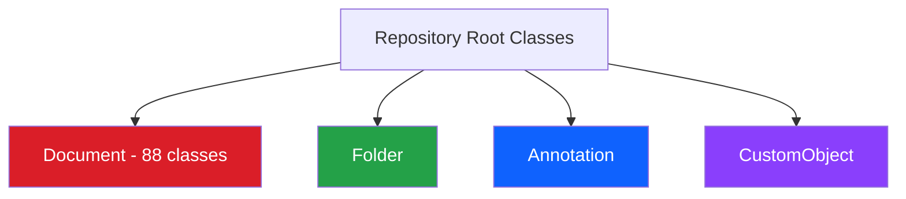
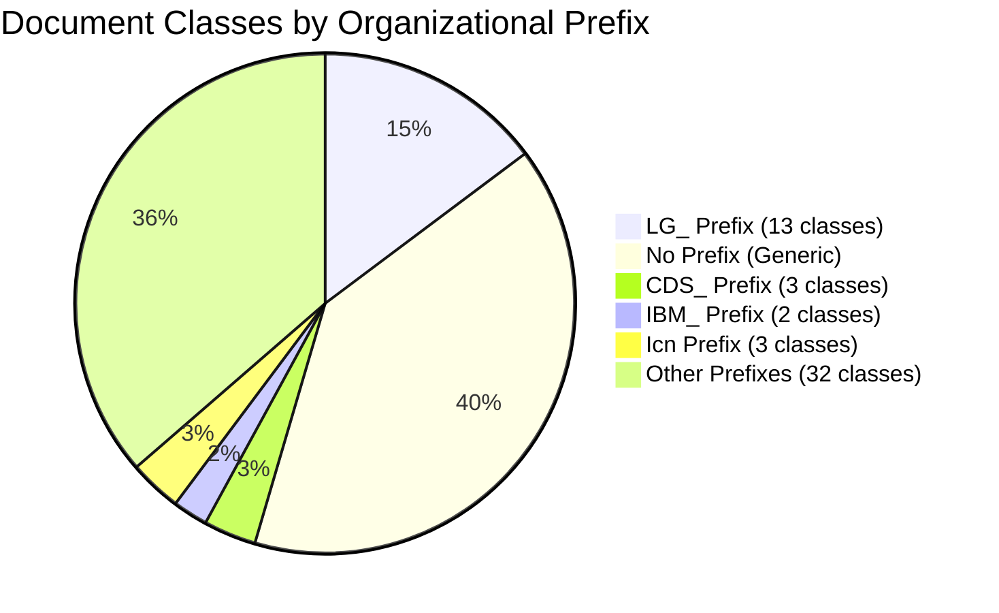
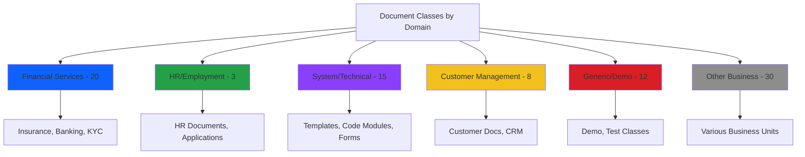
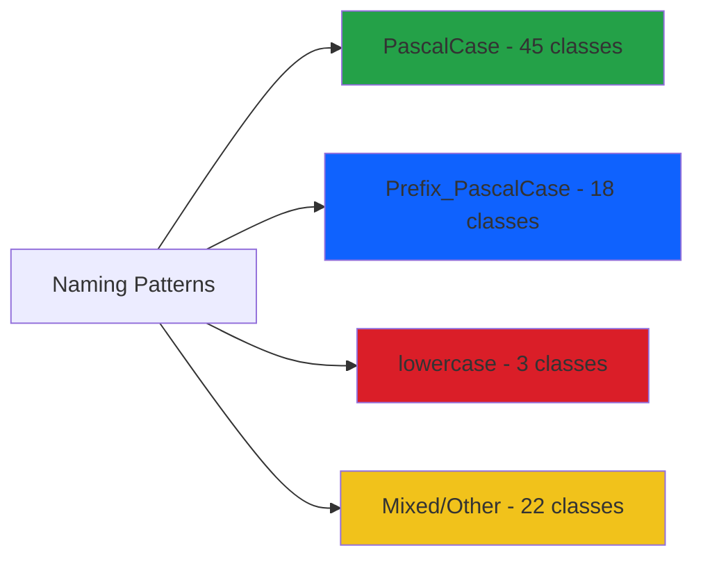
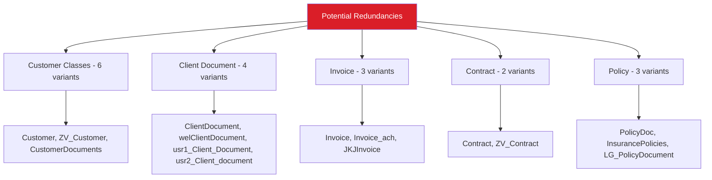
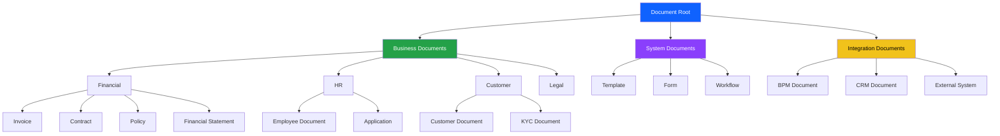

# Document Class Analysis
**Audit ID:** 20260519_114024_full_audit  
**Phase:** 2 - Class Analysis  
**Date:** May 19, 2026

## Executive Summary

The repository contains **88 document classes** (including the root Document class), revealing a highly fragmented class architecture with significant consolidation opportunities. The analysis identifies multiple patterns of class proliferation, inconsistent naming conventions, and potential redundancy across organizational boundaries.

### Key Findings
- 🔴 **88 total document classes** - Extremely high number indicating class proliferation
- 🟡 **Multiple similar classes** - Evidence of duplicate or overlapping purposes
- 🟡 **Inconsistent naming** - Mix of prefixes, languages, and conventions
- 🟢 **Clear organizational patterns** - Some classes show logical grouping by prefix

## Root Class Overview



## Document Class Inventory

### Total Count: 88 Classes

The repository contains 88 document classes, which is significantly high for a typical enterprise repository. This suggests:
1. Organic growth without governance
2. Multiple projects/teams creating classes independently
3. Lack of class reuse strategy
4. Potential for significant consolidation

## Class Categorization Analysis

### By Organizational Prefix



#### LG_ Prefixed Classes (13 classes)
Largest single organizational group, suggesting a major business unit or project:
- [`LG_BirthCertificate`](LG_BirthCertificate) - Birth Certificate
- [`LG_CommercialSignatureArchive`](LG_CommercialSignatureArchive) - Commercial Signature Archive
- [`LG_KYCDocuments`](LG_KYCDocuments) - KYC Documents
- [`LG_KnowledgeCentre`](LG_KnowledgeCentre) - Knowledge Centre
- [`LG_LicenseDocument`](LG_LicenseDocument) - License Document
- [`LG_MemberForms`](LG_MemberForms) - Member Forms
- [`LG_MortgageDocument`](LG_MortgageDocument) - Mortgage Document
- [`LG_Passport`](LG_Passport) - Passport
- [`LG_PolicyDocument`](LG_PolicyDocument) - Policy Document
- [`LG_ProductLicenseDocument`](LG_ProductLicenseDocument) - Product License Document
- [`LG_SignatureArchive`](LG_SignatureArchive) - Signature Archive
- [`LG_TechnicalDocument`](LG_TechnicalDocument) - Technical Document

**Pattern:** Financial services/banking domain with KYC, identity documents, and policy management.

#### CDS_ Prefixed Classes (3 classes)
- [`CDS_CertificationCaseAsDocument`](CDS_CertificationCaseAsDocument) - CDS Certification Case
- [`CDS_Document`](CDS_Document) - CDS Document
- [`CDS_ParentSubcase`](CDS_ParentSubcase) - CDS Parent and Subcase

**Pattern:** Case management system integration.

#### IBM_ Prefixed Classes (2 classes)
- [`IBM_BPM_CodeModule`](IBM_BPM_CodeModule) - BPM Code Module
- [`IBM_BPM_Document`](IBM_BPM_Document) - IBM BPM document

**Pattern:** IBM Business Process Manager integration classes.

#### Icn Prefixed Classes (3 classes)
- [`IcnEditTemplate`](IcnEditTemplate) - Edit Service Template
- [`IcnOfficeTemplate`](IcnOfficeTemplate) - Office Template
- [`IcnSearch`](IcnSearch) - Search

**Pattern:** IBM Content Navigator specific classes.

### By Business Domain



### Financial Services Domain (20 classes)
- Insurance: [`InsurancePolicies`](InsurancePolicies), [`PolicyDoc`](PolicyDoc), [`LG_PolicyDocument`](LG_PolicyDocument)
- Banking: [`LG_KYCDocuments`](LG_KYCDocuments), [`welBankInformation`](welBankInformation), [`welClientIdentification`](welClientIdentification)
- Mortgages: [`LG_MortgageDocument`](LG_MortgageDocument), [`Collateral`](Collateral)
- Contracts: [`Contract`](Contract), [`ZV_Contract`](ZV_Contract)
- Invoices: [`Invoice`](Invoice), [`Invoice_ach`](Invoice_ach), [`JKJInvoice`](JKJInvoice)
- Identity: [`LG_BirthCertificate`](LG_BirthCertificate), [`LG_Passport`](LG_Passport)
- Signatures: [`LG_SignatureArchive`](LG_SignatureArchive), [`LG_CommercialSignatureArchive`](LG_CommercialSignatureArchive)
- Financial Docs: [`FinancialDocuments`](FinancialDocuments), [`Disputes`](Disputes)

### HR/Employment Domain (3 classes)
- [`HRDocument`](HRDocument) - HR Document
- [`EmploymentApplication`](EmploymentApplication) - Employment Application
- [`SalaryCertificate`](SalaryCertificate) - Salary Certificate

### System/Technical Domain (15 classes)
- Code/Templates: [`CodeModule`](CodeModule), [`IBM_BPM_CodeModule`](IBM_BPM_CodeModule), [`FormTemplate`](FormTemplate), [`WebFormTemplate`](WebFormTemplate)
- Entry Templates: [`EntryTemplate`](EntryTemplate), [`RecordsTemplate`](RecordsTemplate), [`IcnEditTemplate`](IcnEditTemplate), [`IcnOfficeTemplate`](IcnOfficeTemplate)
- Forms: [`FormData`](FormData), [`FormPolicy`](FormPolicy)
- Workflows: [`WorkflowDefinition`](WorkflowDefinition), [`ScenarioDefinition`](ScenarioDefinition)
- Search: [`IcnSearch`](IcnSearch), [`StoredSearch`](StoredSearch)
- XML: [`XMLPropertyMappingScript`](XMLPropertyMappingScript)

### Customer Management Domain (8 classes)
- [`Customer`](Customer), [`ZV_Customer`](ZV_Customer)
- [`ClientDocument`](ClientDocument), [`welClientDocument`](welClientDocument), [`usr1_Client_Document`](usr1_Client_Document), [`usr2_Client_document`](usr2_Client_document)
- [`CustomerDocuments`](CustomerDocuments)
- [`SFCRMDocument`](SFCRMDocument) - Salesforce CRM integration

## Naming Convention Analysis

### Inconsistencies Identified



#### Issues Found:
1. **Case Inconsistency**
   - Most use PascalCase: `CustomerDocument`, `HRDocument`
   - Some use lowercase: `webhookclass`, `welBankInformation`, `welClientDocument`
   - Inconsistent prefix separation: `LG_Document` vs `LGDocument`

2. **Language Mixing**
   - English: `Document`, `Customer`, `Invoice`
   - Finnish: `Kokouskutsu` (Meeting invitation)
   - Spanish: `UAX_Alumnos`, `UAX_Comprobantes`
   - German: `AIngelDokument`, `HaseDocument`
   - Mixed: `DynDos`, `JARDNI`

3. **Abbreviation Inconsistency**
   - Full words: `CustomerDocuments`, `EmploymentApplication`
   - Abbreviations: `ASDocument`, `SFDocument`, `DCGD_Document`
   - Unclear: `HHNK`, `JARDNI`, `MitaDoc`

## Redundancy Analysis

### Potential Duplicate Classes



### Customer-Related Classes (6 classes)
Could potentially be consolidated:
- [`Customer`](Customer)
- [`ZV_Customer`](ZV_Customer)
- [`CustomerDocuments`](CustomerDocuments)
- [`ClientDocument`](ClientDocument)
- [`welClientDocument`](welClientDocument)
- [`usr1_Client_Document`](usr1_Client_Document)
- [`usr2_Client_document`](usr2_Client_document)

**Recommendation:** Consolidate to 1-2 classes with properties to distinguish types.

### Invoice Classes (3 classes)
- [`Invoice`](Invoice)
- [`Invoice_ach`](Invoice_ach)
- [`JKJInvoice`](JKJInvoice)

**Recommendation:** Single Invoice class with payment method property.

### Policy/Insurance Classes (3 classes)
- [`PolicyDoc`](PolicyDoc)
- [`InsurancePolicies`](InsurancePolicies)
- [`LG_PolicyDocument`](LG_PolicyDocument)

**Recommendation:** Consolidate to single policy class.

## Demo/Test Classes

Classes that appear to be for demonstration or testing:
- [`DemoDocument`](DemoDocument) - ECM Demo Document
- [`DocumentwithSummary`](DocumentwithSummary) - Document with Summary
- [`Bulletin`](Bulletin) - Bulletin
- [`Simulation`](Simulation) - Simulation
- [`PreferencesDocument`](PreferencesDocument) - Preferences Document

**Recommendation:** Review if these are still needed in production environment.

## Specialized/Integration Classes

### IBM Product Integration
- [`IBM_BPM_Document`](IBM_BPM_Document) - BPM integration
- [`IBM_BPM_CodeModule`](IBM_BPM_CodeModule) - BPM code modules
- [`IcnEditTemplate`](IcnEditTemplate), [`IcnOfficeTemplate`](IcnOfficeTemplate), [`IcnSearch`](IcnSearch) - Navigator integration

### External System Integration
- [`SFCRMDocument`](SFCRMDocument), [`SFDocument`](SFDocument) - Salesforce
- [`CDS_CertificationCaseAsDocument`](CDS_CertificationCaseAsDocument) - Case management
- [`webhookclass`](webhookclass) - Webhook integration

### Archive/Records Management
- [`ArchiveDocuments`](ArchiveDocuments)
- [`DACArchive`](DACArchive)
- [`RecordInfo`](RecordInfo)
- [`RecordsTemplate`](RecordsTemplate)

## Class Hierarchy Visualization

```mermaid
classDiagram
    Document <|-- HRDocument
    Document <|-- Invoice
    Document <|-- Contract
    Document <|-- Customer
    Document <|-- ClientDocument
    Document <|-- LG_PolicyDocument
    Document <|-- LG_KYCDocuments
    Document <|-- IBM_BPM_Document
    Document <|-- FormTemplate
    Document <|-- WorkflowDefinition
    Document <|-- DemoDocument
    Document <|-- ArchiveDocuments
    Document <|-- "... 76 more classes"
    
    class Document{
        +Root Class
        +88 total subclasses
    }
    
    class HRDocument{
        +HR Domain
    }
    
    class Invoice{
        +Financial Domain
    }
    
    class LG_PolicyDocument{
        +LG Organization
        +Financial Services
    }
    
    class IBM_BPM_Document{
        +IBM Integration
    }
    
    style Document fill:#0f62fe,color:#fff
    style HRDocument fill:#24a148,color:#fff
    style Invoice fill:#f1c21b,color:#000
    style LG_PolicyDocument fill:#8a3ffc,color:#fff
```

## Critical Findings

### 🔴 High Priority Issues

1. **Class Proliferation**
   - 88 classes is excessive for most organizations
   - Indicates lack of governance and reuse strategy
   - Creates maintenance burden and confusion

2. **Naming Inconsistency**
   - Multiple naming conventions in use
   - Language mixing (English, Finnish, Spanish, German)
   - Inconsistent use of prefixes and separators

3. **Apparent Redundancy**
   - Multiple classes serving similar purposes
   - Customer/Client classes: 7 variants
   - Invoice classes: 3 variants
   - Policy classes: 3 variants

### 🟡 Medium Priority Issues

4. **Organizational Fragmentation**
   - Classes created by different teams/projects
   - Lack of central class design authority
   - Prefix usage inconsistent (LG_, CDS_, wel, usr1, usr2)

5. **Demo/Test Classes in Production**
   - Several classes appear to be for testing
   - May not be needed in production environment

6. **Unclear Purpose Classes**
   - Many classes have minimal or unclear descriptions
   - Abbreviations without explanation (HHNK, JARDNI, DCGD)

### 🟢 Positive Observations

7. **Some Good Patterns**
   - LG_ prefix shows organized approach
   - IBM integration classes properly prefixed
   - Some domain grouping evident

## Recommendations

### Immediate Actions (0-30 days)

1. **Establish Class Governance**
   - Create class naming standards document
   - Require approval for new classes
   - Implement class reuse policy

2. **Document Existing Classes**
   - Add clear descriptions to all classes
   - Document intended use cases
   - Identify class owners

3. **Freeze New Class Creation**
   - Temporarily halt new class creation
   - Review all requests against existing classes
   - Require justification for new classes

### Short-term Actions (1-3 months)

4. **Consolidation Planning**
   - Identify consolidation candidates
   - Create migration plan for redundant classes
   - Prioritize by business impact

5. **Naming Standardization**
   - Define standard naming convention
   - Create prefix registry
   - Plan class renaming strategy

6. **Clean Up Demo/Test Classes**
   - Identify classes not needed in production
   - Archive or delete unused classes
   - Document remaining test classes

### Long-term Actions (3-6 months)

7. **Class Architecture Redesign**
   - Design optimal class hierarchy
   - Reduce to 20-30 core classes
   - Implement property-based differentiation

8. **Migration Execution**
   - Execute consolidation plan
   - Migrate documents to new classes
   - Deprecate old classes

9. **Ongoing Governance**
   - Regular class usage reviews
   - Quarterly architecture assessments
   - Continuous optimization

## Consolidation Opportunities

### Proposed Target Architecture



### Consolidation Targets

**From 88 classes → 25-30 classes**

| Current Count | Target Count | Reduction |
|--------------|--------------|-----------|
| 88 classes | 25-30 classes | 65-70% |

## Next Steps

1. ✅ Complete class inventory
2. ➡️ Proceed to Phase 3: Property Analysis
3. Analyze property templates for each major class
4. Identify property reuse opportunities
5. Document property dependencies

---

**Phase 2 Status:** ✅ Complete  
**Classes Analyzed:** 88  
**Ready for Phase 3:** Yes  
**Estimated Phase 3 Duration:** 45 minutes