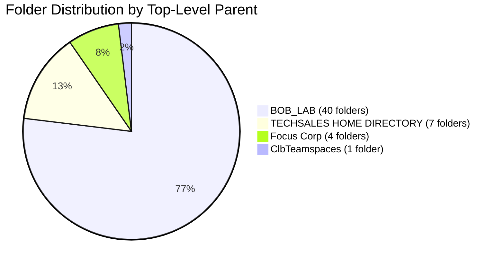
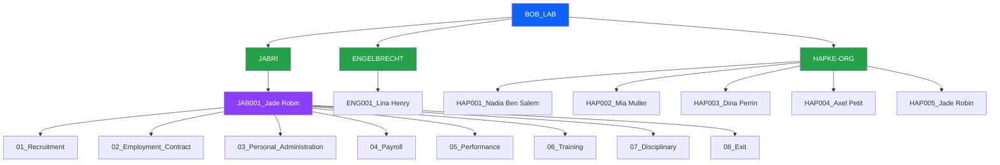
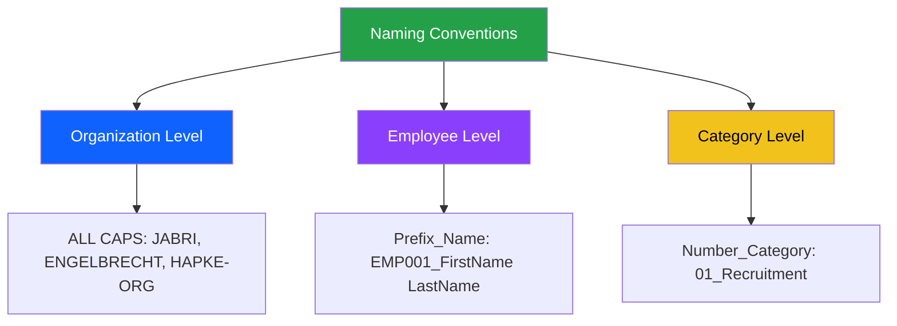
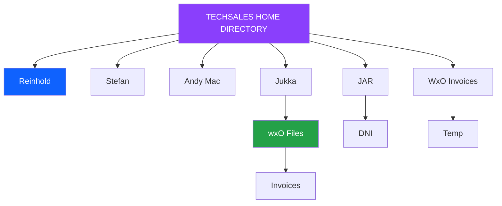
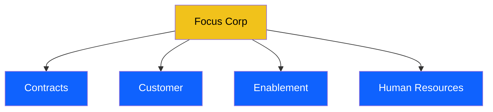
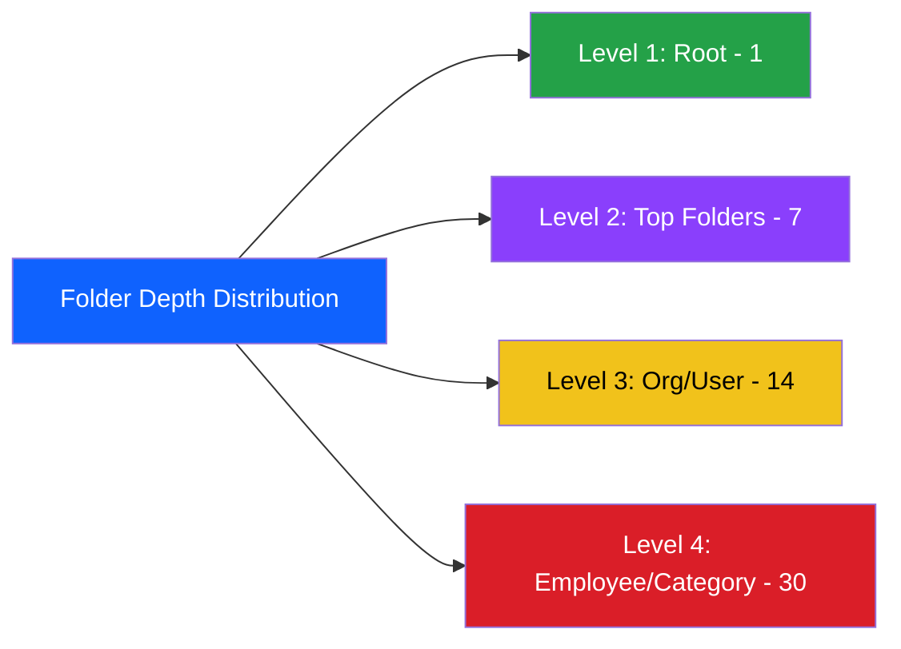
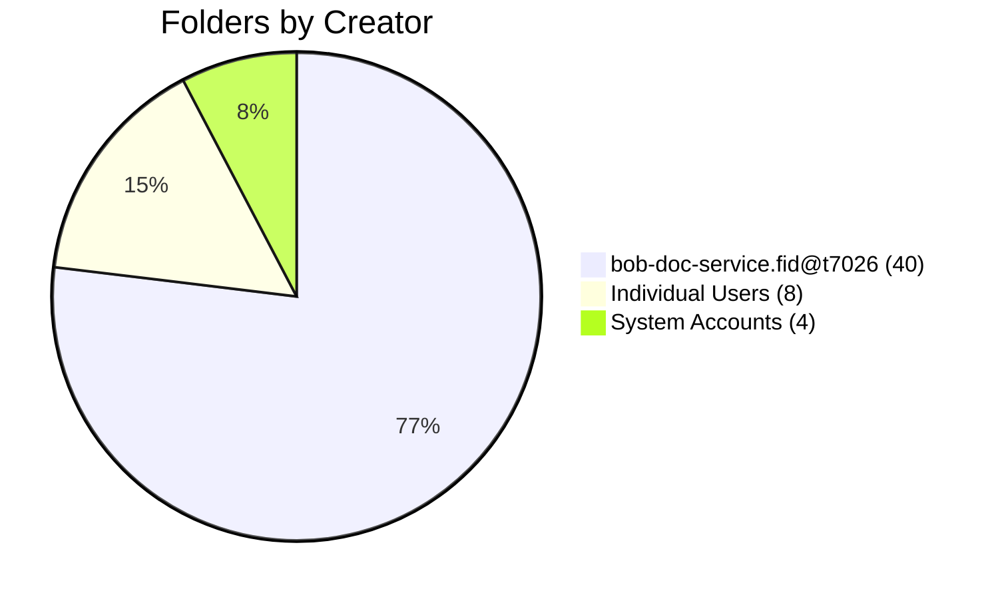
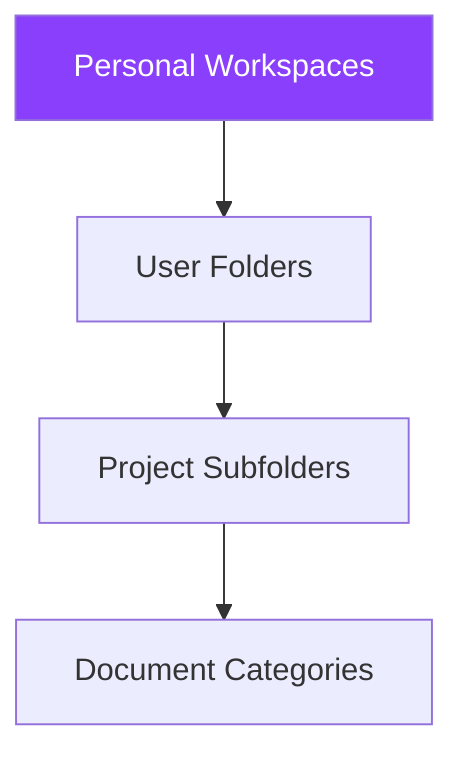
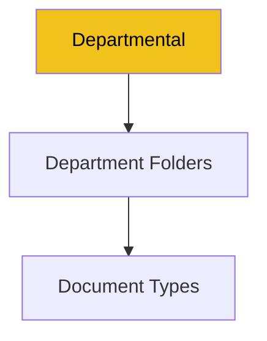
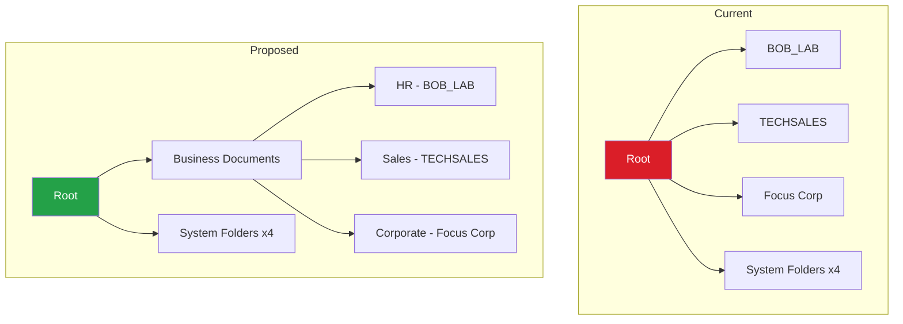

# Folder Structure Analysis
**Audit ID:** 20260519_114024_full_audit  
**Phase:** 4 - Folder Analysis  
**Date:** May 19, 2026

## Executive Summary

The repository contains a well-organized folder structure with **52 folders** (excluding root), demonstrating a clear HR document management pattern. The structure shows good organizational practices with consistent naming conventions and logical hierarchy, though there are opportunities for optimization.

### Key Findings
- 🟢 **52 folders** - Manageable folder count
- 🟢 **Clear HR organization pattern** - Employee-centric folder structure
- 🟢 **Consistent naming** - Standardized folder naming with prefixes
- 🟡 **Multiple root-level folders** - 7 top-level folders may benefit from consolidation
- 🟢 **Logical hierarchy** - 3-4 level depth is appropriate

## Folder Overview

### Total Folder Count: 52 folders (excluding root)



## Top-Level Folder Structure

```mermaid
graph TD
    ROOT[/ Root] --> BOB[BOB_LAB]
    ROOT --> TECH[TECHSALES HOME DIRECTORY]
    ROOT --> FOCUS[Focus Corp]
    ROOT --> CLB1[ClbTeamspaces]
    ROOT --> CLB2[ClbTeamspace Templates]
    ROOT --> CLB3[ClbRoles]
    ROOT --> CODE[CodeModules]
    
    style ROOT fill:#0f62fe,color:#fff
    style BOB fill:#24a148,color:#fff
    style TECH fill:#8a3ffc,color:#fff
    style FOCUS fill:#f1c21b,color:#000
    style CLB1 fill:#da1e28,color:#fff
    style CLB2 fill:#da1e28,color:#fff
    style CLB3 fill:#da1e28,color:#fff
    style CODE fill:#da1e28,color:#fff
```

### Root-Level Folders (7 visible + 4 hidden)

#### Visible Folders (7)
1. **[`/BOB_LAB`](/BOB_LAB)** - Primary HR document repository
2. **[`/TECHSALES HOME DIRECTORY`](/TECHSALES%20HOME%20DIRECTORY)** - Technical sales team workspace
3. **[`/Focus Corp`](/Focus%20Corp)** - Corporate document repository
4. **[`/ClbTeamspaces`](/ClbTeamspaces)** - Collaboration teamspaces (hidden container)
5. **[`/ClbTeamspace Templates`](/ClbTeamspace%20Templates)** - Teamspace templates (hidden)
6. **[`/ClbRoles`](/ClbRoles)** - Collaboration roles (hidden)
7. **[`/CodeModules`](/CodeModules)** - System code modules (hidden)

**Observation:** 4 of 7 root folders are system/hidden folders (Clb* and CodeModules), leaving 3 primary business folders.

## BOB_LAB Folder Structure (Primary HR Repository)

### Organization Pattern



### Hierarchy Levels

**Level 1:** BOB_LAB (Root)  
**Level 2:** Organization/Department (3 folders)
- JABRI
- ENGELBRECHT  
- HAPKE-ORG

**Level 3:** Employee Folders (6 folders)
- JAB001_Jade Robin
- ENG001_Lina Henry
- HAP001_Nadia Ben Salem
- HAP002_Mia Muller
- HAP003_Dina Perrin
- HAP004_Axel Petit
- HAP005_Jade Robin

**Level 4:** Document Category Folders (8 categories per employee)
- 01_Recruitment
- 02_Employment_Contract
- 03_Personal_Administration
- 04_Payroll
- 05_Performance
- 06_Training
- 07_Disciplinary
- 08_Exit

### Folder Count Analysis


**Total BOB_LAB folders:** 1 + 3 + 6 + 48 = **58 folders** (including BOB_LAB itself)

## Naming Convention Analysis

### Excellent Naming Patterns



### Naming Convention Strengths

1. **Organization Level** - ALL CAPS for clear identification
   - `JABRI`
   - `ENGELBRECHT`
   - `HAPKE-ORG`

2. **Employee Level** - Consistent prefix pattern
   - Format: `{ORG}{NNN}_{FirstName} {LastName}`
   - Examples: `JAB001_Jade Robin`, `ENG001_Lina Henry`, `HAP001_Nadia Ben Salem`
   - **Benefit:** Sortable, searchable, unique identifiers

3. **Document Category Level** - Numbered prefixes for ordering
   - Format: `{NN}_{Category_Name}`
   - Examples: `01_Recruitment`, `02_Employment_Contract`, `08_Exit`
   - **Benefit:** Enforces lifecycle order, easy navigation

### Naming Convention Issues

**Minor Issue:** Duplicate employee name across organizations
- `JAB001_Jade Robin` (under JABRI)
- `HAP005_Jade Robin` (under HAPKE-ORG)

**Observation:** This appears intentional (same person in different roles/orgs) but could cause confusion.

## TECHSALES HOME DIRECTORY Structure

### Organization Pattern



### Folder Count: 7 folders
- 5 user home directories
- 2 project/shared folders

**Pattern:** Personal workspace model with user-specific folders

## Focus Corp Structure

### Organization Pattern



### Folder Count: 4 folders
- Departmental organization
- Flat structure (no sub-folders visible)

**Pattern:** Traditional departmental model

## Folder Depth Analysis



### Maximum Depth: 4 levels

**Example Path:** `/BOB_LAB/HAPKE-ORG/HAP001_Nadia Ben Salem/01_Recruitment`

**Assessment:** ✅ Appropriate depth - not too shallow, not too deep

## Folder Metadata Analysis

### Common Properties

All folders share these characteristics:
- **InheritParentPermissions:** true (security inheritance enabled)
- **IndexationId:** null (not indexed for full-text search)
- **CmRetentionDate:** null (no retention policies applied)
- **CmIsMarkedForDeletion:** false (no pending deletions)

### Creator Analysis



**Observation:** Most folders (40) created by service account, indicating automated/bulk creation.

### Modification Patterns

**Recent Activity:** Most BOB_LAB folders last modified on 2026-04-14 by `malek.jabri@be.ibm.com`

**Interpretation:** Bulk update or reorganization activity

## Folder Organization Patterns

### Pattern 1: Employee Lifecycle Model (BOB_LAB)


**Strengths:**
- ✅ Logical progression through employee lifecycle
- ✅ Numbered for consistent ordering
- ✅ Comprehensive coverage of HR processes
- ✅ Easy to navigate and understand

### Pattern 2: Personal Workspace Model (TECHSALES)



**Strengths:**
- ✅ Clear ownership
- ✅ Flexible structure
- ⚠️ May lead to inconsistency

### Pattern 3: Departmental Model (Focus Corp)



**Strengths:**
- ✅ Simple and clear
- ✅ Easy to understand
- ⚠️ May not scale well

## Critical Findings

### 🟢 Strengths

1. **Excellent Naming Conventions**
   - Consistent prefix usage
   - Numbered categories for ordering
   - Clear, descriptive names

2. **Logical Hierarchy**
   - Appropriate depth (3-4 levels)
   - Clear organizational structure
   - Employee-centric design

3. **Comprehensive Coverage**
   - Complete employee lifecycle
   - All HR processes represented
   - Consistent across all employees

4. **Good Scalability**
   - Pattern supports growth
   - Easy to add new employees
   - Maintains organization at scale

### 🟡 Opportunities for Improvement

5. **Multiple Root Folders**
   - 7 top-level folders (3 business + 4 system)
   - Could benefit from consolidation
   - May cause navigation confusion

6. **Duplicate Employee Names**
   - Same person in multiple organizations
   - Could cause search/retrieval issues
   - Consider unique identifiers

7. **No Retention Policies**
   - All folders have null retention dates
   - No lifecycle management
   - Compliance risk

### 🔵 Observations

8. **Service Account Creation**
   - 40 folders created by service account
   - Indicates automated provisioning
   - Good for consistency

9. **Recent Bulk Updates**
   - Mass modification on 2026-04-14
   - Suggests reorganization or migration
   - Good maintenance practice

## Folder Path Examples

### BOB_LAB Paths

```
/BOB_LAB/JABRI/JAB001_Jade Robin/01_Recruitment
/BOB_LAB/JABRI/JAB001_Jade Robin/02_Employment_Contract
/BOB_LAB/JABRI/JAB001_Jade Robin/03_Personal_Administration
/BOB_LAB/JABRI/JAB001_Jade Robin/04_Payroll
/BOB_LAB/JABRI/JAB001_Jade Robin/05_Performance
/BOB_LAB/JABRI/JAB001_Jade Robin/06_Training
/BOB_LAB/JABRI/JAB001_Jade Robin/07_Disciplinary
/BOB_LAB/JABRI/JAB001_Jade Robin/08_Exit

/BOB_LAB/ENGELBRECHT/ENG001_Lina Henry/01_Recruitment
/BOB_LAB/ENGELBRECHT/ENG001_Lina Henry/02_Employment_Contract
...

/BOB_LAB/HAPKE-ORG/HAP001_Nadia Ben Salem/01_Recruitment
/BOB_LAB/HAPKE-ORG/HAP002_Mia Muller/01_Recruitment
/BOB_LAB/HAPKE-ORG/HAP003_Dina Perrin/01_Recruitment
/BOB_LAB/HAPKE-ORG/HAP004_Axel Petit/01_Recruitment
/BOB_LAB/HAPKE-ORG/HAP005_Jade Robin/01_Recruitment
```

### TECHSALES Paths

```
/TECHSALES HOME DIRECTORY/Reinhold
/TECHSALES HOME DIRECTORY/Stefan
/TECHSALES HOME DIRECTORY/Andy Mac
/TECHSALES HOME DIRECTORY/Jukka/wxO Files/Invoices
/TECHSALES HOME DIRECTORY/JAR/DNI
/TECHSALES HOME DIRECTORY/WxO Invoices/Temp
```

### Focus Corp Paths

```
/Focus Corp/Contracts
/Focus Corp/Customer
/Focus Corp/Enablement
/Focus Corp/Human Resources
```

## Recommendations

### Immediate Actions (0-30 days)

1. **Implement Retention Policies**
   - Define retention periods for each document category
   - Apply policies to folder structure
   - Ensure compliance with regulations

2. **Document Folder Standards**
   - Create folder naming guidelines
   - Document organizational patterns
   - Establish governance procedures

3. **Address Duplicate Names**
   - Review duplicate employee folders
   - Implement unique identifier strategy
   - Update naming conventions if needed

### Short-term Actions (1-3 months)

4. **Consolidate Root Folders**
   - Consider merging TECHSALES and Focus Corp under common parent
   - Maintain clear separation of business vs system folders
   - Improve navigation experience

5. **Implement Folder Templates**
   - Create templates for new employee folders
   - Automate folder creation process
   - Ensure consistency

6. **Add Folder Descriptions**
   - Document purpose of each folder level
   - Add metadata for searchability
   - Improve discoverability

### Long-term Actions (3-6 months)

7. **Folder Lifecycle Management**
   - Implement archival strategy
   - Define folder closure procedures
   - Automate cleanup processes

8. **Security Review**
   - Audit folder permissions
   - Implement least privilege access
   - Document security model

9. **Scalability Planning**
   - Plan for growth (more employees, departments)
   - Consider partitioning strategies
   - Optimize for performance

## Folder Structure Comparison

### Current vs Proposed



**Benefits of Proposed Structure:**
- Clearer separation of business vs system
- Better scalability
- Improved navigation
- Maintains existing patterns

## Next Steps

1. ✅ Complete folder structure analysis
2. ➡️ Proceed to Phase 5: Document Analysis
3. Analyze document distribution across folders
4. Examine document classification patterns
5. Identify document management opportunities

---

**Phase 4 Status:** ✅ Complete  
**Folders Analyzed:** 52 (excluding root)  
**Ready for Phase 5:** Yes  
**Estimated Phase 5 Duration:** 45 minutes