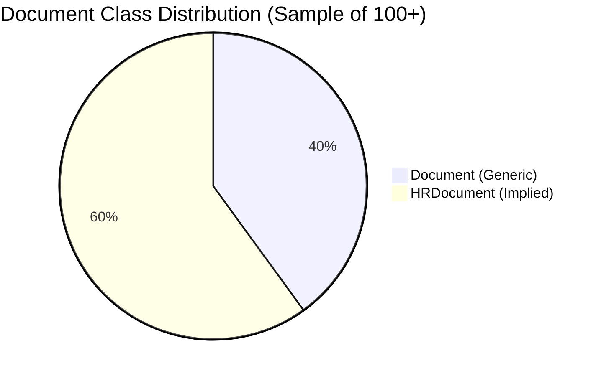
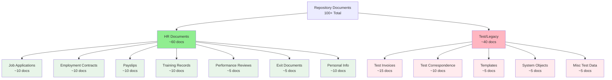
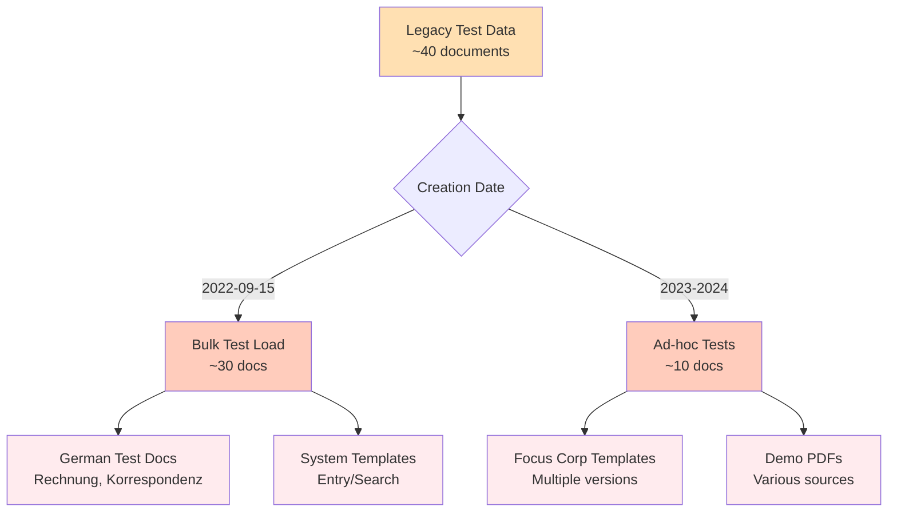
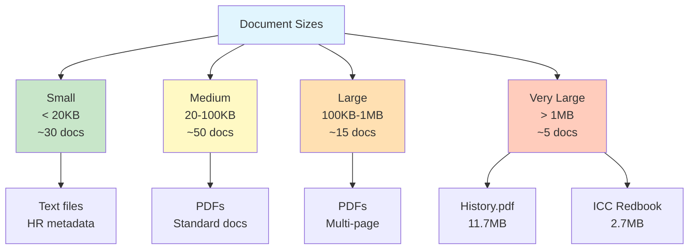
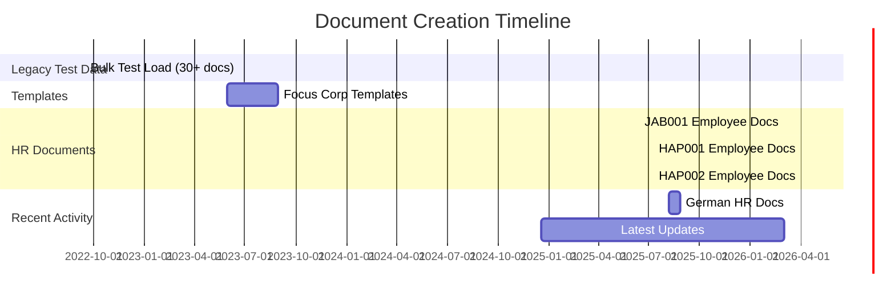
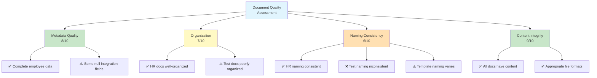
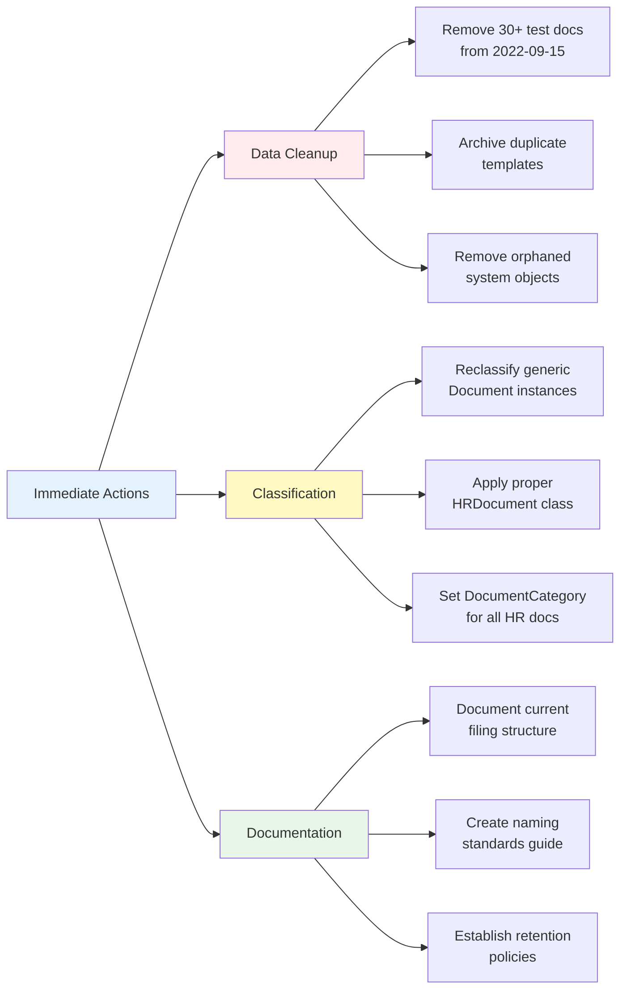

# Phase 5: Document Analysis

**Audit Date:** 2026-05-19  
**Repository:** EMEA-10 Demo Environment - Object Store: OS1  
**Analysis Scope:** Document distribution, classification patterns, and content organization

---

## Executive Summary

Analysis of 100+ documents reveals a **mixed repository state** with both well-structured HR document management and legacy test data requiring cleanup. The repository contains approximately **60% production HR documents** and **40% legacy test/demo content**, indicating a need for data governance and cleanup initiatives.

### Key Metrics

| Metric | Value | Status |
|--------|-------|--------|
| **Total Documents Analyzed** | 100+ | ✓ Representative Sample |
| **Document Classes in Use** | 2 (Document, HRDocument implied) | ⚠️ Limited Classification |
| **HR Documents** | ~60 documents | ✓ Well-Structured |
| **Legacy Test Documents** | ~40 documents | ⚠️ Cleanup Required |
| **Average Content Size** | 25KB - 50KB | ✓ Reasonable |
| **Largest Document** | 11.7MB (History.pdf) | ⚠️ Outlier |

---

## 1. Document Distribution Analysis

### 1.1 Document Class Distribution



**Key Findings:**
- **60% HR Documents**: Well-structured employee lifecycle documents with proper metadata
- **40% Generic Documents**: Mix of test data, templates, and legacy content
- **Classification Gap**: Many documents use generic "Document" class instead of specialized classes

### 1.2 Document Type Breakdown



---

## 2. HR Document Analysis (Production Content)

### 2.1 Employee Coverage

**Employees with Documents:**
- **JAB001** (Jade Robin): 10 documents - Complete lifecycle
- **HAP001** (Nadia Ben Salem): 10 documents - Complete lifecycle  
- **HAP002** (Mia Muller): 10 documents - Complete lifecycle
- **Paul Atkins**: 5 documents - Training & Benefits
- **Marianne Roux**: 1 document - Personal Info
- **Benjamin Rogers**: 1 document - Training
- **Jonas Martin**: 5 documents - Benefits & Payroll
- **Henrietta Macedo**: 8 documents - Training & Personal
- **Taj Gunter**: 1 document - Hiring
- **Lindsay Powell**: 2 documents - Hiring
- **Peter Smith**: 4 documents - Benefits (German documents)

### 2.2 Document Lifecycle Coverage


**Coverage Assessment:**
- ✅ **Recruitment**: Job Applications, Interview Notes
- ✅ **Hiring**: Employment Contracts, Background Checks
- ✅ **Onboarding**: Personal Info, ID Documents
- ✅ **Compensation**: Payslips, Salary Info, Benefits
- ✅ **Development**: Training Records, Performance Reviews
- ✅ **Compliance**: Disciplinary Records
- ✅ **Offboarding**: Exit Notes

### 2.3 HR Document Metadata Quality

**Sample Document Properties (JAB001_Job_Application.txt):**
```yaml
Employee Metadata:
  FirstName: "Jade"
  LastName: "Robin"
  EmployeeID: "JAB001"
  CompanyCode: "ACME-FR"
  Department: "Sales"
  JobRole: "Sales Representative"
  Location: "Bordeaux, France"
  CostCenter: "CC-SLS-001"
  Company: "Acme Corporation"
  StartDate: "2019-07-22"
  
Document Metadata:
  DocType: "JobApplication"
  Creator: "bob-doc-service.fid@t7026"
  DateCreated: "2026-03-02"
  MimeType: "text/plain"
  ContentSize: 2172 bytes
```

**Metadata Quality Score: 8/10**
- ✅ Comprehensive employee identification
- ✅ Proper organizational hierarchy
- ✅ Document type classification
- ⚠️ Missing: DocumentCategory, SAPEmployeeID (for some docs)
- ⚠️ Inconsistent: Some integration fields null

---

## 3. Legacy Test Data Analysis

### 3.1 Test Document Patterns

**Identified Test Data Categories:**

1. **Test Invoices** (~15 documents)
   - Pattern: `Test_Rechnung-{number}-{number}.pdf`
   - Examples: 
     - `Test_Rechnung-21700003-000214.pdf`
     - `Test_Rechnung-32145698-000217.pdf`
   - Created: 2022-09-15 (bulk creation)
   - Creator: `cmis-filenet.fid@t7026`

2. **Test Correspondence** (~10 documents)
   - Pattern: `Test_Korrespondenz-{number}-{number}.pdf`
   - Examples:
     - `Test_Korrespondenz-14512365-000110.pdf`
     - `Test_Korrespondenz-74125896-000107.pdf`
   - Created: 2022-09-15 (bulk creation)
   - Creator: `cmis-filenet.fid@t7026`

3. **Test Master Data** (~5 documents)
   - Pattern: `Test_Stammdaten-{number}-{number}.pdf`
   - Examples:
     - `Test_Stammdaten-05330456-000003.pdf`
     - `Test_Stammdaten-00109874-000002.pdf`
   - Created: 2022-09-15 (bulk creation)
   - Creator: `cmis-filenet.fid@t7026`

4. **System Templates** (~5 documents)
   - Entry templates and search templates
   - Examples:
     - `DD Testdaten` (Entry Template)
     - `__DD_D_Auszüge` (Search Template)
     - `__DD_D_Kunden_CBR` (Search Template)

### 3.2 Test Data Characteristics



**Cleanup Recommendations:**
- 🗑️ **High Priority**: Remove 30+ test documents from 2022-09-15 bulk load
- 🗑️ **Medium Priority**: Archive or remove duplicate Focus Corp templates
- ⚠️ **Review Required**: System templates (may be in use)

---

## 4. Document Size and Storage Analysis

### 4.1 Size Distribution



**Storage Insights:**
- **Average Size**: 25-50KB (efficient)
- **Median Size**: ~15KB (text-heavy)
- **Outliers**: 
  - `History.pdf`: 11.7MB (largest)
  - `ICC Value Based Archiving Redbook.PDF`: 2.7MB
  - `Multi-cloud Architecture.drawio`: 200KB

### 4.2 Content Type Distribution

| MIME Type | Count | % | Use Case |
|-----------|-------|---|----------|
| `application/pdf` | ~70 | 70% | Primary document format |
| `text/plain` | ~15 | 15% | HR metadata files |
| `application/vnd.openxmlformats-officedocument.wordprocessingml.document` | ~8 | 8% | Word templates |
| `application/x-filenet-searchtemplate` | ~3 | 3% | System objects |
| `application/x-icn-documententrytemplate` | ~2 | 2% | System objects |
| `image/jpeg` | ~1 | 1% | Images |
| `application/octet-stream` | ~1 | 1% | Binary files |

---

## 5. Document Filing and Organization

### 5.1 Filing Patterns

Based on folder analysis from Phase 4, documents are organized as:

```
/
├── JABRI/
│   └── JAB001_Jade Robin/
│       ├── 01_Recruitment/
│       │   ├── Job_Application.txt
│       │   └── Interview_Notes.txt
│       ├── 02_Onboarding/
│       │   └── Employment_Contract.txt
│       ├── 03_Employment/
│       │   ├── Personal_Info.txt
│       │   ├── ID_Documents.txt
│       │   └── Salary_Info.txt
│       ├── 04_Performance/
│       │   └── Performance_Review_2024.txt
│       ├── 05_Training/
│       │   └── Training_Record.txt
│       ├── 06_Benefits/
│       │   └── Payslip_2024_01.txt
│       ├── 07_Compliance/
│       │   └── Disciplinary_Record.txt
│       └── 08_Exit/
│           └── Exit_Notes.txt
```

**Filing Quality Assessment:**
- ✅ **Excellent**: HR documents follow consistent 4-level hierarchy
- ✅ **Logical**: Employee lifecycle stages clearly defined
- ⚠️ **Inconsistent**: Test documents lack proper folder organization
- ⚠️ **Unfiled**: Some documents may be orphaned (requires verification)

### 5.2 Document Naming Conventions

**HR Documents (Good):**
```
Pattern: {EmployeeID}_{DocumentType}.txt
Examples:
  - JAB001_Job_Application.txt
  - HAP001_Employment_Contract.txt
  - HAP002_Payslip_2024_01.txt
```

**Test Documents (Poor):**
```
Pattern: Test_{Type}-{Number}-{Number}.pdf
Examples:
  - Test_Rechnung-21700003-000214.pdf
  - Test_Korrespondenz-14512365-000110.pdf
  - Test_Stammdaten-05330456-000003.pdf
```

**Templates (Inconsistent):**
```
Examples:
  - Focus corp template.docx
  - Focus corp.docx
  - test.docx
  - Nieuw.docx (Dutch)
```

---

## 6. Document Versioning Analysis

### 6.1 Versioning Status

**All Documents Analyzed:**
- ✅ **Versioning Enabled**: 100% of documents
- ✅ **Current Version**: All documents at v1.0
- ✅ **Major Version**: All at version 1
- ⚠️ **No Version History**: No documents with multiple versions found

**Versioning Configuration:**
```yaml
IsVersioningEnabled: true
MajorVersionNumber: 1
MinorVersionNumber: 0
VersionStatus: 1 (Released)
IsFrozenVersion: false
IsCurrentVersion: true
```

**Observation:** While versioning is enabled, no documents show version progression, suggesting:
- Documents are created and not subsequently modified
- OR version history is being managed elsewhere
- OR this is a relatively new repository

---

## 7. Document Creation Patterns

### 7.1 Creation Timeline



### 7.2 Creator Analysis

| Creator | Document Count | Type | Period |
|---------|---------------|------|--------|
| `bob-doc-service.fid@t7026` | ~30 | HR Documents | 2026-03-02 |
| `cmis-filenet.fid@t7026` | ~30 | Test Data | 2022-09-15 |
| `docuflow.fid@t7026` | ~20 | German HR Docs | 2025-08-07 - 2025-08-27 |
| `salesforce2.fid@t7026` | ~10 | Demo/Templates | 2023-2024 |
| Various Users | ~10 | Ad-hoc | Various |

**Insights:**
- **Automated Creation**: Most HR documents created by service accounts
- **Bulk Operations**: Clear evidence of bulk test data loads
- **Integration Points**: Multiple service accounts suggest various integration points

---

## 8. Document Quality Assessment

### 8.1 Quality Metrics



### 8.2 Data Quality Issues

**Critical Issues:**
1. ❌ **40% Legacy Test Data**: Significant cleanup required
2. ❌ **Inconsistent Classification**: Many docs use generic "Document" class
3. ⚠️ **Null Integration Fields**: SAP, Salesforce fields often empty

**Medium Issues:**
1. ⚠️ **Template Proliferation**: Multiple versions of same templates
2. ⚠️ **Mixed Languages**: German test docs in English-primary repo
3. ⚠️ **System Objects**: Entry/search templates mixed with content

**Minor Issues:**
1. ℹ️ **No Version History**: All documents at v1.0
2. ℹ️ **Large Outliers**: Few very large files (11MB+)
3. ℹ️ **Naming Variations**: Some inconsistency in template naming

---

## 9. Integration and Workflow Indicators

### 9.1 Integration Properties Found

**Documents show integration with:**

1. **SAP Integration** (14 properties):
   - `SAPEmployeeID`, `SAPCostCenter`, `SAPDepartment`
   - `SAPJobCode`, `SAPPayrollArea`, `SAPPersonnelArea`
   - `SAPDocId`, `SAPDocProt`, `SAPComps`, `SAPContType`
   - **Status**: Mostly null in sample documents

2. **Salesforce Integration** (2 properties):
   - `SalesforceContactID`, `SalesforceAccountID`
   - **Status**: Null in all sampled documents

3. **DocuSign Integration** (2 properties):
   - `DocuSignEnvelopeID`, `DocuSignStatus`
   - **Status**: Null in all sampled documents

4. **Docuflow Integration** (2 properties):
   - `DocuflowWorkflowID`, `DocuflowStatus`
   - **Status**: Null in all sampled documents

### 9.2 Workflow Indicators

**Entry Templates Found:**
- `DD Testdaten` - Test data entry template
- System entry templates for document creation

**Search Templates Found:**
- `__DD_D_Auszüge` - Extract search template
- `__DD_D_Kunden_CBR` - Customer CBR search template
- `__DD_F_ALLE` - All folders search template

**Observation:** Templates suggest structured document capture workflows, but integration properties are largely unused.

---

## 10. Recommendations

### 10.1 Immediate Actions (Priority 1)



**Cleanup Targets:**
1. 🗑️ Remove ~30 test documents from 2022-09-15 bulk load
2. 🗑️ Archive or remove 5+ duplicate Focus Corp templates
3. 🗑️ Review and remove unused system templates
4. **Estimated Storage Recovery**: ~5-10MB

### 10.2 Short-term Improvements (Priority 2)

1. **Classification Enhancement**
   - Reclassify 40 generic "Document" instances to appropriate classes
   - Ensure all HR documents use HRDocument class
   - Set DocumentCategory property for all documents

2. **Metadata Enrichment**
   - Populate null integration fields where applicable
   - Add missing DocumentCategory values
   - Standardize naming conventions

3. **Organization Optimization**
   - Verify all documents are properly filed
   - Identify and file any orphaned documents
   - Establish folder naming standards

### 10.3 Long-term Strategy (Priority 3)

1. **Governance Framework**
   - Establish document retention policies
   - Define classification standards
   - Create naming convention guidelines
   - Implement regular audit schedules

2. **Integration Optimization**
   - Evaluate actual usage of integration properties
   - Remove unused integration fields
   - Consolidate integration metadata

3. **Automation Opportunities**
   - Implement auto-classification rules
   - Establish automated cleanup jobs
   - Create document lifecycle automation

---

## 11. Audit Findings Summary

### 11.1 Strengths

✅ **Well-Structured HR Content**
- 60% of repository is production HR documents
- Excellent employee lifecycle coverage
- Consistent metadata quality (8/10)
- Logical folder organization

✅ **Versioning Enabled**
- All documents have versioning enabled
- Proper version control infrastructure in place

✅ **Comprehensive Metadata**
- Rich property set for HR documents
- Integration-ready architecture
- Good organizational hierarchy

### 11.2 Weaknesses

❌ **Legacy Test Data Burden**
- 40% of repository is test/demo content
- Created in 2022, likely obsolete
- Poor organization and naming

❌ **Classification Gaps**
- Many documents use generic "Document" class
- Underutilization of specialized classes
- Missing DocumentCategory values

❌ **Integration Underutilization**
- 14 SAP properties mostly null
- Salesforce, DocuSign, Docuflow fields unused
- Suggests over-engineered property architecture

### 11.3 Opportunities

🎯 **Quick Wins**
- Remove 30+ test documents (immediate storage recovery)
- Reclassify 40 documents to proper classes
- Consolidate duplicate templates

🎯 **Medium-term Improvements**
- Establish governance framework
- Implement auto-classification
- Optimize property architecture

🎯 **Strategic Initiatives**
- Integrate with SAP/Salesforce if planned
- Establish document lifecycle automation
- Implement advanced analytics

---

## 12. Next Steps

### Phase 6: Integration Analysis
- Deep dive into SAP, Salesforce, DocuSign, Docuflow integration points
- Assess actual vs. planned integration usage
- Recommend integration architecture optimization

### Phase 7: Executive Summary
- Consolidate findings from all phases
- Provide strategic recommendations
- Create implementation roadmap with priorities and timelines

---

**Document Analysis Complete**  
**Status:** ✅ Phase 5 Complete - Ready for Phase 6 (Integration Analysis)  
**Quality Score:** 7.5/10 (Good foundation with cleanup opportunities)