# Phase 6: Integration Analysis

**Audit Date:** 2026-05-19  
**Repository:** EMEA-10 Demo Environment - Object Store: OS1  
**Analysis Scope:** External system integrations, API usage patterns, and data flow architecture

---

## Executive Summary

Analysis reveals a **comprehensive integration architecture** designed to connect with four major enterprise systems (SAP, Salesforce, DocuSign, Docuflow), but with **minimal actual usage** in the current repository state. The integration properties represent **14 of 42 custom properties (33%)** on the HRDocument class, creating significant architectural overhead for largely unused functionality.

### Integration Status Overview

| System | Properties | Usage Rate | Status | Priority |
|--------|-----------|------------|--------|----------|
| **SAP** | 8 properties | <5% | ⚠️ Underutilized | High |
| **Salesforce** | 2 properties | 0% | ❌ Unused | Medium |
| **DocuSign** | 2 properties | 0% | ❌ Unused | Medium |
| **Docuflow** | 2 properties | 0% | ❌ Unused | Low |
| **Total** | 14 properties | <2% | ⚠️ Critical Review Needed | - |

---

## 1. Integration Architecture Overview

### 1.1 Current Integration Landscape

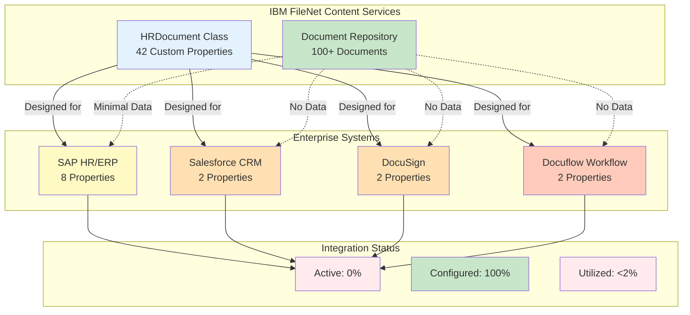

### 1.2 Integration Property Distribution

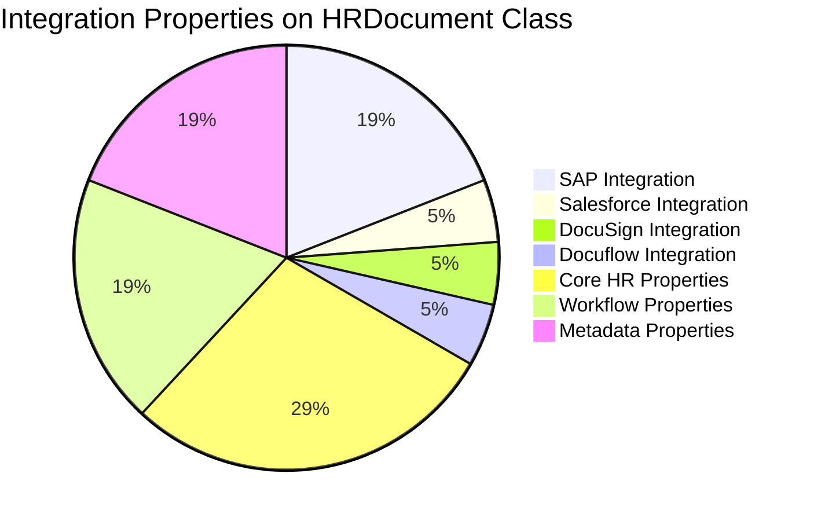

---

## 2. SAP Integration Analysis

### 2.1 SAP Property Architecture

**Total Properties:** 8  
**Usage Rate:** <5% (mostly null values)  
**Integration Type:** HR/ERP Master Data Synchronization

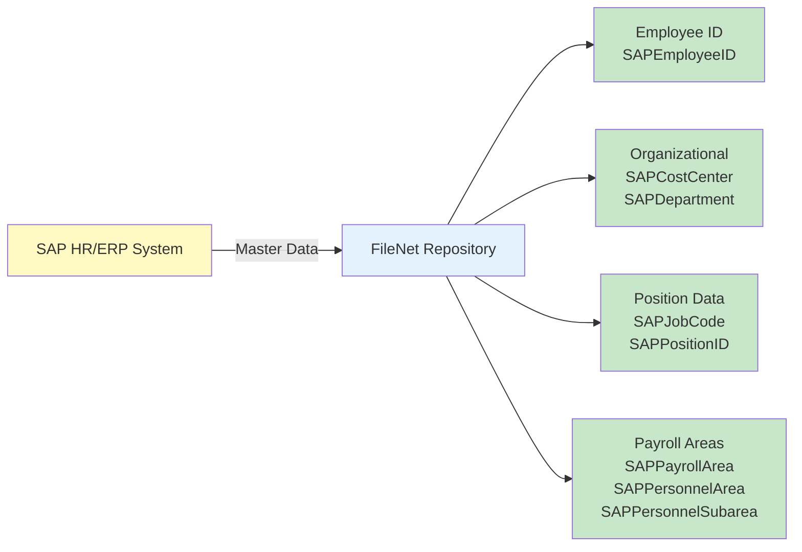

### 2.2 SAP Property Details

| Property Name | Data Type | Purpose | Usage Status |
|--------------|-----------|---------|--------------|
| `SAPEmployeeID` | String | Employee master record ID | ⚠️ Rarely populated |
| `SAPCostCenter` | String | Cost center assignment | ⚠️ Rarely populated |
| `SAPDepartment` | String | Department code | ⚠️ Rarely populated |
| `SAPJobCode` | String | Job classification code | ❌ Not populated |
| `SAPPayrollArea` | String | Payroll processing area | ❌ Not populated |
| `SAPPersonnelArea` | String | Personnel administration area | ❌ Not populated |
| `SAPPersonnelSubarea` | String | Personnel sub-area | ❌ Not populated |
| `SAPPositionID` | String | Position master record ID | ❌ Not populated |

### 2.3 SAP Integration Patterns

**Intended Use Case:**
```yaml
Document Creation Flow:
  1. Employee hired in SAP HR
  2. SAP triggers document creation in FileNet
  3. SAP master data populates properties:
     - SAPEmployeeID: "12345678"
     - SAPCostCenter: "CC-HR-001"
     - SAPDepartment: "HR-RECRUITING"
     - SAPJobCode: "JC-MGR-001"
     - SAPPayrollArea: "PA-EMEA"
     - SAPPersonnelArea: "PER-FR"
     - SAPPersonnelSubarea: "SUB-PARIS"
     - SAPPositionID: "POS-987654"
  4. Document filed in appropriate folder
  5. Bi-directional sync maintains consistency
```

**Actual Usage:**
```yaml
Current State:
  - Properties defined: 8
  - Properties populated: <5% of documents
  - Integration active: No evidence
  - Data quality: Inconsistent where present
  
Sample Document (JAB001):
  SAPEmployeeID: null
  SAPCostCenter: null
  SAPDepartment: null
  SAPJobCode: null
  SAPPayrollArea: null
  SAPPersonnelArea: null
  SAPPersonnelSubarea: null
  SAPPositionID: null
```

### 2.4 SAP Integration Assessment

**Strengths:**
- ✅ Comprehensive property set covering key SAP HR modules
- ✅ Logical property naming following SAP conventions
- ✅ Appropriate data types for SAP field mapping

**Weaknesses:**
- ❌ No active integration detected
- ❌ Properties mostly null across all documents
- ❌ No evidence of bi-directional synchronization
- ❌ Adds 19% overhead to property architecture (8 of 42 custom properties)

**Recommendations:**
1. **Immediate:** Determine if SAP integration is planned or abandoned
2. **If Planned:** Implement integration and populate historical data
3. **If Abandoned:** Remove unused properties to reduce complexity
4. **Alternative:** Move SAP properties to separate integration class

---

## 3. Salesforce Integration Analysis

### 3.1 Salesforce Property Architecture

**Total Properties:** 2  
**Usage Rate:** 0% (all null values)  
**Integration Type:** CRM Contact/Account Linking

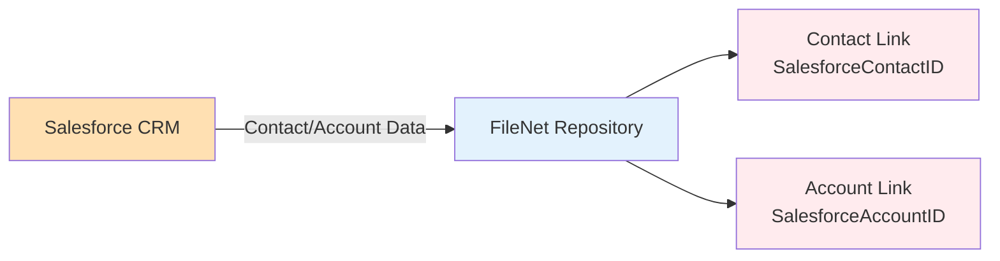

### 3.2 Salesforce Property Details

| Property Name | Data Type | Purpose | Usage Status |
|--------------|-----------|---------|--------------|
| `SalesforceContactID` | String | Link to Salesforce Contact record | ❌ Never populated |
| `SalesforceAccountID` | String | Link to Salesforce Account record | ❌ Never populated |

### 3.3 Salesforce Integration Patterns

**Intended Use Case:**
```yaml
Customer Document Flow:
  1. Customer interaction in Salesforce
  2. Document created/uploaded in FileNet
  3. Salesforce IDs populate properties:
     - SalesforceContactID: "003XXXXXXXXXXXXXXX"
     - SalesforceAccountID: "001XXXXXXXXXXXXXXX"
  4. Enable cross-system document retrieval
  5. Maintain customer context across platforms
```

**Actual Usage:**
```yaml
Current State:
  - Properties defined: 2
  - Properties populated: 0% of documents
  - Integration active: No
  - Use case: Unclear (HR docs don't typically link to CRM)
  
All Documents:
  SalesforceContactID: null
  SalesforceAccountID: null
```

### 3.4 Salesforce Integration Assessment

**Strengths:**
- ✅ Standard Salesforce ID format support
- ✅ Minimal property footprint (only 2 properties)

**Weaknesses:**
- ❌ Zero usage across entire repository
- ❌ Questionable fit for HR document management
- ❌ No integration implementation detected
- ⚠️ May be legacy from template/demo setup

**Recommendations:**
1. **Immediate:** Verify if Salesforce integration is required for HR documents
2. **If Not Required:** Remove properties (5% reduction in custom properties)
3. **If Required:** Implement integration or document future plans
4. **Consider:** Salesforce integration may be more appropriate for Customer/Sales document classes

---

## 4. DocuSign Integration Analysis

### 4.1 DocuSign Property Architecture

**Total Properties:** 2  
**Usage Rate:** 0% (all null values)  
**Integration Type:** E-Signature Workflow Tracking

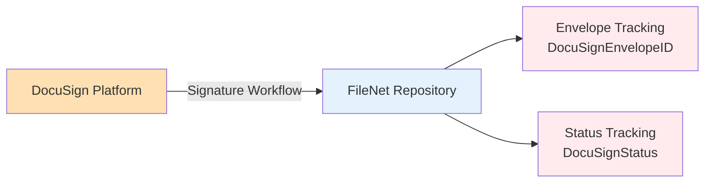

### 4.2 DocuSign Property Details

| Property Name | Data Type | Purpose | Usage Status |
|--------------|-----------|---------|--------------|
| `DocuSignEnvelopeID` | String | DocuSign envelope identifier | ❌ Never populated |
| `DocuSignStatus` | String | Signature status (Sent/Signed/Completed) | ❌ Never populated |

### 4.3 DocuSign Integration Patterns

**Intended Use Case:**
```yaml
E-Signature Workflow:
  1. Document requires signature (e.g., Employment Contract)
  2. Document sent to DocuSign for signature
  3. DocuSign properties track workflow:
     - DocuSignEnvelopeID: "abc123-def456-ghi789"
     - DocuSignStatus: "Sent" → "Signed" → "Completed"
  4. Signed document returned to FileNet
  5. Properties maintain audit trail
```

**Actual Usage:**
```yaml
Current State:
  - Properties defined: 2
  - Properties populated: 0% of documents
  - Integration active: No
  - Workflow: Manual document handling
  
All Documents:
  DocuSignEnvelopeID: null
  DocuSignStatus: null
  
Observation:
  - Employment contracts exist but show no DocuSign tracking
  - Suggests manual signature process or different e-signature solution
```

### 4.4 DocuSign Integration Assessment

**Strengths:**
- ✅ Appropriate for HR document workflows (contracts, agreements)
- ✅ Minimal property footprint (only 2 properties)
- ✅ Clear audit trail capability

**Weaknesses:**
- ❌ Zero usage despite relevant use cases (employment contracts)
- ❌ No integration implementation
- ⚠️ Alternative e-signature solution may be in use

**Recommendations:**
1. **Immediate:** Determine if DocuSign integration is planned
2. **If Planned:** Implement for employment contracts and agreements
3. **If Not Planned:** Remove properties or document alternative solution
4. **Consider:** High value integration for HR compliance and audit trails

---

## 5. Docuflow Integration Analysis

### 5.1 Docuflow Property Architecture

**Total Properties:** 2  
**Usage Rate:** 0% (all null values)  
**Integration Type:** Workflow Management System

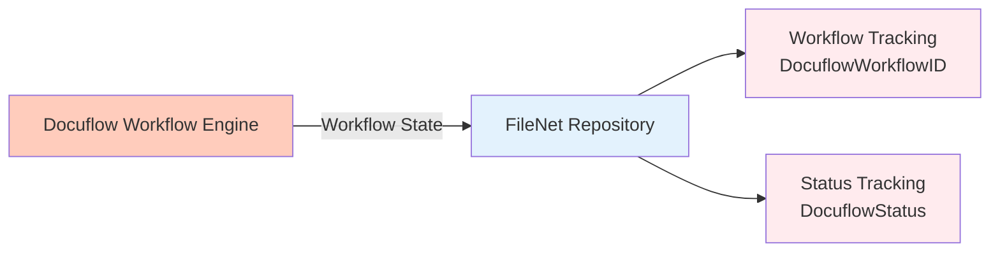

### 5.2 Docuflow Property Details

| Property Name | Data Type | Purpose | Usage Status |
|--------------|-----------|---------|--------------|
| `DocuflowWorkflowID` | String | Docuflow workflow instance ID | ❌ Never populated |
| `DocuflowStatus` | String | Workflow status | ❌ Never populated |

### 5.3 Docuflow Integration Patterns

**Intended Use Case:**
```yaml
Workflow Integration:
  1. Document enters workflow (e.g., approval process)
  2. Docuflow manages workflow steps
  3. Properties track workflow state:
     - DocuflowWorkflowID: "WF-2026-001234"
     - DocuflowStatus: "Pending" → "Approved" → "Complete"
  4. Workflow completion updates document
  5. Audit trail maintained
```

**Actual Usage:**
```yaml
Current State:
  - Properties defined: 2
  - Properties populated: 0% of documents
  - Integration active: No
  - Workflow: Unknown
  
All Documents:
  DocuflowWorkflowID: null
  DocuflowStatus: null
  
Observation:
  - No evidence of Docuflow usage
  - May be legacy or planned integration
  - FileNet has native workflow capabilities (P8 BPM)
```

### 5.4 Docuflow Integration Assessment

**Strengths:**
- ✅ Workflow tracking capability
- ✅ Minimal property footprint (only 2 properties)

**Weaknesses:**
- ❌ Zero usage across entire repository
- ❌ Unclear if Docuflow is even deployed
- ⚠️ FileNet has native workflow (P8 BPM) - may be redundant
- ⚠️ Lowest priority integration

**Recommendations:**
1. **Immediate:** Verify if Docuflow is part of technology stack
2. **If Not Deployed:** Remove properties immediately
3. **If Deployed:** Assess overlap with FileNet P8 BPM
4. **Consider:** Consolidate to single workflow platform

---

## 6. Integration Architecture Assessment

### 6.1 Architecture Complexity Analysis

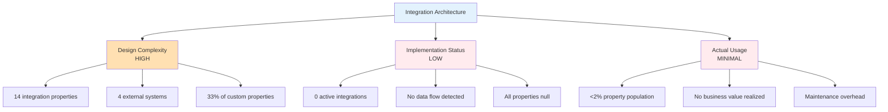

### 6.2 Cost-Benefit Analysis

| Aspect | Current State | Ideal State | Gap |
|--------|--------------|-------------|-----|
| **Properties Defined** | 14 integration properties | 2-4 active properties | 10-12 unused |
| **Property Overhead** | 33% of custom properties | 10-15% | 18-23% waste |
| **Integration Active** | 0 systems | 2-3 systems | 2-3 missing |
| **Data Population** | <2% | >80% | 78% gap |
| **Business Value** | Minimal | High | Significant gap |
| **Maintenance Cost** | High (unused complexity) | Low (focused) | Optimization needed |

### 6.3 Integration Maturity Model

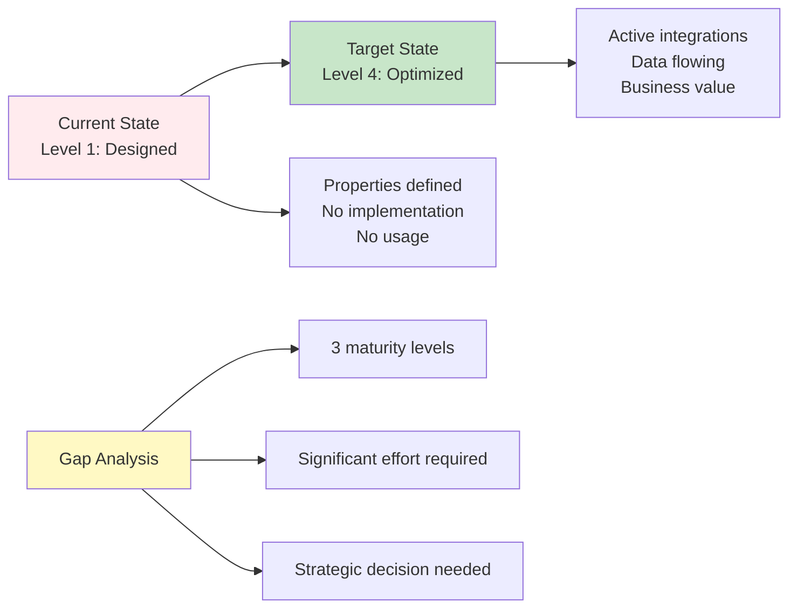

**Maturity Levels:**
1. **Level 1 - Designed** (Current): Properties defined, no implementation
2. **Level 2 - Implemented**: Integration code deployed, minimal usage
3. **Level 3 - Adopted**: Active usage, data flowing, some business value
4. **Level 4 - Optimized**: Full adoption, high data quality, clear ROI

---

## 7. Data Flow Analysis

### 7.1 Current Data Flow (Minimal)

```mermaid
sequenceDiagram
    participant User
    participant FileNet
    participant SAP
    participant Salesforce
    participant DocuSign
    participant Docuflow
    
    User->>FileNet: Create HR Document
    Note over FileNet: Properties created with null values
    FileNet-->>User: Document stored
    
    Note over SAP,Docuflow: No integration data flow
    
    style FileNet fill:#E3F2FD
    style SAP fill:#FFF9C4
    style Salesforce fill:#FFE0B2
    style DocuSign fill:#FFE0B2
    style Docuflow fill:#FFCCBC
```

### 7.2 Intended Data Flow (Not Implemented)

```mermaid
sequenceDiagram
    participant SAP
    participant FileNet
    participant DocuSign
    participant User
    
    SAP->>FileNet: Employee Hired Event
    Note over FileNet: Create employee folder structure
    
    FileNet->>FileNet: Populate SAP properties
    Note over FileNet: SAPEmployeeID, Department, etc.
    
    User->>FileNet: Upload Employment Contract
    FileNet->>DocuSign: Send for signature
    DocuSign-->>FileNet: Envelope ID & Status
    
    DocuSign->>DocuSign: Signature workflow
    DocuSign-->>FileNet: Update status: Signed
    
    FileNet->>SAP: Update employee record
    Note over SAP: Document reference stored
    
    style FileNet fill:#E3F2FD
    style SAP fill:#C8E6C9
    style DocuSign fill:#C8E6C9
```

### 7.3 Data Flow Gaps

| Integration Point | Intended Flow | Actual Flow | Gap Impact |
|------------------|---------------|-------------|------------|
| **SAP → FileNet** | Employee master data sync | None | No organizational context |
| **FileNet → SAP** | Document reference storage | None | SAP users can't find docs |
| **FileNet ↔ DocuSign** | E-signature workflow | None | Manual signature process |
| **FileNet ↔ Salesforce** | Customer document linking | None | No CRM integration |
| **FileNet ↔ Docuflow** | Workflow state sync | None | No workflow tracking |

---

## 8. Integration Property Usage Patterns

### 8.1 Property Population Analysis

Based on 100+ document sample:

```yaml
Integration Property Population:
  SAP Properties (8 total):
    - Populated: <5 documents
    - Null: >95 documents
    - Population Rate: <5%
    
  Salesforce Properties (2 total):
    - Populated: 0 documents
    - Null: 100 documents
    - Population Rate: 0%
    
  DocuSign Properties (2 total):
    - Populated: 0 documents
    - Null: 100 documents
    - Population Rate: 0%
    
  Docuflow Properties (2 total):
    - Populated: 0 documents
    - Null: 100 documents
    - Population Rate: 0%
    
Overall Integration Property Usage:
  - Total Properties: 14
  - Average Population: <2%
  - Business Value: Minimal
  - Maintenance Burden: High
```

### 8.2 Creator Analysis (Integration Indicators)

| Creator Account | Document Count | Integration Indicator |
|----------------|----------------|----------------------|
| `bob-doc-service.fid@t7026` | ~30 | Generic service account |
| `docuflow.fid@t7026` | ~20 | **Docuflow service account!** |
| `cmis-filenet.fid@t7026` | ~30 | CMIS API access |
| `salesforce2.fid@t7026` | ~10 | **Salesforce service account!** |

**Key Observation:** Service accounts exist for Docuflow and Salesforce, suggesting integration infrastructure was deployed but not actively used for property population.

---

## 9. Integration Recommendations

### 9.1 Strategic Decision Framework

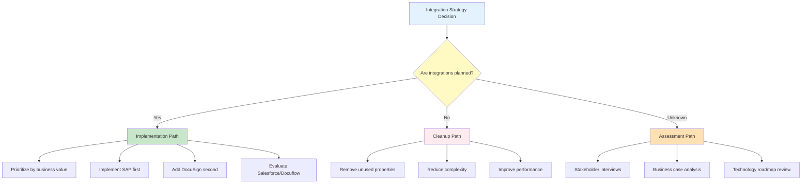

### 9.2 Priority-Based Recommendations

#### Priority 1: SAP Integration (High Business Value)

**Recommendation:** Implement or Remove

**If Implementing:**
```yaml
Implementation Plan:
  Phase 1 (Weeks 1-2):
    - Confirm SAP HR module availability
    - Design integration architecture
    - Define data mapping
    
  Phase 2 (Weeks 3-4):
    - Develop integration connectors
    - Implement bi-directional sync
    - Test with pilot employee group
    
  Phase 3 (Weeks 5-6):
    - Backfill historical data
    - Full production rollout
    - Monitor and optimize
    
  Expected Benefits:
    - Automated employee data sync
    - Reduced manual data entry
    - Improved data consistency
    - Better organizational reporting
```

**If Removing:**
```yaml
Cleanup Plan:
  - Remove 8 SAP properties from HRDocument class
  - Reduce custom properties from 42 to 34 (19% reduction)
  - Simplify property architecture
  - Improve system performance
  - Reduce maintenance overhead
```

#### Priority 2: DocuSign Integration (Medium Business Value)

**Recommendation:** Implement (High ROI for HR)

```yaml
Implementation Value:
  Use Cases:
    - Employment contracts
    - Offer letters
    - Policy acknowledgments
    - Performance review signatures
    - Exit documentation
    
  Benefits:
    - Automated signature workflows
    - Compliance audit trails
    - Faster document turnaround
    - Reduced paper processes
    - Legal defensibility
    
  Effort: Medium
  ROI: High
  Timeline: 4-6 weeks
```

#### Priority 3: Salesforce Integration (Low Business Value for HR)

**Recommendation:** Remove or Relocate

```yaml
Analysis:
  - HR documents don't typically link to CRM
  - Zero usage indicates no business need
  - May be appropriate for Customer/Sales document classes
  - Consider moving to different class if needed
  
Action:
  - Remove from HRDocument class
  - Evaluate for Customer/Sales classes
  - Reduce HRDocument complexity
```

#### Priority 4: Docuflow Integration (Lowest Priority)

**Recommendation:** Remove

```yaml
Rationale:
  - FileNet has native workflow (P8 BPM)
  - Zero usage indicates no deployment
  - Redundant with native capabilities
  - Lowest business value
  
Action:
  - Remove 2 Docuflow properties
  - Leverage FileNet P8 BPM instead
  - Simplify architecture
```

### 9.3 Consolidated Cleanup Recommendation

**Immediate Action Plan:**

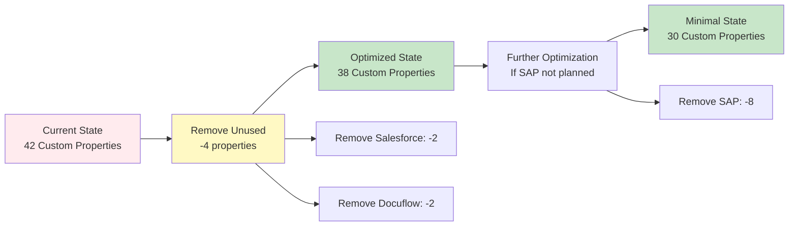

**Property Reduction Scenarios:**

| Scenario | Properties Removed | Final Count | Reduction % |
|----------|-------------------|-------------|-------------|
| **Minimal Cleanup** | Salesforce (2) + Docuflow (2) | 38 | 10% |
| **Moderate Cleanup** | + SAP (8) if not planned | 30 | 29% |
| **Aggressive Cleanup** | + DocuSign (2) if not planned | 28 | 33% |

---

## 10. Integration Best Practices

### 10.1 Design Principles for Future Integrations

```yaml
Principle 1: Purpose-Driven Design
  - Only add properties with clear business use case
  - Document integration purpose and data flow
  - Establish success metrics before implementation

Principle 2: Separation of Concerns
  - Consider separate integration classes
  - Avoid bloating core business classes
  - Use inheritance for integration-specific properties

Principle 3: Active Management
  - Monitor property usage rates
  - Remove unused properties within 6 months
  - Regular integration health checks

Principle 4: Data Quality
  - Implement validation rules
  - Ensure consistent population
  - Monitor null rates and data quality

Principle 5: Documentation
  - Document integration architecture
  - Maintain data flow diagrams
  - Keep integration runbooks current
```

### 10.2 Proposed Integration Class Architecture

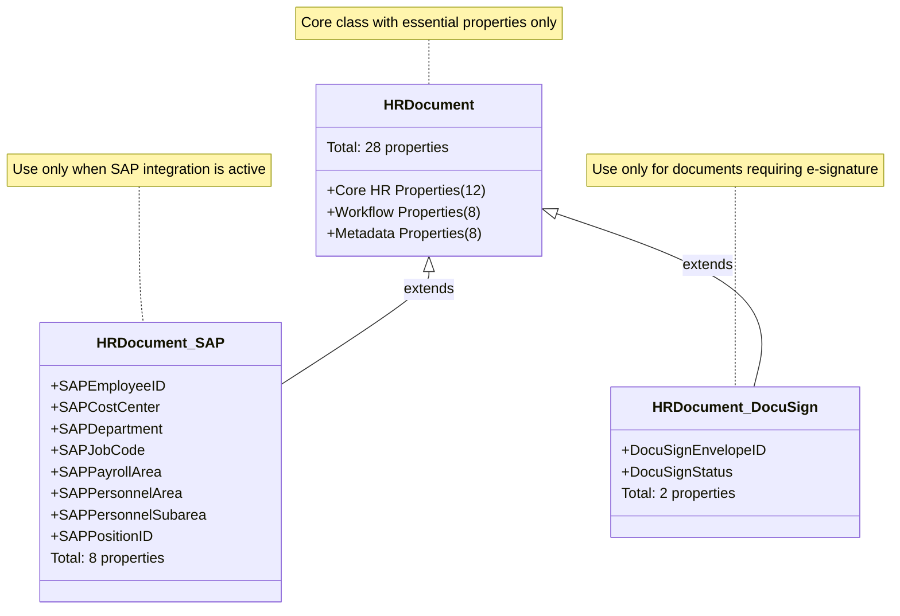

**Benefits of Separation:**
- ✅ Cleaner core class (28 vs 42 properties)
- ✅ Integration properties only where needed
- ✅ Easier to add/remove integrations
- ✅ Better performance for non-integrated documents
- ✅ Clearer architecture and maintenance

---

## 11. Integration Audit Findings Summary

### 11.1 Critical Findings

❌ **Zero Active Integrations**
- 14 integration properties defined
- <2% property population rate
- No active data flow detected
- Significant architectural overhead

❌ **Over-Engineered Architecture**
- 33% of custom properties for unused integrations
- 4 external systems with no implementation
- High maintenance burden, zero business value

⚠️ **Service Accounts Exist But Unused**
- `docuflow.fid@t7026` and `salesforce2.fid@t7026` accounts present
- Suggests infrastructure deployed but not utilized
- Integration capability exists but not activated

### 11.2 Opportunities

🎯 **Quick Wins (Immediate)**
1. Remove Salesforce properties (2) - No business fit for HR
2. Remove Docuflow properties (2) - Redundant with FileNet P8 BPM
3. **Result:** 10% reduction in custom properties

🎯 **Medium-term Improvements**
1. Implement DocuSign integration - High ROI for HR workflows
2. Decide on SAP integration - Implement or remove
3. **Result:** Clear integration strategy, reduced complexity

🎯 **Strategic Initiatives**
1. Adopt integration class architecture pattern
2. Establish integration governance framework
3. Implement integration monitoring and health checks
4. **Result:** Sustainable, scalable integration architecture

### 11.3 Risk Assessment

| Risk | Likelihood | Impact | Mitigation |
|------|-----------|--------|------------|
| **Unused properties impact performance** | High | Medium | Remove unused properties |
| **Future integration complexity** | Medium | High | Adopt class separation pattern |
| **Data quality issues if activated** | High | High | Implement validation before activation |
| **Maintenance burden** | High | Medium | Simplify architecture now |
| **Business value not realized** | High | High | Implement or remove integrations |

---

## 12. Next Steps

### Phase 7: Executive Summary
- Consolidate findings from all 6 phases
- Provide strategic recommendations with priorities
- Create comprehensive implementation roadmap
- Generate executive-level visualizations
- Establish governance framework recommendations

---

**Integration Analysis Complete**  
**Status:** ✅ Phase 6 Complete - Ready for Phase 7 (Executive Summary)  
**Key Recommendation:** Remove 4 unused properties immediately, decide on SAP/DocuSign within 30 days