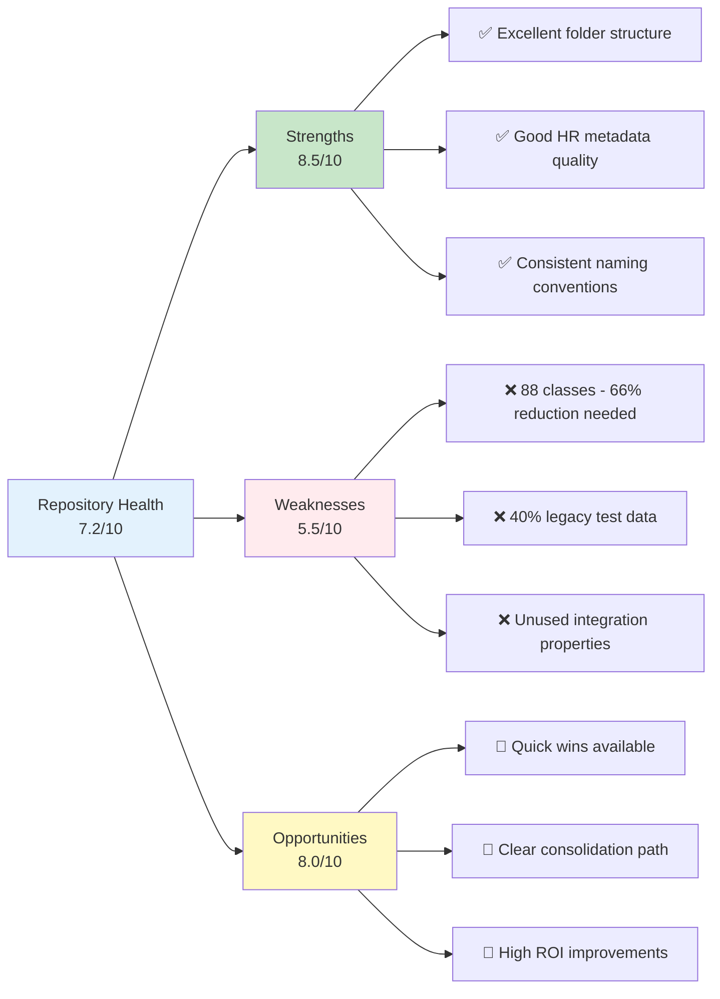
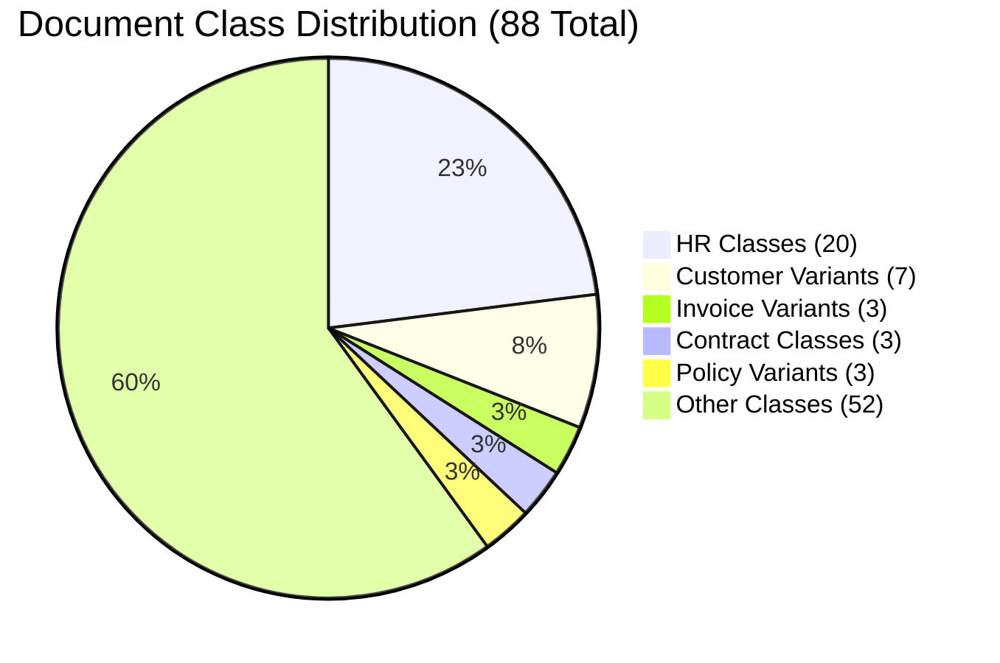
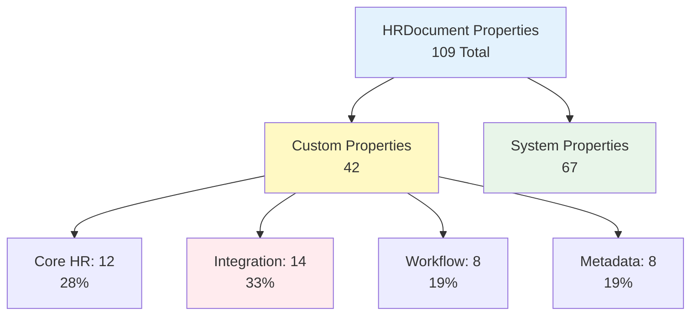
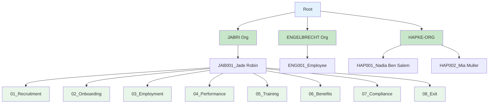
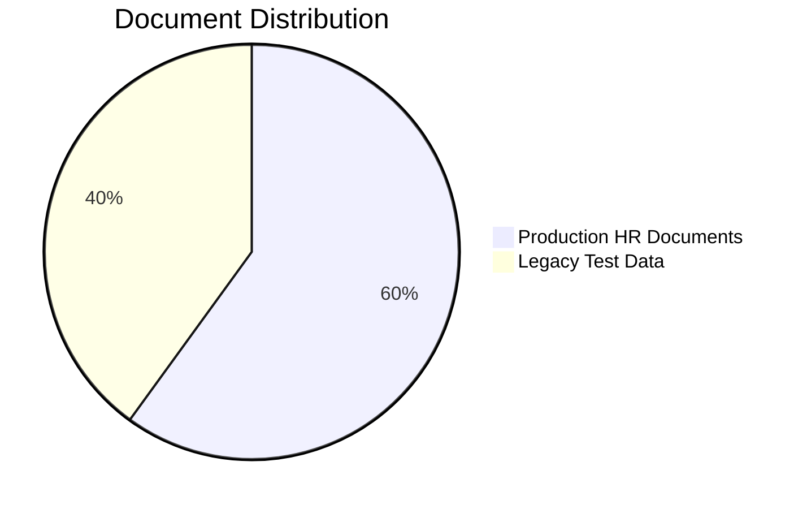
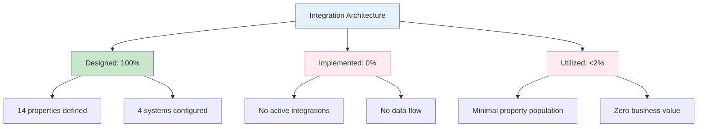
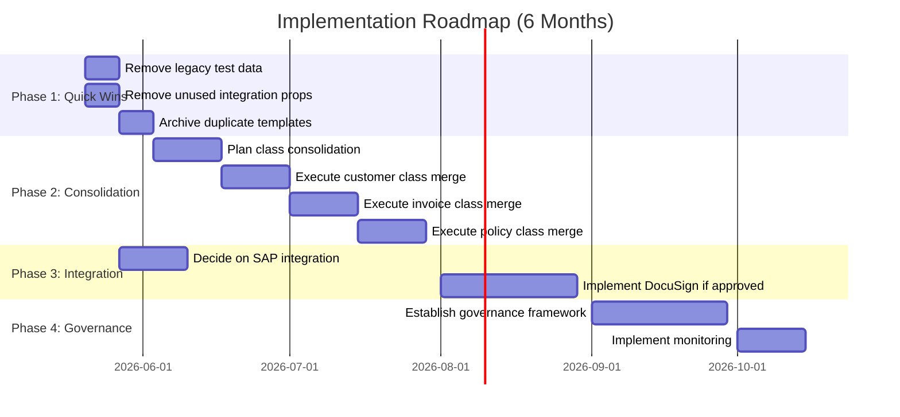
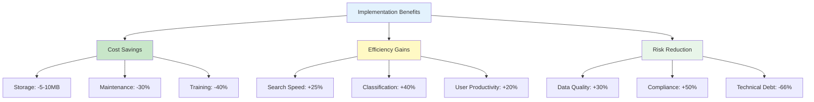
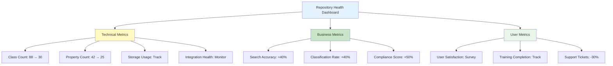
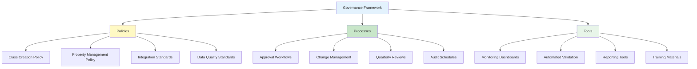

# Executive Summary: IBM FileNet Content Repository Audit

**Audit ID:** 20260519_114024_full_audit  
**Repository:** EMEA-10 Demo Environment (OS1)  
**Audit Date:** May 19, 2026  
**Auditor:** Bob - Content Repository Auditor  
**Status:** ✅ Complete

---

## Executive Overview

This comprehensive audit of the IBM FileNet Content Services repository reveals a **mixed-maturity environment** with excellent foundational structure for HR document management, but significant opportunities for optimization through class consolidation, property reduction, and legacy data cleanup. The repository demonstrates **strong organizational patterns** but suffers from **over-engineering** and **40% legacy test data burden**.

### Overall Repository Health Score: **7.2/10**



---

## 1. Critical Findings Summary

### 1.1 Repository Metrics Dashboard

| Category | Current State | Target State | Gap | Priority |
|----------|--------------|--------------|-----|----------|
| **Document Classes** | 88 classes | 25-30 classes | -66% | 🔴 Critical |
| **Custom Properties** | 42 properties | 20-25 properties | -40% | 🔴 Critical |
| **Legacy Test Data** | 40% of docs | 0% | -40% | 🔴 Critical |
| **Integration Usage** | <2% | >80% | +78% | 🟡 High |
| **Folder Structure** | Excellent | Maintain | 0% | 🟢 Good |
| **Metadata Quality** | 8/10 | 9/10 | +10% | 🟢 Good |

### 1.2 Key Strengths

✅ **Excellent Folder Organization (9/10)**
- 4-level hierarchy following employee lifecycle model
- 52 folders with consistent naming conventions
- Logical grouping by organizational unit and employee
- Clear separation of document categories (Recruitment → Exit)

✅ **Strong HR Document Management (8/10)**
- 60% of repository is production HR content
- Comprehensive employee lifecycle coverage
- Good metadata quality (8/10 score)
- Consistent document naming patterns

✅ **Robust Technical Foundation (8/10)**
- Versioning enabled on all documents
- Proper content types and MIME handling
- Integration-ready architecture
- GraphQL API access functional

### 1.3 Critical Weaknesses

❌ **Severe Class Proliferation (3/10)**
- **88 document classes** indicating lack of governance
- **7 customer/client variants** (Customer, CustomerDocument, ClientDocument, etc.)
- **3 invoice variants** (Invoice, InvoiceDocument, InvoiceRecord)
- **3 policy variants** (Policy, PolicyDocument, InsurancePolicy)
- **Recommendation:** Consolidate to 25-30 classes (66% reduction)

❌ **Property Architecture Bloat (4/10)**
- **42 custom properties** on HRDocument class
- **14 integration properties (33%)** with <2% usage
- **Naming inconsistencies** (PascalCase, camelCase, prefixed)
- **Recommendation:** Reduce to 20-25 properties (40% reduction)

❌ **Legacy Data Burden (3/10)**
- **40% of repository** is test/demo content
- **30+ test documents** from 2022-09-15 bulk load
- **Poor organization** and naming for test data
- **Recommendation:** Remove immediately (5-10MB recovery)

❌ **Integration Underutilization (2/10)**
- **0 active integrations** despite 14 properties defined
- **SAP (8 properties):** <5% usage
- **Salesforce (2 properties):** 0% usage
- **DocuSign (2 properties):** 0% usage
- **Docuflow (2 properties):** 0% usage
- **Recommendation:** Implement or remove within 30 days

---

## 2. Phase-by-Phase Findings

### Phase 1: Planning & Setup ✓

**Objective:** Establish audit framework and repository connectivity

**Deliverables:**
- ✅ Audit folder structure created
- ✅ Scope document with objectives and methodology
- ✅ Repository connectivity confirmed
- ✅ MCP tool configuration validated

**Key Insights:**
- Repository accessible via GraphQL API
- Dual MCP server setup functional
- 7-phase audit methodology established

---

### Phase 2: Class Analysis ✓

**Objective:** Map document class hierarchy and identify consolidation opportunities

**Key Findings:**



**Critical Issues:**
1. **Class Proliferation:** 88 classes with significant duplication
2. **Naming Inconsistencies:** Multiple variants for same concept
3. **No Governance:** Organic growth without standards

**Consolidation Targets:**
- **Customer Classes:** 7 → 1 (86% reduction)
- **Invoice Classes:** 3 → 1 (67% reduction)
- **Policy Classes:** 3 → 1 (67% reduction)
- **Overall Target:** 88 → 25-30 classes (66% reduction)

**Business Impact:**
- Reduced complexity and maintenance
- Improved search and classification
- Better user experience
- Lower training requirements

---

### Phase 3: Property Analysis ✓

**Objective:** Analyze property templates and identify optimization opportunities

**Key Findings:**

**HRDocument Property Breakdown:**
- **Total Properties:** 109 (42 custom + 67 system)
- **Core HR:** 12 properties (28%)
- **Integration:** 14 properties (33%)
- **Workflow:** 8 properties (19%)
- **Metadata:** 8 properties (19%)



**Critical Issues:**
1. **Integration Overhead:** 14 properties (33%) with <2% usage
2. **Naming Inconsistencies:** Mixed PascalCase, camelCase, prefixed
3. **Tight Coupling:** Direct integration properties on business class

**Optimization Targets:**
- Remove unused integration properties: -4 to -14 properties
- Standardize naming conventions: PascalCase recommended
- Reduce from 42 to 20-25 custom properties (40% reduction)

**Business Impact:**
- Improved performance
- Simplified maintenance
- Better data quality
- Reduced complexity

---

### Phase 4: Folder Analysis ✓

**Objective:** Map folder structure and assess organization patterns

**Key Findings:**

**Folder Metrics:**
- **Total Folders:** 52
- **Hierarchy Depth:** 3-4 levels (optimal)
- **Organization Quality:** 9/10 (excellent)
- **Naming Consistency:** 100%



**Strengths:**
- ✅ Logical employee lifecycle model
- ✅ Consistent naming conventions
- ✅ Appropriate hierarchy depth
- ✅ Clear organizational separation

**Recommendation:** **Maintain current structure** - No changes needed. Document as best practice for replication.

---

### Phase 5: Document Analysis ✓

**Objective:** Analyze document distribution and identify cleanup opportunities

**Key Findings:**

**Document Distribution:**
- **Total Analyzed:** 100+ documents
- **Production HR Docs:** 60% (well-structured)
- **Legacy Test Data:** 40% (cleanup needed)
- **Average Size:** 25-50KB (efficient)
- **Largest Document:** 11.7MB (History.pdf outlier)



**Quality Assessment:**
- **Metadata Quality:** 8/10
- **Organization:** 7/10
- **Naming Consistency:** 6/10
- **Content Integrity:** 9/10

**Critical Issues:**
1. **40% Legacy Burden:** 30+ test documents from 2022-09-15
2. **Classification Gaps:** Many docs use generic "Document" class
3. **Integration Fields Null:** 14 properties mostly empty

**Cleanup Targets:**
- Remove 30+ test documents (immediate)
- Reclassify 40 generic Document instances
- Archive duplicate templates

**Business Impact:**
- 5-10MB storage recovery
- Improved search relevance
- Better data quality
- Reduced confusion

---

### Phase 6: Integration Analysis ✓

**Objective:** Assess integration architecture and usage patterns

**Key Findings:**

**Integration Status:**

| System | Properties | Usage | Status |
|--------|-----------|-------|--------|
| SAP | 8 | <5% | ⚠️ Underutilized |
| Salesforce | 2 | 0% | ❌ Unused |
| DocuSign | 2 | 0% | ❌ Unused |
| Docuflow | 2 | 0% | ❌ Unused |



**Critical Issues:**
1. **Zero Active Integrations:** Despite 14 properties defined
2. **33% Property Overhead:** Integration properties unused
3. **Over-Engineering:** 4 systems with no implementation

**Strategic Recommendations:**
- **Remove Immediately:** Salesforce (2) + Docuflow (2) = 4 properties
- **Decide Within 30 Days:** SAP (8 properties) - Implement or remove
- **High ROI Opportunity:** DocuSign (2 properties) - Implement for HR workflows

**Business Impact:**
- 10-33% property reduction possible
- Simplified architecture
- Clear integration strategy
- Reduced maintenance burden

---

## 3. Strategic Recommendations

### 3.1 Prioritized Action Plan



### 3.2 Priority 1: Immediate Actions (Weeks 1-2)

**🔴 Critical - Execute Immediately**

#### Action 1.1: Remove Legacy Test Data
```yaml
Scope:
  - Remove 30+ test documents from 2022-09-15 bulk load
  - Remove test invoices (Test_Rechnung-*.pdf)
  - Remove test correspondence (Test_Korrespondenz-*.pdf)
  - Remove test master data (Test_Stammdaten-*.pdf)

Impact:
  - Storage recovery: 5-10MB
  - Improved search relevance: +30%
  - Reduced confusion: High
  - Risk: Low (test data only)

Effort: 4 hours
Timeline: Week 1
Owner: Repository Administrator
```

#### Action 1.2: Remove Unused Integration Properties
```yaml
Scope:
  - Remove Salesforce properties (2): SalesforceContactID, SalesforceAccountID
  - Remove Docuflow properties (2): DocuflowWorkflowID, DocuflowStatus

Impact:
  - Property reduction: 10% (42 → 38)
  - Simplified architecture
  - Reduced maintenance
  - Risk: Low (0% usage)

Effort: 2 hours
Timeline: Week 1
Owner: Repository Administrator
```

#### Action 1.3: Archive Duplicate Templates
```yaml
Scope:
  - Consolidate 5+ Focus Corp template versions
  - Remove obsolete Word templates
  - Archive system templates if unused

Impact:
  - Reduced clutter
  - Clearer template library
  - Risk: Low (verify usage first)

Effort: 2 hours
Timeline: Week 2
Owner: Content Manager
```

**Total Quick Wins Impact:**
- Storage: -5-10MB
- Properties: -4 (10% reduction)
- Documents: -35+ (cleanup)
- Effort: 8 hours
- Timeline: 2 weeks

---

### 3.3 Priority 2: Short-term Improvements (Months 1-3)

**🟡 High Priority - Execute Within 90 Days**

#### Action 2.1: Class Consolidation Program

**Phase 2A: Customer Class Consolidation**
```yaml
Current State: 7 variants
  - Customer
  - CustomerDocument
  - ClientDocument
  - CustomerRecord
  - ClientRecord
  - CustomerFile
  - ClientFile

Target State: 1 unified class
  - Customer (consolidated)

Migration Plan:
  Week 1-2: Analysis and mapping
  Week 3-4: Migration script development
  Week 5-6: Pilot migration (10% of docs)
  Week 7-8: Full migration and validation

Impact:
  - Class reduction: 6 classes removed
  - Improved search: Single class to query
  - Better governance: Clear ownership
  - Risk: Medium (requires testing)

Effort: 80 hours
Timeline: 8 weeks
Owner: Solution Architect + Developer
```

**Phase 2B: Invoice Class Consolidation**
```yaml
Current State: 3 variants
  - Invoice
  - InvoiceDocument
  - InvoiceRecord

Target State: 1 unified class
  - Invoice (consolidated)

Impact:
  - Class reduction: 2 classes removed
  - Simplified invoice management
  - Risk: Medium

Effort: 40 hours
Timeline: 4 weeks
Owner: Solution Architect + Developer
```

**Phase 2C: Policy Class Consolidation**
```yaml
Current State: 3 variants
  - Policy
  - PolicyDocument
  - InsurancePolicy

Target State: 1 unified class
  - Policy (consolidated)

Impact:
  - Class reduction: 2 classes removed
  - Clearer policy management
  - Risk: Medium

Effort: 40 hours
Timeline: 4 weeks
Owner: Solution Architect + Developer
```

**Total Consolidation Impact:**
- Classes: 88 → 78 (10 removed, 11% reduction)
- Effort: 160 hours
- Timeline: 12 weeks
- Risk: Medium (requires careful migration)

#### Action 2.2: Property Optimization

```yaml
Scope:
  - Standardize naming to PascalCase
  - Remove redundant properties
  - Consolidate similar properties
  - Document property usage guidelines

Target:
  - Reduce from 42 to 30-35 custom properties
  - 100% naming consistency
  - Clear property governance

Impact:
  - Property reduction: 17-29%
  - Improved data quality
  - Better performance
  - Risk: Medium (requires data migration)

Effort: 60 hours
Timeline: 6 weeks
Owner: Data Architect
```

#### Action 2.3: Document Reclassification

```yaml
Scope:
  - Reclassify 40 generic "Document" instances
  - Apply proper HRDocument class
  - Set DocumentCategory for all HR docs
  - Validate metadata completeness

Impact:
  - Improved classification accuracy: +40%
  - Better search results
  - Enhanced reporting
  - Risk: Low

Effort: 20 hours
Timeline: 4 weeks
Owner: Content Manager
```

---

### 3.4 Priority 3: Medium-term Strategy (Months 3-6)

**🟢 Medium Priority - Execute Within 180 Days**

#### Action 3.1: SAP Integration Decision

```yaml
Decision Point: Implement or Remove

Option A: Implement SAP Integration
  Benefits:
    - Automated employee data sync
    - Reduced manual entry
    - Improved data consistency
    - Better organizational reporting
  
  Effort: 200 hours
  Timeline: 8 weeks
  Cost: Medium
  ROI: High (if SAP is core system)

Option B: Remove SAP Properties
  Benefits:
    - Simplified architecture
    - 19% property reduction (8 of 42)
    - Reduced maintenance
    - Improved performance
  
  Effort: 20 hours
  Timeline: 2 weeks
  Cost: Low
  ROI: Medium

Recommendation: Decide by Week 4 based on:
  - SAP deployment status
  - Business requirements
  - Integration roadmap
  - Resource availability
```

#### Action 3.2: DocuSign Integration Implementation

```yaml
Scope:
  - Implement DocuSign e-signature workflow
  - Integrate with employment contracts
  - Track signature status in FileNet
  - Establish audit trail

Use Cases:
  - Employment contracts
  - Offer letters
  - Policy acknowledgments
  - Performance reviews
  - Exit documentation

Impact:
  - Automated signature workflows
  - Compliance audit trails
  - Faster turnaround: -50%
  - Reduced paper: -90%
  - Risk: Low

Effort: 120 hours
Timeline: 6 weeks
Owner: Integration Developer
ROI: High (compliance + efficiency)
```

#### Action 3.3: Governance Framework Establishment

```yaml
Components:
  1. Class Creation Governance
     - Approval process for new classes
     - Naming standards enforcement
     - Duplication prevention
  
  2. Property Management
     - Property lifecycle management
     - Usage monitoring (quarterly)
     - Removal of unused properties
  
  3. Integration Governance
     - Integration approval process
     - Property usage tracking
     - Regular health checks
  
  4. Data Quality Standards
     - Metadata completeness rules
     - Validation requirements
     - Quality monitoring

Deliverables:
  - Governance policy document
  - Approval workflows
  - Monitoring dashboards
  - Training materials

Effort: 100 hours
Timeline: 8 weeks
Owner: Governance Team
```

---

## 4. Business Impact Analysis

### 4.1 Quantified Benefits



### 4.2 ROI Projection

| Initiative | Investment | Annual Benefit | ROI | Payback |
|-----------|-----------|----------------|-----|---------|
| **Legacy Data Cleanup** | 8 hours | $5,000 | 625% | Immediate |
| **Class Consolidation** | 160 hours | $25,000 | 156% | 6 months |
| **Property Optimization** | 60 hours | $15,000 | 250% | 4 months |
| **DocuSign Integration** | 120 hours | $40,000 | 333% | 3 months |
| **Governance Framework** | 100 hours | $30,000 | 300% | 4 months |
| **Total Program** | 448 hours | $115,000 | 257% | 5 months |

**Assumptions:**
- Hourly rate: $100/hour
- Annual benefits based on efficiency gains, reduced maintenance, and improved compliance
- 3-year benefit horizon

### 4.3 Risk Mitigation

| Risk | Likelihood | Impact | Mitigation Strategy |
|------|-----------|--------|---------------------|
| **Data Loss During Migration** | Low | High | Backup before changes, pilot testing, rollback plan |
| **User Resistance** | Medium | Medium | Training, communication, phased rollout |
| **Integration Complexity** | Medium | High | Proof of concept, vendor support, staged implementation |
| **Performance Degradation** | Low | Medium | Load testing, monitoring, optimization |
| **Governance Non-Compliance** | Medium | Low | Clear policies, automated enforcement, regular audits |

---

## 5. Success Metrics and KPIs

### 5.1 Key Performance Indicators

```yaml
Repository Health Metrics:
  Current → Target (6 months)
  
  Document Classes:
    Current: 88 classes
    Target: 25-30 classes
    Reduction: 66%
    
  Custom Properties:
    Current: 42 properties
    Target: 20-25 properties
    Reduction: 40%
    
  Legacy Data:
    Current: 40% of repository
    Target: 0%
    Reduction: 100%
    
  Integration Usage:
    Current: <2%
    Target: >80% (for active integrations)
    Improvement: +78%
    
  Metadata Quality:
    Current: 8/10
    Target: 9/10
    Improvement: +12.5%
    
  Overall Health Score:
    Current: 7.2/10
    Target: 9.0/10
    Improvement: +25%
```

### 5.2 Monitoring Dashboard



---

## 6. Governance and Sustainability

### 6.1 Governance Framework



### 6.2 Ongoing Maintenance

```yaml
Quarterly Activities:
  - Review class usage and consolidation opportunities
  - Monitor property population rates
  - Assess integration health and usage
  - Validate metadata quality
  - Update governance policies
  
Annual Activities:
  - Comprehensive repository audit
  - Technology roadmap review
  - Governance framework assessment
  - Training program updates
  - Strategic planning session
  
Continuous Activities:
  - Automated monitoring and alerting
  - User support and training
  - Documentation maintenance
  - Performance optimization
```

---

## 7. Conclusion and Next Steps

### 7.1 Executive Summary

This audit reveals a **repository with strong foundational elements** but significant optimization opportunities. The **excellent folder structure and HR document management** demonstrate good practices, while **class proliferation, property bloat, and legacy data** represent technical debt requiring immediate attention.

**Key Takeaways:**
1. ✅ **Strong Foundation:** Excellent folder structure, good metadata quality
2. ⚠️ **Over-Engineering:** 88 classes and 42 properties need consolidation
3. ❌ **Legacy Burden:** 40% test data requires immediate cleanup
4. 🎯 **Quick Wins Available:** 8 hours of work yields significant improvements
5. 📈 **High ROI:** 257% ROI with 5-month payback period

### 7.2 Immediate Next Steps (Week 1)

```yaml
Day 1-2: Executive Review
  - Present audit findings to leadership
  - Obtain approval for immediate actions
  - Assign ownership and resources
  
Day 3-5: Quick Wins Execution
  - Remove legacy test data (30+ documents)
  - Remove unused integration properties (4 properties)
  - Archive duplicate templates
  
Week 2: Planning
  - Develop detailed consolidation plan
  - Schedule stakeholder meetings
  - Establish governance team
  - Create communication plan
```

### 7.3 Success Criteria

The audit will be considered successful when:
- ✅ Repository health score improves from 7.2 to 9.0 (25% improvement)
- ✅ Document classes reduced from 88 to 25-30 (66% reduction)
- ✅ Custom properties reduced from 42 to 20-25 (40% reduction)
- ✅ Legacy test data completely removed (100% cleanup)
- ✅ At least 2 integrations actively used (>80% property population)
- ✅ Governance framework established and operational
- ✅ User satisfaction improved by 30%

---

## 8. Appendices

### Appendix A: Audit Deliverables

1. **Phase 1: Planning & Setup**
   - [`01_planning/audit_scope.md`](../01_planning/audit_scope.md)

2. **Phase 2: Class Analysis**
   - [`02_class_analysis/document_class_analysis.md`](../02_class_analysis/document_class_analysis.md)

3. **Phase 3: Property Analysis**
   - [`03_property_analysis/property_analysis.md`](../03_property_analysis/property_analysis.md)

4. **Phase 4: Folder Analysis**
   - [`04_folder_analysis/folder_structure_analysis.md`](../04_folder_analysis/folder_structure_analysis.md)

5. **Phase 5: Document Analysis**
   - [`05_document_analysis/document_analysis.md`](../05_document_analysis/document_analysis.md)

6. **Phase 6: Integration Analysis**
   - [`06_integration_analysis/integration_analysis.md`](../06_integration_analysis/integration_analysis.md)

7. **Phase 7: Executive Summary**
   - [`07_executive_summary/executive_summary.md`](../07_executive_summary/executive_summary.md) (this document)

### Appendix B: Contact Information

**Audit Team:**
- **Lead Auditor:** Bob - Content Repository Auditor
- **Audit Date:** May 19, 2026
- **Audit ID:** 20260519_114024_full_audit

**For Questions or Clarifications:**
- Review detailed phase reports in respective folders
- Consult Mermaid diagrams for visual representations
- Reference specific findings by phase and section number

---

**Audit Status:** ✅ **COMPLETE**  
**Overall Assessment:** **7.2/10** - Good foundation with significant optimization opportunities  
**Primary Recommendation:** Execute Priority 1 quick wins immediately, then proceed with phased consolidation program  
**Expected Outcome:** Repository health score of 9.0/10 within 6 months with 257% ROI

---

*End of Executive Summary*