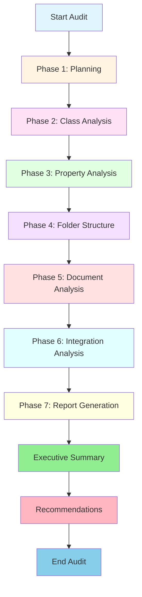

# IBM FileNet Content Repository Audit
## EMEA-10 Environment - Full Audit

**Audit Date:** 2026-05-19  
**Audit ID:** 20260519_102148_full_audit  
**Environment:** fncm-dev-demo-emea-10.automationcloud.ibm.com  
**Object Store:** OS1  
**Auditor:** Bob - Content Repository Auditor

---

## Audit Scope

This comprehensive audit covers all aspects of the IBM FileNet Content Repository:

### 1. **Document Class Architecture**
- Complete class hierarchy analysis
- Document class definitions and relationships
- Subclass usage patterns
- Class property mappings

### 2. **Property Analysis**
- Property template definitions
- Property usage across classes
- Data type consistency
- Required vs optional properties
- Property naming conventions

### 3. **Folder Structure**
- Root folder hierarchy
- Folder organization patterns
- Folder class usage
- Containment relationships

### 4. **Document Distribution**
- Document counts by class
- Filing patterns
- Version series analysis
- Content storage patterns

### 5. **Integration Points**
- GraphQL API usage
- External system connections
- Authentication mechanisms
- API endpoint configurations

### 6. **Governance & Compliance**
- Security configurations
- Retention policies
- Audit trail capabilities
- Access control patterns

---

## Audit Methodology

---

## Expected Deliverables

1. **Class Architecture Report** - Visual diagrams and detailed analysis
2. **Property Specifications** - Complete property catalog with usage metrics
3. **Folder Structure Map** - Hierarchical visualization and organization patterns
4. **Document Distribution Analysis** - Statistics and filing patterns
5. **Integration Documentation** - API endpoints and connection details
6. **Executive Summary** - High-level findings and recommendations
7. **Cleanup & Optimization Roadmap** - Actionable improvement plan

---

## Audit Timeline

```mermaid
gantt
    title Full Repository Audit Timeline
    dateFormat HH:mm
    section Phase 1
    Planning & Setup           :done, p1, 08:21, 10m
    section Phase 2
    Document Class Analysis    :active, p2, 08:31, 30m
    section Phase 3
    Property Analysis          :p3, after p2, 25m
    section Phase 4
    Folder Structure Analysis  :p4, after p3, 20m
    section Phase 5
    Document Analysis          :p5, after p4, 25m
    section Phase 6
    Integration Analysis       :p6, after p5, 15m
    section Phase 7
    Report Generation          :p7, after p6, 30m
```

---

## Repository Connection Details

- **Server URL:** https://fncm-dev-demo-emea-10.automationcloud.ibm.com/content-services-graphql/graphql
- **Object Store:** OS1
- **Authentication:** CMIS-FileNet (FID)
- **API Type:** GraphQL
- **Access Level:** Full repository access via MCP server

---

## Next Steps

1. ✅ Audit structure created
2. 🔄 Begin document class analysis
3. ⏳ Property template examination
4. ⏳ Folder hierarchy mapping
5. ⏳ Document distribution analysis
6. ⏳ Integration point identification
7. ⏳ Final report compilation
