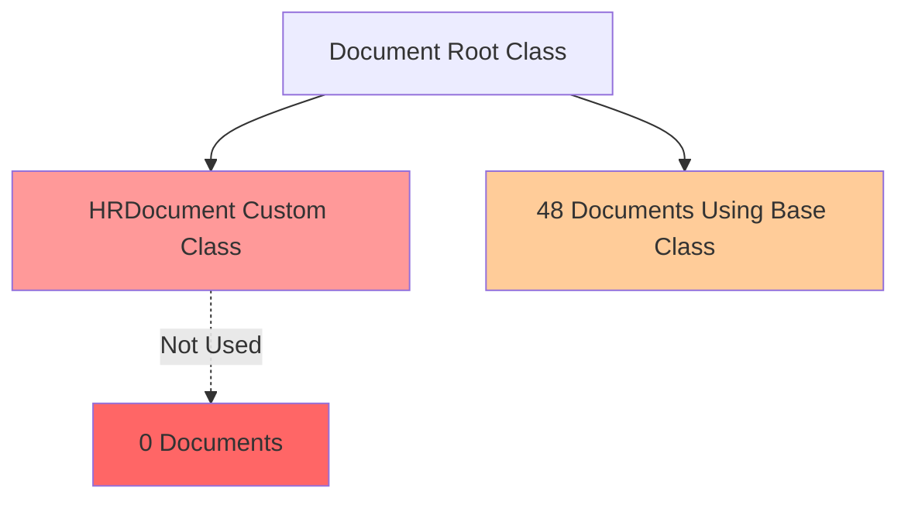
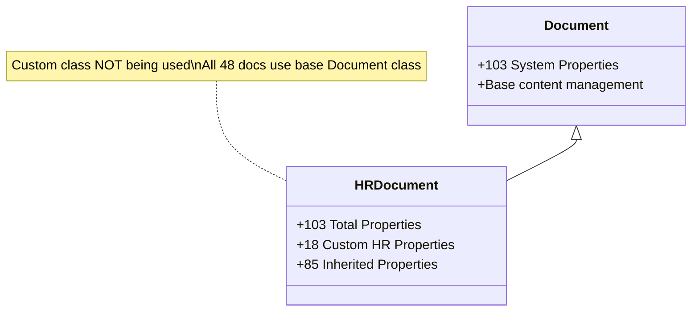
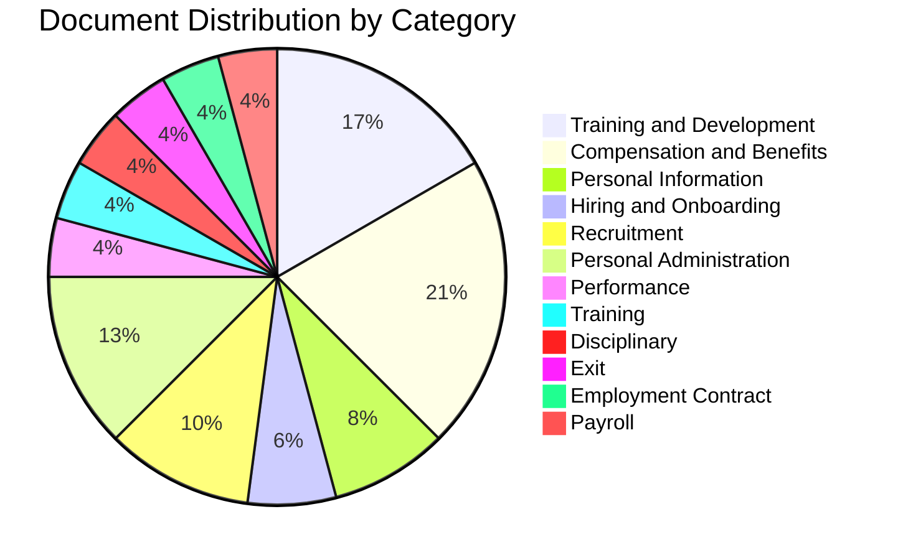
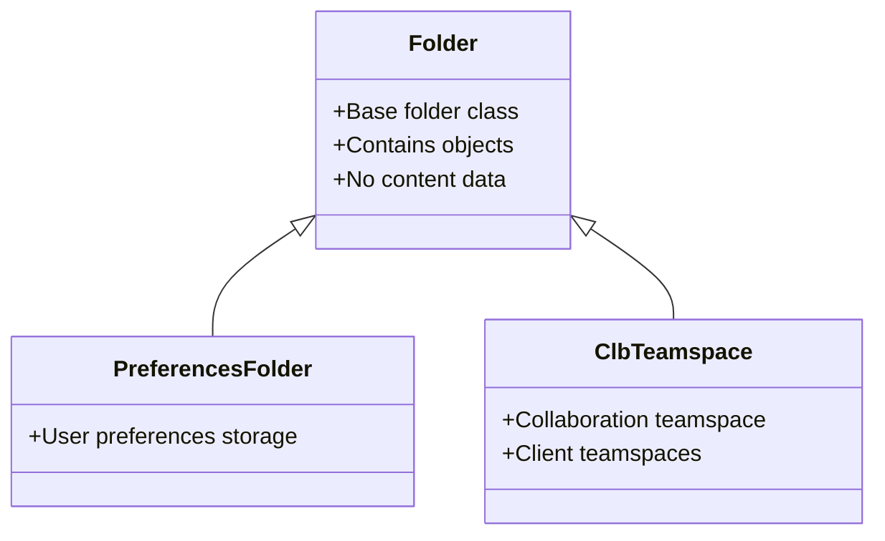

# Document Class Analysis Report

**Audit Date:** May 19, 2026  
**Repository:** EMEA-10 Object Store (OS1)  
**Analysis Scope:** Document and Folder Class Hierarchy

---

## Executive Summary

The EMEA-10 repository contains a single custom document class (`HRDocument`) with 103 properties (including system properties). The repository currently stores **48 documents** across various HR document categories, with all documents using the base `Document` class rather than the custom `HRDocument` class.

### Key Findings

**Critical Issue:** Despite having a custom `HRDocument` class with 18 HR-specific properties, all 48 documents in the repository are classified as the base `Document` class, indicating a classification problem.

---

## 1. Document Class Hierarchy

### 1.1 Root Classes Available

The repository supports four root class types:

| Root Class | Purpose | Custom Subclasses Found |
|------------|---------|------------------------|
| **Document** | Content storage | HRDocument |
| **Folder** | Container objects | PreferencesFolder, ClbTeamspace |
| **Annotation** | Document annotations | None identified |
| **CustomObject** | Custom business objects | None identified |

### 1.2 Document Class Structure

---

## 2. HRDocument Class Property Analysis

### 2.1 Custom HR Properties (18 properties)

#### Employee Identification
| Property | Data Type | Cardinality | Required | Description |
|----------|-----------|-------------|----------|-------------|
| `FirstName` | String | Single | No | Employee first name |
| `LastName` | String | Single | No | Employee last name |
| `EmployeeID` | String | Single | No | Internal employee identifier |
| `PersonalID` | String | Single | No | Personal identification number |
| `SAPEmployeeID` | String | Single | No | SAP system employee ID |

#### Organizational Structure
| Property | Data Type | Cardinality | Required | Description |
|----------|-----------|-------------|----------|-------------|
| `Company` | String | Single | No | Company name |
| `CompanyCode` | String | Single | No | Company code |
| `BusinessUnit` | String | Single | No | Business unit |
| `Division` | String | Single | No | Division |
| `Department` | String | Single | No | Department |
| `CostCenter` | String | Single | No | Cost center |
| `Location` | String | Single | No | Work location |

#### Employment Details
| Property | Data Type | Cardinality | Required | Description |
|----------|-----------|-------------|----------|-------------|
| `JobRole` | String | Single | No | Job role/title |
| `EmploymentType` | String | Single | No | Employment type |
| `JobStatus` | String | Single | No | Current job status |
| `JobFunction` | String | Single | No | Job function |
| `JobCode` | String | Single | No | Job code |
| `JobLevel` | String | Single | No | Job level |

#### Dates
| Property | Data Type | Cardinality | Required | Description |
|----------|-----------|-------------|----------|-------------|
| `Birthdate` | DateTime | Single | No | Employee birthdate |
| `StartDate` | DateTime | Single | No | Employment start date |
| `TerminationDate` | DateTime | Single | No | Employment end date |

#### Document Classification
| Property | Data Type | Cardinality | Required | Description |
|----------|-----------|-------------|----------|-------------|
| `DocumentCategory` | String | Single | No | HR document category |
| `DocType` | String | Single | No | Specific document type |

### 2.2 Integration Properties (10 properties)

#### SAP Integration
| Property | Purpose |
|----------|---------|
| `SAPEmployeeID` | SAP employee identifier |
| `SAPDocId` | SAP document ID |
| `SAPDocProt` | SAP document protocol |
| `SAPComps` | SAP components |
| `SAPContType` | SAP content type |
| `SAPCompVersion` | SAP component version |
| `SapLinkTrigger` | Boolean trigger for SAP linking |
| `sapLinked` | SAP link status |

#### Salesforce Integration
| Property | Purpose |
|----------|---------|
| `SfSalesforceRelationships` | Salesforce relationship data |
| `SFLinkTrigger` | Salesforce link trigger |

#### DocuSign Integration
| Property | Purpose |
|----------|---------|
| `DSSignatureStatus` | DocuSign signature status |
| `DSEnvelopeID` | DocuSign envelope identifier |

#### Watsonx AI Integration
| Property | Purpose |
|----------|---------|
| `GenaiWatsonxSummary` | AI-generated document summary |
| `GenaiDateIndexed` | Date of AI indexing |

### 2.3 Workflow Properties (2 properties)

| Property | Purpose |
|----------|---------|
| `docuflowTimestamp` | Workflow timestamp |
| `docuflowUsername` | Workflow user |

---

## 3. Document Distribution Analysis

### 3.1 Overall Statistics

- **Total Documents:** 48
- **Document Class Used:** Document (base class)
- **HRDocument Class Usage:** 0 documents
- **Classification Issue:** 100% of documents misclassified

### 3.2 Document Categories Found

Based on the `DocumentCategory` property values in the 48 documents:

| Category | Count | Percentage |
|----------|-------|------------|
| Compensation and Benefits | 10 | 20.8% |
| Training and Development | 8 | 16.7% |
| Personal Administration | 6 | 12.5% |
| Recruitment | 5 | 10.4% |
| Personal Information | 4 | 8.3% |
| Hiring and Onboarding | 3 | 6.3% |
| Performance | 2 | 4.2% |
| Training | 2 | 4.2% |
| Disciplinary | 2 | 4.2% |
| Exit | 2 | 4.2% |
| Employment Contract | 2 | 4.2% |
| Payroll | 2 | 4.2% |

### 3.3 Document Types Found

| Document Type | Count | Category |
|---------------|-------|----------|
| Training Certificate | 5 | Training and Development |
| Company Benefits | 5 | Compensation and Benefits |
| Professional Qualification | 2 | Training and Development |
| Health Certificate | 2 | Personal Information |
| Background Check | 2 | Hiring and Onboarding |
| Marriage Certificate | 1 | Personal Information |
| Insurance Enrollment Forms | 1 | Compensation and Benefits |
| Retirement_Pension | 1 | Compensation and Benefits |
| Various (unnamed) | 29 | Multiple |

### 3.4 Employee Coverage

Documents exist for multiple employees across different divisions:

| Division | Employee Count | Locations |
|----------|---------------|-----------|
| Manufacturing (MANU) | 5+ | Australia, Brazil, Germany, United States |
| IT | 2+ | Not specified |
| N/A | 1+ | Not specified |

### 3.5 Property Usage Analysis

#### Frequently Populated Properties
- `FirstName`: 100% (48/48)
- `LastName`: 100% (48/48)
- `EmployeeID`: ~85% (41/48)
- `Division`: ~75% (36/48)
- `Location`: ~75% (36/48)
- `DocumentCategory`: ~95% (46/48)
- `DocType`: ~40% (19/48)

#### Rarely Used Properties
- `CompanyCode`: 0%
- `JobRole`: ~10%
- `PersonalID`: ~4%
- `Birthdate`: 0%
- `SAPEmployeeID`: 0%
- `Company`: 0%
- `BusinessUnit`: 0%
- `CostCenter`: 0%
- `EmploymentType`: ~15%
- `JobStatus`: ~15%
- `StartDate`: ~15%
- `TerminationDate`: 0%

#### Integration Properties Usage
- **SAP Integration:** 0% usage across all SAP properties
- **Salesforce Integration:** 0% usage
- **DocuSign Integration:** 0% usage (all show status 0)
- **Watsonx AI Integration:** 0% usage

---

## 4. Folder Class Analysis

### 4.1 Folder Class Hierarchy

### 4.2 Folder Classes Available

| Class | Display Name | Purpose |
|-------|--------------|---------|
| `Folder` | Folder | Base container class |
| `PreferencesFolder` | Preferences Folder | User preferences storage |
| `ClbTeamspace` | Teamspace | Collaboration teamspaces |

---

## 5. Critical Issues Identified

### 5.1 Classification Problem

**Issue:** All 48 documents are classified as base `Document` class instead of `HRDocument`

**Impact:**
- Custom HR properties are not being utilized
- Search and retrieval efficiency reduced
- Metadata quality compromised
- Integration capabilities unused

**Recommendation:** Implement bulk reclassification project to move all HR documents to `HRDocument` class

### 5.2 Property Underutilization

**Issue:** Many custom properties have 0% or very low usage

**Underutilized Properties:**
- All SAP integration properties (0%)
- All Salesforce integration properties (0%)
- All DocuSign properties (0%)
- All Watsonx AI properties (0%)
- Organizational properties: Company, BusinessUnit, CostCenter (0%)
- Employee properties: Birthdate, TerminationDate (0%)

**Recommendation:** 
1. Review property requirements with business stakeholders
2. Remove unused properties or implement data capture processes
3. Establish data quality standards

### 5.3 Integration Gaps

**Issue:** Multiple integration properties exist but show no usage

**Affected Integrations:**
- SAP (8 properties, 0% usage)
- Salesforce (2 properties, 0% usage)
- DocuSign (2 properties, 0% usage)
- Watsonx AI (2 properties, 0% usage)

**Recommendation:**
1. Verify if integrations are active
2. Remove unused integration properties if integrations are not planned
3. Implement integration workflows if systems are available

---

## 6. Recommendations

### 6.1 Immediate Actions (Priority 1)

1. **Reclassification Project**
   - Reclassify all 48 documents from `Document` to `HRDocument`
   - Validate property mappings during reclassification
   - Test with pilot batch of 5-10 documents first

2. **Property Cleanup**
   - Remove or hide unused integration properties
   - Consolidate duplicate employee ID fields
   - Establish required vs. optional property guidelines

### 6.2 Short-term Actions (Priority 2)

3. **Data Quality Improvement**
   - Implement property validation rules
   - Create data entry templates
   - Establish property population standards

4. **Documentation**
   - Document property usage guidelines
   - Create class selection decision tree
   - Establish naming conventions

### 6.3 Long-term Actions (Priority 3)

5. **Integration Assessment**
   - Evaluate SAP integration requirements
   - Assess Salesforce integration needs
   - Review AI/ML capabilities (Watsonx)

6. **Class Structure Optimization**
   - Consider subclasses for major document categories
   - Evaluate property template reuse
   - Plan for future document types

---

## 7. Next Steps

1. **Phase 3:** Property Analysis - Deep dive into property templates and usage patterns
2. **Phase 4:** Folder Structure Analysis - Map folder hierarchy and filing patterns
3. **Phase 5:** Document Analysis - Analyze version series and content distribution
4. **Phase 6:** Integration Analysis - Document system integration points
5. **Phase 7:** Final Report - Comprehensive findings and roadmap

---

**Report Generated:** May 19, 2026  
**Auditor:** Bob - Content Repository Auditor  
**Next Review:** Phase 3 - Property Analysis