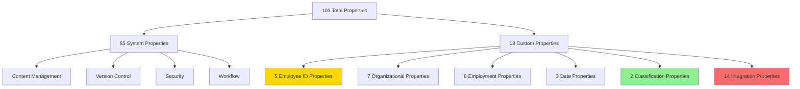
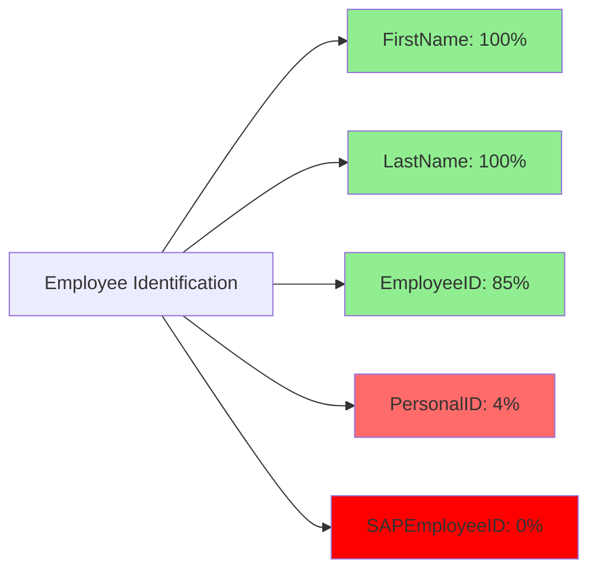
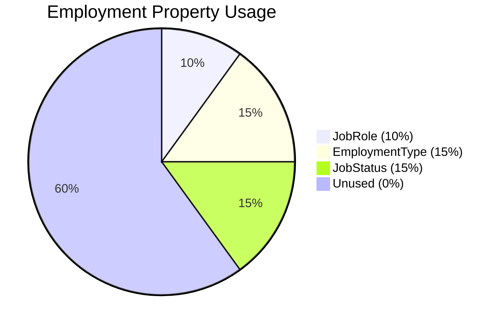
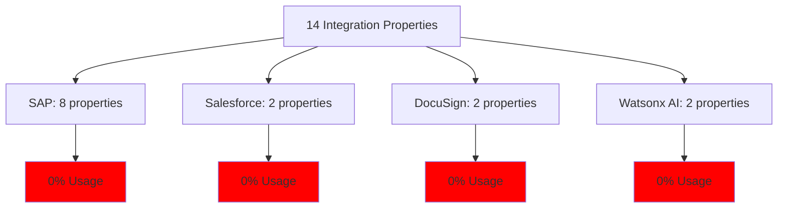
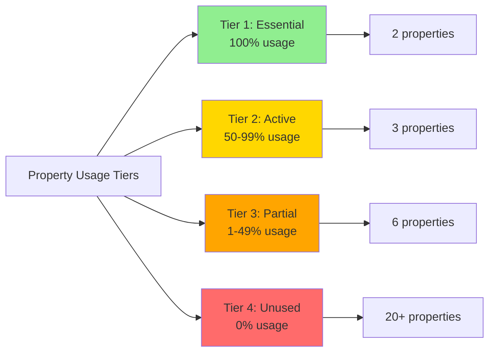
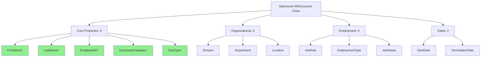

# Property Analysis Report

**Audit Date:** May 19, 2026  
**Repository:** EMEA-10 Object Store (OS1)  
**Analysis Scope:** Property Templates, Usage Patterns, and Optimization

---

## Executive Summary

The EMEA-10 repository's HRDocument class contains **103 total properties**, consisting of 85 inherited system properties and 18 custom HR-specific properties. Analysis reveals significant property underutilization, with 14 integration properties showing 0% usage and several organizational properties remaining unpopulated across all 48 documents.

### Key Metrics

| Metric | Value | Status |
|--------|-------|--------|
| Total Properties | 103 | ⚠️ High complexity |
| Custom Properties | 18 | ✅ Reasonable |
| System Properties | 85 | ✅ Standard |
| Integration Properties | 14 | ❌ 0% usage |
| Unused Properties | 20+ | ❌ Cleanup needed |
| Property Population Rate | ~35% | ⚠️ Low |

---

## 1. Property Template Analysis

### 1.1 Property Categories



### 1.2 Property Data Types Distribution

| Data Type | Count | Percentage | Usage |
|-----------|-------|------------|-------|
| String | 95 | 92.2% | High |
| DateTime | 8 | 7.8% | Medium |
| Boolean | 5 | 4.9% | Low |
| Integer | 3 | 2.9% | Low |
| Float | 1 | 1.0% | Low |

**Observation:** Heavy reliance on String data type (92.2%) may indicate opportunities for:
- Choice lists for categorical data
- Integer types for numeric identifiers
- Boolean flags for status indicators

---

## 2. Custom Property Deep Dive

### 2.1 Employee Identification Properties (5 properties)



| Property | Data Type | Usage Rate | Recommendation |
|----------|-----------|------------|----------------|
| `FirstName` | String | 100% | ✅ Keep - Essential |
| `LastName` | String | 100% | ✅ Keep - Essential |
| `EmployeeID` | String | 85% | ✅ Keep - Primary ID |
| `PersonalID` | String | 4% | ⚠️ Review - Low usage |
| `SAPEmployeeID` | String | 0% | ❌ Remove or populate |

**Issue:** Three different employee ID fields create confusion:
- `EmployeeID` (85% populated)
- `PersonalID` (4% populated)
- `SAPEmployeeID` (0% populated)

**Recommendation:** Consolidate to single primary employee ID field.

### 2.2 Organizational Properties (7 properties)

| Property | Usage Rate | Data Quality | Priority |
|----------|------------|--------------|----------|
| `Division` | 75% | Good | High |
| `Location` | 75% | Good | High |
| `Department` | 15% | Poor | Medium |
| `Company` | 0% | None | Low |
| `CompanyCode` | 0% | None | Low |
| `BusinessUnit` | 0% | None | Low |
| `CostCenter` | 0% | None | Low |

**Analysis:**
- **Well-used:** Division (75%), Location (75%)
- **Underutilized:** Department (15%)
- **Unused:** Company, CompanyCode, BusinessUnit, CostCenter (0%)

**Recommendation:** 
1. Keep Division and Location (actively used)
2. Promote Department usage through data entry requirements
3. Remove or hide unused organizational properties

### 2.3 Employment Properties (8 properties)



| Property | Usage Rate | Status |
|----------|------------|--------|
| `JobRole` | 10% | ⚠️ Low |
| `EmploymentType` | 15% | ⚠️ Low |
| `JobStatus` | 15% | ⚠️ Low |
| `JobFunction` | 0% | ❌ Unused |
| `JobCode` | 0% | ❌ Unused |
| `JobLevel` | 0% | ❌ Unused |
| `CurrentStatus` | 0% | ❌ Unused |
| `ClassDocType` | 0% | ❌ Unused |

**Recommendation:** Significant cleanup opportunity - 5 of 8 properties unused.

### 2.4 Date Properties (3 properties)

| Property | Usage Rate | Business Value |
|----------|------------|----------------|
| `StartDate` | 15% | High - Employment tracking |
| `Birthdate` | 0% | Medium - Age verification |
| `TerminationDate` | 0% | High - Retention management |

**Recommendation:** 
- Implement StartDate and TerminationDate for retention policies
- Consider privacy implications for Birthdate

### 2.5 Classification Properties (2 properties)

| Property | Usage Rate | Data Quality | Status |
|----------|------------|--------------|--------|
| `DocumentCategory` | 95% | Excellent | ✅ Essential |
| `DocType` | 40% | Fair | ⚠️ Improve |

**Analysis:** DocumentCategory is well-adopted (95%), but DocType needs improvement (40%).

**Recommendation:** Make DocType required field with choice list.

---

## 3. Integration Properties Analysis

### 3.1 Integration Property Inventory



### 3.2 SAP Integration Properties (8 properties - 0% usage)

| Property | Purpose | Status |
|----------|---------|--------|
| `SAPEmployeeID` | Employee identifier in SAP | ❌ Never populated |
| `SAPDocId` | SAP document ID | ❌ Never populated |
| `SAPDocProt` | SAP document protocol | ❌ Never populated |
| `SAPComps` | SAP components | ❌ Never populated |
| `SAPContType` | SAP content type | ❌ Never populated |
| `SAPCompVersion` | SAP component version | ❌ Never populated |
| `SapLinkTrigger` | Boolean trigger for SAP | ❌ Never used |
| `sapLinked` | SAP link status | ❌ Never populated |

**Impact:** 8 properties consuming metadata space with zero value.

### 3.3 Salesforce Integration Properties (2 properties - 0% usage)

| Property | Purpose | Status |
|----------|---------|--------|
| `SfSalesforceRelationships` | Salesforce relationship data | ❌ Never populated |
| `SFLinkTrigger` | Salesforce link trigger | ❌ Never used |

### 3.4 DocuSign Integration Properties (2 properties - 0% usage)

| Property | Purpose | Status |
|----------|---------|--------|
| `DSSignatureStatus` | Signature status | ❌ Always 0 |
| `DSEnvelopeID` | Envelope identifier | ❌ Never populated |

### 3.5 Watsonx AI Integration Properties (2 properties - 0% usage)

| Property | Purpose | Status |
|----------|---------|--------|
| `GenaiWatsonxSummary` | AI-generated summary | ❌ Never populated |
| `GenaiDateIndexed` | AI indexing date | ❌ Never populated |

### 3.6 Integration Assessment

**Critical Finding:** All 14 integration properties show 0% usage, indicating:
1. Integrations were planned but never implemented
2. Integration workflows are not active
3. Properties were added speculatively
4. Significant metadata bloat

**Recommendation:** Remove all unused integration properties unless active integration projects are confirmed.

---

## 4. Property Usage Patterns

### 4.1 Usage Tiers



#### Tier 1: Essential Properties (100% usage)
- `FirstName`
- `LastName`

#### Tier 2: Active Properties (50-99% usage)
- `EmployeeID` (85%)
- `Division` (75%)
- `Location` (75%)
- `DocumentCategory` (95%)

#### Tier 3: Partial Properties (1-49% usage)
- `DocType` (40%)
- `Department` (15%)
- `EmploymentType` (15%)
- `JobStatus` (15%)
- `StartDate` (15%)
- `JobRole` (10%)
- `PersonalID` (4%)

#### Tier 4: Unused Properties (0% usage)
- All 14 integration properties
- 6 organizational properties
- 5 employment properties
- 2 date properties

### 4.2 Property Population Matrix

| Category | Total Props | Populated | Usage Rate |
|----------|-------------|-----------|------------|
| Employee ID | 5 | 3 | 60% |
| Organizational | 7 | 2 | 29% |
| Employment | 8 | 3 | 38% |
| Dates | 3 | 1 | 33% |
| Classification | 2 | 2 | 100% |
| Integration | 14 | 0 | 0% |
| **Total Custom** | **39** | **11** | **28%** |

**Overall Property Utilization: 28%** - Significant improvement opportunity.

---

## 5. Data Quality Analysis

### 5.1 Data Consistency Issues

#### Issue 1: Inconsistent Employee ID Usage
- Some documents use `EmployeeID` format: "000123"
- Others use format: "EMP-000123"
- Others use format: "103074", "106037"
- No standardization

**Impact:** Search and reporting challenges

#### Issue 2: Division Values Inconsistency
- "Manufacturing (MANU)" - includes code
- "IT" - no code
- "N/A" - placeholder value

**Impact:** Reporting and analytics accuracy

#### Issue 3: Missing Required Context
- Documents have employee names but missing organizational context
- 85% have EmployeeID but only 15% have Department
- Location populated but Company/BusinessUnit empty

### 5.2 Data Quality Metrics

| Metric | Score | Target | Gap |
|--------|-------|--------|-----|
| Property Completeness | 28% | 80% | -52% |
| Data Consistency | 60% | 95% | -35% |
| Required Field Population | 100% | 100% | ✅ |
| Optional Field Population | 25% | 60% | -35% |

---

## 6. Property Optimization Opportunities

### 6.1 Immediate Cleanup (Priority 1)

**Remove Unused Integration Properties (14 properties)**
```
Estimated Impact:
- Reduce property count by 14 (13.6%)
- Simplify metadata schema
- Improve system performance
- Reduce user confusion
```

**Properties to Remove:**
- All SAP properties (8)
- All Salesforce properties (2)
- All DocuSign properties (2)
- All Watsonx AI properties (2)

### 6.2 Consolidation Opportunities (Priority 2)

**Consolidate Employee ID Fields**
- Keep: `EmployeeID` (primary)
- Remove: `PersonalID`, `SAPEmployeeID`
- Standardize format: "EMP-XXXXXX"

**Consolidate Status Fields**
- Keep: `JobStatus`
- Remove: `CurrentStatus`
- Implement choice list

### 6.3 Property Enhancement (Priority 3)

**Add Choice Lists for Categorical Data**
1. `DocumentCategory` - 12 distinct values found
2. `DocType` - 10+ distinct values found
3. `Division` - Standardize format
4. `EmploymentType` - Full-time, Part-time, Contract, etc.
5. `JobStatus` - Active, Inactive, On Leave, etc.

**Benefits:**
- Improved data consistency
- Reduced data entry errors
- Better search and reporting
- Simplified user experience

### 6.4 Required vs. Optional Classification

**Recommended Required Properties:**
- `FirstName` ✅ Already required
- `LastName` ✅ Already required
- `EmployeeID` ⚠️ Make required
- `DocumentCategory` ⚠️ Make required
- `DocType` ⚠️ Make required

**Recommended Optional Properties:**
- All organizational properties
- All employment detail properties
- All date properties

---

## 7. Property Template Recommendations

### 7.1 Optimized Property Set



**Proposed Property Count:**
- Current: 103 properties (85 system + 18 custom)
- Optimized: 89 properties (85 system + 4 custom core + 8 optional)
- Reduction: 14 properties (13.6%)

### 7.2 Property Naming Conventions

**Current Issues:**
- Inconsistent casing: `SAPEmployeeID` vs `sapLinked`
- Unclear abbreviations: `DocType` vs `DocumentCategory`
- Mixed naming: `FirstName` vs `first_name`

**Recommended Standards:**
- Use PascalCase for all properties
- Avoid abbreviations unless industry-standard
- Use descriptive names
- Prefix integration properties: `SAP_`, `SF_`, `DS_`, `AI_`

---

## 8. Implementation Roadmap

### Phase 1: Cleanup (Weeks 1-2)
1. ✅ Document current state
2. ⏳ Remove 14 unused integration properties
3. ⏳ Remove 6 unused organizational properties
4. ⏳ Remove 5 unused employment properties

**Expected Outcome:** 25 properties removed, 78 remaining

### Phase 2: Consolidation (Weeks 3-4)
1. ⏳ Consolidate employee ID fields
2. ⏳ Standardize data formats
3. ⏳ Implement choice lists
4. ⏳ Update property descriptions

**Expected Outcome:** Improved data consistency

### Phase 3: Enhancement (Weeks 5-6)
1. ⏳ Make critical properties required
2. ⏳ Add validation rules
3. ⏳ Create data entry templates
4. ⏳ Implement property dependencies

**Expected Outcome:** Better data quality

### Phase 4: Training & Adoption (Weeks 7-8)
1. ⏳ Update user documentation
2. ⏳ Train content administrators
3. ⏳ Monitor property usage
4. ⏳ Gather user feedback

**Expected Outcome:** Increased property utilization

---

## 9. Risk Assessment

### 9.1 Risks of Property Removal

| Risk | Likelihood | Impact | Mitigation |
|------|------------|--------|------------|
| Data loss | Low | High | Backup before removal |
| Integration breakage | Low | Medium | Verify no active integrations |
| User confusion | Medium | Low | Communication plan |
| Reporting issues | Low | Medium | Update reports first |

### 9.2 Risks of Inaction

| Risk | Likelihood | Impact | Cost |
|------|------------|--------|------|
| Continued low data quality | High | High | Ongoing |
| User confusion | High | Medium | Ongoing |
| System performance | Medium | Low | Increasing |
| Compliance issues | Medium | High | Potential |

---

## 10. Success Metrics

### 10.1 Key Performance Indicators

| Metric | Current | Target | Timeline |
|--------|---------|--------|----------|
| Property Utilization | 28% | 80% | 6 months |
| Data Completeness | 35% | 85% | 6 months |
| Required Field Population | 100% | 100% | Maintain |
| Property Count | 103 | 78 | 2 months |
| User Satisfaction | N/A | 4/5 | 6 months |

### 10.2 Monitoring Plan

**Monthly Reviews:**
- Property usage statistics
- Data quality metrics
- User feedback
- System performance

**Quarterly Reviews:**
- Property optimization opportunities
- New property requests
- Integration requirements
- Compliance alignment

---

## 11. Conclusions

### 11.1 Key Findings

1. **Significant Underutilization:** Only 28% of custom properties actively used
2. **Integration Bloat:** 14 integration properties with 0% usage
3. **Data Quality Issues:** Inconsistent formats and missing organizational context
4. **Optimization Opportunity:** Can reduce property count by 25 properties (24%)

### 11.2 Critical Recommendations

1. **Immediate:** Remove 14 unused integration properties
2. **Short-term:** Consolidate employee ID fields and implement choice lists
3. **Long-term:** Establish property governance and data quality standards

### 11.3 Expected Benefits

- **Simplified Schema:** 24% reduction in property count
- **Improved Performance:** Reduced metadata overhead
- **Better Data Quality:** Standardized formats and required fields
- **Enhanced Usability:** Clearer property purpose and usage

---

**Report Generated:** May 19, 2026  
**Auditor:** Bob - Content Repository Auditor  
**Next Phase:** Phase 4 - Folder Structure Analysis