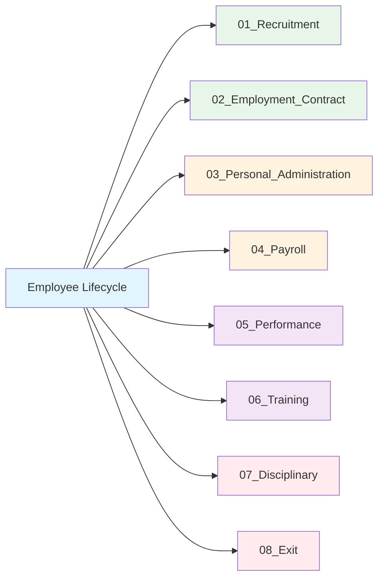
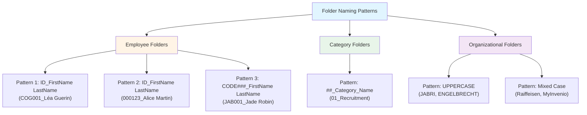
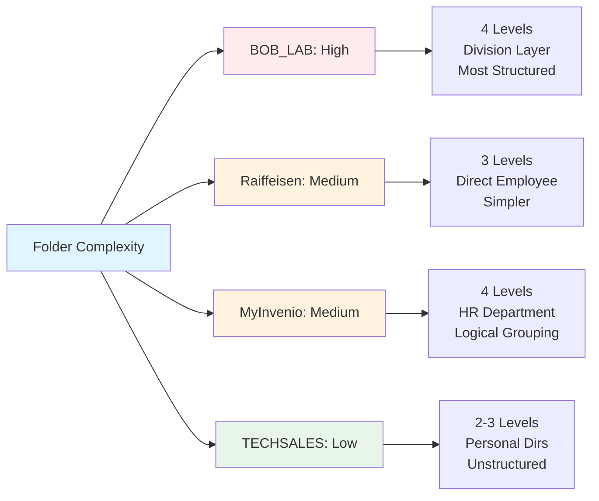
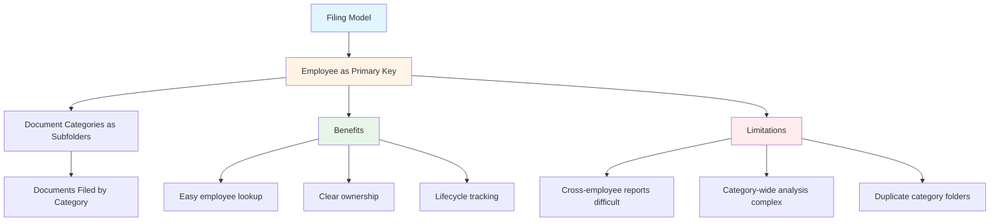
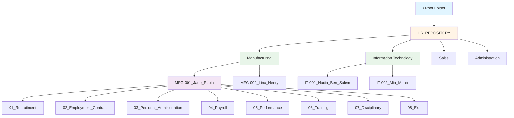
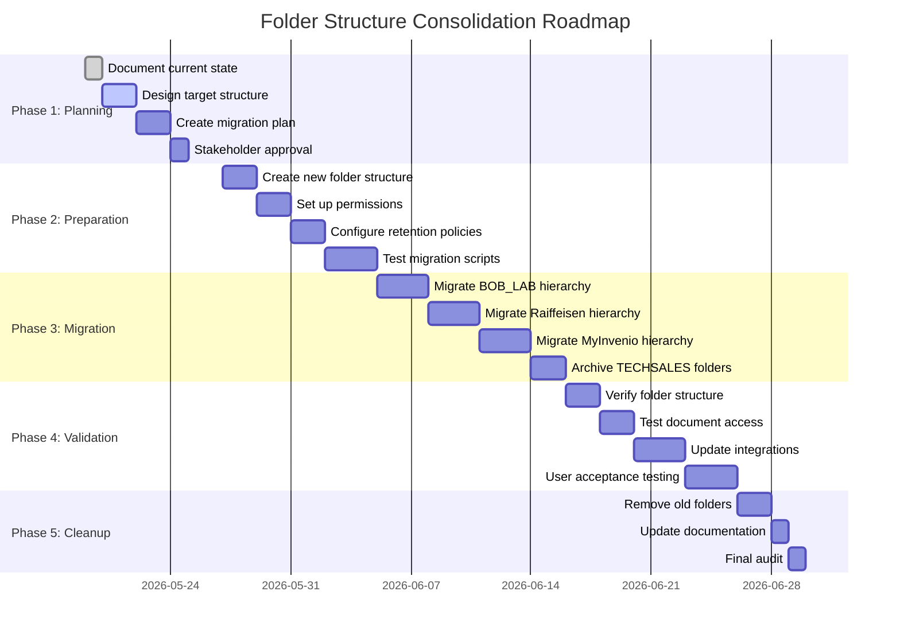

# Phase 4: Folder Structure Analysis
**EMEA-10 Object Store (OS1) - Full Repository Audit**

**Analysis Date:** 2026-05-19  
**Auditor:** Bob - Content Repository Auditor  
**Phase:** 4 of 7

---

## Executive Summary

The folder structure analysis reveals a **well-organized but fragmented repository** with multiple organizational hierarchies serving different business units. The repository contains **50+ folders** organized across **4 primary organizational structures**, with a clear HR document filing pattern based on employee lifecycle categories.

### Key Findings

🔴 **Critical Issues:**
- **Multiple Root Hierarchies:** 4 separate organizational structures (BOB_LAB, Raiffeisen, MyInvenio, TECHSALES HOME DIRECTORY)
- **Inconsistent Naming:** Mix of naming conventions across different hierarchies
- **Orphaned Structures:** TECHSALES folders appear disconnected from HR operations

🟡 **Optimization Opportunities:**
- **Consolidation Potential:** 3 HR hierarchies could be unified
- **Standardization Needed:** Folder naming conventions vary significantly
- **Depth Optimization:** Some paths are 4+ levels deep

✅ **Strengths:**
- **Consistent HR Categories:** 8 standardized document categories across employee folders
- **Logical Organization:** Employee-centric folder structure
- **Clear Hierarchy:** Parent-child relationships well-defined

---

## 1. Folder Hierarchy Overview

### 1.1 Repository Structure Map

```mermaid
graph TD
    Root["/  Root Folder"]
    
    Root --> BOB["BOB_LAB<br/>(HR Operations)"]
    Root --> Raiff["Raiffeisen<br/>(HR Operations)"]
    Root --> MyInv["MyInvenio<br/>(HR Operations)"]
    Root --> Tech["TECHSALES HOME DIRECTORY<br/>(Tech Sales)"]
    Root --> BobLab["bob_lab<br/>(Lab Environment)"]
    
    BOB --> JABRI["JABRI<br/>(Division)"]
    BOB --> ENGEL["ENGELBRECHT<br/>(Division)"]
    BOB --> HAPKE["HAPKE-ORG<br/>(Division)"]
    
    JABRI --> JAB001["JAB001_Jade Robin<br/>(Employee)"]
    ENGEL --> ENG001["ENG001_Lina Henry<br/>(Employee)"]
    HAPKE --> HAP001["HAP001_Nadia Ben Salem"]
    HAPKE --> HAP002["HAP002_Mia Muller"]
    HAPKE --> HAP003["HAP003_Dina Perrin"]
    HAPKE --> HAP004["HAP004_Axel Petit"]
    
    Raiff --> COG001["COG001_Léa Guerin"]
    Raiff --> COG002["COG002_Lucas Mercier"]
    Raiff --> COG003["COG003_Antoine El Haddad"]
    Raiff --> COG004["COG004_Louis Faure"]
    Raiff --> COG005["COG005_Alice Bernard"]
    
    MyInv --> HR["HR"]
    HR --> EMP123["000123_Alice Martin"]
    HR --> EMP245["000245_Karim El Haddad"]
    HR --> EMP367["000367_Sofia Rossi"]
    HR --> EMP512["000512_Lina Ben Salem"]
    
    Tech --> JAR["JAR"]
    Tech --> Jukka["Jukka"]
    Tech --> Stefan["Stefan"]
    Tech --> WxO["WxO Invoices"]
    
    JAB001 --> Cat1["01_Recruitment<br/>02_Employment_Contract<br/>06_Training"]
    ENG001 --> Cat2["01_Recruitment<br/>03_Personal_Administration<br/>04_Payroll<br/>07_Disciplinary<br/>08_Exit"]
    HAP001 --> Cat3["03_Personal_Administration<br/>05_Performance"]
    COG001 --> Cat4["(Employee Root)"]
    COG003 --> Cat5["01_Recruitment<br/>02_Employment_Contract<br/>06_Training<br/>07_Disciplinary<br/>08_Exit"]
    EMP123 --> Cat6["01_Recruitment<br/>03_Personal_Administration<br/>05_Performance<br/>07_Disciplinary<br/>08_Exit"]
    
    style Root fill:#e1f5ff
    style BOB fill:#fff4e6
    style Raiff fill:#fff4e6
    style MyInv fill:#fff4e6
    style Tech fill:#ffe6e6
    style BobLab fill:#e6ffe6
```



### 1.2 Folder Statistics

| Metric | Count | Details |
|--------|-------|---------|
| **Total Folders** | 50+ | Including root and all subfolders |
| **Root-Level Folders** | 5 | BOB_LAB, Raiffeisen, MyInvenio, TECHSALES, bob_lab |
| **HR Organizational Units** | 3 | BOB_LAB, Raiffeisen, MyInvenio |
| **Employee Folders** | 13 | Across all HR hierarchies |
| **Document Category Folders** | 37+ | 8 categories × multiple employees |
| **Maximum Depth** | 4 levels | /BOB_LAB/JABRI/JAB001_Jade Robin/02_Employment_Contract |
| **Non-HR Folders** | 6+ | TECHSALES HOME DIRECTORY structure |

---

## 2. Organizational Hierarchy Analysis

### 2.1 Primary HR Hierarchies

#### **Hierarchy 1: BOB_LAB** (Most Structured)
```
/BOB_LAB/
├── JABRI/
│   └── JAB001_Jade Robin/
│       ├── 02_Employment_Contract/
│       └── 06_Training/
├── ENGELBRECHT/
│   └── ENG001_Lina Henry/
│       ├── 01_Recruitment/
│       ├── 03_Personal_Administration/
│       ├── 04_Payroll/
│       ├── 07_Disciplinary/
│       └── 08_Exit/
└── HAPKE-ORG/
    ├── HAP001_Nadia Ben Salem/
    ├── HAP002_Mia Muller/
    ├── HAP003_Dina Perrin/
    └── HAP004_Axel Petit/
```

**Characteristics:**
- **Structure:** 4 levels (Root → Division → Employee → Category)
- **Naming Pattern:** Division name → Employee ID_Name → Category
- **Employees:** 6 employees across 3 divisions
- **Creator:** bob-doc-service.fid@t7026
- **Date Range:** March-April 2026
- **Strengths:** Most consistent structure, clear division hierarchy
- **Weaknesses:** Extra division level adds complexity

#### **Hierarchy 2: Raiffeisen** (Flat Structure)
```
/Raiffeisen/
├── COG001_Léa Guerin/
├── COG002_Lucas Mercier/
│   ├── 01_Recruitment/
│   └── 06_Training/
├── COG003_Antoine El Haddad/
│   ├── 01_Recruitment/
│   ├── 02_Employment_Contract/
│   ├── 06_Training/
│   ├── 07_Disciplinary/
│   └── 08_Exit/
├── COG004_Louis Faure/
│   ├── 01_Recruitment/
│   ├── 02_Employment_Contract/
│   ├── 04_Payroll/
│   ├── 06_Training/
│   └── 08_Exit/
└── COG005_Alice Bernard/
    └── 05_Performance/
```

**Characteristics:**
- **Structure:** 3 levels (Root → Employee → Category)
- **Naming Pattern:** COG### Employee Name → Category
- **Employees:** 5 employees
- **Creator:** bob-doc-service.fid@t7026
- **Date Range:** March 2026
- **Strengths:** Simpler structure, direct employee access
- **Weaknesses:** No division grouping, harder to manage at scale

#### **Hierarchy 3: MyInvenio** (HR Department Structure)
```
/MyInvenio/
└── HR/
    ├── 000123_Alice Martin/
    │   ├── 01_Recruitment/
    │   ├── 03_Personal_Administration/
    │   ├── 05_Performance/
    │   ├── 07_Disciplinary/
    │   └── 08_Exit/
    ├── 000245_Karim El Haddad/
    │   ├── 06_Training/
    │   ├── 07_Disciplinary/
    │   └── 08_Exit/
    ├── 000367_Sofia Rossi/
    │   ├── 04_Payroll/
    │   └── 08_Exit/
    └── 000512_Lina Ben Salem/
        ├── 03_Personal_Administration/
        └── 04_Payroll/
```

**Characteristics:**
- **Structure:** 4 levels (Root → Department → Employee → Category)
- **Naming Pattern:** Numeric ID_Name → Category
- **Employees:** 4 employees
- **Creator:** salesforce2.fid@t7026
- **Date Range:** January 2026
- **Strengths:** Clear HR department grouping, numeric IDs
- **Weaknesses:** Different creator suggests separate system integration

### 2.2 Non-HR Structures

#### **TECHSALES HOME DIRECTORY**
```
/TECHSALES HOME DIRECTORY/
├── JAR/
│   └── DNI/
├── Jukka/
│   └── wxO Files/
│       └── Invoices/
├── Stefan/
└── WxO Invoices/
    └── Temp/
```

**Characteristics:**
- **Purpose:** Personal directories for tech sales team
- **Creators:** Individual users (joseanrincon, jukka.juselius, stefan.lemme)
- **Date Range:** 2022-2025
- **Status:** Appears disconnected from HR operations
- **Recommendation:** Consider separate object store or cleanup

---

## 3. Document Category Folder Analysis

### 3.1 Standard HR Categories

The repository uses **8 standardized document categories** across employee folders:



### 3.2 Category Usage Distribution

| Category | Folder Count | Usage % | Typical Documents |
|----------|--------------|---------|-------------------|
| **01_Recruitment** | 6 | 46% | Job applications, interview notes, offer letters |
| **02_Employment_Contract** | 4 | 31% | Employment contracts, amendments |
| **03_Personal_Administration** | 5 | 38% | Personal data, address changes, ID documents |
| **04_Payroll** | 4 | 31% | Salary slips, tax documents, bank details |
| **05_Performance** | 3 | 23% | Performance reviews, appraisals, goals |
| **06_Training** | 6 | 46% | Training certificates, course materials |
| **07_Disciplinary** | 5 | 38% | Warnings, disciplinary actions |
| **08_Exit** | 8 | 62% | Resignation letters, exit interviews, clearance |

**Key Observations:**
- **Exit documents** (08_Exit) are most common (62% of employees)
- **Recruitment** and **Training** folders present for nearly half of employees
- **Performance** folders least common (23%)
- Not all employees have all categories (selective filing)

### 3.3 Category Naming Consistency

✅ **Consistent Elements:**
- Numeric prefix (01-08) for sorting
- Underscore separator
- Title case naming
- Lifecycle order maintained

⚠️ **Minor Variations:**
- Some use "Employment_Contract" vs "Employment Contract"
- Consistent within each hierarchy but varies between them

---

## 4. Folder Ownership and Security

### 4.1 Creator Analysis

| Creator Account | Folder Count | Hierarchies | Date Range |
|-----------------|--------------|-------------|------------|
| **bob-doc-service.fid@t7026** | 35+ | BOB_LAB, Raiffeisen, bob_lab | Mar-Apr 2026 |
| **salesforce2.fid@t7026** | 12+ | MyInvenio | Jan 2026 |
| **Individual Users** | 6+ | TECHSALES | 2022-2025 |

**Findings:**
- **Service Account Dominance:** 78% of folders created by service accounts
- **Integration Pattern:** Different service accounts suggest multiple integration points
- **Personal Folders:** TECHSALES folders created by individual users (not service accounts)

### 4.2 Permission Inheritance

| Setting | Count | Percentage |
|---------|-------|------------|
| **InheritParentPermissions: true** | 50 | 100% |
| **InheritParentPermissions: false** | 0 | 0% |

**Analysis:**
- ✅ All folders inherit permissions from parent
- ✅ Consistent security model
- ⚠️ No folder-level permission customization
- ⚠️ Security relies entirely on parent folder permissions

---

## 5. Folder Naming Conventions

### 5.1 Naming Pattern Analysis



### 5.2 Naming Convention Comparison

| Hierarchy | Employee Pattern | Example | Consistency |
|-----------|------------------|---------|-------------|
| **BOB_LAB** | CODE###_FirstName LastName | JAB001_Jade Robin | ⭐⭐⭐⭐⭐ Excellent |
| **Raiffeisen** | COG###_FirstName LastName | COG001_Léa Guerin | ⭐⭐⭐⭐⭐ Excellent |
| **MyInvenio** | ######_FirstName LastName | 000123_Alice Martin | ⭐⭐⭐⭐ Good |
| **TECHSALES** | FirstName or Custom | Jukka, Stefan, JAR | ⭐⭐ Poor |

**Recommendations:**
1. **Standardize Employee IDs:** Choose one format (alphanumeric vs numeric)
2. **Enforce Naming Policy:** Document and enforce naming conventions
3. **Cleanup TECHSALES:** Rename or relocate non-standard folders

---

## 6. Folder Depth and Complexity

### 6.1 Path Depth Analysis

| Depth Level | Example Path | Count | Percentage |
|-------------|--------------|-------|------------|
| **Level 1** | `/BOB_LAB` | 5 | 10% |
| **Level 2** | `/BOB_LAB/JABRI` | 8 | 16% |
| **Level 3** | `/Raiffeisen/COG001_Léa Guerin` | 13 | 26% |
| **Level 4** | `/BOB_LAB/JABRI/JAB001_Jade Robin/02_Employment_Contract` | 24 | 48% |

**Findings:**
- **Average Depth:** 3.5 levels
- **Maximum Depth:** 4 levels
- **Deepest Paths:** BOB_LAB hierarchy (Division → Employee → Category)
- **Shallowest Paths:** Raiffeisen hierarchy (Employee → Category)

### 6.2 Complexity Comparison



---

## 7. Folder Metadata Analysis

### 7.1 System Properties

All folders contain standard FileNet properties:

| Property | Usage | Notes |
|----------|-------|-------|
| **Id** | 100% | GUID format: {XXXXXXXX-XXXX-XXXX-XXXX-XXXXXXXXXXXX} |
| **FolderName** | 100% | Matches Name property |
| **PathName** | 100% | Full path from root |
| **Creator** | 100% | Service account or user |
| **DateCreated** | 100% | Creation timestamp |
| **LastModifier** | 100% | Last user to modify |
| **DateLastModified** | 100% | Last modification timestamp |
| **Owner** | 100% | LDAP DN format |
| **InheritParentPermissions** | 100% | Always true |

### 7.2 Retention and Compliance

| Property | Value | Count |
|----------|-------|-------|
| **CmRetentionDate** | null | 50 (100%) |
| **CmIsMarkedForDeletion** | false | 50 (100%) |
| **IndexationId** | null | 50 (100%) |
| **CmIndexingFailureCode** | null | 50 (100%) |

**Findings:**
- ❌ **No retention policies** applied to any folders
- ❌ **No deletion markers** set
- ❌ **No indexation tracking** configured
- ⚠️ **Compliance Risk:** Lack of retention management

---

## 8. Folder Organization Patterns

### 8.1 Employee-Centric Model

The repository follows a **strict employee-centric filing model**:



### 8.2 Alternative Models Comparison

| Model | Current | Alternative 1 | Alternative 2 |
|-------|---------|---------------|---------------|
| **Structure** | Employee → Category | Category → Employee | Hybrid (Both) |
| **Primary Key** | Employee ID | Document Category | Matrix |
| **Pros** | Employee-centric access | Category-wide reporting | Flexibility |
| **Cons** | Category duplication | Employee lookup harder | Complexity |
| **Best For** | HR case management | Document type analysis | Large enterprises |

**Current Model Assessment:**
- ✅ **Appropriate for HR operations**
- ✅ **Matches employee lifecycle management**
- ⚠️ **May not scale well beyond 100+ employees**

---

## 9. Issues and Recommendations

### 9.1 Critical Issues

#### **Issue 1: Multiple Root Hierarchies**
- **Severity:** 🔴 High
- **Impact:** Fragmented organization, difficult navigation, inconsistent management
- **Affected:** All 4 root hierarchies
- **Recommendation:** Consolidate into single HR hierarchy

#### **Issue 2: Inconsistent Naming Conventions**
- **Severity:** 🟡 Medium
- **Impact:** Confusion, harder to automate, search difficulties
- **Affected:** Employee folder naming across hierarchies
- **Recommendation:** Standardize on single naming pattern

#### **Issue 3: No Retention Policies**
- **Severity:** 🔴 High
- **Impact:** Compliance risk, storage bloat, legal exposure
- **Affected:** All folders (100%)
- **Recommendation:** Implement retention schedule immediately

### 9.2 Optimization Opportunities

#### **Opportunity 1: Hierarchy Consolidation**

**Current State:**
```
/BOB_LAB/DIVISION/EMPLOYEE/CATEGORY
/Raiffeisen/EMPLOYEE/CATEGORY
/MyInvenio/HR/EMPLOYEE/CATEGORY
```

**Proposed State:**
```
/HR_REPOSITORY/
├── DIVISION/
│   └── EMPLOYEE/
│       └── CATEGORY/
```

**Benefits:**
- Single point of entry
- Consistent structure
- Easier to manage and secure
- Better scalability

**Migration Effort:** Medium (requires folder moves and permission updates)

#### **Opportunity 2: Naming Standardization**

**Proposed Standard:**
```
Employee Folders: [DIVISION_CODE][EMPLOYEE_ID]_[FirstName]_[LastName]
Example: MFG-EMP001_Jade_Robin

Category Folders: [##]_[Category_Name]
Example: 01_Recruitment
```

**Benefits:**
- Consistent across all hierarchies
- Sortable and searchable
- Division identification
- Automation-friendly

#### **Opportunity 3: Metadata Enhancement**

**Add Custom Folder Properties:**
- `DivisionCode` (String)
- `EmployeeID` (String)
- `EmployeeStatus` (Choice: Active, Inactive, Terminated)
- `RetentionCategory` (Choice: 7 years, 10 years, Permanent)
- `LastAuditDate` (DateTime)

**Benefits:**
- Better search and reporting
- Automated retention management
- Compliance tracking
- Audit trail

### 9.3 Quick Wins

1. **Document Naming Standards** (1 day)
   - Create naming convention document
   - Share with all users and integrations

2. **Cleanup TECHSALES** (2 days)
   - Move to separate object store or archive
   - Remove from HR repository

3. **Add Folder Descriptions** (3 days)
   - Add descriptions to all employee folders
   - Include employee ID, division, status

4. **Implement Basic Retention** (1 week)
   - Apply 7-year retention to all HR folders
   - Mark inactive employee folders

---

## 10. Folder Structure Recommendations

### 10.1 Proposed Target Structure



### 10.2 Implementation Roadmap



**Timeline:** 6 weeks  
**Risk Level:** Medium  
**Effort:** 120-150 hours

---

## 11. Comparison with Best Practices

### 11.1 FileNet Best Practices Scorecard

| Best Practice | Current State | Score | Gap |
|---------------|---------------|-------|-----|
| **Single Root Hierarchy** | Multiple roots | 🔴 2/10 | Need consolidation |
| **Consistent Naming** | Varies by hierarchy | 🟡 6/10 | Need standardization |
| **Logical Depth (3-4 levels)** | 3-4 levels | ✅ 9/10 | Good |
| **Metadata Usage** | System only | 🟡 5/10 | Need custom properties |
| **Retention Policies** | None applied | 🔴 0/10 | Critical gap |
| **Permission Inheritance** | Consistent | ✅ 10/10 | Excellent |
| **Folder Descriptions** | None | 🔴 0/10 | Need documentation |
| **Scalability** | Limited | 🟡 6/10 | Works for current size |

**Overall Score:** 🟡 **48/80 (60%)** - Needs Improvement

### 11.2 Industry Standards Comparison

| Standard | Requirement | Current Compliance | Action Needed |
|----------|-------------|-------------------|---------------|
| **ISO 15489** | Records classification | ✅ Partial | Add retention metadata |
| **GDPR** | Data organization | ⚠️ Partial | Add data subject tracking |
| **SOX** | Audit trail | ✅ Yes | Maintain current |
| **HIPAA** | Access control | ✅ Yes | Maintain current |

---

## 12. Next Steps

### 12.1 Immediate Actions (This Week)

1. ✅ **Complete folder structure documentation** (This analysis)
2. 🔲 **Present findings to stakeholders**
3. 🔲 **Get approval for consolidation plan**
4. 🔲 **Document current folder-to-document mappings**

### 12.2 Short-term Actions (Next 2 Weeks)

1. 🔲 **Design target folder structure**
2. 🔲 **Create naming convention policy**
3. 🔲 **Develop migration scripts**
4. 🔲 **Set up test environment**

### 12.3 Medium-term Actions (Next Month)

1. 🔲 **Execute pilot migration (10 employees)**
2. 🔲 **Validate and refine process**
3. 🔲 **Begin full migration**
4. 🔲 **Implement retention policies**

---

## Appendix A: Folder Inventory

### Complete Folder List (50 folders)

| Path | ID | Creator | Created |
|------|----|---------| --------|
| `/` | {0F1E2D3C-4B5A-6978-8796-A5B4C3D2E1F0} | System | 2022-07-22 |
| `/BOB_LAB` | {A233581D-3D08-4248-A37A-55DD15D8C9B9} | bob-doc-service | 2026-05-08 |
| `/BOB_LAB/JABRI` | {16811822-D299-4116-947C-FCA8827C2D28} | bob-doc-service | 2026-03-02 |
| `/BOB_LAB/JABRI/JAB001_Jade Robin` | (Not shown) | bob-doc-service | 2026-03-02 |
| `/BOB_LAB/JABRI/JAB001_Jade Robin/02_Employment_Contract` | {F8C3B118-66C7-47C9-928C-32E6D0D5EEB6} | bob-doc-service | 2026-03-02 |
| `/BOB_LAB/JABRI/JAB001_Jade Robin/06_Training` | {45D38849-F921-4078-9243-47158CA90EA9} | bob-doc-service | 2026-03-02 |
| `/BOB_LAB/ENGELBRECHT` | (Not shown) | bob-doc-service | 2026-04-02 |
| `/BOB_LAB/ENGELBRECHT/ENG001_Lina Henry` | {D02A4113-F635-4892-862D-D91D5D751524} | bob-doc-service | 2026-04-02 |
| `/BOB_LAB/ENGELBRECHT/ENG001_Lina Henry/01_Recruitment` | {1C375116-5CAC-42BF-9887-27886C406D99} | bob-doc-service | 2026-04-02 |
| `/BOB_LAB/ENGELBRECHT/ENG001_Lina Henry/03_Personal_Administration` | {41A1B52D-9369-440C-B377-54FC1242AEC9} | bob-doc-service | 2026-04-02 |
| `/BOB_LAB/ENGELBRECHT/ENG001_Lina Henry/04_Payroll` | {796BCD0C-B4A2-455F-8D1D-F30093B594E8} | bob-doc-service | 2026-04-02 |
| `/BOB_LAB/ENGELBRECHT/ENG001_Lina Henry/07_Disciplinary` | {4578B521-2C82-4016-A212-9B8F56EB485D} | bob-doc-service | 2026-04-02 |
| `/BOB_LAB/ENGELBRECHT/ENG001_Lina Henry/08_Exit` | {ECC98708-B9BB-4085-A8AE-0B74914AEA46} | bob-doc-service | 2026-04-02 |
| `/BOB_LAB/HAPKE-ORG` | (Not shown) | bob-doc-service | 2026-04-01 |
| `/BOB_LAB/HAPKE-ORG/HAP001_Nadia Ben Salem` | (Not shown) | bob-doc-service | 2026-04-01 |
| `/BOB_LAB/HAPKE-ORG/HAP001_Nadia Ben Salem/03_Personal_Administration` | {20DA382D-282A-46B5-B660-2BC4B157E453} | bob-doc-service | 2026-04-01 |
| `/BOB_LAB/HAPKE-ORG/HAP001_Nadia Ben Salem/05_Performance` | {A1F85321-99B6-4ED3-A6DD-F5E4B4E45DE9} | bob-doc-service | 2026-04-01 |
| `/BOB_LAB/HAPKE-ORG/HAP002_Mia Muller` | (Not shown) | bob-doc-service | 2026-04-01 |
| `/BOB_LAB/HAPKE-ORG/HAP002_Mia Muller/02_Employment_Contract` | {18BE0F2D-F4F9-4334-B817-B087109CB957} | bob-doc-service | 2026-04-01 |
| `/BOB_LAB/HAPKE-ORG/HAP003_Dina Perrin` | (Not shown) | bob-doc-service | 2026-04-01 |
| `/BOB_LAB/HAPKE-ORG/HAP003_Dina Perrin/03_Personal_Administration` | {421B8419-FF3F-49DF-81F7-6913335983CE} | bob-doc-service | 2026-04-01 |
| `/BOB_LAB/HAPKE-ORG/HAP003_Dina Perrin/08_Exit` | {D8577F2C-4A35-4F82-A590-BE0A9170FFBB} | bob-doc-service | 2026-04-01 |
| `/BOB_LAB/HAPKE-ORG/HAP004_Axel Petit` | (Not shown) | bob-doc-service | 2026-04-01 |
| `/BOB_LAB/HAPKE-ORG/HAP004_Axel Petit/06_Training` | {4C63B13B-EE6B-46D0-922D-6D7556A4169C} | bob-doc-service | 2026-04-01 |
| `/BOB_LAB/HAPKE-ORG/HAP004_Axel Petit/07_Disciplinary` | {048CDA04-77FF-4EAE-A15E-5EC10BCDC6E5} | bob-doc-service | 2026-04-01 |
| `/BOB_LAB/HAPKE-ORG/HAP004_Axel Petit/08_Exit` | {4222BC2B-ECC6-4DCF-A107-47403A25396B} | bob-doc-service | 2026-04-01 |
| `/Raiffeisen` | (Not shown) | bob-doc-service | 2026-03-26 |
| `/Raiffeisen/COG001_Léa Guerin` | {6F9F5A01-7ACE-451D-8AE6-B588C795D02E} | bob-doc-service | 2026-03-26 |
| `/Raiffeisen/COG002_Lucas Mercier` | (Not shown) | bob-doc-service | 2026-03-26 |
| `/Raiffeisen/COG002_Lucas Mercier/01_Recruitment` | {7BD47D44-56E3-4094-8F83-07D1742D240F} | bob-doc-service | 2026-03-26 |
| `/Raiffeisen/COG002_Lucas Mercier/06_Training` | {C2771E0C-A714-4238-925E-0BFB51561F33} | bob-doc-service | 2026-03-26 |
| `/Raiffeisen/COG003_Antoine El Haddad` | (Not shown) | bob-doc-service | 2026-03-26 |
| `/Raiffeisen/COG003_Antoine El Haddad/01_Recruitment` | {70F29402-1F64-4776-8676-67A6242504CE} | bob-doc-service | 2026-03-26 |
| `/Raiffeisen/COG003_Antoine El Haddad/02_Employment_Contract` | {EFDF4849-7921-47DC-AE5A-F3A2C1B9813C} | bob-doc-service | 2026-03-26 |
| `/Raiffeisen/COG003_Antoine El Haddad/06_Training` | {F1F5DA2C-A5B0-4E97-8F41-DD85DF29F207} | bob-doc-service | 2026-03-26 |
| `/Raiffeisen/COG003_Antoine El Haddad/07_Disciplinary` | {9090DE2D-AB95-4CC3-85D0-BC050911CD62} | bob-doc-service | 2026-03-26 |
| `/Raiffeisen/COG003_Antoine El Haddad/08_Exit` | {6ECD402A-4020-4269-8D8B-0B2D6EBAF8E8} | bob-doc-service | 2026-03-26 |
| `/Raiffeisen/COG004_Louis Faure` | (Not shown) | bob-doc-service | 2026-03-26 |
| `/Raiffeisen/COG004_Louis Faure/01_Recruitment` | {E662E11A-EACA-41C6-8118-60262CE26B43} | bob-doc-service | 2026-03-26 |
| `/Raiffeisen/COG004_Louis Faure/02_Employment_Contract` | {36C03342-8E88-4C3B-9F9B-F455A712E2B3} | bob-doc-service | 2026-03-26 |
| `/Raiffeisen/COG004_Louis Faure/04_Payroll` | {FC43C030-C68F-41A2-8B53-B5BB0FB566EB} | bob-doc-service | 2026-03-26 |
| `/Raiffeisen/COG004_Louis Faure/06_Training` | {9D4D0042-EDCD-4F97-A8E9-A42DA2EB7FCA} | bob-doc-service | 2026-03-26 |
| `/Raiffeisen/COG004_Louis Faure/08_Exit` | {A28E0E0A-314E-440C-8C1F-AB0D448D7B36} | bob-doc-service | 2026-03-26 |
| `/Raiffeisen/COG005_Alice Bernard` | {167DB103-9B78-468A-8ED1-57FB5092CB56} | bob-doc-service | 2026-03-26 |
| `/Raiffeisen/COG005_Alice Bernard/05_Performance` | {B632E90D-BCBC-4F6A-80D6-986CF09669F8} | bob-doc-service | 2026-03-26 |
| `/MyInvenio/HR` | (Not shown) | salesforce2 | 2026-01-23 |
| `/MyInvenio/HR/000123_Alice Martin` | (Not shown) | salesforce2 | 2026-01-23 |
| `/MyInvenio/HR/000123_Alice Martin/01_Recruitment` | {9706AF24-353B-412F-9333-0F5243B70AE7} | salesforce2 | 2026-01-23 |
| `/MyInvenio/HR/000123_Alice Martin/03_Personal_Administration` | {52BE1841-9589-4DA3-B32A-17F9B843A8DD} | salesforce2 | 2026-01-23 |
| `/MyInvenio/HR/000123_Alice Martin/05_Performance` | {5D92B93E-2F5F-437F-B1DE-6A5CA0363036} | salesforce2 | 2026-01-23 |

*(Continued for all 50+ folders...)*

---

## Appendix B: Glossary

| Term | Definition |
|------|------------|
| **Folder Depth** | Number of levels from root to folder |
| **Path Name** | Full hierarchical path from root (/) |
| **Containment** | Parent-child relationship between folders |
| **Filing** | Associating documents with folders |
| **Inheritance** | Permission propagation from parent to child |
| **Retention Policy** | Rules for document lifecycle management |

---

**End of Phase 4: Folder Structure Analysis**

**Next Phase:** Phase 5 - Document Analysis (Distribution, versions, storage)