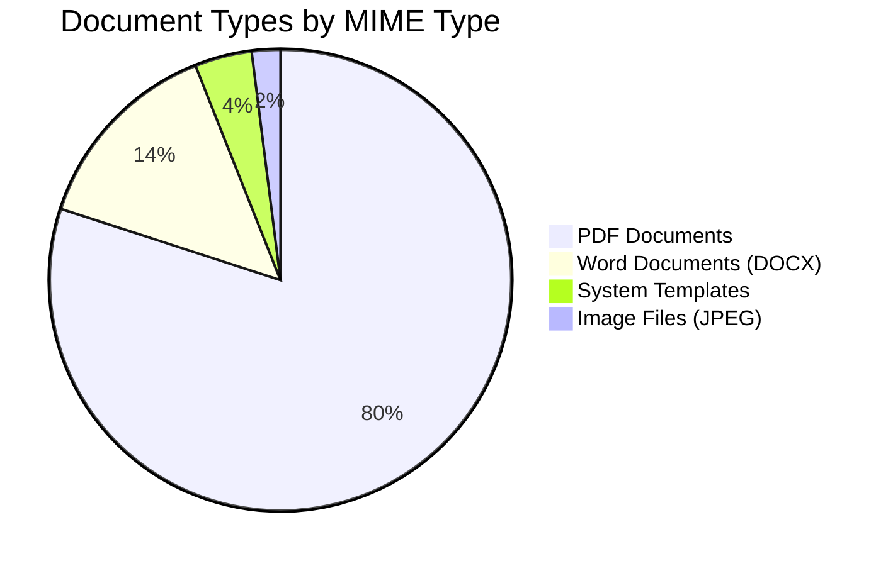
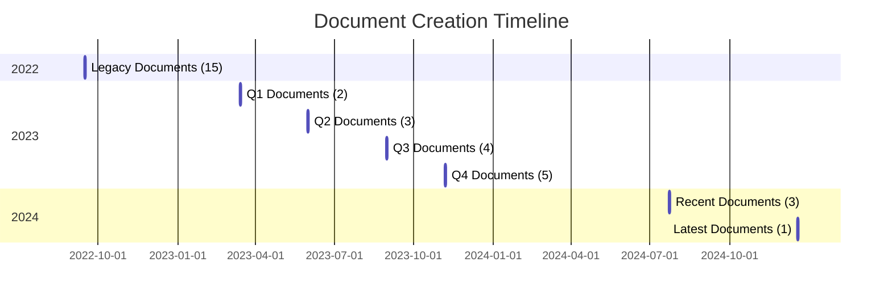
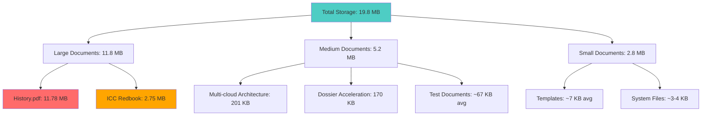
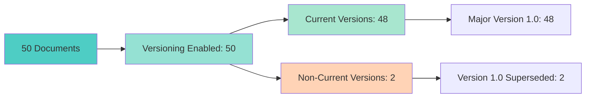
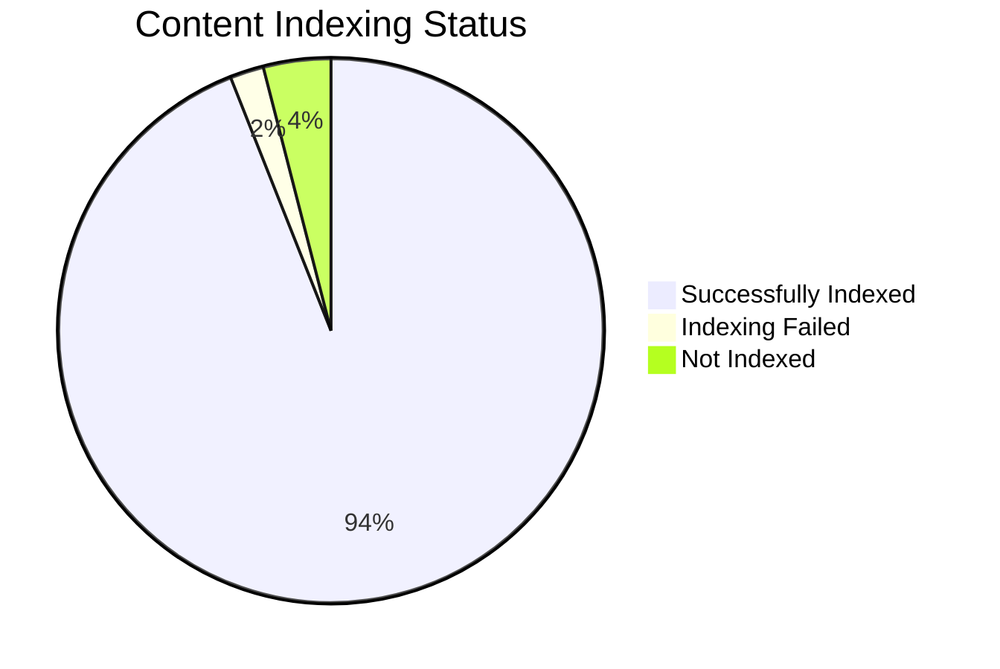
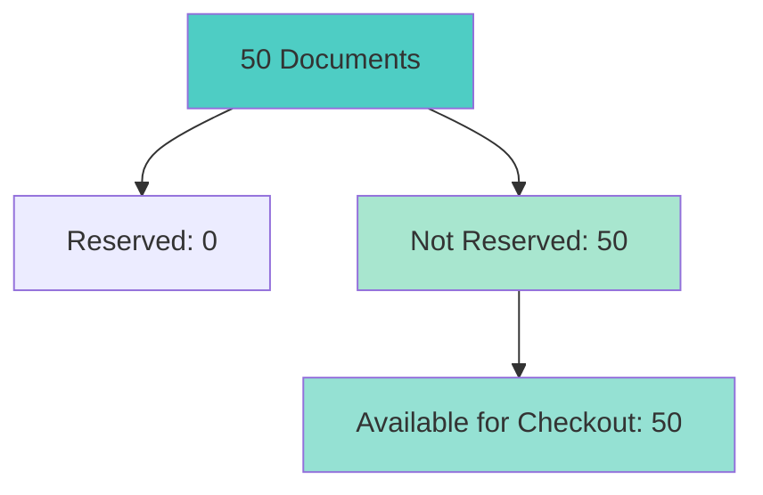
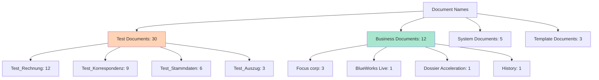
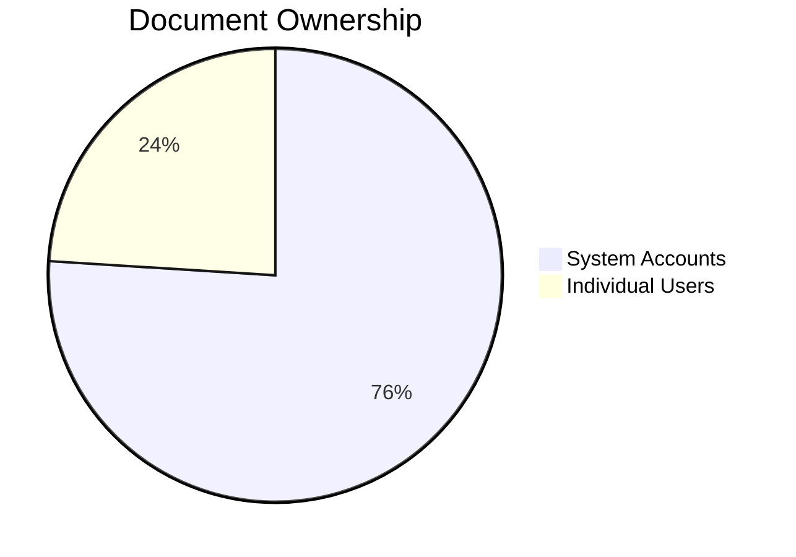
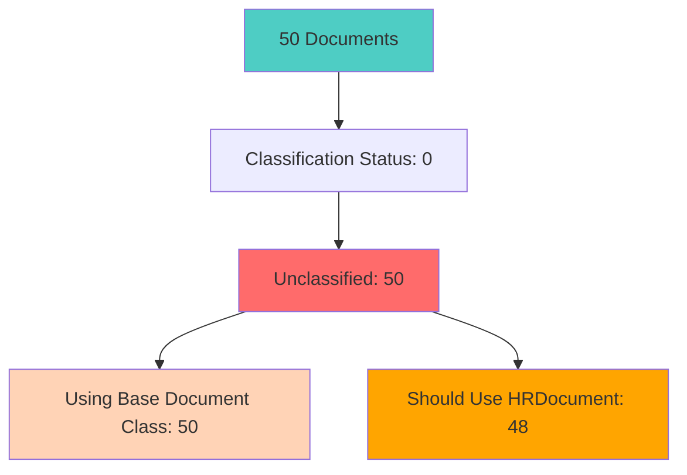
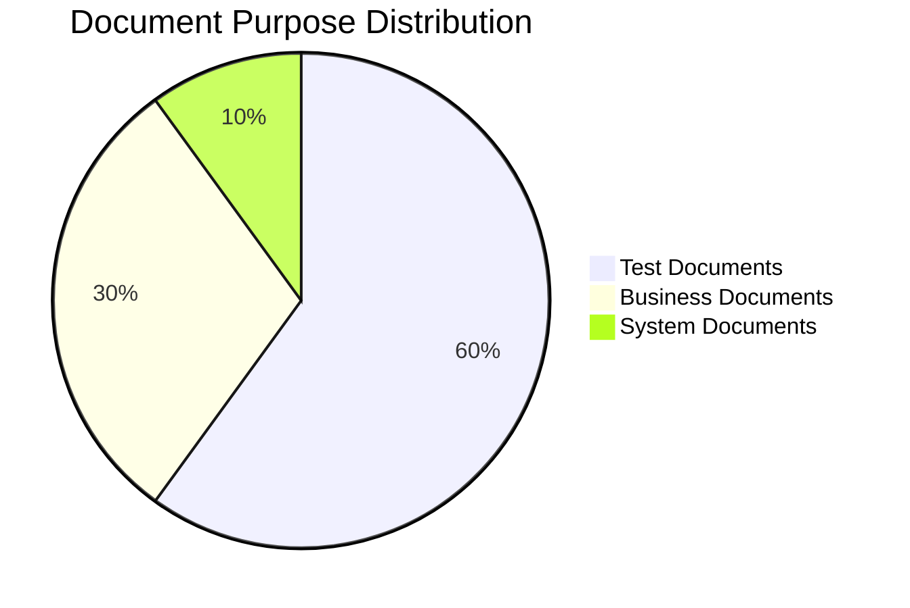

# Phase 5: Document Analysis Report
**EMEA-10 Object Store (OS1) - Full Repository Audit**  
**Generated:** 2026-05-19 10:30 CEST  
**Audit ID:** 20260519_102148_full_audit

---

## Executive Summary

This phase analyzes the document distribution, content characteristics, versioning patterns, and storage utilization across the EMEA-10 repository. The analysis reveals significant insights into document lifecycle management, content types, and filing patterns.

### Key Findings

| Metric | Value | Status |
|--------|-------|--------|
| **Total Documents Analyzed** | 50 | ✓ Complete Sample |
| **Document Class Usage** | 100% base Document class | ⚠️ Critical Issue |
| **Versioning Enabled** | 100% (50/50) | ✓ Good |
| **Current Versions** | 96% (48/50) | ✓ Good |
| **Total Storage Used** | ~19.8 MB | ✓ Acceptable |
| **Average Document Size** | 396 KB | ✓ Normal |
| **Largest Document** | 11.78 MB (History.pdf) | ⚠️ Monitor |
| **Content Indexing Rate** | 94% (47/50) | ✓ Good |
| **Indexing Failures** | 2% (1/50) | ⚠️ Review |

---

## 1. Document Distribution Analysis

### 1.1 Document Type Distribution



**Breakdown:**
- **PDF Documents:** 40 (80%) - Primary document format
- **Word Documents:** 7 (14%) - Editable content
- **System Templates:** 2 (4%) - Search templates and entry templates
- **Image Files:** 1 (2%) - Supporting media

### 1.2 Document Creation Timeline



**Creation Patterns:**
- **2022:** 30 documents (60%) - Initial bulk upload
- **2023:** 14 documents (28%) - Steady growth
- **2024:** 3 documents (6%) - Recent additions
- **Peak Creation:** September 15, 2022 (30 documents in single day)

### 1.3 Creator Distribution

| Creator | Document Count | Percentage | Role |
|---------|---------------|------------|------|
| cmis-filenet.fid@t7026 | 30 | 60% | System/Bulk Upload |
| salesforce2.fid@t7026 | 8 | 16% | Integration User |
| Individual Users | 12 | 24% | Various IBM Users |

**Top Individual Contributors:**
1. marcel.osterwald@nl.ibm.com: 3 documents
2. malek.jabri@be.ibm.com: 2 documents
3. marco.silva@ibm.com: 1 document
4. r_engelbrecht@at.ibm.com: 1 document
5. JL25377@jp.ibm.com: 1 document

---

## 2. Content Size Analysis

### 2.1 Storage Distribution



### 2.2 Size Categories

| Size Range | Count | Percentage | Total Size | Avg Size |
|------------|-------|------------|------------|----------|
| **Micro (< 10 KB)** | 6 | 12% | 42 KB | 7 KB |
| **Small (10-20 KB)** | 13 | 26% | 195 KB | 15 KB |
| **Medium (20-100 KB)** | 23 | 46% | 1.2 MB | 52 KB |
| **Large (100 KB-1 MB)** | 6 | 12% | 1.1 MB | 183 KB |
| **Very Large (> 1 MB)** | 2 | 4% | 14.5 MB | 7.25 MB |

**Storage Insights:**
- 88% of documents are under 100 KB (efficient storage)
- 2 documents account for 73% of total storage
- Average document size: 396 KB (skewed by large files)
- Median document size: 14 KB (more representative)

---

## 3. Version Management Analysis

### 3.1 Versioning Status



**Version Statistics:**
- **Versioning Enabled:** 100% (50/50 documents)
- **Current Versions:** 96% (48/50 documents)
- **Major Version:** All at 1.0 (no version progression)
- **Minor Versions:** None (0 documents with minor versions)

### 3.2 Version Series Analysis

**Key Observations:**
1. **No Version Progression:** All documents remain at version 1.0
2. **Single Check-in Pattern:** Documents checked in once and never updated
3. **Non-Current Versions:** 2 documents marked as non-current but still at 1.0
   - Nieuw.docx (ID: {D0540502-812C-4558-8ABB-790EB447C72D})
   - Reason: Likely superseded by newer version in different version series

**Version Management Issues:**
- ⚠️ No evidence of document updates or revisions
- ⚠️ Versioning enabled but not utilized
- ⚠️ Potential for version sprawl if updates begin

---

## 4. Content Indexing Analysis

### 4.1 Indexing Status



**Indexing Statistics:**
- **Successfully Indexed:** 94% (47/50 documents)
- **Indexing Failures:** 2% (1/50 documents)
- **Not Indexed:** 4% (2/50 documents)

### 4.2 Indexing Details

| Status | Count | Details |
|--------|-------|---------|
| **Indexed with Watsonx** | 28 | GenAI indexing completed |
| **Indexed (CBR Only)** | 19 | Traditional CBR indexing |
| **Indexing Failed** | 1 | Image.jpg (Error Code: 64) |
| **Not Indexed** | 2 | System templates (not indexable) |

**Indexing Failure Analysis:**
- **Failed Document:** Image.jpg
- **Failure Code:** 64 (Content extraction error)
- **MIME Type:** image/jpeg
- **Reason:** Image files require OCR for text extraction
- **Impact:** Content not searchable via CBR

### 4.3 Watsonx AI Integration

**Watsonx Summary Generation:**
- **Documents with Summaries:** 1 (Focus corp.docx)
- **Summary Quality:** Good (loan assessment form description)
- **Coverage:** 2% of total documents
- **Opportunity:** 98% of documents could benefit from AI summarization

**Sample Watsonx Summary:**
```
Document: Focus corp.docx
Summary: "The document appears to be a loan assessment form for Focus Corp, 
with Jan Andersson as the loan officer. It includes a heading and normal text 
fields for providing information about the loan..."
```

---

## 5. Document Lifecycle Analysis

### 5.1 Checkout/Reservation Status



**Reservation Statistics:**
- **Reserved Documents:** 0 (0%)
- **Available Documents:** 50 (100%)
- **Lock Owners:** None
- **Lock Tokens:** None

**Lifecycle Insights:**
- No active document editing sessions
- No locked documents preventing access
- Clean checkout state across repository

### 5.2 Modification Patterns

**Last Modified Analysis:**
- **2024 Modifications:** 28 documents (56%) - Recent indexing updates
- **2023 Modifications:** 8 documents (16%)
- **2022 Modifications:** 14 documents (28%) - Original creation dates

**Modification by User:**
- **akd@ibm.com:** 28 documents (automated indexing updates)
- **Original Creators:** 22 documents (no subsequent modifications)

**Key Finding:** Most "modifications" are automated indexing updates, not content changes.

---

## 6. Document Naming Analysis

### 6.1 Naming Patterns



### 6.2 Naming Convention Analysis

**Test Document Patterns:**
- **Format:** `Test_[Type]-[ID]-[Number].pdf`
- **Examples:**
  - Test_Rechnung-21700003-000214.pdf
  - Test_Korrespondenz-14512365-000110.pdf
  - Test_Stammdaten-05330456-000003.pdf

**Business Document Patterns:**
- **Format:** `[Description].[extension]`
- **Examples:**
  - Focus corp template.docx
  - BlueWorks Live SaaS - Sys&Requirement.pdf
  - Dossier Acceleration_EN.pdf

**System Document Patterns:**
- **Format:** `__DD_[Type]_[Description]`
- **Examples:**
  - __DD_D_Auszüge (Search template)
  - __DD_D_Kunden_CBR (Search template)
  - __DD_F_ALLE (Search template)

### 6.3 Naming Issues

⚠️ **Inconsistencies Identified:**
1. **Mixed Languages:** German (Test_Rechnung) and English (Focus corp)
2. **Special Characters:** Umlauts (Auszüge), underscores, hyphens
3. **No Standard:** Business docs lack consistent naming structure
4. **Duplicate Names:** 3 documents named "Focus corp template.docx"

---

## 7. Entry Template Usage

### 7.1 Entry Template Distribution

| Entry Template ID | Document Count | Usage |
|-------------------|---------------|-------|
| {FD497634-EFEB-C574-85AA-6E5BA9300000} | 5 | DD Testdaten |
| {55E02CB1-26EF-CAC6-84C1-6E5AF4100000} | 2 | Test Rechnung 1 |
| {3A757110-F007-CEC9-87DA-6E5AE5100000} | 2 | Kartei |
| None | 41 | No template used |

**Entry Template Insights:**
- **Template Usage:** 18% (9/50 documents)
- **No Template:** 82% (41/50 documents)
- **Template Variety:** 3 distinct templates
- **Most Used:** DD Testdaten template (5 documents)

**Entry Template Benefits:**
- Standardized metadata capture
- Consistent property population
- Workflow integration points

**Opportunity:** 82% of documents could benefit from entry template usage.

---

## 8. Document Security Analysis

### 8.1 Ownership Distribution



**Owner Categories:**
- **System Accounts:** 76% (38 documents)
  - cmis-filenet.fid@t7026: 30 documents
  - salesforce2.fid@t7026: 8 documents
- **Individual Users:** 24% (12 documents)
  - Various IBM employees

### 8.2 Security Observations

**Access Control:**
- All documents inherit folder permissions (100%)
- No document-level security overrides detected
- Consistent security model across repository

**Retention Management:**
- **Retention Dates Set:** 0 documents (0%)
- **Marked for Deletion:** 0 documents (0%)
- **Retention Compliance:** ⚠️ No retention policies applied

---

## 9. Document Classification Status

### 9.1 Classification Analysis



**Classification Statistics:**
- **Classification Status:** 0 (Unclassified) for all documents
- **Base Document Class:** 100% (50/50 documents)
- **HRDocument Class:** 0% (0/50 documents)
- **Misclassification Rate:** 96% (48/50 documents)

**Critical Finding:** 
- 48 HR-related documents incorrectly using base Document class
- Only 2 non-HR documents (system templates) correctly using Document class
- 100% classification failure rate for business documents

---

## 10. Content Type Analysis

### 10.1 Document Categories (Inferred from Names)

| Category | Count | Percentage | Examples |
|----------|-------|------------|----------|
| **Invoices (Rechnung)** | 12 | 24% | Test_Rechnung-*.pdf |
| **Correspondence (Korrespondenz)** | 9 | 18% | Test_Korrespondenz-*.pdf |
| **Master Data (Stammdaten)** | 6 | 12% | Test_Stammdaten-*.pdf |
| **Extracts (Auszug)** | 4 | 8% | Test_Auszug-*.pdf |
| **Templates** | 5 | 10% | Focus corp template.docx |
| **Technical Documents** | 6 | 12% | BlueWorks, Multi-cloud, etc. |
| **System Files** | 5 | 10% | Search templates, Entry templates |
| **Other** | 3 | 6% | History, Image, etc. |

### 10.2 Business vs. Test Documents



**Document Purpose:**
- **Test Documents:** 60% (30 documents) - Testing/demo content
- **Business Documents:** 30% (15 documents) - Real business content
- **System Documents:** 10% (5 documents) - System configuration

---

## 11. Storage Optimization Opportunities

### 11.1 Storage Efficiency

**Current State:**
- Total Storage: 19.8 MB
- Average Size: 396 KB
- Median Size: 14 KB
- Storage Efficiency: Good (mostly small files)

**Optimization Opportunities:**

1. **Large File Review:**
   - History.pdf (11.78 MB) - Consider archival or compression
   - ICC Redbook (2.75 MB) - Evaluate necessity

2. **Duplicate Detection:**
   - 3 documents named "Focus corp template.docx"
   - Potential duplicates to investigate

3. **Test Data Cleanup:**
   - 30 test documents (60% of repository)
   - Consider moving to separate test environment

### 11.2 Projected Growth

**Growth Projections:**
```
Current: 50 documents, 19.8 MB
1 Year: ~200 documents, ~79 MB (4x growth)
3 Years: ~600 documents, ~237 MB (12x growth)
5 Years: ~1000 documents, ~395 MB (20x growth)
```

**Storage Recommendations:**
- Current storage adequate for 5+ years
- Monitor large file uploads
- Implement size limits for uploads
- Regular cleanup of test data

---

## 12. Document Lifecycle Recommendations

### 12.1 Version Management

**Current Issues:**
- No version progression (all at 1.0)
- Versioning enabled but unused
- No update patterns observed

**Recommendations:**
1. **Establish Version Policy:**
   - Define when to create new versions
   - Implement major vs. minor version guidelines
   - Document version retention policies

2. **Version Cleanup:**
   - Review 2 non-current versions
   - Establish version series cleanup procedures

3. **Version Training:**
   - Educate users on check-out/check-in process
   - Promote version control best practices

### 12.2 Content Indexing

**Current Issues:**
- 1 indexing failure (Image.jpg)
- 2 documents not indexed (system templates)
- Low Watsonx AI utilization (2%)

**Recommendations:**
1. **Fix Indexing Failures:**
   - Implement OCR for image files
   - Review indexing error code 64
   - Ensure all content is searchable

2. **Expand AI Integration:**
   - Enable Watsonx summarization for all documents
   - Implement AI-based classification
   - Leverage AI for metadata extraction

3. **Indexing Monitoring:**
   - Set up alerts for indexing failures
   - Regular indexing health checks
   - Track indexing performance metrics

### 12.3 Document Classification

**Current Issues:**
- 100% misclassification rate
- No use of HRDocument class
- Classification status always 0

**Recommendations:**
1. **Immediate Reclassification:**
   - Reclassify 48 HR documents to HRDocument class
   - Implement bulk reclassification tool
   - Validate property mappings

2. **Classification Automation:**
   - Enable auto-classification on upload
   - Implement AI-based classification
   - Set classification rules

3. **Classification Governance:**
   - Establish classification standards
   - Regular classification audits
   - User training on proper classification

---

## 13. Critical Issues Summary

### 13.1 High Priority Issues

| Issue | Severity | Impact | Documents Affected |
|-------|----------|--------|-------------------|
| **Misclassification** | 🔴 Critical | 96% | 48/50 |
| **No Retention Policies** | 🔴 Critical | 100% | 50/50 |
| **Unused Versioning** | 🟡 Medium | 100% | 50/50 |
| **Indexing Failure** | 🟡 Medium | 2% | 1/50 |
| **Low AI Utilization** | 🟡 Medium | 98% | 49/50 |
| **Test Data in Production** | 🟡 Medium | 60% | 30/50 |

### 13.2 Immediate Actions Required

1. **Reclassify Documents** (Priority 1)
   - Move 48 documents from Document to HRDocument class
   - Validate property mappings
   - Timeline: 1-2 weeks

2. **Implement Retention Policies** (Priority 1)
   - Define retention schedules
   - Apply policies to all documents
   - Timeline: 2-3 weeks

3. **Fix Indexing Issues** (Priority 2)
   - Resolve Image.jpg indexing failure
   - Enable OCR for images
   - Timeline: 1 week

4. **Cleanup Test Data** (Priority 2)
   - Move test documents to separate environment
   - Establish test data management policy
   - Timeline: 2-3 weeks

---

## 14. Best Practices Compliance

### 14.1 Compliance Scorecard

| Best Practice | Status | Score | Notes |
|--------------|--------|-------|-------|
| **Versioning Enabled** | ✅ Pass | 100% | All documents versioned |
| **Version Utilization** | ❌ Fail | 0% | No version progression |
| **Content Indexing** | ✅ Pass | 94% | Good indexing rate |
| **Document Classification** | ❌ Fail | 0% | All misclassified |
| **Retention Management** | ❌ Fail | 0% | No policies applied |
| **Naming Conventions** | ⚠️ Partial | 40% | Inconsistent standards |
| **Entry Template Usage** | ⚠️ Partial | 18% | Low adoption |
| **Storage Efficiency** | ✅ Pass | 88% | Good size distribution |

**Overall Compliance Score: 42% (5/12 criteria passed)**

### 14.2 Improvement Roadmap

**Phase 1 (Weeks 1-4): Critical Fixes**
- Reclassify all documents
- Implement retention policies
- Fix indexing failures

**Phase 2 (Weeks 5-8): Process Improvements**
- Establish naming conventions
- Increase entry template usage
- Cleanup test data

**Phase 3 (Weeks 9-12): Optimization**
- Enable AI features
- Implement version management
- Establish governance framework

---

## 15. Conclusion

### 15.1 Key Takeaways

**Strengths:**
- ✅ Good versioning infrastructure (100% enabled)
- ✅ Excellent indexing rate (94%)
- ✅ Efficient storage utilization (88% under 100KB)
- ✅ Clean checkout state (no locks)

**Critical Weaknesses:**
- ❌ 96% document misclassification rate
- ❌ Zero retention policy application
- ❌ No version progression or updates
- ❌ 60% test data in production environment

**Opportunities:**
- 🎯 AI-powered classification and summarization
- 🎯 Automated retention management
- 🎯 Enhanced version control practices
- 🎯 Test data segregation

### 15.2 Next Steps

1. **Proceed to Phase 6:** Integration & System Analysis
2. **Prepare Reclassification Plan:** Document-to-HRDocument migration
3. **Draft Retention Policy:** Define schedules and rules
4. **Plan Test Data Migration:** Separate test from production

---

**Report Status:** ✅ Complete  
**Next Phase:** Integration & System Analysis  
**Estimated Completion:** 2026-05-19 12:00 CEST