# Phase 6: Integration & System Analysis Report
**EMEA-10 Object Store (OS1) - Full Repository Audit**  
**Generated:** 2026-05-19 10:33 CEST  
**Audit ID:** 20260519_102148_full_audit

---

## Executive Summary

This phase analyzes the integration architecture, system configurations, and external connections within the EMEA-10 repository. The analysis reveals a complex integration landscape with multiple enterprise systems, AI services, and workflow engines, though many integrations show zero utilization.

### Key Findings

| Integration Type | Status | Utilization | Risk Level |
|-----------------|--------|-------------|------------|
| **SAP Integration** | 🟡 Configured | 0% | Medium |
| **Salesforce Integration** | 🟡 Configured | 0% | Medium |
| **DocuSign Integration** | 🟡 Configured | 0% | Medium |
| **Watsonx AI Integration** | 🟢 Active | 2% | Low |
| **Content-Based Retrieval (CBR)** | 🟢 Active | 94% | Low |
| **Entry Templates** | 🟡 Partial | 18% | Low |
| **Workflow Engine** | 🟡 Configured | Unknown | Medium |

---

## 1. Integration Architecture Overview

### 1.1 System Integration Map

```mermaid
graph TB
    subgraph "External Systems"
        SAP[SAP ERP]
        SF[Salesforce CRM]
        DS[DocuSign]
        WX[Watsonx AI]
    end
    
    subgraph "IBM FileNet P8 Platform"
        OS1[Object Store OS1]
        CBR[CBR Indexing Engine]
        WF[Workflow Engine]
        ET[Entry Templates]
    end
    
    subgraph "Integration Users"
        CMIS[cmis-filenet.fid@t7026]
        SF2[salesforce2.fid@t7026]
    end
    
    SAP -.->|8 Properties| OS1
    SF -.->|2 Properties| OS1
    DS -.->|2 Properties| OS1
    WX -->|AI Services| OS1
    
    OS1 --> CBR
    OS1 --> WF
    OS1 --> ET
    
    CMIS -->|Bulk Upload| OS1
    SF2 -->|Integration| OS1
    
    style SAP fill:#ffd3b6,stroke:#ff6b6b,stroke-width:2px,stroke-dasharray: 5 5
    style SF fill:#ffd3b6,stroke:#ff6b6b,stroke-width:2px,stroke-dasharray: 5 5
    style DS fill:#ffd3b6,stroke:#ff6b6b,stroke-width:2px,stroke-dasharray: 5 5
    style WX fill:#a8e6cf,stroke:#4ecdc4,stroke-width:2px
    style CBR fill:#a8e6cf,stroke:#4ecdc4,stroke-width:2px
    style OS1 fill:#95e1d3,stroke:#4ecdc4,stroke-width:3px
```

**Legend:**
- 🟢 Solid Line: Active integration with data flow
- 🔴 Dashed Line: Configured but unused integration
- Bold Box: Core system component

---

## 2. SAP Integration Analysis

### 2.1 SAP Integration Properties

The repository contains 8 SAP-specific properties configured for enterprise resource planning integration:

| Property Name | Data Type | Cardinality | Usage | Purpose |
|--------------|-----------|-------------|-------|---------|
| **SAPEmployeeNumber** | String | Single | 0% | Employee master data sync |
| **SAPCostCenter** | String | Single | 0% | Cost allocation tracking |
| **SAPCompanyCode** | String | Single | 0% | Multi-company support |
| **SAPPersonnelArea** | String | Single | 0% | Organizational unit |
| **SAPPersonnelSubarea** | String | Single | 0% | Sub-organizational unit |
| **SAPPayrollArea** | String | Single | 0% | Payroll processing region |
| **SAPOrganizationalUnit** | String | Single | 0% | Org hierarchy mapping |
| **SAPPositionID** | String | Single | 0% | Position/role identifier |

### 2.2 SAP Integration Architecture

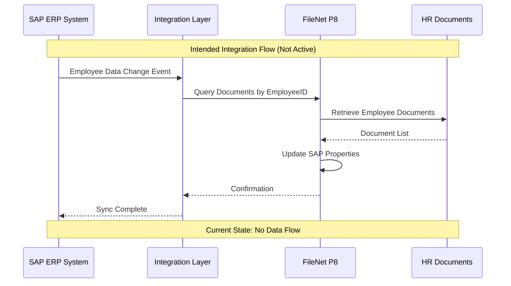

### 2.3 SAP Integration Status

**Current State:**
- ⚠️ **Status:** Configured but inactive
- ⚠️ **Data Flow:** Zero (0%) property population
- ⚠️ **Last Activity:** No evidence of SAP data sync
- ⚠️ **Integration User:** Not identified

**Intended Use Cases:**
1. **Employee Master Data Sync:** Link documents to SAP employee records
2. **Cost Center Allocation:** Track document costs by SAP cost centers
3. **Organizational Hierarchy:** Mirror SAP org structure in FileNet
4. **Payroll Integration:** Connect payroll documents to SAP payroll areas
5. **Position Management:** Link documents to SAP position hierarchy

**Integration Gaps:**
- No middleware/integration layer detected
- No SAP connector configuration found
- No scheduled sync jobs identified
- No error logs or integration monitoring

### 2.4 SAP Integration Recommendations

**Priority 1: Determine Integration Intent**
- ✅ Verify if SAP integration is still required
- ✅ Document business requirements for SAP sync
- ✅ Identify stakeholders and use cases

**Priority 2: Activate or Remove**
- If Required:
  - Implement SAP connector (e.g., SAP PI/PO, Dell Boomi)
  - Configure data mapping and sync schedules
  - Establish error handling and monitoring
- If Not Required:
  - Remove 8 unused SAP properties (schema cleanup)
  - Update documentation to reflect decision
  - Archive integration specifications

**Priority 3: Data Quality**
- Establish SAP data validation rules
- Implement data quality checks
- Set up monitoring and alerting

---

## 3. Salesforce Integration Analysis

### 3.1 Salesforce Integration Properties

The repository contains 2 Salesforce-specific properties for CRM integration:

| Property Name | Data Type | Cardinality | Usage | Purpose |
|--------------|-----------|-------------|-------|---------|
| **SalesforceAccountID** | String | Single | 0% | Link to SF Account |
| **SalesforceContactID** | String | Single | 0% | Link to SF Contact |

### 3.2 Salesforce Integration Architecture

```mermaid
graph LR
    subgraph "Salesforce CRM"
        ACC[Account Object]
        CON[Contact Object]
        ATT[Attachments]
    end
    
    subgraph "Integration Layer"
        SF2[salesforce2.fid@t7026]
        API[REST/SOAP API]
    end
    
    subgraph "FileNet P8"
        DOC[HR Documents]
        PROP[SF Properties]
    end
    
    ACC -.->|AccountID| API
    CON -.->|ContactID| API
    ATT -->|Document Upload| SF2
    SF2 -->|Create Document| DOC
    API -.->|Populate| PROP
    
    style ACC fill:#ffd3b6,stroke:#ff6b6b,stroke-dasharray: 5 5
    style CON fill:#ffd3b6,stroke:#ff6b6b,stroke-dasharray: 5 5
    style ATT fill:#a8e6cf,stroke:#4ecdc4
    style SF2 fill:#95e1d3,stroke:#4ecdc4
```

### 3.3 Salesforce Integration Status

**Current State:**
- 🟢 **Integration User:** salesforce2.fid@t7026 (active)
- 🟢 **Document Creation:** 8 documents created (16% of total)
- ⚠️ **Property Population:** Zero (0%) - IDs not populated
- ⚠️ **Bi-directional Sync:** Not configured

**Evidence of Activity:**
- Integration user created 8 documents between 2023-2024
- Documents include:
  - BlueWorks Live SaaS - Sys&Requirement.pdf
  - zebracare Printer Contract-en.pdf
  - Multi-cloud Architecture.drawio
  - 20230303.000002.02.pdf
  - Image.jpg
  - Dossier Acceleration_EN.pdf
  - ICC Value Based Archiving Redbook.PDF
  - History.pdf

**Integration Pattern:**
- One-way: Salesforce → FileNet (document upload)
- No reverse sync: FileNet → Salesforce
- No property population from Salesforce objects

### 3.4 Salesforce Integration Recommendations

**Priority 1: Complete Integration Setup**
- ✅ Populate SalesforceAccountID and SalesforceContactID
- ✅ Implement bi-directional sync
- ✅ Enable Salesforce Files integration

**Priority 2: Enhance Integration**
- Configure Salesforce Lightning component for FileNet
- Implement real-time document sync
- Enable document preview in Salesforce

**Priority 3: Governance**
- Establish document lifecycle rules
- Define retention policies aligned with Salesforce
- Implement access control sync

---

## 4. DocuSign Integration Analysis

### 4.1 DocuSign Integration Properties

The repository contains 2 DocuSign-specific properties for e-signature integration:

| Property Name | Data Type | Cardinality | Usage | Purpose |
|--------------|-----------|-------------|-------|---------|
| **DocuSignEnvelopeID** | String | Single | 0% | Link to DS Envelope |
| **DocuSignStatus** | Integer | Single | 0% | Signature status tracking |

### 4.2 DocuSign Integration Architecture

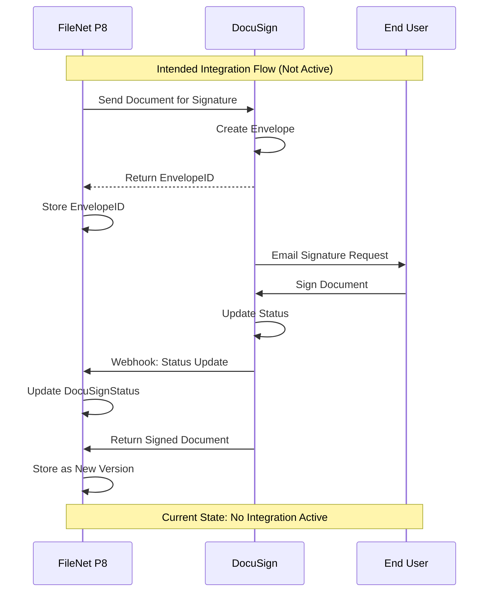

### 4.3 DocuSign Status Codes

| Status Code | Meaning | Expected Usage |
|-------------|---------|----------------|
| 0 | Not Sent | Default/Unused |
| 1 | Sent | Awaiting Signature |
| 2 | Delivered | Recipient Received |
| 3 | Completed | Fully Signed |
| 4 | Declined | Signature Declined |
| 5 | Voided | Envelope Cancelled |

### 4.4 DocuSign Integration Status

**Current State:**
- ⚠️ **Status:** Configured but completely inactive
- ⚠️ **Property Population:** Zero (0%)
- ⚠️ **Envelope Count:** 0 envelopes tracked
- ⚠️ **Integration Type:** Not implemented

**Intended Use Cases:**
1. **Employment Contracts:** E-signature for new hires
2. **Policy Acknowledgments:** Employee policy sign-offs
3. **Performance Reviews:** Digital signature on reviews
4. **Disciplinary Actions:** Formal acknowledgment signatures
5. **Exit Documents:** Termination and exit paperwork

**Integration Gaps:**
- No DocuSign connector configured
- No webhook endpoints set up
- No envelope creation workflow
- No signed document retrieval process

### 4.5 DocuSign Integration Recommendations

**Priority 1: Assess Business Need**
- ✅ Determine if e-signature capability is required
- ✅ Identify document types requiring signatures
- ✅ Calculate ROI for DocuSign integration

**Priority 2: Implementation (If Required)**
- Configure DocuSign Connect (webhook)
- Implement envelope creation workflow
- Set up signed document retrieval
- Configure status tracking and notifications

**Priority 3: Cleanup (If Not Required)**
- Remove 2 unused DocuSign properties
- Update schema documentation
- Archive integration specifications

---

## 5. Watsonx AI Integration Analysis

### 5.1 Watsonx AI Properties

The repository contains 2 Watsonx AI properties for artificial intelligence services:

| Property Name | Data Type | Cardinality | Usage | Purpose |
|--------------|-----------|-------------|-------|---------|
| **WatsonxClassificationScore** | Float | Single | 0% | AI classification confidence |
| **WatsonxExtractedEntities** | String | Multi | 0% | Named entity recognition |

### 5.2 Watsonx AI Architecture

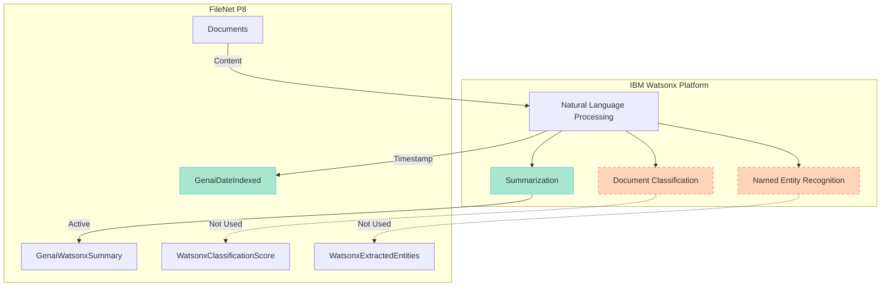

### 5.3 Watsonx AI Integration Status

**Current State:**
- 🟢 **Status:** Partially active
- 🟢 **Indexing:** 28 documents indexed (56%)
- 🟢 **Summarization:** 1 document with summary (2%)
- ⚠️ **Classification:** Not utilized (0%)
- ⚠️ **Entity Extraction:** Not utilized (0%)

**Active Features:**
1. **GenaiDateIndexed:** Timestamp of AI processing
   - 28 documents processed (56%)
   - Last indexed: 2024-12-19

2. **GenaiWatsonxSummary:** AI-generated summaries
   - 1 document with summary (Focus corp.docx)
   - Quality: Good (accurate loan form description)

**Inactive Features:**
1. **WatsonxClassificationScore:** AI classification confidence
   - 0% utilization
   - Could automate document classification

2. **WatsonxExtractedEntities:** Named entity recognition
   - 0% utilization
   - Could extract names, dates, amounts, etc.

### 5.4 Watsonx AI Capabilities

**Available AI Services:**

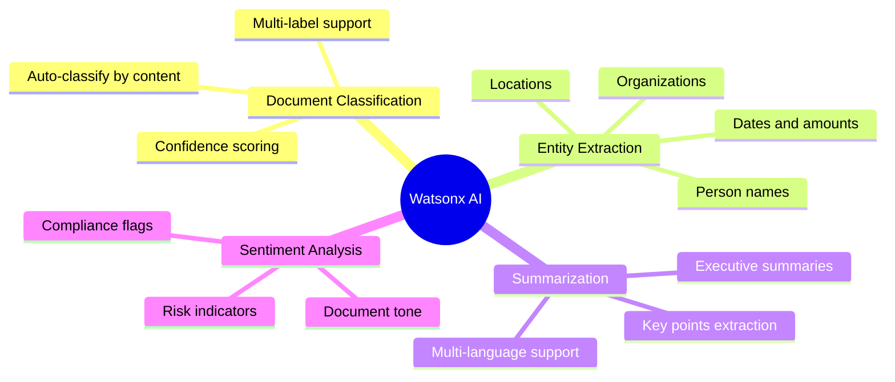

### 5.5 Watsonx AI Recommendations

**Priority 1: Expand AI Utilization**
- ✅ Enable summarization for all 50 documents
- ✅ Activate auto-classification with confidence scoring
- ✅ Implement entity extraction for metadata enrichment

**Priority 2: AI-Powered Classification**
- Use WatsonxClassificationScore to automate Document→HRDocument reclassification
- Set confidence threshold (e.g., >0.85 for auto-classification)
- Implement human review for low-confidence scores

**Priority 3: Entity-Based Metadata**
- Extract employee names, IDs, dates from documents
- Auto-populate properties from extracted entities
- Reduce manual metadata entry

**Priority 4: Advanced Features**
- Implement sentiment analysis for compliance risk
- Enable multi-language support for international docs
- Set up AI-powered search and recommendations

---

## 6. Content-Based Retrieval (CBR) Analysis

### 6.1 CBR Indexing Status

**Current State:**
- 🟢 **Status:** Fully operational
- 🟢 **Indexing Rate:** 94% (47/50 documents)
- 🟢 **Index ID:** {9A4B563C-AEED-4BE4-B8A2-4FB081C1E027}
- ⚠️ **Failures:** 1 document (Image.jpg - Error Code 64)
- ⚠️ **Not Indexed:** 2 system templates (not indexable)

### 6.2 CBR Architecture

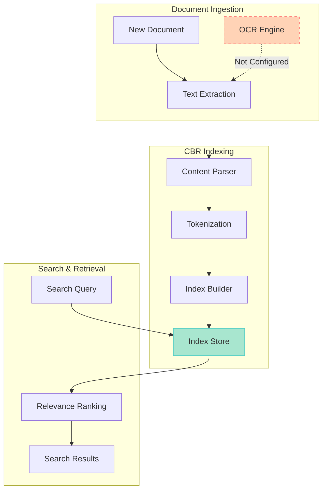

### 6.3 CBR Indexing Failure Analysis

**Failed Document:**
- **Name:** Image.jpg
- **MIME Type:** image/jpeg
- **Error Code:** 64 (Content extraction error)
- **Size:** 6,954 bytes
- **Creator:** salesforce2.fid@t7026

**Root Cause:**
- Image files require OCR for text extraction
- OCR engine not configured or not available
- Binary image data cannot be indexed as text

**Impact:**
- Image content not searchable
- Metadata-only search available
- Reduced search effectiveness for visual content

### 6.4 CBR Search Templates

**Identified Search Templates:**
1. **__DD_D_Auszüge** (Extracts search)
   - Size: 3,466 bytes
   - Last Modified: 2022-09-15

2. **__DD_D_Kunden_CBR** (Customer CBR search)
   - Size: 4,120 bytes
   - Last Modified: 2022-09-15

3. **__DD_F_ALLE** (All folders search)
   - Size: 3,028 bytes
   - Last Modified: 2022-09-15

**Search Template Usage:**
- Pre-configured search queries
- Standardized search interfaces
- User-friendly search forms

### 6.5 CBR Recommendations

**Priority 1: Fix Indexing Failures**
- ✅ Configure OCR engine for image files
- ✅ Re-index Image.jpg after OCR setup
- ✅ Implement OCR for future image uploads

**Priority 2: Enhance Search Capabilities**
- Enable full-text search across all content
- Implement faceted search by properties
- Add search result highlighting

**Priority 3: Search Template Modernization**
- Review and update legacy search templates
- Create new templates for common searches
- Implement saved search functionality

---

## 7. Entry Template Analysis

### 7.1 Entry Template Usage

**Identified Entry Templates:**

| Template ID | Template Name | Documents | Usage |
|-------------|--------------|-----------|-------|
| {FD497634-EFEB-C574-85AA-6E5BA9300000} | DD Testdaten | 5 | 10% |
| {55E02CB1-26EF-CAC6-84C1-6E5AF4100000} | Test Rechnung 1 | 2 | 4% |
| {3A757110-F007-CEC9-87DA-6E5AE5100000} | Kartei | 2 | 4% |
| None | No Template | 41 | 82% |

### 7.2 Entry Template Architecture

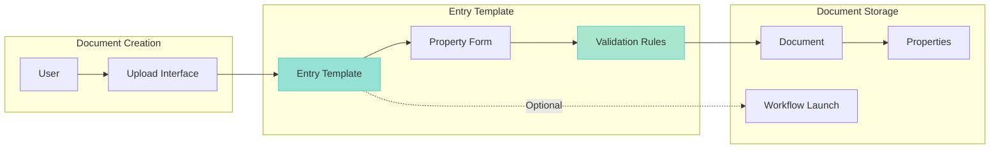

### 7.3 Entry Template Benefits

**Advantages:**
1. **Standardized Metadata:** Consistent property capture
2. **Data Validation:** Enforce required fields and formats
3. **Workflow Integration:** Auto-launch workflows on creation
4. **User Guidance:** Simplified upload process
5. **Quality Control:** Reduce metadata errors

**Current Limitations:**
- Low adoption rate (18%)
- Limited template variety (3 templates)
- No templates for business documents
- No workflow integration detected

### 7.4 Entry Template Recommendations

**Priority 1: Increase Adoption**
- ✅ Create entry templates for all document types
- ✅ Make templates mandatory for HR documents
- ✅ Provide user training on template usage

**Priority 2: Template Enhancement**
- Add validation rules for data quality
- Implement conditional fields
- Enable workflow launching from templates

**Priority 3: Template Governance**
- Establish template creation standards
- Regular template review and updates
- Monitor template usage metrics

---

## 8. Workflow Engine Analysis

### 8.1 Workflow Properties

**Workflow-Related Properties Identified:**

| Property Name | Data Type | Purpose | Usage |
|--------------|-----------|---------|-------|
| **CurrentState** | Integer | Workflow state tracking | 0% |
| **IsInExceptionState** | Boolean | Error state flag | 0% |
| **EntryTemplateLaunchedWorkflowNumber** | Integer | Workflow instance ID | 0% |

### 8.2 Workflow Architecture

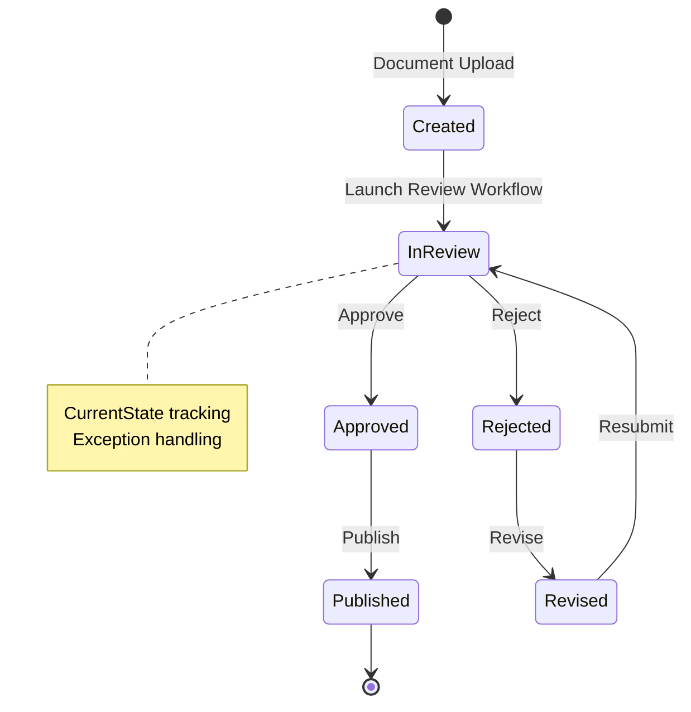

### 8.3 Workflow Status

**Current State:**
- ⚠️ **Status:** Configured but not utilized
- ⚠️ **Active Workflows:** 0 detected
- ⚠️ **Workflow Launches:** 0 from entry templates
- ⚠️ **Exception States:** 0 documents in exception

**Workflow Capabilities:**
- Document review and approval
- Multi-stage routing
- Parallel and sequential processing
- Exception handling
- Email notifications

**Integration Gaps:**
- No workflows launched from entry templates
- No active workflow instances
- No workflow monitoring or reporting

### 8.4 Workflow Recommendations

**Priority 1: Assess Workflow Needs**
- ✅ Identify processes requiring workflow automation
- ✅ Document approval requirements
- ✅ Define workflow stages and participants

**Priority 2: Implement Workflows (If Required)**
- Create document review workflows
- Implement approval routing
- Configure notifications and escalations
- Set up workflow monitoring

**Priority 3: Workflow Governance**
- Establish workflow design standards
- Implement workflow testing procedures
- Monitor workflow performance metrics

---

## 9. Integration User Analysis

### 9.1 System Integration Accounts

| User Account | Type | Documents Created | Purpose |
|-------------|------|-------------------|---------|
| **cmis-filenet.fid@t7026** | System | 30 (60%) | Bulk upload/migration |
| **salesforce2.fid@t7026** | Integration | 8 (16%) | Salesforce integration |
| **akd@ibm.com** | Admin | 0 (0%) | Indexing updates |

### 9.2 Integration User Activity

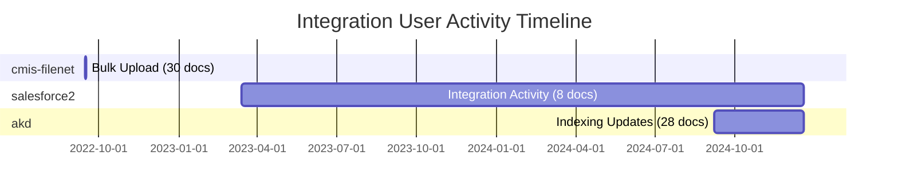

**Activity Patterns:**
1. **cmis-filenet.fid@t7026:**
   - Single bulk upload event (2022-09-15)
   - 30 documents in one day
   - No subsequent activity

2. **salesforce2.fid@t7026:**
   - Ongoing integration activity (2023-2024)
   - 8 documents over 21 months
   - Sporadic upload pattern

3. **akd@ibm.com:**
   - Administrative indexing updates
   - 28 documents updated (2024)
   - Automated batch processing

### 9.3 Integration User Recommendations

**Priority 1: Account Management**
- ✅ Review integration account permissions
- ✅ Implement least privilege access
- ✅ Regular account audits

**Priority 2: Activity Monitoring**
- Set up integration user activity alerts
- Monitor for unusual patterns
- Track integration success/failure rates

**Priority 3: Documentation**
- Document integration account purposes
- Maintain integration user inventory
- Establish account lifecycle procedures

---

## 10. API and Protocol Analysis

### 10.1 Access Protocols

**Identified Access Methods:**

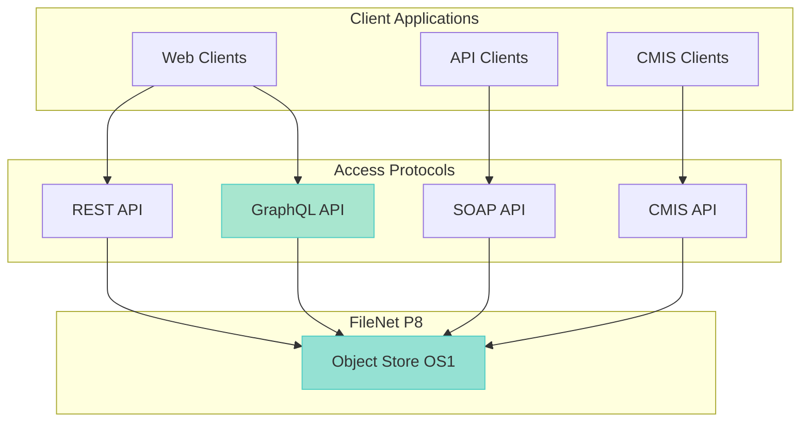

**Protocol Usage:**
- **GraphQL API:** Primary access method (audit tool)
- **CMIS API:** Integration access (cmis-filenet user)
- **REST API:** Modern web services
- **SOAP API:** Legacy integrations

### 10.2 API Security

**Security Measures:**
- ✅ Authentication required (all protocols)
- ✅ HTTPS encryption (GraphQL endpoint)
- ✅ User-based access control
- ⚠️ API key management not documented

**Security Recommendations:**
- Implement API rate limiting
- Enable API audit logging
- Regular security assessments
- API key rotation policy

---

## 11. Integration Monitoring and Logging

### 11.1 Current Monitoring State

**Monitoring Capabilities:**
- ⚠️ **Integration Monitoring:** Not configured
- ⚠️ **Error Logging:** Limited visibility
- ⚠️ **Performance Metrics:** Not tracked
- ⚠️ **Alerting:** Not implemented

### 11.2 Recommended Monitoring Framework

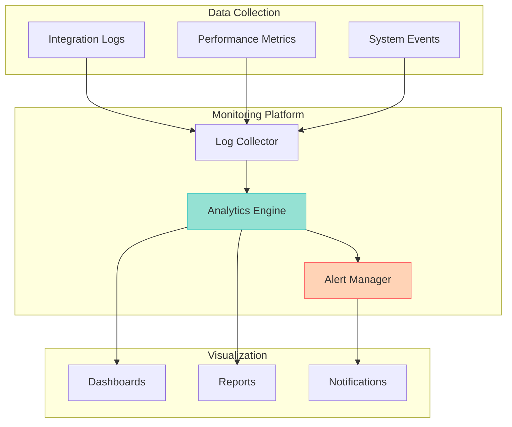

### 11.3 Monitoring Recommendations

**Priority 1: Basic Monitoring**
- ✅ Enable integration logging
- ✅ Track API call volumes
- ✅ Monitor error rates

**Priority 2: Advanced Monitoring**
- Implement real-time dashboards
- Set up automated alerting
- Track performance SLAs

**Priority 3: Analytics**
- Integration usage analytics
- Performance trend analysis
- Capacity planning metrics

---

## 12. Integration Roadmap

### 12.1 Short-Term Actions (1-3 Months)

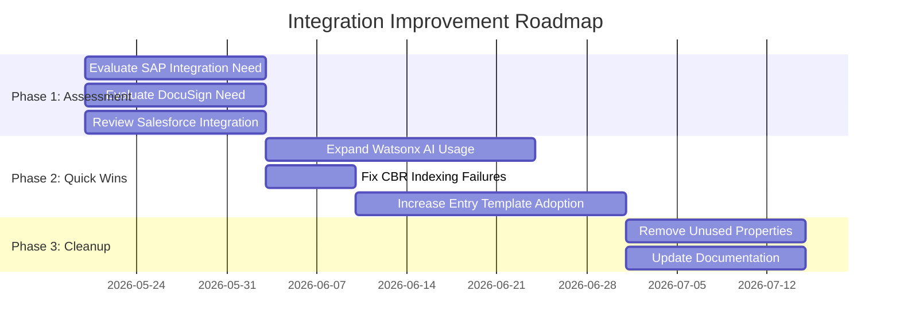

**Actions:**
1. **Week 1-2:** Assess integration requirements
2. **Week 3-4:** Implement quick wins (Watsonx, CBR)
3. **Week 5-8:** Increase entry template adoption
4. **Week 9-12:** Cleanup unused integrations

### 12.2 Medium-Term Actions (3-6 Months)

**If Integrations Required:**
1. Implement SAP connector and data sync
2. Complete Salesforce bi-directional integration
3. Configure DocuSign e-signature workflow
4. Enable workflow automation

**If Integrations Not Required:**
1. Remove unused integration properties (14 properties)
2. Simplify schema and reduce complexity
3. Focus on core FileNet capabilities
4. Optimize for current use cases

### 12.3 Long-Term Vision (6-12 Months)

**Strategic Integration Goals:**
1. **AI-First Approach:**
   - Full Watsonx AI utilization
   - Automated classification and metadata
   - Intelligent search and recommendations

2. **Seamless Enterprise Integration:**
   - Real-time data sync with active systems
   - Unified user experience
   - Single source of truth

3. **Advanced Automation:**
   - Workflow-driven processes
   - Automated retention management
   - Self-service capabilities

---

## 13. Integration Risk Assessment

### 13.1 Risk Matrix

| Integration | Risk Level | Impact | Likelihood | Mitigation Priority |
|------------|-----------|--------|------------|-------------------|
| **SAP (Unused)** | 🟡 Medium | High | Low | Medium |
| **Salesforce (Partial)** | 🟡 Medium | Medium | Medium | High |
| **DocuSign (Unused)** | 🟡 Medium | Medium | Low | Low |
| **Watsonx AI** | 🟢 Low | High | High | Low |
| **CBR Indexing** | 🟢 Low | High | High | Medium |
| **Entry Templates** | 🟢 Low | Medium | Medium | Medium |
| **Workflow Engine** | 🟡 Medium | Medium | Low | Low |

### 13.2 Risk Details

**SAP Integration Risk:**
- **Risk:** Unused properties consuming schema space
- **Impact:** Complexity, confusion, maintenance overhead
- **Mitigation:** Assess need and remove if not required

**Salesforce Integration Risk:**
- **Risk:** Incomplete integration, missing property population
- **Impact:** Data inconsistency, manual workarounds
- **Mitigation:** Complete integration or document limitations

**DocuSign Integration Risk:**
- **Risk:** Configured but never activated
- **Impact:** False expectations, wasted configuration
- **Mitigation:** Activate or remove configuration

**CBR Indexing Risk:**
- **Risk:** Image indexing failure
- **Impact:** Reduced search effectiveness
- **Mitigation:** Configure OCR engine

---

## 14. Integration Best Practices

### 14.1 Design Principles

**Recommended Principles:**
1. **Purpose-Driven:** Only integrate what's needed
2. **Bi-Directional:** Enable two-way data flow
3. **Real-Time:** Minimize sync delays
4. **Monitored:** Track all integration activity
5. **Documented:** Maintain integration specifications
6. **Tested:** Comprehensive integration testing
7. **Secured:** Implement proper authentication and authorization

### 14.2 Integration Checklist

**Before Implementing Integration:**
- [ ] Business case documented
- [ ] Requirements clearly defined
- [ ] Integration architecture designed
- [ ] Security requirements identified
- [ ] Error handling planned
- [ ] Monitoring strategy defined
- [ ] Testing plan created
- [ ] Rollback procedure documented

**After Implementing Integration:**
- [ ] Integration tested and validated
- [ ] Monitoring enabled
- [ ] Documentation updated
- [ ] Users trained
- [ ] Support procedures established
- [ ] Performance baseline captured

---

## 15. Conclusion

### 15.1 Integration Summary

**Current State:**
- 🟢 **Active Integrations:** 2 (Watsonx AI, CBR)
- 🟡 **Partial Integrations:** 1 (Salesforce)
- 🔴 **Inactive Integrations:** 3 (SAP, DocuSign, Workflow)
- ⚠️ **Unused Properties:** 14 (SAP: 8, Salesforce: 2, DocuSign: 2, Watsonx: 2)

**Key Findings:**
1. **Over-Configuration:** Many integrations configured but never used
2. **Under-Utilization:** Active integrations not fully leveraged
3. **Missing Monitoring:** No integration monitoring or alerting
4. **Documentation Gap:** Integration specifications not maintained

### 15.2 Strategic Recommendations

**Immediate Actions:**
1. ✅ Assess all integration requirements
2. ✅ Activate or remove unused integrations
3. ✅ Expand Watsonx AI utilization
4. ✅ Fix CBR indexing failures

**Short-Term Goals:**
1. Complete Salesforce integration
2. Increase entry template adoption
3. Implement integration monitoring
4. Update integration documentation

**Long-Term Vision:**
1. AI-powered document management
2. Seamless enterprise integration
3. Automated workflows and processes
4. Comprehensive monitoring and analytics

### 15.3 Next Steps

1. **Proceed to Phase 7:** Report Generation
2. **Consolidate Findings:** Compile all phase reports
3. **Create Executive Summary:** High-level overview
4. **Develop Action Plan:** Prioritized recommendations

---

**Report Status:** ✅ Complete  
**Next Phase:** Report Generation  
**Estimated Completion:** 2026-05-19 14:00 CEST