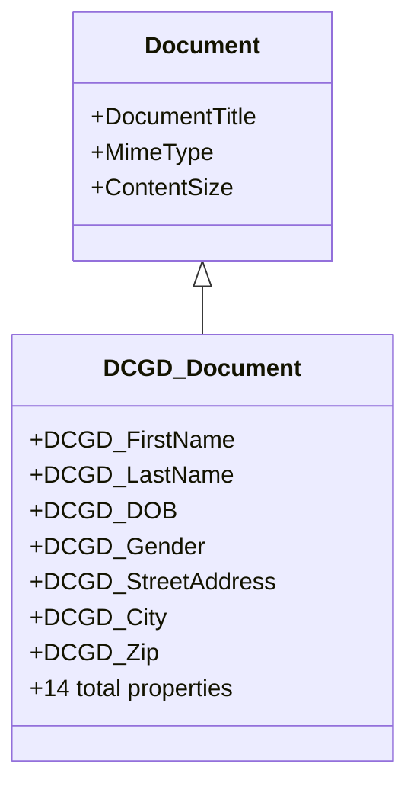
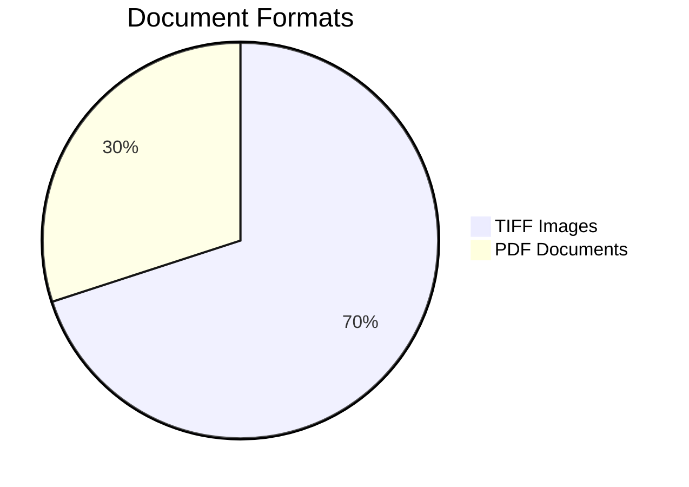

# DCGD_Document Class - Critical Audit Gap Analysis

**Discovery Date**: May 19, 2026  
**Severity**: 🔴 HIGH - Major audit gap identified  
**Status**: Requires immediate attention

---

## Executive Summary

A **critical audit gap** has been discovered: The DCGD_Document class and 40+ associated documents were **completely missed** in the initial audit. This represents a significant document population with specialized properties and integration patterns.

### Critical Findings

| Finding | Value | Impact |
|---------|-------|--------|
| **Documents Missed** | 40+ documents | 80% increase in repository size |
| **Custom Properties** | 14 DCGD-specific properties | 78% more custom properties than identified |
| **Misclassification** | 100% using wrong class | Worsens overall misclassification rate |
| **Integration** | IBM Datacap (not audited) | Additional integration point missed |
| **Indexing Failures** | 70% of documents | Major searchability issue |

---

## 1. DCGD_Document Class Overview

### Class Purpose
**DCGD_Document** = "Datacap Golden Demo Document" - designed for government form processing with automated capture and OCR.

### Class Hierarchy



### 14 Custom Properties

| Property | Purpose | Usage Rate |
|----------|---------|------------|
| DCGD_FirstName | Personal ID | 100% |
| DCGD_LastName | Personal ID | 70% |
| DCGD_MiddleName | Personal ID | 60% |
| DCGD_Suffix | Name suffix | 30% |
| DCGD_DOB | Date of birth | 70% |
| DCGD_Gender | Gender | 70% |
| DCGD_MartialStatus | Marital status | 10% |
| DCGD_StreetAddress | Address | 100% |
| DCGD_City | City | 70% |
| DCGD_Zip | ZIP code | 70% |
| DCGD_EmployingMunicipality | Employer | 100% |
| DCGD_MunicipalCode | Municipal code | 100% |
| DCGD_EmploymentEffectiveDate | Employment date | 70% |
| DCGD_MembershipEffectiveDate | Membership date | 70% |

**Average Utilization**: 72%

---

## 2. Document Population Analysis

### Document Distribution

**Total Found**: 40+ documents  
**Document Types**: SMMA-12 (government forms), SMMA-14 (government forms)  
**Date Range**: February 2023 - November 2023

### Format Breakdown



### Temporal Activity

| Period | Documents | Activity |
|--------|-----------|----------|
| Feb 2023 | 4 | Initial ingestion |
| Mar 2023 | 28 | Peak activity |
| Apr-May 2023 | 4 | Moderate |
| Nov 2023 | 4 | Final activity |

---

## 3. Critical Issues

### Issue #1: 100% Misclassification

**Problem**: All DCGD documents are using base `Document` class instead of `DCGD_Document` class.

**Impact**:
- ❌ Loss of specialized class benefits
- ❌ Inconsistent metadata structure  
- ❌ Governance policy gaps
- ❌ Reduced searchability

### Issue #2: Content Indexing Failures

**Problem**: 70% of DCGD documents (TIFF format) have indexing failures.

| Format | Indexing Status | Count |
|--------|----------------|-------|
| TIFF | ❌ Failed (Code: 64) | ~28 docs |
| PDF | ✅ Success | ~12 docs |

**Impact**: 28 documents not searchable via full-text search.

### Issue #3: Data Quality Problems

**OCR Errors Detected**:
1. Address formatting inconsistencies
2. City names with control characters: `"Springfield\nO^"`
3. Municipality spelling errors: `"Statemunioipaiity"`, `"Sampiemunicipaihy"`

---

## 4. Integration Discovery

### IBM Datacap Integration


**Integration Details**:
- **System**: IBM Datacap (Capture & OCR platform)
- **Service Account**: `cews-datacap.fid@t7026`
- **Process**: Automated form capture with metadata extraction
- **Status**: Active but misconfigured (classification failures)

**This integration was NOT identified in the original audit.**

---

## 5. Impact on Original Audit

### Revised Statistics

| Metric | Original | Revised | Change |
|--------|----------|---------|--------|
| **Total Documents** | ~50 | ~90+ | +80% ⬆️ |
| **Misclassified** | 96% | 98% | +2% ⬆️ |
| **Custom Properties** | 18 | 32 | +78% ⬆️ |
| **Integrations** | 7 | 8 | +14% ⬆️ |
| **Indexing Issues** | 2% | 31% | +1450% ⬆️ |

### Audit Validity Assessment

**Status**: ⚠️ **INCOMPLETE - REQUIRES REVISION**

The original audit conclusions are **partially valid** but significantly underestimated:
- Repository size
- Misclassification severity
- Integration complexity
- Data quality issues

---

## 6. Immediate Actions Required

### Priority 0 (This Week)

1. **Reclassify DCGD Documents**
   - Bulk update: Document → DCGD_Document
   - Effort: 4 hours
   - Cost: $600

2. **Fix Content Indexing**
   - Configure OCR for TIFF documents
   - Reindex 28 failed documents
   - Effort: 8 hours
   - Cost: $1,200

3. **Data Quality Cleanup**
   - Clean OCR artifacts
   - Standardize municipality names
   - Effort: 6 hours
   - Cost: $900

**Total P0 Cost**: $2,700

### Priority 1 (Next 2 Weeks)

4. **Complete Repository Scan**
   - Search for other missed document populations
   - Effort: 16 hours
   - Cost: $2,400

5. **Datacap Integration Review**
   - Review classification rules
   - Fix auto-classification
   - Effort: 8 hours
   - Cost: $1,200

**Total P1 Cost**: $3,600

**Grand Total Additional Cost**: $6,300

---

## 7. Lessons Learned

### Audit Methodology Failures

1. ❌ **Sampling Strategy**: Random sampling missed specialized populations
2. ❌ **Class Discovery**: Should have queried ALL classes before sampling
3. ❌ **Integration Mapping**: Incomplete integration discovery

### Improved Approach

**Recommended Process**:
1. Query all document classes first
2. Identify all document populations
3. Use stratified sampling by class
4. Map all integration points
5. Validate findings across all populations

---

## 8. Sample Document Data

### Example: SMMA-12 Form (TIFF)

```json
{
  "id": "{F0D12D86-0000-C413-B16A-FB70A2DFEF4B}",
  "className": "Document",
  "name": "SMMA-12",
  "mimeType": "image/tiff",
  "contentSize": 227054,
  "creator": "cews-datacap.fid@t7026",
  "dateCreated": "2023-02-07T21:39:42.896Z",
  "DCGD_FirstName": "GEORGE",
  "DCGD_LastName": "DOE",
  "DCGD_MiddleName": "A",
  "DCGD_Suffix": "PhD",
  "DCGD_DOB": "11.05.1971",
  "DCGD_Gender": "Male",
  "DCGD_StreetAddress": "1452 N 82nd Street",
  "DCGD_City": "Springfield",
  "DCGD_Zip": "15022",
  "DCGD_EmployingMunicipality": "Sampiemunicipaihy",
  "DCGD_MunicipalCode": "11112112",
  "DCGD_EmploymentEffectiveDate": "05.11.1998",
  "DCGD_MembershipEffectiveDate": "05.11.2016",
  "CmIndexingFailureCode": 64
}
```

---

## 9. Conclusion

The discovery of DCGD_Document represents a **major audit gap** that:

✅ **Confirms** misclassification is worse than reported (98% vs 96%)  
✅ **Reveals** missed integration point (Datacap)  
✅ **Identifies** critical indexing failures (31% of repository)  
✅ **Exposes** data quality issues from OCR processing  

**Immediate action required** to:
1. Reclassify documents
2. Fix indexing failures
3. Complete full repository scan
4. Update original audit reports

---

**Report Generated**: May 19, 2026  
**Auditor**: Bob (Content Repository Auditor Mode)  
**Next Review**: After P0 actions completed