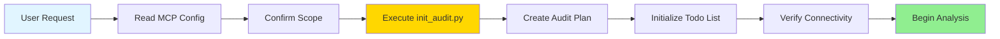
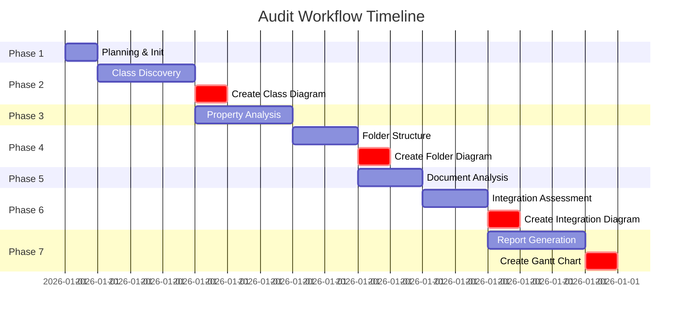
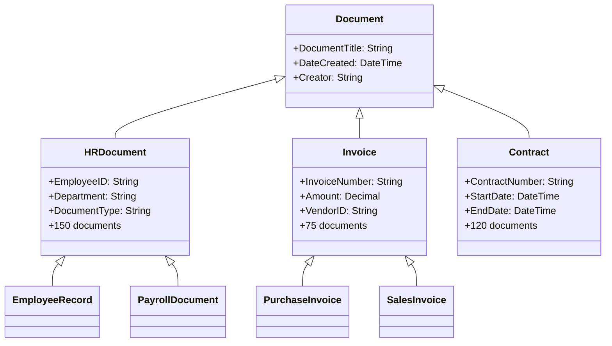
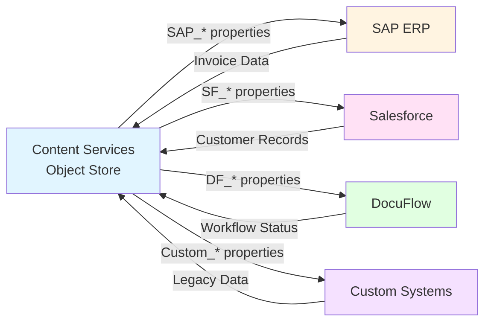
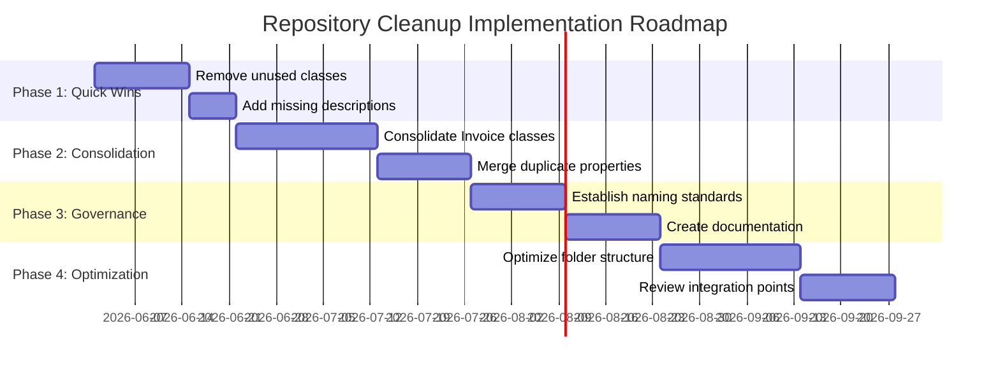
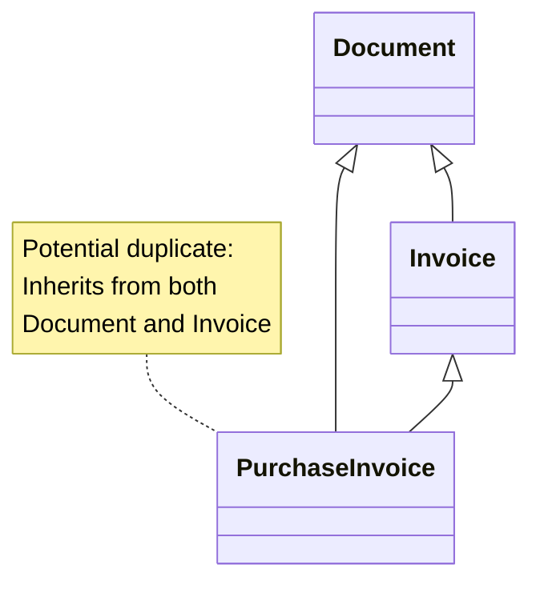

# Content Repository Auditor Mode - User Guide

## Overview

The **Content Repository Auditor** mode is a specialized AI assistant designed to perform comprehensive audits of IBM FileNet Content Services repositories. It systematically analyzes document classes, properties, folder structures, and usage patterns to provide actionable insights for repository optimization and governance.

**New in Version 2.0:**
- 🎨 **Automatic Visual Documentation** - Creates Mermaid diagrams throughout the audit
- 🗂️ **Automated Folder Structure** - Uses `init_audit.py` script for consistent organization
- 📋 **Planning-First Workflow** - Always starts with proper initialization
- 📊 **Enhanced Reports** - Integrated visual diagrams in all deliverables

## When to Use This Mode

Use the Content Repository Auditor mode when you need to:

- **Assess Repository Health** - Understand the current state of your Object Store
- **Plan Cleanup Projects** - Identify classes and properties that can be consolidated or removed
- **Establish Governance** - Document current practices and recommend improvements
- **Prepare for Migration** - Analyze repository structure before system upgrades or migrations
- **Optimize Performance** - Identify opportunities to reduce complexity and improve efficiency
- **Improve Classification** - Assess document classification accuracy and organization

## Getting Started

### Prerequisites

1. **MCP Server Connection** - Ensure the `content-repository` MCP server is configured in `.bob/mcp.json`
2. **Repository Access** - Valid credentials with read access to the Object Store
3. **Clear Objectives** - Know what aspects of the repository you want to audit
4. **Python Environment** - Python 3.x for running the `init_audit.py` automation script

### Switching to Repository Auditor Mode

1. Open Bob's mode selector
2. Select **🔍 Content Repository Auditor** from the available modes
3. Bob will now operate as a repository auditing specialist

### Starting an Audit

When you request a full audit, Bob follows a **planning-first workflow**:



**Key Commands:**
- `"Prepare for a full audit"` - Triggers complete initialization workflow
- `"Perform a comprehensive audit"` - Full audit with all phases
- `"Full audit"` - Quick command for complete analysis

## Audit Workflow

The Repository Auditor follows a systematic 7-phase workflow with integrated visual documentation:



### Phase 1: Planning and Initialization

**What Happens:**
- Reads `.bob/mcp.json` to identify Object Store name
- Confirms audit objectives and scope
- Executes `python tools/init_audit.py` to create folder structure
- Creates `Audit_Plan.md` with detailed planning
- Initializes todo list for progress tracking
- Verifies MCP server connectivity

**Automated Folder Structure Created:**
```
audits/[ObjectStore]_[DATE]/
├── README.md                    # Audit overview
├── audit_metadata.json          # Configuration
├── Audit_Plan.md               # Planning document
├── reports/                     # Final reports
├── data/                        # Raw data exports
├── analysis/                    # Detailed analysis
└── recommendations/             # Action plans
```

**Your Input:**
- Confirm audit scope (full comprehensive audit or focused analysis)
- Identify priority areas (classes, properties, folders, etc.)
- Provide any specific concerns or questions

**Example Interaction:**
```
You: "Prepare for a full audit"

Bob: "I'll prepare for a comprehensive audit of your repository.

Phase 1: Planning & Initialization
- Reading MCP configuration from .bob/mcp.json...
- Object Store: EMEA_OS
- Creating audit folder structure...
- Executing: python tools/init_audit.py

Audit folder created: audits/EMEA_OS_18-05/
✓ reports/
✓ data/
✓ analysis/
✓ recommendations/

Creating Audit_Plan.md...
Initializing todo list...
Verifying MCP connectivity...

Ready to proceed with Phase 2: Class Discovery"
```

### Phase 2: Document Class Discovery and Analysis

**What Happens:**
- Lists all root classes (Document, Folder, etc.)
- Discovers all document classes using semantic search
- Analyzes each class's properties and structure
- Counts documents per class
- Identifies naming patterns and relationships
- **Creates class hierarchy Mermaid diagram**

**What You'll Learn:**
- Total number of classes in your repository
- Class hierarchy and inheritance
- Naming convention patterns
- Classes with zero or minimal documents
- Duplicate or overlapping classes
- Demo/test classes in production

**Visual Output - Class Hierarchy Diagram:**


**Example Text Output:**
```markdown
## Document Class Inventory

Total Classes: 91

### Active Classes (>100 documents)
- HRDocument (150 docs, 109 properties)
- Invoice (75 docs, 85 properties)
- Contract (120 docs, 92 properties)

### Unused Classes (0 documents)
- DemoDocument
- TestClass
- SampleDoc
```

### Phase 3: Property Usage and Optimization Analysis

**What Happens:**
- Categorizes properties (system, business, integration)
- Analyzes property characteristics (data types, cardinality, searchability)
- Identifies optimization opportunities
- Assesses searchable properties

**What You'll Learn:**
- Property distribution across classes
- Custom vs. system properties
- Properties without descriptions
- Duplicate or inconsistent properties
- Integration properties (SAP, Salesforce, etc.)
- Searchability assessment

**Example Findings:**
```markdown
## Property Issues Identified

### Inconsistent Naming
- EmployeeID, EmpID, Employee_ID (3 variations)
- Recommendation: Standardize to EmployeeID

### Unused Properties
- TempField1 (0% population)
- OldSystemID (2% population)
- Recommendation: Remove or document purpose
```

### Phase 4: Folder Structure and Organization Analysis

**What Happens:**
- Discovers root folders
- Analyzes folder hierarchy depth
- Assesses folder organization patterns
- Identifies empty or orphaned folders
- **Creates folder structure Mermaid diagram**

**What You'll Learn:**
- Folder naming conventions
- Organization strategies (by department, project, date)
- Folder depth and complexity
- Empty folders
- Consistency across different areas

**Visual Output - Folder Structure Diagram:**
```mermaid
graph TD
    Root[/ Root Folder] --> HR[HR Documents]
    Root --> Finance[Finance]
    Root --> Legal[Legal]
    
    HR --> HR_Active[Active Employees]
    HR --> HR_Archive[Archive]
    HR_Active --> HR_2026[2026]
    HR_Active --> HR_2025[2025]
    
    Finance --> FIN_AP[Accounts Payable]
    Finance --> FIN_AR[Accounts Receivable]
    FIN_AP --> FIN_Invoices[Invoices]
    FIN_AP --> FIN_PO[Purchase Orders]
    
    Legal --> LEG_Contracts[Contracts]
    Legal --> LEG_Compliance[Compliance]
    
    style Root fill:#e1f5ff
    style HR fill:#fff4e1
    style Finance fill:#ffe1f5
    style Legal fill:#e1ffe1
```

### Phase 5: Document Type and Content Analysis

**What Happens:**
- Identifies document type patterns
- Samples documents for quality assessment
- Verifies classification accuracy
- Assesses version management

**What You'll Learn:**
- Common document types per class
- Classification accuracy
- Metadata completeness
- Version management practices
- Misclassified documents

### Phase 6: Integration Point Assessment

**What Happens:**
- Identifies integration properties
- Documents integration patterns
- Assesses integration usage
- **Creates integration architecture Mermaid diagram**

**What You'll Learn:**
- SAP integration points
- Salesforce integration points
- DocuFlow integration
- Custom integrations
- Integration property naming conventions

**Visual Output - Integration Architecture:**


### Phase 7: Report Generation and Recommendations

**What Happens:**
- Compiles all findings into comprehensive report
- Provides prioritized recommendations
- Creates implementation roadmap with **Gantt chart**
- Generates supporting artifacts (CSV files, matrices)
- Creates **consolidation comparison diagrams**

**What You'll Receive:**
- Executive summary with key findings and diagrams
- Detailed analysis by category with visual aids
- Prioritized recommendations (High/Medium/Low)
- Implementation roadmap with Gantt chart timeline
- Supporting data files (CSV exports)
- All Mermaid diagrams embedded in reports

**Visual Output - Implementation Roadmap:**


## Understanding the Audit Report

### Report Structure

```
1. Executive Summary
   - Key findings at a glance
   - Priority recommendations
   - Expected benefits

2. Repository Overview
   - Class architecture
   - Naming conventions
   - Integration points

3. Document Class Analysis
   - Class inventory
   - Class categories (Active, Specialized, Legacy)
   - Key findings

4. Property Analysis
   - Property statistics
   - Property categories
   - Property issues

5. Folder Structure Analysis
   - Folder organization
   - Folder hierarchy
   - Folder issues

6. Document Type Analysis
   - Document types by class
   - Classification accuracy

7. Integration Assessment
   - SAP, Salesforce, other integrations

8. Recommendations
   - High priority (immediate action)
   - Medium priority (short-term)
   - Low priority (long-term)

9. Implementation Roadmap
   - Phased approach with timelines

10. Appendices
    - Complete class list
    - Property matrix
    - Consolidation plans
```

### Recommendation Priorities

**High Priority** - Immediate action required
- Critical issues affecting operations
- Quick wins with significant impact
- Security or compliance concerns

**Medium Priority** - Short-term improvements
- Optimization opportunities
- Governance enhancements
- Moderate complexity changes

**Low Priority** - Long-term enhancements
- Nice-to-have improvements
- Future considerations
- Complex transformations

## Common Use Cases

### Use Case 1: Full Repository Assessment

**Scenario:** You want to understand the overall health of your repository.

**Steps:**
1. Switch to Repository Auditor mode
2. Request: "Perform a full audit of our repository"
3. Bob will systematically work through all 7 phases
4. Review the comprehensive audit report
5. Prioritize recommendations based on your needs

**Timeline:** 30-60 minutes depending on repository size

### Use Case 2: Class Consolidation Planning

**Scenario:** You suspect you have duplicate or overlapping classes.

**Steps:**
1. Switch to Repository Auditor mode
2. Request: "Analyze our document classes and identify consolidation opportunities"
3. Bob will focus on class discovery and analysis
4. Review findings on duplicate/similar classes
5. Get specific consolidation recommendations

**Timeline:** 15-30 minutes

### Use Case 3: Property Optimization

**Scenario:** You want to clean up unused or redundant properties.

**Steps:**
1. Switch to Repository Auditor mode
2. Request: "Analyze property usage and identify optimization opportunities"
3. Bob will focus on property analysis
4. Review findings on unused, duplicate, or poorly named properties
5. Get specific recommendations for property cleanup

**Timeline:** 20-40 minutes

### Use Case 4: Governance Assessment

**Scenario:** You need to establish or improve repository governance.

**Steps:**
1. Switch to Repository Auditor mode
2. Request: "Assess our repository governance and recommend improvements"
3. Bob will analyze naming conventions, documentation, and organization
4. Review governance gaps and issues
5. Get recommendations for governance framework

**Timeline:** 30-45 minutes

### Use Case 5: Pre-Migration Analysis

**Scenario:** You're planning a system upgrade or migration.

**Steps:**
1. Switch to Repository Auditor mode
2. Request: "Perform a comprehensive audit for migration planning"
3. Bob will analyze all aspects with migration considerations
4. Review findings on complexity, dependencies, and risks
5. Get migration-specific recommendations

**Timeline:** 45-90 minutes

## Tips for Effective Audits

### Before Starting

1. **Define Clear Objectives** - Know what you want to learn
2. **Gather Context** - Understand your repository's history and usage
3. **Set Aside Time** - Full audits take 30-60 minutes
4. **Prepare Questions** - Have specific concerns ready to discuss

### During the Audit

1. **Be Patient** - Bob works systematically through each phase
2. **Provide Feedback** - Clarify scope or focus as needed
3. **Ask Questions** - Request clarification on findings
4. **Take Notes** - Document insights as they emerge

### After the Audit

1. **Review Thoroughly** - Read the complete report
2. **Prioritize Actions** - Focus on high-priority recommendations first
3. **Share Findings** - Distribute report to stakeholders
4. **Plan Implementation** - Use the roadmap to guide improvements
5. **Schedule Follow-up** - Plan periodic audits to track progress

## Interpreting Findings

### Class Analysis Findings

**"Active Core Classes"**
- Classes with >100 documents
- Clear business purpose
- Actively used
- **Action:** Keep and optimize

**"Specialized Classes"**
- Classes with 10-100 documents
- Specific business need
- **Action:** Keep with documentation

**"Candidate for Consolidation"**
- Overlapping with other classes
- Low document count
- **Action:** Merge or deprecate

**"Legacy/Unused Classes"**
- Zero or minimal documents
- No recent activity
- **Action:** Deprecate and remove

### Property Analysis Findings

**"Inconsistent Naming"**
- Similar properties with different names
- **Impact:** Confusion, maintenance burden
- **Action:** Standardize naming

**"Unused Properties"**
- Properties with low/zero population
- **Impact:** Wasted storage, complexity
- **Action:** Remove or document purpose

**"Missing Descriptions"**
- Properties without clear documentation
- **Impact:** Unclear usage, errors
- **Action:** Add descriptions

### Integration Findings

**"Active Integration"**
- Properties populated and used
- **Action:** Maintain and document

**"Inactive Integration"**
- Properties defined but not used
- **Action:** Review and potentially remove

**"Inconsistent Integration"**
- Mixed naming or usage patterns
- **Action:** Standardize approach

## Frequently Asked Questions

### Q: How long does a full audit take?

**A:** A comprehensive audit typically takes 30-60 minutes, depending on:
- Repository size (number of classes)
- Complexity of class structure
- Number of properties to analyze
- Depth of folder hierarchy

Focused audits (single area) take 15-30 minutes.

### Q: Will the audit modify my repository?

**A:** No. The Repository Auditor mode only reads and analyzes data. It never modifies classes, properties, documents, or folders. All recommendations are advisory only.

### Q: How often should I run audits?

**A:** Recommended frequency:
- **Quarterly:** Quick health checks
- **Annually:** Comprehensive full audits
- **As-needed:** Before major changes or migrations
- **After incidents:** Following issues or problems

### Q: Can I audit specific classes only?

**A:** Yes! You can request focused audits:
- "Analyze only HR-related classes"
- "Review the Invoice class and related classes"
- "Audit classes with the LG_ prefix"

### Q: What if I disagree with a recommendation?

**A:** Recommendations are advisory based on best practices. Consider:
- Your specific business context
- Organizational constraints
- User requirements
- Integration dependencies

Use recommendations as input for informed decisions.

### Q: Can I get the data in CSV format?

**A:** Yes! The audit generates supporting artifacts including:
- Class inventory (CSV)
- Property matrix (CSV)
- Document counts by class
- Consolidation plans

Request these specifically if not automatically provided.

### Q: How do I share the audit report?

**A:** The audit report is generated as a Markdown file that you can:
- Export to PDF
- Share via email
- Store in documentation repository
- Present to stakeholders
- Use for planning sessions

### Q: What if my repository is very large?

**A:** For large repositories (>100 classes):
- Consider focused audits by domain
- Request sampling strategies
- Break audit into multiple sessions
- Focus on high-priority areas first

### Q: Can the auditor help with implementation?

**A:** The Repository Auditor mode focuses on analysis and recommendations. For implementation:
- Switch to **Code** or **Advanced** mode for making changes
- Use the audit report as a guide
- Implement recommendations incrementally
- Re-audit after changes to verify improvements

## Best Practices

### For First-Time Audits

1. Start with a full comprehensive audit
2. Don't rush - let Bob complete all phases
3. Review the entire report before taking action
4. Share findings with stakeholders
5. Prioritize recommendations based on business impact

### For Regular Audits

1. Focus on specific areas that changed
2. Compare with previous audit results
3. Track progress on recommendations
4. Update governance documentation
5. Adjust priorities based on business needs

### For Large Repositories

1. Break audit into domains (HR, Finance, Legal, etc.)
2. Audit high-usage classes first
3. Sample documents rather than analyzing all
4. Focus on quick wins initially
5. Plan long-term improvements separately

## Troubleshooting

### Issue: Audit takes too long

**Solution:**
- Request focused audit on specific area
- Ask Bob to sample rather than analyze everything
- Break into multiple shorter sessions

### Issue: Too much detail in report

**Solution:**
- Request executive summary only
- Ask for top 10 findings
- Focus on high-priority recommendations

### Issue: Recommendations seem generic

**Solution:**
- Provide more context about your environment
- Ask for specific examples from your repository
- Request detailed action steps

### Issue: Can't understand technical terms

**Solution:**
- Ask Bob to explain specific terms
- Request examples for clarity
- Focus on business impact rather than technical details

## Next Steps After Audit

1. **Review Report** - Read thoroughly and take notes
2. **Share Findings** - Distribute to relevant stakeholders
3. **Prioritize Actions** - Focus on high-priority recommendations
4. **Create Plan** - Use the implementation roadmap
5. **Assign Ownership** - Designate responsible parties
6. **Schedule Work** - Plan implementation timeline
7. **Track Progress** - Monitor completion of recommendations
8. **Re-audit** - Schedule follow-up audit to verify improvements

## Visual Documentation Guide

### Understanding Mermaid Diagrams

The Repository Auditor creates several types of diagrams to visualize findings:

#### 1. Class Hierarchy Diagrams (classDiagram)
**Purpose:** Show document class inheritance and relationships

**When Created:** Phase 2 - Class Discovery

**What to Look For:**
- Inheritance chains (parent → child relationships)
- Property distribution across classes
- Document counts per class
- Overlapping or duplicate classes

**Example Use:**


#### 2. Folder Structure Diagrams (graph TD/LR)
**Purpose:** Visualize repository organization

**When Created:** Phase 4 - Folder Structure Analysis

**What to Look For:**
- Folder depth and complexity
- Naming patterns
- Empty folders (highlighted)
- Organizational inconsistencies

#### 3. Integration Architecture Diagrams (graph LR)
**Purpose:** Map external system connections

**When Created:** Phase 6 - Integration Assessment

**What to Look For:**
- Active vs. inactive integrations
- Property naming patterns
- Bidirectional data flows
- Integration complexity

#### 4. Gantt Charts (gantt)
**Purpose:** Timeline for implementation roadmap

**When Created:** Phase 7 - Report Generation

**What to Look For:**
- Phase dependencies
- Critical path items
- Timeline estimates
- Resource allocation needs

#### 5. Comparison Diagrams (flowchart)
**Purpose:** Before/after consolidation plans

**When Created:** Phase 7 - Recommendations

**What to Look For:**
- Classes being merged
- Property mappings
- Simplification benefits
- Migration paths

### Diagram Best Practices

**For Stakeholder Presentations:**
- Focus on high-level diagrams (architecture, roadmap)
- Use color coding to highlight priorities
- Include annotations for context
- Export to PNG/SVG for presentations

**For Technical Teams:**
- Use detailed class diagrams
- Include property lists
- Show inheritance chains
- Reference specific line numbers

**For Management:**
- Use Gantt charts for timelines
- Show before/after comparisons
- Highlight cost/benefit metrics
- Focus on business impact

## Automation Tools

### init_audit.py Script

**Location:** `tools/init_audit.py`

**Purpose:** Automates creation of standardized audit folder structure

**Usage:**
```bash
# Automatic mode (reads from .bob/mcp.json)
python tools/init_audit.py

# Manual mode with specific Object Store
python tools/init_audit.py --object-store EMEA_OS

# Custom date format
python tools/init_audit.py --date 18-05
```

**What It Creates:**
1. Main audit folder: `audits/[ObjectStore]_[DATE]/`
2. Subfolders: reports/, data/, analysis/, recommendations/
3. `audit_metadata.json` - Configuration and timestamps
4. `README.md` - Folder navigation guide

**Benefits:**
- Consistent folder structure across all audits
- Automatic metadata tracking
- Reduces manual setup errors
- Enables audit comparison over time

**Integration:**
The script is automatically called during Phase 1 initialization when you request a full audit.

## Advanced Features

### Multi-Repository Audits

For organizations with multiple Object Stores:

```
You: "I need to audit multiple repositories"

Bob: "I can help you audit multiple Object Stores.
Would you like to:
1. Audit them sequentially (one after another)
2. Compare them side-by-side
3. Generate a consolidated report

Which approach would you prefer?"
```

### Comparative Audits

Track improvements over time:

```
You: "Compare this audit with the one from last quarter"

Bob: "I'll compare the current state with audits/EMEA_OS_15-02/

Key changes since last audit:
✓ Reduced classes from 91 to 78 (-14%)
✓ Removed 23 unused classes
✓ Standardized 15 property names
✗ Added 5 new classes (review needed)

Would you like a detailed comparison report?"
```

### Custom Focus Areas

Request specific analysis:

```
You: "Focus the audit on SAP integration properties"

Bob: "I'll perform a focused audit on SAP integration:
- Identifying all SAP_* properties
- Analyzing usage patterns
- Documenting integration points
- Assessing data quality
- Creating integration architecture diagram"
```

## Additional Resources

- **Reference Documents:**
  - `Reference/Classification_and_Cleaning_Plan.md` - Detailed cleanup strategies
  - `HR_Document_Class_Description.md` - Example class documentation
  
- **Mode Instructions:**
  - `.bob/rules-repository-auditor/0_audit_initialization.xml` - Initialization workflow
  - `.bob/rules-repository-auditor/1_audit_workflow.xml` - Complete workflow
  - `.bob/rules-repository-auditor/2_audit_best_practices.xml` - Best practices
  - `.bob/rules-repository-auditor/3_tool_usage.xml` - MCP tool guide
  - `.bob/rules-repository-auditor/4_reporting_templates.xml` - Report templates
  - `.bob/rules-repository-auditor/6_mermaid_diagrams.xml` - Visual documentation guide

- **Automation Tools:**
  - `tools/init_audit.py` - Audit folder structure automation
  - `tools/README.md` - Tool documentation

## Support

For questions or issues with the Repository Auditor mode:
1. Review this guide thoroughly
2. Check the FAQ section
3. Consult the reference documents
4. Review the Quick Start guide: `docs/Repository_Auditor_Quick_Start.md`
5. Ask Bob for clarification while in Repository Auditor mode

---

## Version History

**Version 2.0** (2026-05-19)
- Added automatic Mermaid diagram generation
- Implemented planning-first workflow
- Created init_audit.py automation script
- Enhanced visual documentation throughout
- Added Gantt charts for implementation roadmaps

**Version 1.0** (2026-05-18)
- Initial release
- 7-phase audit workflow
- Comprehensive reporting
- MCP tool integration

---

**Version:** 2.0
**Last Updated:** 2026-05-19
**Mode Slug:** content-repository-auditor