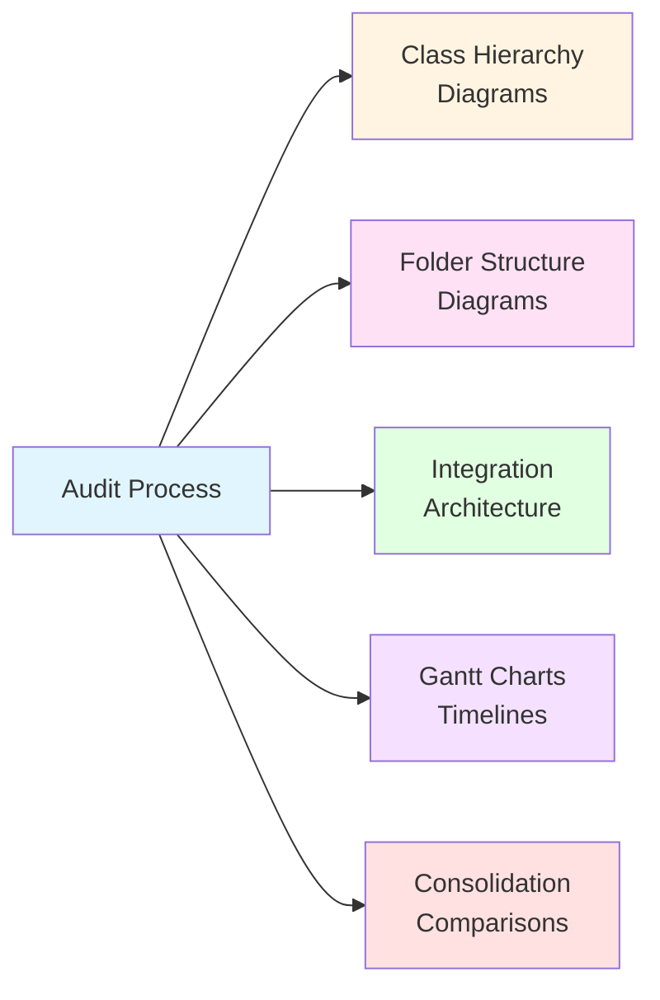
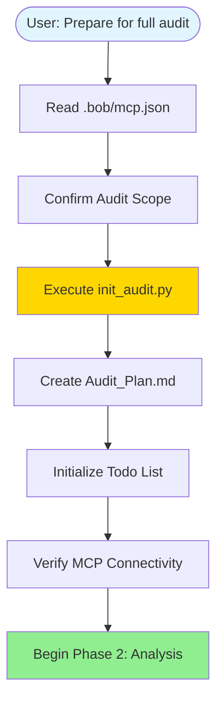
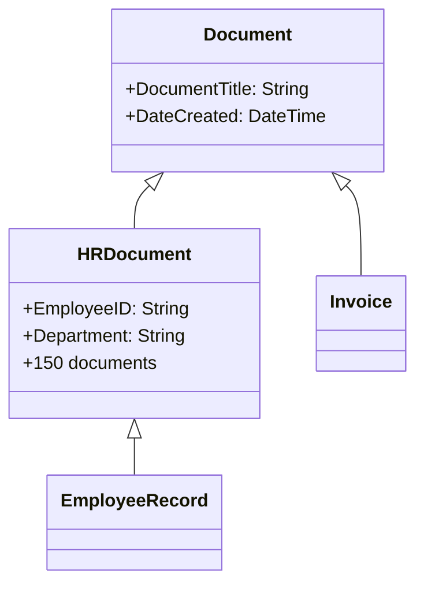
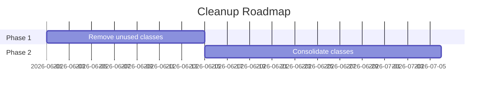

# Content Repository Auditor - Version 2.0 Changelog

## Overview

Version 2.0 of the Content Repository Auditor mode introduces significant enhancements focused on **visual documentation**, **automated initialization**, and **planning-first workflows**.

## Release Date

**Version 2.0** - May 19, 2026

---

## 🎨 Major New Features

### 1. Automatic Mermaid Diagram Generation

The mode now automatically creates visual diagrams throughout the audit process to enhance understanding and communication.

**Diagram Types Created:**



**When Diagrams Are Created:**
- **Phase 2** - Class hierarchy diagrams showing inheritance and relationships
- **Phase 4** - Folder structure diagrams visualizing organization
- **Phase 6** - Integration architecture diagrams mapping external systems
- **Phase 7** - Gantt charts for implementation roadmaps
- **Phase 7** - Before/after comparison diagrams for consolidation plans

**Benefits:**
- Easier to understand complex repository structures
- Better stakeholder communication
- Visual documentation for presentations
- Clearer implementation planning

### 2. Planning-First Workflow

The mode now **always starts with proper initialization** when you request a full audit.

**Initialization Sequence:**



**What This Means:**
- No more manual folder creation
- Consistent audit structure every time
- Proper planning before analysis begins
- Clear progress tracking with todo lists

### 3. Automated Folder Structure Creation

New Python script (`tools/init_audit.py`) automates the creation of standardized audit folders.

**Folder Structure Created:**
```
audits/[ObjectStore]_[DATE]/
├── README.md                    # Audit overview and navigation
├── audit_metadata.json          # Configuration and timestamps
├── Audit_Plan.md               # Initial planning document
├── reports/                     # Final audit reports
│   ├── Executive_Summary.md
│   ├── Full_Audit_Report.md
│   └── Implementation_Roadmap.md
├── data/                        # Raw data exports
│   ├── class_inventory.csv
│   ├── property_matrix.csv
│   └── document_counts.csv
├── analysis/                    # Detailed analysis documents
│   ├── Class_Analysis.md
│   ├── Property_Analysis.md
│   ├── Folder_Analysis.md
│   └── Integration_Analysis.md
└── recommendations/             # Specific recommendations
    ├── Consolidation_Plan.md
    ├── Cleanup_Recommendations.md
    └── Governance_Guidelines.md
```

**Script Features:**
- Reads Object Store name from `.bob/mcp.json`
- Creates date-stamped folders
- Generates metadata files
- Creates README with navigation
- Can be run manually or automatically

---

## 📝 Updated Documentation

### Files Updated

1. **`docs/Repository_Auditor_Quick_Start.md`**
   - Added comprehensive audit workflow diagram
   - Documented new visual documentation features
   - Explained folder structure automation
   - Added "What's New" section
   - Updated example sessions

2. **`docs/Content_Repository_Auditor_Guide.md`**
   - Added "New in Version 2.0" overview
   - Integrated Mermaid diagrams in all phase descriptions
   - Added "Visual Documentation Guide" section
   - Added "Automation Tools" section
   - Added "Advanced Features" section
   - Updated version history

### New Documentation

3. **`tools/README.md`**
   - Complete documentation for `init_audit.py` script
   - Usage examples
   - Integration guidance

4. **`docs/Repository_Auditor_Changelog.md`** (this file)
   - Comprehensive changelog
   - Migration guide
   - Feature comparison

---

## 🔧 Technical Changes

### New Files Created

1. **`.bob/rules-repository-auditor/0_audit_initialization.xml`**
   - Enforces planning-first workflow
   - Defines initialization sequence
   - Integrates init_audit.py script

2. **`.bob/rules-repository-auditor/6_mermaid_diagrams.xml`**
   - Comprehensive Mermaid diagram guidelines
   - 7 diagram types with examples
   - Best practices and quality checklist
   - Mandatory diagram requirements per phase

3. **`tools/init_audit.py`**
   - Python script for folder automation
   - Reads MCP configuration
   - Creates standardized structure
   - Generates metadata files

4. **`tools/README.md`**
   - Tool documentation

### Modified Files

1. **`.bob/custom_modes.yaml`**
   - Enhanced roleDefinition with visual documentation emphasis
   - Updated whenToUse with planning-first approach
   - Added explicit mention of 7-phase workflow

2. **`.bob/rules-repository-auditor/1_audit_workflow.xml`**
   - Added diagram creation steps in Phase 2, 4, 6, and 7
   - Integrated visual documentation requirements
   - Updated workflow to include init_audit.py

---

## 🚀 Migration Guide

### For Existing Users

If you've used the Repository Auditor mode before, here's what's different:

**Before Version 2.0:**
```
You: "Perform a full audit"
Bob: [Immediately starts analyzing classes]
```

**Version 2.0:**
```
You: "Prepare for a full audit"
Bob: [Reads MCP config → Creates folders → Plans → Then analyzes]
```

**Key Changes:**
1. Use `"Prepare for a full audit"` to trigger the complete initialization workflow
2. Audit folders are now automatically created with standardized structure
3. Visual diagrams are embedded throughout the audit report
4. Planning phase always comes first

**Backward Compatibility:**
- Old command `"Perform a full audit"` still works
- Mode will prompt for initialization if not done
- Existing audit reports remain valid

### For New Users

Simply request:
```
"Prepare for a full audit"
```

Bob will handle everything:
1. ✅ Read your MCP configuration
2. ✅ Create organized folder structure
3. ✅ Plan the audit scope
4. ✅ Execute systematic analysis
5. ✅ Generate visual diagrams
6. ✅ Produce comprehensive reports

---

## 📊 Feature Comparison

| Feature | Version 1.0 | Version 2.0 |
|---------|-------------|-------------|
| **Audit Workflow** | 7 phases | 7 phases ✓ |
| **Visual Diagrams** | ❌ None | ✅ 5 types |
| **Folder Creation** | ❌ Manual | ✅ Automated |
| **Planning Phase** | ⚠️ Optional | ✅ Mandatory |
| **MCP Integration** | ✅ Yes | ✅ Enhanced |
| **Progress Tracking** | ⚠️ Basic | ✅ Todo lists |
| **Metadata Tracking** | ❌ None | ✅ JSON files |
| **Documentation** | ✅ Good | ✅ Excellent |

---

## 🎯 Use Case Examples

### Example 1: First-Time Full Audit

**Command:**
```
"Prepare for a full audit"
```

**What Happens:**
1. Bob reads `.bob/mcp.json` → identifies "EMEA_OS"
2. Creates `audits/EMEA_OS_19-05/` with all subfolders
3. Creates `Audit_Plan.md` with scope and objectives
4. Initializes todo list with 7 phases
5. Verifies MCP connectivity
6. Begins Phase 2: Class Discovery
7. Creates class hierarchy diagram
8. Continues through all phases
9. Generates final reports with embedded diagrams

**Deliverables:**
- Executive summary with key findings
- Full audit report with 5+ Mermaid diagrams
- Class inventory CSV
- Property matrix CSV
- Implementation roadmap with Gantt chart
- All organized in structured folders

### Example 2: Focused Class Analysis

**Command:**
```
"Analyze document classes and create a visual hierarchy"
```

**What Happens:**
1. Bob focuses on Phase 2: Class Discovery
2. Discovers all document classes
3. Analyzes inheritance relationships
4. Creates detailed class hierarchy diagram
5. Identifies consolidation opportunities
6. Generates focused report

**Deliverables:**
- Class hierarchy Mermaid diagram
- Class analysis report
- Consolidation recommendations

---

## 🔍 Visual Documentation Examples

### Class Hierarchy Diagram
Shows inheritance, properties, and document counts:



### Folder Structure Diagram
Visualizes repository organization:

```mermaid
graph TD
    Root[/ Root] --> HR[HR Documents]
    Root --> Finance[Finance]
    HR --> Active[Active Employees]
    HR --> Archive[Archive]
```

### Implementation Roadmap
Timeline with dependencies:



---

## 💡 Best Practices

### For Stakeholder Presentations
1. Use the executive summary with embedded diagrams
2. Export Gantt charts for timeline discussions
3. Show before/after consolidation diagrams
4. Focus on business impact metrics

### For Technical Teams
1. Review detailed class hierarchy diagrams
2. Analyze property matrices
3. Study integration architecture diagrams
4. Use folder structure diagrams for planning

### For Management
1. Focus on executive summary
2. Review implementation Gantt charts
3. Understand cost/benefit through diagrams
4. Track progress with todo lists

---

## 🐛 Known Issues

None reported in Version 2.0.

---

## 🔮 Future Enhancements

Potential features for Version 3.0:
- Interactive diagrams with drill-down capability
- Automated comparison between audit versions
- Export to PowerPoint with diagrams
- Real-time progress dashboard
- Integration with project management tools

---

## 📞 Support

For questions about Version 2.0:
1. Review `docs/Repository_Auditor_Quick_Start.md`
2. Consult `docs/Content_Repository_Auditor_Guide.md`
3. Check `tools/README.md` for script documentation
4. Ask Bob while in Repository Auditor mode

---

## 🙏 Acknowledgments

Version 2.0 was developed based on user feedback requesting:
- Better visual documentation
- Automated folder creation
- More structured workflow
- Enhanced planning capabilities

Thank you to all users who provided feedback!

---

**Version:** 2.0  
**Release Date:** 2026-05-19  
**Mode Slug:** content-repository-auditor