# Repository Auditor - Quick Start Guide

## 🚀 Getting Started in 5 Minutes

### 1. Switch to Repository Auditor Mode
Select **🔍 Content Repository Auditor** from Bob's mode selector

### 2. Start Your Audit
Choose your audit type:

**Full Audit:**
```
"Perform a comprehensive audit of our repository"
"Prepare for a full audit"
```

**Focused Audit:**
```
"Analyze document classes and identify consolidation opportunities"
"Review property usage and find optimization opportunities"
"Assess folder structure and organization"
```

### 3. Review Results
Bob will generate a detailed audit report with:
- Executive summary
- Key findings with **visual Mermaid diagrams**
- Prioritized recommendations
- Implementation roadmap

---

## 🎨 New: Visual Documentation

The Repository Auditor now automatically creates **Mermaid diagrams** throughout the audit process to visualize:

- 📊 **Class Hierarchies** - Document class relationships and inheritance
- 📁 **Folder Structures** - Repository organization patterns
- 🔄 **Integration Architecture** - External system connections
- 📅 **Implementation Timelines** - Gantt charts for roadmaps
- 📈 **Consolidation Plans** - Before/after comparisons

These diagrams make it easier to understand complex repository structures and communicate findings to stakeholders.

---

## 🔄 Audit Workflow

```mermaid
flowchart TD
    Start([User Requests Audit]) --> Init[Phase 1: Planning & Initialization]
    Init --> ReadMCP[Read .bob/mcp.json]
    ReadMCP --> ConfirmScope[Confirm Audit Scope]
    ConfirmScope --> CreateFolders[Execute init_audit.py Script]
    CreateFolders --> CreatePlan[Create Audit_Plan.md]
    CreatePlan --> InitTodo[Initialize Todo List]
    InitTodo --> VerifyMCP[Verify MCP Connectivity]
    
    VerifyMCP --> Phase2[Phase 2: Class Discovery]
    Phase2 --> ListClasses[List Root Classes]
    ListClasses --> DiscoverClasses[Discover All Classes]
    DiscoverClasses --> AnalyzeClasses[Analyze Class Properties]
    AnalyzeClasses --> CountDocs[Count Documents per Class]
    CountDocs --> ClassDiagram[Create Class Hierarchy Diagram]
    
    ClassDiagram --> Phase3[Phase 3: Property Analysis]
    Phase3 --> CategorizeProps[Categorize Properties]
    CategorizeProps --> AnalyzeProps[Analyze Property Characteristics]
    AnalyzeProps --> IdentifyIssues[Identify Property Issues]
    
    IdentifyIssues --> Phase4[Phase 4: Folder Structure]
    Phase4 --> DiscoverFolders[Discover Root Folders]
    DiscoverFolders --> AnalyzeFolders[Analyze Folder Hierarchy]
    AnalyzeFolders --> FolderDiagram[Create Folder Structure Diagram]
    
    FolderDiagram --> Phase5[Phase 5: Document Analysis]
    Phase5 --> SampleDocs[Sample Documents]
    SampleDocs --> VerifyClass[Verify Classification]
    VerifyClass --> AssessMetadata[Assess Metadata Quality]
    
    AssessMetadata --> Phase6[Phase 6: Integration Assessment]
    Phase6 --> IdentifyIntegrations[Identify Integration Points]
    IdentifyIntegrations --> DocumentPatterns[Document Integration Patterns]
    DocumentPatterns --> IntegrationDiagram[Create Integration Architecture Diagram]
    
    IntegrationDiagram --> Phase7[Phase 7: Report Generation]
    Phase7 --> CompileFindings[Compile All Findings]
    CompileFindings --> GenerateReports[Generate Reports & CSVs]
    GenerateReports --> CreateRoadmap[Create Implementation Roadmap]
    CreateRoadmap --> GanttChart[Create Gantt Chart]
    GanttChart --> ExecutiveSummary[Create Executive Summary]
    
    ExecutiveSummary --> Complete([Audit Complete])
    
    style Init fill:#e1f5ff
    style Phase2 fill:#fff4e1
    style Phase3 fill:#ffe1f5
    style Phase4 fill:#e1ffe1
    style Phase5 fill:#f5e1ff
    style Phase6 fill:#ffe1e1
    style Phase7 fill:#e1e1ff
    style ClassDiagram fill:#ffd700
    style FolderDiagram fill:#ffd700
    style IntegrationDiagram fill:#ffd700
    style GanttChart fill:#ffd700
    style Complete fill:#90EE90
```



---

## 📋 Audit Types

| Type | Duration | Use When |
|------|----------|----------|
| **Full Audit** | 30-60 min | Need complete repository assessment |
| **Class Analysis** | 15-30 min | Want to consolidate or clean up classes |
| **Property Review** | 20-40 min | Need to optimize properties |
| **Folder Assessment** | 15-25 min | Want to improve organization |
| **Governance Check** | 30-45 min | Need to establish standards |

---

## 🎯 Common Requests

### Repository Health Check
```
"Give me an overview of our repository health"
"What are the top 5 issues in our repository?"
"Identify quick wins for repository improvement"
```

### Class Management
```
"Find duplicate or overlapping classes"
"List all classes with zero documents"
"Identify demo or test classes in production"
"Show me classes that could be consolidated"
```

### Property Optimization
```
"Find unused properties across all classes"
"Identify properties with inconsistent naming"
"Show me properties without descriptions"
"Which properties have low population rates?"
```

### Folder Organization
```
"Analyze our folder structure"
"Find empty folders"
"Review folder naming conventions"
"Assess folder hierarchy depth"
```

### Integration Assessment
```
"Document all SAP integration points"
"Review Salesforce integration properties"
"Identify all external system integrations"
```

---

## 📊 Understanding Your Report

### Priority Levels

🔴 **High Priority** - Act immediately
- Critical issues
- Quick wins
- Security concerns

🟡 **Medium Priority** - Plan for short-term
- Optimization opportunities
- Governance improvements

🟢 **Low Priority** - Consider long-term
- Nice-to-have enhancements
- Complex transformations

### Common Findings

| Finding | What It Means | Typical Action |
|---------|---------------|----------------|
| **Unused Classes** | Classes with 0 documents | Remove or document |
| **Duplicate Classes** | Similar classes serving same purpose | Consolidate |
| **Inconsistent Naming** | Mixed naming conventions | Standardize |
| **Unused Properties** | Properties never populated | Remove |
| **Missing Descriptions** | Undocumented classes/properties | Add documentation |
| **Empty Folders** | Folders with no content | Remove or document |

---

## 🗂️ Audit Folder Structure

When you request a full audit, the mode automatically creates an organized folder structure:

```
audits/
└── [ObjectStore]_[DATE]/
    ├── README.md                    # Audit overview and navigation
    ├── audit_metadata.json          # Audit configuration and timestamps
    ├── Audit_Plan.md               # Initial planning document
    ├── reports/                     # Final audit reports
    │   ├── Executive_Summary.md
    │   ├── Full_Audit_Report.md
    │   └── Implementation_Roadmap.md
    ├── data/                        # Raw data exports
    │   ├── class_inventory.csv
    │   ├── property_matrix.csv
    │   └── document_counts.csv
    ├── analysis/                    # Detailed analysis documents
    │   ├── Class_Analysis.md
    │   ├── Property_Analysis.md
    │   ├── Folder_Analysis.md
    │   └── Integration_Analysis.md
    └── recommendations/             # Specific recommendations
        ├── Consolidation_Plan.md
        ├── Cleanup_Recommendations.md
        └── Governance_Guidelines.md
```

This structure is created automatically using the `tools/init_audit.py` script.

---

## ✅ Quick Checklist

### Before Audit
- [ ] MCP server connected (`.bob/mcp.json` configured)
- [ ] Repository access verified
- [ ] Audit objectives defined
- [ ] Time allocated (30-60 min)

### During Audit
- [ ] Let Bob complete each phase
- [ ] Review Mermaid diagrams as they're created
- [ ] Provide clarification when asked
- [ ] Take notes on key findings
- [ ] Ask questions as needed

### After Audit
- [ ] Review complete report with diagrams
- [ ] Share with stakeholders
- [ ] Prioritize recommendations
- [ ] Create action plan
- [ ] Schedule follow-up

---

## 💡 Pro Tips

1. **Start Broad, Then Focus** - Begin with full audit, then dive into specific areas
2. **Document Context** - Provide business context for better recommendations
3. **Sample First** - For large repositories, audit by domain or department
4. **Track Progress** - Re-audit after implementing changes
5. **Share Findings** - Use reports and diagrams to drive organizational improvements
6. **Use Visual Aids** - Mermaid diagrams make complex structures easier to understand
7. **Leverage Automation** - The init_audit.py script ensures consistent folder structure

---

## 🔧 Troubleshooting

**Audit taking too long?**
→ Request focused audit on specific area

**Too much detail?**
→ Ask for executive summary only

**Need clarification?**
→ Ask Bob to explain specific findings

**Want specific examples?**
→ Request concrete examples from your repository

**Diagrams not rendering?**
→ Ensure your Markdown viewer supports Mermaid syntax

---

## 📚 Learn More

- **Full Guide:** `docs/Content_Repository_Auditor_Guide.md`
- **Reference:** `Reference/Classification_and_Cleaning_Plan.md`
- **Example:** `HR_Document_Class_Description.md`
- **Tools:** `tools/README.md` - Audit automation scripts

---

## 🎓 Example Session

```
You: "Prepare for a full audit"

Bob: "I'll prepare for a comprehensive audit of your repository.

Phase 1: Planning & Initialization
- Reading MCP configuration from .bob/mcp.json...
- Object Store: EMEA_OS
- Creating audit folder structure...
- Executing: python tools/init_audit.py

Audit folder created: audits/EMEA_OS_18-05/
- reports/
- data/
- analysis/
- recommendations/

Creating Audit_Plan.md...
Initializing todo list...
Verifying MCP connectivity...

Ready to proceed with Phase 2: Class Discovery"

[Bob systematically works through all 7 phases, creating diagrams along the way]

Bob: "Audit complete! Key findings:
- 91 document classes (recommend reducing to <50)
- 15 duplicate/similar classes identified
- 23 classes with zero documents
- 12 properties without descriptions

Visual documentation created:
✓ Class hierarchy diagram (shows inheritance relationships)
✓ Folder structure diagram (shows organization patterns)
✓ Integration architecture diagram (shows external connections)
✓ Implementation Gantt chart (shows recommended timeline)

Top recommendations:
1. Consolidate Invoice classes (High priority)
2. Remove 23 unused classes (High priority)
3. Standardize naming conventions (Medium priority)

Full report generated: audits/EMEA_OS_18-05/reports/Full_Audit_Report.md"

You: "Show me the class hierarchy diagram"

Bob: [Displays Mermaid class diagram showing inheritance and relationships]
```

---

## 🆕 What's New

### Version 2.0 Updates

1. **Automated Folder Creation** - `init_audit.py` script creates standardized folder structure
2. **Planning-First Workflow** - Always starts with proper initialization
3. **Visual Documentation** - Automatic Mermaid diagram generation throughout audit
4. **Enhanced Reports** - Diagrams integrated into all audit reports
5. **Better Organization** - Structured folders for reports, data, analysis, and recommendations

---

**Quick Reference Card**

| Command | Result |
|---------|--------|
| "Prepare for full audit" | Complete repository analysis with planning |
| "Full audit" | Complete repository analysis |
| "Class analysis" | Document class review with hierarchy diagram |
| "Property review" | Property optimization analysis |
| "Folder assessment" | Folder structure review with diagram |
| "Quick wins" | High-impact, low-effort improvements |
| "Top issues" | Most critical findings |

---

**Need Help?** Ask Bob while in Repository Auditor mode!